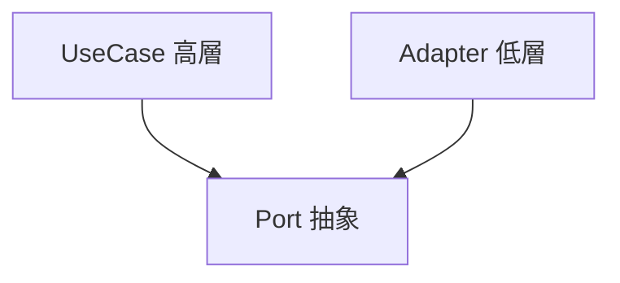
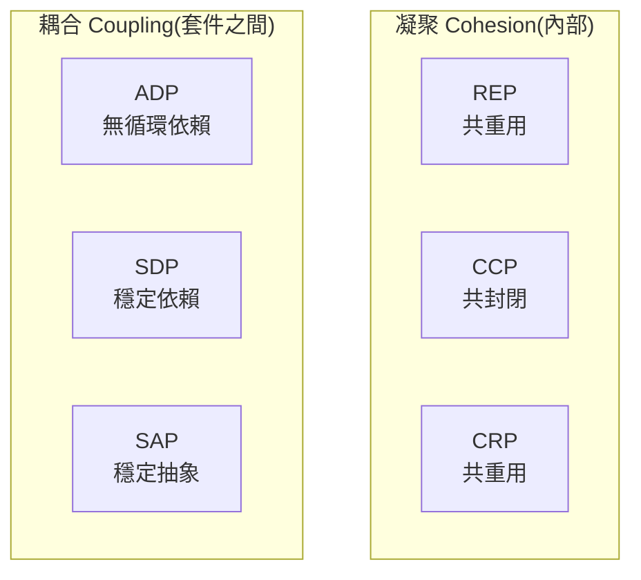
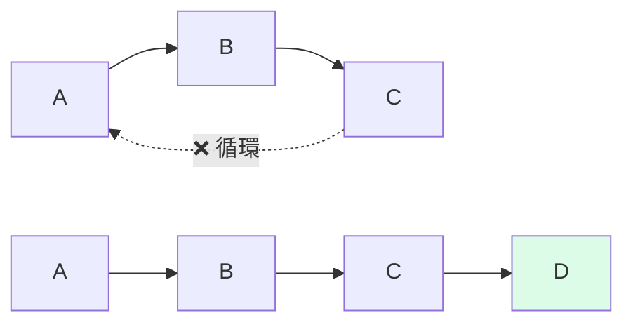

# A1 - 程式碼品質

← [返回索引(README.md)](./README.md)

---

## 目錄

### 設計原則
- [SOLID 原則 🟡](#solid)
  - [SRP — 單一職責](#srp)
  - [OCP — 開放封閉](#ocp)
  - [LSP — 里氏替換](#lsp)
  - [ISP — 介面隔離](#isp)
  - [DIP — 依賴反轉](#dip)
- [DRY(Don't Repeat Yourself)🟢](#dry)
- [KISS / YAGNI 🟢](#kiss-yagni)
- [Law of Demeter(迪米特法則)🟡](#demeter)

### Package Principles(套件設計六原則)🔴
- [套件凝聚:REP / CCP / CRP](#package-cohesion)
- [套件耦合:ADP / SDP / SAP](#package-coupling)

### 架構驗證
- [ArchUnit 🟡](#archunit)

### 反模式
- [Magic Number / Magic String 🟢](#magic-number-string)
- [God Class / God Object 🟡](#god-class)
- [Anemic Domain Model 🔴](#anemic-domain-model)
- [Primitive Obsession 🟡](#primitive-obsession)

### 工具與技術
- [Enum 🟢](#enum)
- [Constants Class 🟢](#constants-class)
- [Lombok 🟢](#lombok)
- [Validation(Jakarta Bean Validation)🟡](#validation)
- [Value Object(VO)🟡](#value-object)
- [Immutability(不可變性)🟡](#immutability)

---

## 設計原則

<a id="solid"></a>
### SOLID 原則 🟡

由 Robert C. Martin 整理的五個 OOP 設計原則,首字縮寫即「SOLID」。

<a id="srp"></a>
#### S — Single Responsibility Principle(單一職責)

**定義**:一個類別只該有**一個改變的理由**。

**反例**:`UserService` 同時管理註冊、寄信、產生報表 → 任何一塊改動都要動到這個類別。
**正解**:拆成 `UserRegistrationUseCase`、`MailSender`、`UserReportService`。

<a id="ocp"></a>
#### O — Open-Closed Principle(對擴展開放、對修改封閉)

**定義**:加新功能時應**新增程式碼**而非**修改既有程式碼**。

**範例**:新增「LinePay」付款方式時——
- ❌ 在 `PaymentService` 內加 `if (type == LINE_PAY) { ... }`
- ✅ 新增 `LinePayStrategy implements PaymentStrategy`,Strategy Factory 自動納管

<a id="lsp"></a>
#### L — Liskov Substitution Principle(里氏替換)

**定義**:子類別必須能**完全替換**父類別,而程式行為不變。

**反例**:`Square extends Rectangle` 但 `setWidth` 連動改 height → 用 `Rectangle` 的人會被搞瘋。
**現代版本**:介面實作不要拋出意料之外的例外、不要回傳 `null` 取代正常值。

<a id="isp"></a>
#### I — Interface Segregation Principle(介面隔離)

**定義**:不要強迫類別實作**它不需要的方法**。把大介面拆成多個小介面。

**反例**:`Worker` 介面有 `work()`、`eat()`、`sleep()` → `RobotWorker` 實作時要硬塞 `eat()` 空實作。
**正解**:拆成 `Workable`、`Eatable`、`Sleepable`。

<a id="dip"></a>
#### D — Dependency Inversion Principle(依賴反轉)

**定義**:**高層模組不依賴低層模組,雙方都依賴抽象**。抽象不依賴細節,細節依賴抽象。

**這就是 Hexagonal Architecture 的核心**——`PayOrderUseCase` 不依賴 `OrderJpaRepository`(細節),而是依賴 `OrderRepositoryPort`(抽象),Adapter 反過來實作 Port。



---

<a id="dry"></a>
### DRY(Don't Repeat Yourself)🟢

**定義**:同一段知識**只該有一個權威的表達**。但別過度——「看起來相似」不等於「相同知識」,過早抽象比重複更糟(WET vs DRY 的拉扯)。

**規範要求**:相同行為只能出現在一個地方(Base / Factory / Strategy / AOP)。

---

<a id="kiss-yagni"></a>
### KISS(Keep It Simple, Stupid)/ YAGNI(You Aren't Gonna Need It)🟢

- **KISS**:能用簡單方案就別用複雜方案。
- **YAGNI**:**只在需要時才實作**,別為了「未來可能需要」現在就先做。過度設計是專案最常見的浪費。

**實務**:三次重複才抽象(Rule of Three),少於三次先 copy-paste。

---

<a id="demeter"></a>
### Law of Demeter(迪米特法則 / 最少知識原則)🟡

**定義**:一個物件**只該認識它的「直接朋友」**,不該對「朋友的朋友」呼來喚去。又稱「不要鏈式呼叫(`a.b().c().d()`)」。

**反例**:
```java
order.getCustomer().getAddress().getCity();   // 違反:Order 不該知道 City
```

**正解**:讓 Order 提供 `order.shippingCity()`,內部封裝細節。

---

## Package Principles(套件設計六原則)

由 Robert C. Martin 提出,**SOLID 處理「類別」層級,Package Principles 處理「套件 / 模組」層級**。六條分為兩組:**凝聚**(同一套件內東西該不該放一起)+ **耦合**(套件之間該怎麼依賴)。



<a id="package-cohesion"></a>
### 套件凝聚:REP / CCP / CRP 🔴

#### REP — Reuse-Release Equivalence Principle(重用 / 發佈等價)

**定義**:**重用的最小單位 = 發佈的最小單位**——一個套件要被別人重用,就必須有版本號、有變更紀錄、有獨立發佈週期(Maven artifact / npm package)。

**實務**:這就是「為什麼把 X 拆成獨立 jar」的理由——若沒人會單獨重用,就別拆。

#### CCP — Common Closure Principle(共同封閉)

**定義**:**會一起變動的類別放同一套件**。一個需求變更,只該影響一個套件,不該散落多處。

**反例**:`User`、`UserService`、`UserRepository`、`UserDto` 散落在 `model/`、`service/`、`repository/`、`dto/` 四個套件——加一個欄位要改四個地方。
**正解**(本規範採用):**按業務切分**(`user/`、`order/`),而非技術切分。

#### CRP — Common Reuse Principle(共同重用)

**定義**:**會一起被重用的類別放同一套件**。反過來:**不會一起用的不要綁同一套件**——不然你的使用者被迫依賴用不到的東西。

**和 ISP 的關係**:CRP 是套件版的 ISP——「**別逼別人依賴他不需要的東西**」。

**三者的張力**:
- REP / CRP 推動**拆成更小套件**(專注、易重用)
- CCP 推動**合成更大套件**(同功能聚合)
- 實務上找平衡——這就是套件設計的藝術

---

<a id="package-coupling"></a>
### 套件耦合:ADP / SDP / SAP 🔴

#### ADP — Acyclic Dependencies Principle(無循環依賴)

**定義**:**套件依賴圖必須是 DAG(有向無環圖),不得有循環**。



**為什麼禁止循環**:
- 任何一個出問題,整個循環一起壞
- 編譯 / 部署順序無解
- 測試難以隔離

**規範對應**:Modulith 規範「禁止循環依賴」就是 ADP。**ArchUnit 可在 CI 自動檢查**。

#### SDP — Stable Dependencies Principle(穩定依賴)

**定義**:**依賴應指向穩定的套件**——「越多人依賴你,你就越不該變動」。

**穩定度衡量**:
- `I = 出度 / (入度 + 出度)`(I = Instability,0 = 穩定 / 1 = 不穩定)
- **核心 Domain** 應該穩定(I 接近 0)——很多 Use Case 依賴它
- **Adapter / 邊界**應該不穩定(I 接近 1)——它們依賴別人,不被別人依賴

**規範對應**:Hexagonal 的「Domain 在中心、Adapter 在外」就是 SDP——Domain 必須穩定,因為大家都依賴它。

#### SAP — Stable Abstractions Principle(穩定抽象)

**定義**:**穩定的套件應該抽象,不穩定的套件可以具體**。否則你陷入兩難:穩定的具體類別難以擴展,但又不能改(會打到所有依賴方)。

**測量**:
- `A = 抽象類別數 / 總類別數`(A = Abstractness)
- 理想:`A + I ≈ 1`(穩定 + 抽象 / 不穩定 + 具體)

**規範對應**:這就是 **DIP(依賴反轉)的套件版**——本規範把 Port(抽象、穩定)放 Domain,把 Adapter(具體、不穩定)放 Infrastructure,完全符合 SAP。

---

## 架構驗證

<a id="archunit"></a>
### ArchUnit 🟡

**定義**:Java 的**架構單元測試**函式庫——把架構規則寫成 JUnit 測試,在 CI 自動驗證,**違反架構規範就 build fail**。

**為什麼用**:
- SOLID、Hexagonal、Package Principles 等規則,光靠 code review 撐不住——人會漏看、新人不知道、規則會被慢慢稀釋
- ArchUnit 把規則「**寫成 code**」,自動且持續驗證
- 規則本身就是文件——讀測試就知道架構長什麼樣

**最低設定**(Maven):
```xml
<dependency>
    <groupId>com.tngtech.archunit</groupId>
    <artifactId>archunit-junit5</artifactId>
    <version>1.x</version>
    <scope>test</scope>
</dependency>
```

**典型規則範例**:

```java
@AnalyzeClasses(packages = "com.example", importOptions = ImportOption.DoNotIncludeTests.class)
class ArchitectureTest {

    @ArchTest
    static final ArchRule no_cyclic_dependencies =
        slices().matching("com.example.(*)..").should().beFreeOfCycles();

    @ArchTest
    static final ArchRule domain_should_not_depend_on_infrastructure =
        noClasses().that().resideInAPackage("..domain..")
            .should().dependOnClassesThat().resideInAPackage("..infrastructure..");

    @ArchTest
    static final ArchRule domain_should_not_depend_on_spring =
        noClasses().that().resideInAPackage("..domain..")
            .should().dependOnClassesThat().resideInAPackage("org.springframework..");

    @ArchTest
    static final ArchRule controllers_should_be_named_correctly =
        classes().that().areAnnotatedWith(RestController.class)
            .should().haveSimpleNameEndingWith("Controller");

    @ArchTest
    static final ArchRule no_field_injection =
        noFields().should().beAnnotatedWith(Autowired.class);

    @ArchTest
    static final ArchRule use_cases_should_be_in_application_layer =
        classes().that().haveSimpleNameEndingWith("UseCase")
            .should().resideInAPackage("..application.usecase..");

    @ArchTest
    static final ArchRule no_classes_should_use_java_util_logging =
        noClasses().should().dependOnClassesThat().resideInAPackage("java.util.logging..");
}
```

**常見可驗證的規則**:
- 套件依賴:Domain 不依賴 Infrastructure / 框架
- 命名規則:特定 annotation / 特定後綴
- 循環依賴禁止
- Layer 之間的存取規則(Controller 只能呼叫 Use Case)
- 禁用 API(`java.util.Date` 改用 `java.time`、`System.out.println` 禁用)
- 欄位注入禁令、@Transactional 只能在 service 層、等等

**CI 整合**:`mvn test` 會自動跑,違反規則 build fail。**Spring Modulith 內建用 ArchUnit** 驗證模組邊界。

**對比同類工具**:
- **JDepend**:更老,功能少
- **Checkstyle / PMD / SpotBugs**:程式碼品質掃描,非架構驗證
- **Sonar Architecture Rules**:商業版,功能類似但綁 SonarQube
- **ArchUnit 是 Java 架構測試的事實標準**

---

## 反模式

<a id="magic-number-string"></a>
### Magic Number / Magic String 🟢

**定義**:程式碼中**直接出現未命名的數字或字串**,讀者得猜其意義。

**反例**:
```java
if (user.getStatus() == 1) { ... }                     // 1 是什麼?
if (path.startsWith("/api/v1/")) { ... }              // 規則藏在字串裡
BigDecimal tax = price.multiply(new BigDecimal("0.05"));  // 5% 是什麼稅?
```

**正解**:
```java
if (user.getStatus() == UserStatus.ACTIVE) { ... }
if (path.startsWith(ApiPathConstants.V1_BASE)) { ... }
BigDecimal tax = price.multiply(TaxRateConstants.SALES_TAX);
```

**規範要求**:
- 數值優先用既有常數(`BigDecimal.ZERO` / `Collections.emptyList()` / `Optional.empty()`)
- 不夠用就建 Constants Class
- 有限選項一律 Enum

---

<a id="god-class"></a>
### God Class / God Object 🟡

**定義**:一個類別**承擔太多職責**,知道太多事、做太多事。常見於 `XxxService` / `XxxUtil` 變成 5000 行的怪獸。

**徵兆**:行數超過 500、方法超過 30 個、依賴超過 10 個 Bean。
**解法**:依職責拆分,套用 SRP。

---

<a id="anemic-domain-model"></a>
### Anemic Domain Model(貧血模型)🔴

**定義**:Domain Model 只有 **getter / setter,沒有業務行為**,所有業務邏輯都堆在 Service 層。Martin Fowler 稱此為反模式。

**反例**:
```java
// Anemic
class Order {
    private Status status;
    public Status getStatus() { ... }
    public void setStatus(Status s) { ... }   // 任何人都能亂改
}

class OrderService {
    void pay(Order o) {
        if (o.getStatus() != PENDING) throw ...;   // 業務規則在外面
        o.setStatus(PAID);
    }
}
```

**正解(Rich Domain Model)**:
```java
class Order {
    private Status status;
    public Order pay() {
        if (status != PENDING) throw new IllegalStateException("Cannot pay");
        return new Order(id, amount, PAID);    // 業務規則在內,且不可變
    }
}
```

---

<a id="primitive-obsession"></a>
### Primitive Obsession(原始型別偏執)🟡

**定義**:過度使用 `String` / `int` / `Long` 表達領域概念,失去型別保護。

**反例**:
```java
public void transfer(Long fromUserId, Long toUserId, BigDecimal amount) { ... }
transfer(amount, fromUserId, toUserId);   // 編譯通過,執行炸裂
```

**正解(Value Object)**:
```java
public record UserId(Long value) {}
public record Money(BigDecimal amount, Currency currency) {}

public void transfer(UserId from, UserId to, Money amount) { ... }
// 寫錯參數順序 → 編譯期報錯
```

---

## 工具與技術

<a id="enum"></a>
### Enum 🟢

**定義**:**一組有限、預先定義的具名常數**。Java Enum 是「特殊類別」,可以有欄位、方法、建構子。

**進階範例**:
```java
public enum OrderStatus {
    PENDING("P", "待付款"),
    PAID("PD", "已付款"),
    SHIPPED("SH", "已出貨"),
    CANCELLED("C", "已取消");

    private final String code;
    private final String description;

    OrderStatus(String code, String description) {
        this.code = code;
        this.description = description;
    }

    public String code() { return code; }
    public String description() { return description; }

    public static OrderStatus fromCode(String code) {
        return Arrays.stream(values())
            .filter(s -> s.code.equals(code))
            .findFirst()
            .orElseThrow(() -> new IllegalArgumentException("Unknown: " + code));
    }
}
```

**規範要求**:
- 放在 **Domain Layer**
- 不得直接 `.name()` 比對(用 `code()` 或 enum 本身)
- 外部輸入轉 Enum 集中於 Mapper

---

<a id="constants-class"></a>
### Constants Class 🟢

**定義**:存放字串常數的類別。

**標準寫法**:
```java
public final class JwtConstants {
    private JwtConstants() {}      // 防止實例化

    public static final String CLAIM_USER_ID = "uid";
    public static final String CLAIM_ROLES = "roles";
    public static final String HEADER_AUTHORIZATION = "Authorization";
    public static final String BEARER_PREFIX = "Bearer ";
}
```

**規範要求**:
- `final class` + `private constructor`
- 依用途分類:`ApiPathConstants`、`JwtConstants`、`CacheKeyConstants`...

**對比 Enum**:當值是「有限選項」用 Enum,當值是「字串/數字常數」用 Constants Class。

---

<a id="lombok"></a>
### Lombok 🟢

**定義**:Java 函式庫,透過 annotation 在編譯期自動產生 getter / setter / constructor / equals / hashCode 等樣板程式。

**常用 annotation**:

| Annotation | 用途 |
| --- | --- |
| `@Getter` / `@Setter` | 產生 getter / setter |
| `@RequiredArgsConstructor` | 為 `final` 欄位產生建構子(常用於 DI) |
| `@AllArgsConstructor` / `@NoArgsConstructor` | 全參數 / 無參數建構子 |
| `@Data` | getter + setter + equals + hashCode + toString(**慎用**,通常太多) |
| `@Value` | 不可變版本的 `@Data`(欄位皆 final) |
| `@Builder` | 產生 Builder Pattern |
| `@Slf4j` | 自動加上 `private static final Logger log = ...` |
| `@With` | 產生 `withXxx(value)` 方法,回傳新物件(支援不可變) |

**Quarkus 注意**:Lombok **可用但不推薦**——Quarkus 強調編譯期 augmentation,Lombok 又動 bytecode,可能與其他 processor 衝突。Quarkus 社群更推 **Java Records**。

---

<a id="validation"></a>
### Validation(Jakarta Bean Validation)🟡

**定義**:JSR-380 標準,在 DTO 上用 annotation 宣告驗證規則,呼叫端用 `@Valid` 觸發。

**常用 annotation**:

| Annotation | 用途 |
| --- | --- |
| `@NotNull` | 不可為 null |
| `@NotBlank` | String 不可為 null / 空 / 全空白 |
| `@NotEmpty` | Collection / String 不可為空 |
| `@Size(min, max)` | 長度範圍 |
| `@Pattern(regexp = ...)` | Regex 驗證 |
| `@Email` | Email 格式 |
| `@Min` / `@Max` | 數字範圍 |
| `@Positive` / `@Negative` | 正數 / 負數 |
| `@Past` / `@Future` | 日期需在過去 / 未來 |

**範例**:
```java
public record CreateUserRequest(
    @NotBlank @Email String email,
    @NotBlank @Size(min = 8, max = 64) String password,
    @Pattern(regexp = "\\d{10}") String phone
) {}

@PostMapping
public UserResponse create(@Valid @RequestBody CreateUserRequest req) { ... }
```

**規範要求**:**僅在 API 層做輸入驗證**,Domain 規則由 Value Object 或 Domain Service 處理。

---

<a id="value-object"></a>
### Value Object(VO)🟡

**定義**:Domain 中**以「值」為識別**的物件——`Money(100, TWD)` 與另一個 `Money(100, TWD)` 是同一個東西。三大特徵:
1. **不可變**(Immutable)
2. **以值相等比較**(equals 比所有欄位)
3. **無生命週期**(可隨意建立、丟棄)

**Java 16+ 用 Record 最簡潔**:
```java
public record Money(BigDecimal amount, Currency currency) {
    public Money {
        if (amount == null || currency == null) throw new IllegalArgumentException();
        if (amount.scale() > currency.getDefaultFractionDigits())
            throw new IllegalArgumentException("Scale too large");
    }
    public Money add(Money other) {
        if (!currency.equals(other.currency)) throw new IllegalArgumentException("Currency mismatch");
        return new Money(amount.add(other.amount), currency);
    }
}
```

**對比 Entity**:
| | Value Object | Entity |
| --- | --- | --- |
| 識別 | 以值 | 以唯一 ID |
| 可變 | 不可變 | 可變 |
| 範例 | `Money` `Address` `Email` | `User` `Order` |

---

<a id="immutability"></a>
### Immutability(不可變性)🟡

**定義**:物件建立後**狀態不能改變**。

**為什麼用**:
- **執行緒安全**:不可變物件天然 thread-safe,無需 synchronization
- **可預測**:傳遞物件後不擔心被改
- **可作為 HashMap key 安全使用**(`hashCode` 不會變)

**Java 寫法**:
- `final` 欄位 + 建構子初始化
- 不提供 setter
- 集合用 `List.copyOf(...)` 或 `Collections.unmodifiableList(...)`
- Java 16+ 直接用 **Record**:`public record User(Long id, String name) {}`
- Lombok `@Value`(注意是 `@Value` 不是 `@Data`)

---

← [返回索引(README.md)](./README.md)
