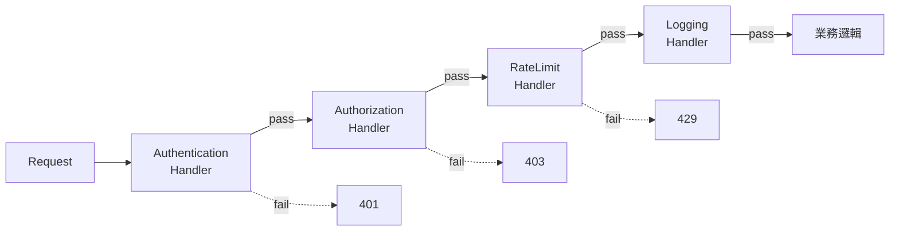

# A2 - 設計模式

← [返回索引(README.md)](./README.md)

---

## 目錄

### 創建型(Creational)
- [Singleton(單例)🟢](#singleton)
- [Factory Method(工廠方法)🟡](#factory-method)
- [Abstract Factory(抽象工廠)🟡](#abstract-factory)
- [Builder(建造者)🟢](#builder)
- [Prototype(原型)🟡](#prototype)

### 結構型(Structural)
- [Adapter(轉接器)🟡](#adapter-pattern)
- [Decorator(裝飾者)🟡](#decorator)
- [Proxy(代理)🟡](#proxy)
- [Facade(外觀)🟢](#facade)

### 行為型(Behavioral)
- [Strategy(策略)🟡](#strategy)
- [Chain of Responsibility(責任鏈)🟡](#chain-of-responsibility)
- [Observer(觀察者)🟡](#observer)
- [Template Method(模板方法)🟡](#template-method)
- [Command(命令)🟡](#command)
- [State(狀態)🔴](#state)

---

## 創建型(Creational)

<a id="singleton"></a>
### Singleton(單例)🟢

**定義**:一個類別**全域只有一個實例**,並提供統一存取點。

**Java 經典寫法 vs Spring 寫法**:
```java
// 經典寫法(不推薦,自行管理生命週期)
public class Config {
    private static final Config INSTANCE = new Config();
    private Config() {}
    public static Config getInstance() { return INSTANCE; }
}

// Spring 寫法(推薦):@Component / @Bean 預設就是 Singleton scope
@Component
public class JwtConfig { /* Spring Container 自動管理唯一實例 */ }
```

**規範要求**:本規範**禁止自行實作 Singleton**,一律交由 Spring IoC Container 處理。

**禁忌**:有狀態的物件(Domain Model、使用者資料)**絕對不能** Singleton——多執行緒共享會炸。

---

<a id="factory-method"></a>
### Factory Method(工廠方法)🟡

**定義**:把物件的**建立過程**封裝在工廠中,呼叫端不需要知道具體類別。

**範例**:
```java
public interface PaymentStrategy { void pay(Money amount); }

@Component
public class PaymentStrategyFactory {
    private final Map<PaymentType, PaymentStrategy> strategies;

    public PaymentStrategyFactory(List<PaymentStrategy> all) {
        // Spring 自動把所有實作注入,組成 Map
        this.strategies = all.stream()
            .collect(toMap(PaymentStrategy::type, identity()));
    }

    public PaymentStrategy create(PaymentType type) {
        return Optional.ofNullable(strategies.get(type))
            .orElseThrow(() -> new IllegalArgumentException("Unknown: " + type));
    }
}
```

**為什麼用**:避免 Controller / Use Case 散落 `new`,集中管理建立邏輯。

---

<a id="abstract-factory"></a>
### Abstract Factory(抽象工廠)🟡

**定義**:建立「**一組相關物件**」的工廠,常用於跨平台 / 跨資料庫的場景。比 Factory Method 多一層抽象。

**範例**(跨資料庫):
```java
public interface DbFactory {
    UserRepo userRepo();
    OrderRepo orderRepo();
}
public class MysqlFactory implements DbFactory { ... }
public class PostgresFactory implements DbFactory { ... }
```

實務上 Spring + JPA 已經把這層抽象掉了,一般專案不太會手刻。

---

<a id="builder"></a>
### Builder(建造者)🟢

**定義**:用於建立**參數眾多、可選參數多**的物件,讓建構過程鏈式且可讀。

**Lombok 寫法**:
```java
@Builder
public class CreateUserCommand {
    private final String email;
    private final String name;
    private final Integer age;
    private final Address address;
}

// 使用
var cmd = CreateUserCommand.builder()
    .email("a@b.com")
    .name("Ryan")
    .age(30)
    .build();
```

**為什麼用**:取代 telescoping constructor(`new User(a, b, c, null, null, ...)`),避免「位置錯誤」造成 bug。

---

<a id="prototype"></a>
### Prototype(原型)🟡

**定義**:透過**複製現有物件**來建立新物件,而非從零建構。Java 的 `Cloneable` 介面是經典實作,但因 `clone()` 設計缺陷(淺/深複製混亂),現代多用 **copy constructor** 或 Lombok `@With` 取代。

```java
@With
@Value
public class Order {
    OrderId id;
    Money amount;
    OrderStatus status;
}

Order paid = original.withStatus(PAID);  // 產生新物件,不修改原物件
```

---

## 結構型(Structural)

<a id="adapter-pattern"></a>
### Adapter(轉接器)🟡

**定義**:讓**介面不相容的兩個類別**能合作。注意:這裡的 Adapter 是**設計模式**,與六邊形架構的 Adapter 概念相同但用法不同。

**範例**:把第三方支付 SDK 包成符合自家 `PaymentPort` 的形狀:
```java
public class StripePaymentAdapter implements PaymentPort {
    private final StripeClient stripe;  // 第三方 SDK
    @Override public void charge(Money amount) {
        stripe.createCharge(amount.value(), amount.currency().code());
    }
}
```

---

<a id="decorator"></a>
### Decorator(裝飾者)🟡

**定義**:**動態地**為物件附加額外職責,而不修改原類別。常用於加 log、加 cache、加重試。

**範例**:
```java
@RequiredArgsConstructor
public class CachingUserRepository implements UserRepositoryPort {
    private final UserRepositoryPort delegate;  // 包裝原本的實作
    private final CachePort cache;

    @Override public Optional<User> findById(UserId id) {
        return cache.get(id.toString(), User.class)
            .or(() -> {
                var user = delegate.findById(id);
                user.ifPresent(u -> cache.put(id.toString(), u));
                return user;
            });
    }
}
```

**對比 AOP**:Decorator 是顯式包裝(編譯期),AOP 是 Proxy(執行期),兩者都能加橫切邏輯。

---

<a id="proxy"></a>
### Proxy(代理)🟡

**定義**:為另一個物件**提供代表**,以控制存取。Spring AOP 的核心機制就是動態 Proxy(JDK Dynamic Proxy 或 CGLIB)。

**用途**:
- 延遲載入(JPA `@OneToMany(fetch = LAZY)` 用 Proxy 實作)
- 權限檢查
- 加上交易、log、metrics(這就是 Spring AOP)

**Spring 內部範例**:你寫 `@Transactional`,Spring 在啟動時為你的 Service 建立一個 Proxy,呼叫 method 前自動開交易、後自動 commit / rollback。

---

<a id="facade"></a>
### Facade(外觀)🟢

**定義**:為複雜子系統提供**一個簡化的統一介面**。

**範例**:`OrderService` 對外只暴露 `placeOrder()`,內部實際協作 `InventoryService`、`PaymentService`、`NotificationService`。Use Case 本質上就是 Facade。

---

## 行為型(Behavioral)

<a id="strategy"></a>
### Strategy(策略)🟡

**定義**:把**可互換的演算法**封裝成獨立物件,執行期動態選擇,**取代 if-else 大型分支**。

**範例**(白名單比對):
```java
public interface WhitelistStrategy {
    WhitelistType type();
    boolean matches(String path, String pattern);
}

@Component
public class RegexWhitelistStrategy implements WhitelistStrategy {
    public WhitelistType type() { return REGEX; }
    public boolean matches(String path, String pattern) {
        return path.matches(pattern);
    }
}

@Component
public class AntPatternWhitelistStrategy implements WhitelistStrategy { ... }
```

**搭配 Factory** 取得策略,**禁止用 if-else 硬分支**取代:
```java
// ❌ 反例
if (type == REGEX) { ... } else if (type == ANT) { ... }

// ✅ 正解
strategyFactory.create(type).matches(path, pattern);
```

---

<a id="chain-of-responsibility"></a>
### Chain of Responsibility(責任鏈)🟡

**定義**:把處理流程串成一條**有序鏈**,每個節點只負責自己的判斷,完成後交給下一個或終止。



**範例**:
```java
public abstract class ValidationHandler {
    private ValidationHandler next;
    public ValidationHandler setNext(ValidationHandler next) {
        this.next = next; return next;
    }
    public final void handle(Request req) {
        check(req);
        if (next != null) next.handle(req);
    }
    protected abstract void check(Request req);
}
```

**Spring 內建**:`Filter Chain`、`HandlerInterceptor` 都是責任鏈的實例。

**規範要求**:鏈的組裝由 Factory / Configuration 負責,**不得在業務邏輯中手動串接**。

---

<a id="observer"></a>
### Observer(觀察者)🟡

**定義**:一個物件(Subject)狀態改變時,**自動通知所有訂閱者(Observer)**。

**Spring 實作**:`ApplicationEventPublisher`
```java
// 發佈
@RequiredArgsConstructor
public class PayOrderUseCase {
    private final ApplicationEventPublisher publisher;
    public void execute(OrderId id) {
        // ...
        publisher.publishEvent(new OrderPaidEvent(id));
    }
}

// 訂閱
@Component
public class SendReceiptListener {
    @EventListener
    public void on(OrderPaidEvent e) { /* 寄送收據 */ }
}
```

**為什麼用**:模組間鬆耦合,`OrderModule` 不需要直接呼叫 `NotificationModule`。

---

<a id="template-method"></a>
### Template Method(模板方法)🟡

**定義**:在父類別定義**演算法骨架**,把可變的步驟留給子類別實作。本規範的 `BaseUseCase` 就是這個模式。

**範例**:
```java
public abstract class BaseUseCase<I, O> {
    public final O execute(I input) {
        validate(input);
        before(input);
        O output = handle(input);
        after(output);
        return output;
    }
    protected void validate(I input) {}      // 預設空實作,子類可覆寫
    protected void before(I input) {}
    protected abstract O handle(I input);    // 子類必須實作
    protected void after(O output) {}
}
```

---

<a id="command"></a>
### Command(命令)🟡

**定義**:把「**請求**」封裝成物件,讓你可以儲存、排隊、撤銷。

**範例**:Use Case 的 Input DTO 通常就是 Command。
```java
public record CreateOrderCommand(UserId userId, List<LineItem> items) {}

createOrderUseCase.execute(new CreateOrderCommand(...));
```

延伸:**Event Sourcing** 把所有 Command 持久化,系統狀態 = 重放所有 Command 的結果。

---

<a id="state"></a>
### State(狀態)🔴

**定義**:物件的行為依**內部狀態**而改變,把每個狀態封裝成獨立類別,避免大型 `switch(state)`。

**範例**(訂單狀態機):
```java
public sealed interface OrderState permits Pending, Paid, Shipped, Cancelled {
    OrderState pay();
    OrderState ship();
    OrderState cancel();
}

public final class Pending implements OrderState {
    public OrderState pay() { return new Paid(); }
    public OrderState ship() { throw new IllegalStateException("尚未付款"); }
    public OrderState cancel() { return new Cancelled(); }
}
```

**對比**:用 Enum + Map 也可實作狀態機,簡單場景更輕量。

---

← [返回索引(README.md)](./README.md)
