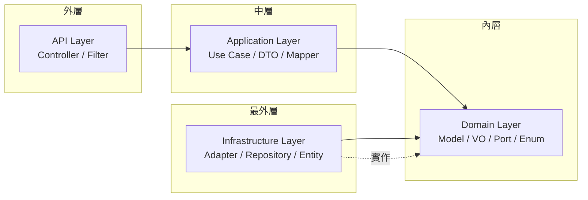
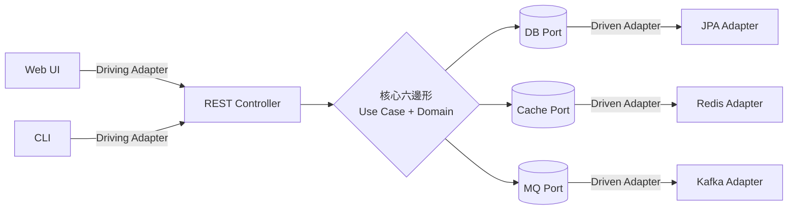
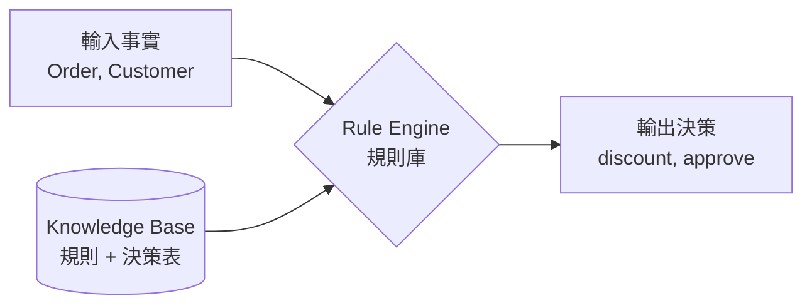

# A3 - 架構類術語

← [返回索引(README.md)](./README.md)

---

## 目錄

- [Clean Architecture(整潔架構)🟡](#clean-architectureCA)
- [Hexagonal Architecture(六邊形架構 / Ports & Adapters)🟡](#hexagonal-architecture)
- [Port(埠)🟡](#port)
- [Adapter(轉接器)🟡](#adapter)
- [Real Adapter / Null Adapter 🟡](#real-adapter--null-adapter)
- [Spring Modulith(模組化)🔴](#spring-modulith)
- [Bounded Context(限界上下文)🔴](#bounded-context)
- [Graceful Degradation(優雅降級)🟡](#graceful-degradation)
- [Stateless(無狀態)🟢](#stateless)
- [Layered Architecture(分層架構)🟢](#layered-architecture)
- [DDD(領域驅動設計)🔴](#ddd)
- [CQRS 🔴](#cqrs)
- [Rule Engine(規則引擎)🟡](#rule-engine)

---

<a id="clean-architectureCA"></a>
### Clean Architecture(整潔架構,簡稱 CA)🟡

**定義**:由 Robert C. Martin(Uncle Bob)提出的架構風格,核心精神是「**依賴方向只能向內**」——外層可以依賴內層,內層絕不知道外層存在。讓業務邏輯不依賴任何框架(DB、UI、Web)。

**層次**(由外到內):



**為什麼用**:
- 框架可替換(今天 JPA、明天 MongoDB,Domain 不用改)
- Domain 邏輯可獨立單元測試,不需啟動 Spring Context
- 邊界清晰,新人容易找到程式該寫在哪裡

**範例**:
```java
// Domain Layer:純 POJO,無框架依賴
public class Order {
    private final OrderId id;
    private final Money amount;
    public Order markAsPaid() { /* 業務規則 */ }
}

// Application Layer:Use Case 只依賴 Port
@Service
@RequiredArgsConstructor
public class PayOrderUseCase {
    private final OrderRepositoryPort orderRepo;  // ← Port,非具體實作
    public void execute(OrderId id) {
        Order order = orderRepo.findById(id).orElseThrow();
        orderRepo.save(order.markAsPaid());
    }
}

// Infrastructure Layer:Adapter 實作 Port
@Repository
@RequiredArgsConstructor
public class OrderRepositoryAdapter implements OrderRepositoryPort {
    private final OrderJpaRepository jpa;  // 真正用 JPA
    public Optional<Order> findById(OrderId id) { ... }
}
```

**反例**:Use Case 直接 `@Autowired OrderJpaRepository`——這就讓 Application 層綁死在 JPA 上。

---

<a id="hexagonal-architecture"></a>
### Hexagonal Architecture(六邊形架構 / Ports & Adapters)🟡

**定義**:由 Alistair Cockburn 提出。把應用程式畫成一個六邊形,**內部是 Domain 與 Use Case**,**外部所有依賴(DB、UI、MQ、API)都透過 Port + Adapter 連接**。本質上和 Clean Architecture 概念一致,只是視覺呈現不同。



**兩種 Port**:
- **Driving Port(主動側 / 左側)**:外界呼叫應用程式的入口,例如 `OrderUseCase` 介面
- **Driven Port(被動側 / 右側)**:應用程式呼叫外界的出口,例如 `OrderRepositoryPort`

**為什麼用**:
- 同一個 Use Case 可被 REST、gRPC、CLI、Job 多種入口呼叫,共用 Driving Port
- 外部服務(DB / Redis / MQ)隨時可換實作,只要 Adapter 仍實作同一個 Port
- **Null Adapter** 可讓系統在外部服務不存在時仍能啟動(配合 Graceful Degradation)

---

<a id="port"></a>
### Port(埠)🟡

**定義**:Domain Layer 定義的抽象介面,描述「**業務意圖**」而非技術細節。Port 不能含任何框架 annotation(`@Repository`、`@Component` 都不行)。

**範例**:
```java
// domain/port/OrderRepositoryPort.java
public interface OrderRepositoryPort {
    Optional<Order> findById(OrderId id);
    void save(Order order);
}
```

**命名規範**:`{功能}Port` —— `UserRepositoryPort`、`CachePort`、`EventPublisherPort`

---

<a id="adapter"></a>
### Adapter(轉接器)🟡

**定義**:Infrastructure Layer 中**實作 Port** 的具體類別,負責把業務意圖轉成實際的技術操作(SQL、Redis 命令、HTTP 請求等)。

**範例**:
```java
// infrastructure/adapter/real/OrderRepositoryAdapter.java
@Repository
@RequiredArgsConstructor
public class OrderRepositoryAdapter implements OrderRepositoryPort {
    private final OrderJpaRepository jpa;
    private final OrderEntityMapper mapper;

    @Override
    public Optional<Order> findById(OrderId id) {
        return jpa.findById(id.value()).map(mapper::toDomain);
    }
}
```

---

<a id="real-adapter--null-adapter"></a>
### Real Adapter / Null Adapter 🟡

**定義**:
- **Real Adapter**:真正連接外部服務(DB / Redis / MQ)的實作
- **Null Adapter(No-op Adapter)**:外部服務不存在時的「空實作」,**不拋例外**,只靜默忽略或回傳安全預設值(空 `Optional`、空集合)

**為什麼用**:讓系統在缺少 DB / Redis 時仍可啟動,方便本地開發、測試與**降級運行**。

**範例**:
```java
// Real
@Profile("real")
@Repository
public class CacheAdapter implements CachePort { /* 連 Redis */ }

// Null:當沒有 Real Adapter 時自動 fallback
@Profile("null")
@ConditionalOnMissingBean(CachePort.class)
@Component
public class NullCacheAdapter implements CachePort {
    @Override public <T> Optional<T> get(String key, Class<T> type) {
        return Optional.empty();          // 永遠 miss
    }
    @Override public void put(String key, Object value) {
        log.warn("Cache disabled, skip put: {}", key);   // 靜默忽略
    }
}
```

---

<a id="spring-modulith"></a>
### Spring Modulith(模組化)🔴

**定義**:Spring 官方框架,在「單一 Spring Boot 應用程式」內以「模組」(package)做出**強邊界**,並在編譯期/測試期驗證模組依賴。是「微服務 vs 單體」之間的折衷:**模組化單體(Modular Monolith)**。

**核心元素**:
- `package-info.java` + `@ApplicationModule` 宣告模組邊界
- `ApplicationModules.of(App.class).verify()` 編譯期檢查依賴
- 模組間溝通優先使用 `ApplicationEventPublisher`(事件驅動,鬆耦合)

**範例**:
```java
// com/example/order/package-info.java
@org.springframework.modulith.ApplicationModule(
    allowedDependencies = {"common", "user"}
)
package com.example.order;
```

**為什麼用**:微服務太重、單體又容易爛掉時的中間方案。模組之後若需獨立部署,可平滑拆分為微服務。

---

<a id="bounded-context"></a>
### Bounded Context(限界上下文)🔴

**定義**:DDD 用語,指**業務語意有明確邊界的範圍**。同一個詞「Order」在不同 Bounded Context 可能代表不同模型——銷售系統的 Order 是「訂單」,物流系統的 Order 是「出貨單」。

**為什麼用**:避免大型專案中「所有人共用一個巨型 `Order` 類」的災難,每個 Context 維護自己的模型。

**對應實作**:每個 Bounded Context 對應一個 **Modulith 模組**(`user` / `order` / `payment`)。

---

<a id="graceful-degradation"></a>
### Graceful Degradation(優雅降級)🟡

**定義**:外部依賴(DB / Redis / 外部 API)失效時,系統**降級運作**而非直接崩潰。例如 Redis 掛掉就改打 DB,DB 掛掉就回傳快取或友善錯誤。

**實作手段**(本規範):
- 每個 Port 都備有 **Null Adapter** 作為 fallback
- Cache miss 自動 fallback 到 DB
- 訊息發送失敗只記 log,不中斷主流程

**範例**:
```java
@Override
public Optional<User> findById(UserId id) {
    try {
        return cache.get(id);            // 先 Redis
    } catch (Exception e) {
        log.warn("Cache failed, fallback to DB", e);
        return jpa.findById(id);         // 降級到 DB
    }
}
```

**對比**:**Fail-Fast** 是「立刻失敗、立刻通知」,Graceful Degradation 是「能跑就跑、能少功能就少功能」,兩者各有適用場景。

---

<a id="stateless"></a>
### Stateless(無狀態)🟢

**定義**:伺服器**不在記憶體保存使用者狀態**——每個請求都自帶完整身份資訊(JWT)。對比 Stateful 的 Session。

**為什麼用**:
- 水平擴展容易(任一節點都能處理任一請求)
- 不需 Sticky Session、Session 共享
- 雲原生 / Kubernetes 友善

**範例**:Spring Security 設定為 Stateless:
```java
http.sessionManagement(s -> s.sessionCreationPolicy(SessionCreationPolicy.STATELESS));
```

---

<a id="layered-architecture"></a>
### Layered Architecture(分層架構)🟢

**定義**:傳統三層或四層切法:Controller → Service → Repository → DB。是 CA / Hexagonal 的「簡化版」,**不嚴格區分 Domain 與 Infrastructure**。

**問題**:`Service` 常常變成大雜燴(業務 + 資料存取 + 框架邏輯都塞在一起),長期難維護。本規範改採 Hexagonal 解決此問題。

---

<a id="ddd"></a>
### DDD(Domain-Driven Design,領域驅動設計)🔴

**定義**:由 Eric Evans 提出。把**領域知識**作為設計核心,以 **Bounded Context** 切分系統,在 Context 內以 **Aggregate / Entity / Value Object / Domain Service / Repository** 表達業務。

**核心概念**:
- **Entity**:有唯一識別、可變狀態的物件(例:`Order`)
- **Value Object**:無識別、不可變、以值相等比較的物件(例:`Money(100, "TWD")`)
- **Aggregate**:一組相關物件的整體,有單一「Aggregate Root」對外
- **Repository**:Aggregate 的持久化抽象
- **Domain Service**:不適合放在 Entity 上的業務邏輯
- **Ubiquitous Language(統一語言)**:業務人員與工程師共用同一套詞彙

---

<a id="cqrs"></a>
### CQRS(Command Query Responsibility Segregation)🔴

**定義**:把**寫操作(Command)**與**讀操作(Query)**分開設計,通常各有獨立的模型甚至獨立的儲存。

**為什麼用**:
- 讀寫負載差異大(讀多寫少很常見)
- 讀模型可預先 join、反正規化以提升查詢效率
- 寫模型專注於業務規則與一致性

**簡單版**(同 DB):
```java
// 寫:Use Case + Domain Model
payOrderUseCase.execute(orderId);

// 讀:直接 JdbcTemplate / DTO Projection
orderQueryService.listByUser(userId);  // 不經過 Domain Model
```

**進階版**:寫入 RDB → 透過 Event 同步到 Elasticsearch → 查詢打 ES。

---

<a id="rule-engine"></a>
### Rule Engine(規則引擎)🟡

**定義**:把**業務規則**從應用程式碼**抽離**到專用引擎執行——規則寫成宣告式(IF-THEN、決策表、決策樹),由引擎在 runtime 推論並執行。讓**非工程師(業務 / 法務 / 風控)**也能讀寫規則。

**為什麼出現**:
- 某些業務規則**頻繁變動**(優惠策略、信用評等、保險核保條件、合規規則)
- 規則寫死 in code → 每次改規則都要**改 code → review → build → deploy**,慢且需工程資源
- 規則散落各處 → **重複邏輯、不一致、難稽核**
- Rule Engine 把規則集中、結構化、可動態載入

**典型架構**:



**範例**(保險核保):
```
IF customer.age >= 65 AND customer.preExistingCondition == true
THEN policy.premium *= 1.5
     policy.requireMedicalExam = true
```

**主流 Rule Engine**:

| 產品 | 廠商 / 出品 | 特色 | 適用 |
| --- | --- | --- | --- |
| **Drools** | Red Hat / Apache | **Java 圈主流**,完整(KIE、Workbench、決策表),學習曲線陡 | 企業級複雜規則 |
| **Easy Rules** | Apache | 輕量,純 annotation 寫 Java 規則,**幾百行 code 即可導入** | 中小型、簡單規則 |
| **OpenL Tablets** | OpenL | **Excel 決策表為核心**,業務人員友善 | 非工程師主導規則 |
| **Camunda DMN** | Camunda | **DMN 標準**(Decision Model and Notation),搭配 BPMN 流程引擎 | 流程 + 決策一體 |
| **JBoss BRMS / Red Hat Decision Manager** | Red Hat | Drools 商業版,加上 Web Workbench | 大企業 |
| **DSL on JVM**(Groovy / Kotlin) | 自行設計 | 不用真 Rule Engine,用 Groovy 動態載入 | 規則複雜度低 |

**Drools 範例**(`.drl` 規則檔):
```drools
package com.example.pricing

import com.example.Order

rule "VIP customer 10% discount"
    when
        $o: Order(customer.tier == "VIP", totalAmount > 1000)
    then
        $o.applyDiscount(0.10);
        update($o);
end

rule "Black Friday additional 5%"
    when
        $o: Order(orderDate.month == "NOVEMBER")
    then
        $o.applyDiscount(0.05);
        update($o);
end
```

```java
// Java 端觸發
KieServices ks = KieServices.Factory.get();
KieContainer kc = ks.getKieClasspathContainer();
KieSession session = kc.newKieSession("pricingSession");

session.insert(order);
session.fireAllRules();      // 引擎自動配對規則並執行
```

**Drools 底層演算法**:**Rete Algorithm**——把規則編譯成判斷網路,事實變動時**只重算受影響的部分**,效能高(數萬規則仍可即時推論)。

**Rule Engine vs Strategy Pattern**:**選擇關鍵**:

| 維度 | Strategy Pattern(寫在 code) | Rule Engine |
| --- | --- | --- |
| 規則數量 | 少(< 10) | 多(數十~數千) |
| 變動頻率 | 低 | 高 |
| 規則複雜度 | 單純 if-else | 多條件交織、衝突解決 |
| 寫規則的人 | 工程師 | **業務人員 / 法務 / 風控** |
| 部署成本 | 每改一次重新 deploy | **熱載入新規則** |
| 學習曲線 | 低 | **陡**(DRL / DMN 語法) |
| 除錯 | IDE 容易 | 工具支援較弱 |

**典型使用情境**:
- **保險核保**:年齡 × 既往症 × 職業 × 保額 → 保費計算
- **信用評等 / 反詐欺**:多維度規則打分數
- **電商定價 / 優惠**:VIP × 季節 × 庫存 × 競品 → 動態定價
- **合規 / 風控**:洗錢防制、KYC、交易監控
- **保健醫療**:臨床決策支援(藥物交互作用、給藥規則)
- **電信 / 金融計費**:複雜資費結構

**反模式**:
- ❌ 簡單 if-else 也上 Drools——**殺雞用牛刀**,維護成本反而高
- ❌ 規則寫在 Drools,結果還是只有工程師看得懂——失去 Rule Engine 最大價值
- ❌ Rule 互相衝突、優先順序無人管理——**規則治理**(rule governance)和規則本身一樣重要
- ✅ **配合 [Bounded Context](#bounded-context)**:同一 Context 內的業務規則一起入 Rule Engine,跨 Context 用事件溝通
- ✅ **規則有版本控管**:DRL 進 git、變更有 PR review、有測試覆蓋

**現代演進**:
- **DMN(Decision Model and Notation)** — OMG 標準,**用決策表**(Excel-like)取代純文字規則,業務人員可直接編輯
- **Low-Code Rule Platform**(Camunda、KIE Workbench、雲廠商):視覺化編輯 + 版本 + 部署一體
- **與 BPMN 流程引擎結合**:流程節點 = 任務,決策節點 = Rule Engine 推論

---

← [返回索引(README.md)](./README.md)
