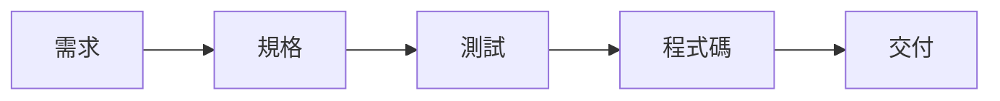
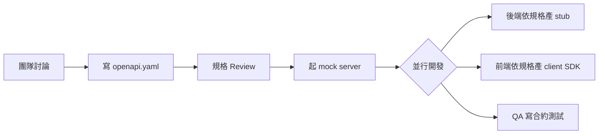
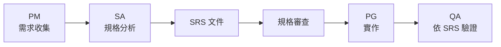
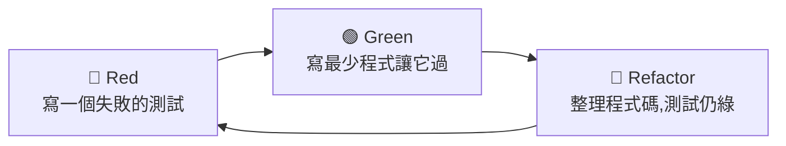
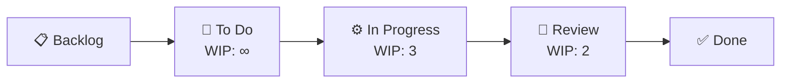
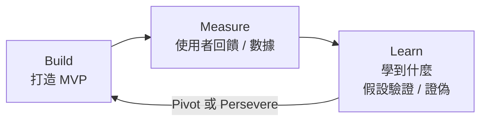
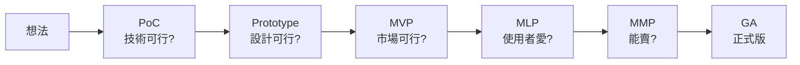

# A4 - 開發方法論(Development Methodology)

← [返回索引(README.md)](./README.md)

---

## 為什麼有這一篇?

「**怎麼寫程式**」之前還有「**怎麼開發**」——團隊用什麼順序產出規格、測試、程式碼,直接影響溝通效率與專案品質。本篇收錄常見的開發方法論詞彙。



各方法論的差異**主要在「先做哪一步、用什麼形式」**。

---

## 目錄

### 規格驅動家族
- [API-First Development / OpenAPI-Driven 🟡](#api-first)
- [Spec-First Development(規格優先開發)🟡](#spec-first)
- [SRS-Driven / Document-Driven Development 🟡](#srs-driven)
- [關於「SDD」這個詞的釐清 🟡](#sdd-clarification)

### 測試驅動家族
- [TDD(Test-Driven Development)🟡](#tdd)
- [BDD(Behavior-Driven Development)/ Specification by Example 🟡](#bdd)
- [ATDD(Acceptance Test-Driven Development)🔴](#atdd)

### 周邊測試工具(非 Java 主場)
- [Selenium 🟡](#selenium)
- [Playwright 🟡](#playwright)
- [Cypress 🟡](#cypress)
- [Jest 🟡](#jest)

### Java 主場測試工具
- [JUnit 🟢](#junit)
- [Mockito 🟡](#mockito)
- [AssertJ 🟢](#assertj)
- [WireMock 🟡](#wiremock)
- [Testcontainers 🟡](#testcontainers)

### 領域與架構驅動
- [DDD(Domain-Driven Design)🔴](#ddd)
- [Contract-Driven Development 🔴](#contract-driven)

### 流程相關
- [Agile / Scrum / Kanban 🟢](#agile)
- [Waterfall(瀑布式)🟢](#waterfall)
- [MVP(Minimum Viable Product / 最小可行產品)🟢](#mvp)

### 比較
- [一張表看懂各種「-Driven Development」🟡](#summary-table)

---

## 規格驅動家族

<a id="api-first"></a>
### API-First Development / OpenAPI-Driven 🟡

**定義**:**先寫 API 規格(OpenAPI / Swagger 的 YAML 或 JSON),再產生程式碼**——前後端依規格各自開發,規格是唯一真相來源。

**典型流程**:



**OpenAPI 規格範例**(片段):
```yaml
openapi: 3.0.3
info:
  title: Order API
  version: 1.0.0
paths:
  /orders/{id}:
    get:
      summary: 取得訂單
      parameters:
        - name: id
          in: path
          required: true
          schema: { type: string }
      responses:
        '200':
          description: OK
          content:
            application/json:
              schema:
                $ref: '#/components/schemas/Order'
components:
  schemas:
    Order:
      type: object
      required: [id, amount]
      properties:
        id: { type: string }
        amount: { type: number, format: double }
```

**工具鏈**:
- **OpenAPI Generator** — 從 YAML 產 server stub(Spring / Quarkus / Go / Python...)、client SDK(Java / TypeScript / Swift...)
- **Swagger UI / ReDoc** — 規格視覺化 + 試打 API
- **Stoplight** / **Postman** — 視覺化編輯規格
- **Spectral** — 規格 lint(命名一致性、必填欄位)

**為什麼用**:
- 前後端**真正並行**(前端不用等後端 API 寫好)
- API 改動先改規格 → 產生變更通知 → 雙方都能及早知道
- Mock server 一鍵啟動,測試不依賴後端進度
- Client SDK 自動產生,**減少前端手刻 API 呼叫**

**實務注意**:
- 規格 lock-in:一旦發版,**規格就是契約**,不能隨便動
- Code-First(用 annotation 反向產 OpenAPI)是另一派,但團隊規模大時 API-First 較不易失控

---

<a id="spec-first"></a>
### Spec-First Development(規格優先開發)🟡

**定義**:廣義的「**先有完整規格、才開始寫 code**」開發流派。**API-First 是其中一種**(規格 = OpenAPI),但 Spec-First 也涵蓋業務層規格。

**特徵**:
- 寫程式前必須有**書面規格**通過 review
- 規格不只是 API,也包含業務規則、流程、邊界條件
- 程式只是規格的實作,**規格才是設計的核心**

**對比**:
- **Spec-First**:先寫文件,再寫 code(可能用 OpenAPI、Confluence、Word)
- **Code-First**:先寫 code,文件是 code 的副產物(用 Swagger annotation 反向生成)
- **Test-First**(TDD):先寫測試,再寫 code

---

<a id="srs-driven"></a>
### SRS-Driven / Document-Driven Development 🟡

**定義**:Spec-First 的傳統 / 重型版本——SA(System Analyst,系統分析師)產出 **SRS(Software Requirements Specification,軟體需求規格書)**,PG(Programmer)依此實作。

**SRS 文件通常包含**:
- 功能需求(Functional Requirements,FR)
- 非功能需求(Non-Functional Requirements,NFR — 效能、安全、可用性)
- 使用情境(Use Cases)
- 介面規格(畫面 / API)
- 資料模型(ERD / Class Diagram)
- 流程圖(Activity Diagram / Sequence Diagram)
- 業務規則
- 邊界條件 / 例外處理

**典型團隊分工**:



**為什麼用**:
- 大型專案、外包專案、政府專案**驗收**需要明確文件依據
- PG 與 SA 角色明確分工
- 變更管理嚴格(每次需求變更都需更新 SRS 並重 review)

**痛點**:
- 文件容易過時(改完 code 沒同步更新文件)
- 重 → 不適合需求快速變動的專案
- PG 拿到 SRS 才能開始,**單向溝通**易造成理解偏差

**現代演進**:純 SRS 模式漸少,常見演進為:
- **SRS + OpenAPI**:業務層 SRS,介面層 OpenAPI(這就是你會議聽到的混合形態)
- **Living Documentation**:文件存在 Confluence / Notion,版本控制與 code 同步
- **BDD**:把 SRS 改寫成可執行場景

---

<a id="sdd-clarification"></a>
### 關於「SDD」這個詞的釐清 🟡

**重要**:**SDD 不是業界統一術語**,不同公司 / 團隊可能指不同東西:

| 縮寫展開 | 實際指什麼 |
| --- | --- |
| **Spec-Driven Design** | 通常指 **API-First / OpenAPI-Driven** |
| **Spec-Driven Development** | 廣義 Spec-First,可能含 SRS |
| **Specification by Example**(也有人簡稱 SDD) | 其實是 BDD 的一種 |
| **Schema-Driven Development** | 強調 schema(GraphQL Schema、OpenAPI、Avro)為核心 |

**遇到「SDD」這個詞的處理方式**:
1. **先問清楚**——對方是指 OpenAPI 那一派、BDD 那一派、還是傳統 SRS?
2. **看上下文工具**——有 OpenAPI / Swagger → API-First;有 Cucumber / Gherkin → BDD;有 Word / Confluence 規格書 → SRS
3. **不要假設大家都用相同定義**

---

## 測試驅動家族

<a id="tdd"></a>
### TDD(Test-Driven Development)🟡

**定義**:Kent Beck 提倡——**先寫一個會失敗的測試,再寫剛好讓它通過的程式,然後重構**。三步驟循環稱為 **Red-Green-Refactor**。



**範例**(算稅功能):
```java
// 1. RED — 先寫測試
@Test
void zeroIncomeHasZeroTax() {
    assertThat(taxCalculator.compute(BigDecimal.ZERO))
        .isEqualByComparingTo(BigDecimal.ZERO);
}
// 跑 → 失敗(連 TaxCalculator 類別都沒有)

// 2. GREEN — 寫最簡單的實作
public class TaxCalculator {
    public BigDecimal compute(BigDecimal income) {
        return BigDecimal.ZERO;     // 先騙它過
    }
}

// 3. 加下一個測試 → 又 RED
@Test
void incomeAboveThresholdIsTaxedAt5Percent() { ... }

// 4. 重構,讓實作真正合理 → GREEN

// 5. REFACTOR — 整理結構,測試持續綠
```

**為什麼用**:
- **強迫思考介面**:寫測試前就想清楚「這個方法該怎麼用」
- **不會寫多餘的 code**:沒測試需要的程式不會被寫出來
- **重構安全網**:有測試在,改程式不怕壞掉

**常見誤解**:
- ❌ TDD 是「寫完 code 再補測試」(那是 Test-After,不是 TDD)
- ❌ TDD = 100% test coverage(coverage 是副產物)
- ❌ TDD 適合所有情況(對 spike、prototype、UI 不一定適合)

**搭配 BDD**:很多人「外層用 BDD 驗收,內層用 TDD 開發」。

---

<a id="bdd"></a>
### BDD(Behavior-Driven Development)/ Specification by Example 🟡

**定義**:Dan North 在 TDD 基礎上提出——**用「行為描述」(Given-When-Then)取代技術性測試方法名**,讓業務人員、QA、開發都能讀懂同一份規格。Gojko Adzic 後來推 **Specification by Example(SbE)** 強調用「具體例子」當規格。

**核心**:**規格 = 文件 = 自動化測試**,三位一體。

**Gherkin 語法範例**(Cucumber 標準):
```gherkin
Feature: 訂單付款

  Scenario: VIP 客戶享 10% 折扣
    Given 一個 VIP 客戶
    And 客戶有一筆 1000 元的訂單
    When 客戶結帳付款
    Then 系統應收取 900 元
    And 訂單狀態為「已付款」

  Scenario: 一般客戶無折扣
    Given 一個一般客戶
    And 客戶有一筆 1000 元的訂單
    When 客戶結帳付款
    Then 系統應收取 1000 元
```

**Java 實作 step**(Cucumber):
```java
public class OrderSteps {
    private Customer customer;
    private Order order;
    private PayResult result;

    @Given("一個 VIP 客戶")
    public void aVipCustomer() { customer = Customer.vip(); }

    @Given("客戶有一筆 {int} 元的訂單")
    public void customerHasOrder(int amount) { order = Order.of(customer, Money.twd(amount)); }

    @When("客戶結帳付款")
    public void checkout() { result = checkoutService.pay(order); }

    @Then("系統應收取 {int} 元")
    public void shouldCharge(int amount) {
        assertThat(result.charged()).isEqualByComparingTo(BigDecimal.valueOf(amount));
    }
}
```

**為什麼用**:
- 業務、PM、QA、Dev **講同一種語言**
- 規格是**可執行的測試**,不會與程式不一致
- **Living Documentation**:跑 Cucumber 自動產出最新版規格網頁

**工具**:
- **Cucumber**(最主流,Java / Ruby / JS 都有)
- **JBehave**(Java 老牌)
- **Karate**(Java,專注 API 測試,語法略簡化)

**對比 TDD**:
| | TDD | BDD |
| --- | --- | --- |
| 焦點 | 單元級「程式正確」 | 行為級「需求正確」 |
| 寫的人 | Dev | Dev + QA + 業務 |
| 風格 | 技術性 | 自然語言 |
| 工具 | JUnit / TestNG | Cucumber / JBehave |

---

<a id="atdd"></a>
### ATDD(Acceptance Test-Driven Development)🔴

**定義**:在開始開發前,**先協同寫好驗收測試**(Acceptance Test),驗收測試通過 = 功能完成。

**與 BDD 關係**:概念高度重疊,**ATDD 強調「驗收」**(誰來驗收、什麼條件算通過),BDD 強調「**用業務語言寫**」。實務上很多團隊把兩者當同義詞。

---

## 周邊測試工具(非 Java 主場)

以下工具**非** Java 生態主場,但 Java 工程師在**全端團隊、跨組討論、PR review 跨前端**時經常聽到。本節提供「**這是什麼**」+「**Java 工程師為什麼會碰到**」+「**Java 端對應方案**」。

```
測試類型對照
                 後端(Java)              前端(JS/TS)
單元測試         JUnit / TestNG        →  Jest / Vitest / Mocha
整合測試         Spring Boot Test       →  Jest + Testing Library
E2E 瀏覽器測試   (跨語言,工具同)      →  Playwright / Cypress / Selenium
API 測試         RestAssured / WireMock →  Supertest / MSW
```

<a id="selenium"></a>
### Selenium 🟡

**定義**:**最老牌的瀏覽器自動化框架**(2004 至今),透過 WebDriver 協定控制 Chrome / Firefox / Edge / Safari。

**特性**:
- ✅ **支援多語言**:Java、Python、C#、Ruby、JavaScript
- ✅ 跨瀏覽器、跨 OS
- ✅ 大量 legacy 測試資產(企業遷移困難)
- ❌ **設計古老**——非同步處理麻煩(要自己寫 WebDriverWait)
- ❌ 易碎(flaky test)——時序問題多
- ❌ 測試速度較慢

**Java 端整合**:Selenium **有官方 Java 綁定**,可直接寫:
```java
WebDriver driver = new ChromeDriver();
driver.get("https://example.com");
WebElement btn = driver.findElement(By.id("login"));
btn.click();
```

**Java 工程師會遇到**:**舊專案 E2E 測試**幾乎都用 Selenium——QA 用 Java 寫測試或 Cucumber + Selenium 組合常見。

**現況**:新專案漸轉 Playwright / Cypress(更現代、更穩定),但 Selenium **不會消失**——legacy 太多。

---

<a id="playwright"></a>
### Playwright 🟡

**定義**:Microsoft 2020 年開源的**現代 E2E 瀏覽器測試框架**,Selenium 的精神後繼者。**設計目標就是修正 Selenium 的痛點**。

**特性**:
- ✅ **自動等待**(auto-wait)— 不用自己寫 wait,框架自動處理時序
- ✅ **並行測試**內建,速度快
- ✅ 三大瀏覽器 + iOS / Android(Chromium、Firefox、WebKit)
- ✅ **多語言綁定**:JS/TS(主場)、Python、Java、.NET
- ✅ Trace viewer、screenshot、video 內建
- ✅ Network mocking 強

**Java 工程師會遇到**:
1. **後端 + 前端同 repo 的全端團隊**:測試多在 TS 寫,但會跑在 CI 中,build pipeline 看得到
2. **Java 後端團隊用 Playwright for Java 寫 E2E**:取代 Selenium 的新選擇
   ```java
   try (Playwright playwright = Playwright.create()) {
       Browser browser = playwright.chromium().launch();
       Page page = browser.newPage();
       page.navigate("https://example.com");
       page.click("text=Login");
   }
   ```
3. **API 測試**:Playwright 也能做 API 測試(取代部分 RestAssured 場景)

**對比 Selenium**:大致**功能相當,但開發體驗大幅提升**——新專案不應再選 Selenium,Playwright 是現代預設。

---

<a id="cypress"></a>
### Cypress 🟡

**定義**:JS / TS 生態裡的**前端 E2E 測試明星**(2017 開源),設計理念是「**對前端開發者極度友善**」。

**特性**:
- ✅ **DX 一流**:即時 reload、time-travel debugger、清晰錯誤訊息
- ✅ 與前端工程師習慣的工具鏈高度整合(npm、TypeScript、React)
- ✅ 自動等待、截圖、影片
- ❌ **只支援 JavaScript / TypeScript**,**沒有 Java 綁定**
- ❌ 早期只支援 Chromium,後加上 Firefox / Edge
- ❌ 跨 origin / 多 tab 測試較弱(Playwright 更靈活)

**Java 工程師會遇到**:
- 前端團隊寫的 E2E 測試多用 Cypress
- 後端要配合的事:**API mock 設定**(避免測試打到 backend)、**測試帳號 seeding**、**CORS / Cookie 配置**

**Cypress vs Playwright**:
- 前端開發者愛 Cypress(DX 好)
- 全端 / 跨平台場景 Playwright 更彈性(支援 Java、跨瀏覽器全)
- 兩者並存,看團隊偏好

---

<a id="jest"></a>
### Jest 🟡

**定義**:Meta(Facebook)開源的 **JavaScript / TypeScript 測試框架**(2014),前端**單元測試**事實標準——尤其 React 生態。

**特性**:
- ✅ **零配置**起手(create-react-app、Next.js 內建)
- ✅ 內建 mock、snapshot、coverage
- ✅ 並行執行,速度快
- ✅ 與 React Testing Library / Vue Test Utils / Angular Testing 整合好
- ❌ 只測 JS / TS(等於 JUnit 的 JS 版)

**Java 工程師會遇到**:
- 看前端 PR 時 `.test.ts` / `.spec.ts` 檔案就是 Jest 測試
- **跨團隊討論測試覆蓋率時**,前後端各算各的(後端 JaCoCo,前端 Jest coverage)
- 全端 monorepo 的 CI pipeline 會同時跑 Maven test + Jest test

**Jest vs JUnit 對照**:
| 概念 | JUnit | Jest |
| --- | --- | --- |
| 測試檔 | `*Test.java` | `*.test.ts` / `*.spec.ts` |
| 測試方法 | `@Test void foo()` | `test('foo', () => {})` 或 `it(...)` |
| 群組 | `@Nested class` | `describe(...)` |
| 斷言 | `assertThat(x).isEqualTo(y)`(AssertJ) | `expect(x).toBe(y)` |
| Mock | Mockito | `jest.fn()` / `jest.mock()` |
| 覆蓋率 | JaCoCo | Jest 內建 `--coverage` |

**現況**:Jest 仍是 React 生態主流,但 **Vitest**(Vite 整合的更快版本)在 Vue / 新專案漸盛行,功能與 Jest 高度相容。

---

## Java 主場測試工具

Java 後端寫測試時的核心工具,**幾乎所有專案都會用**。本節提供「**用途**」+「**何時用**」+「**典型範例**」。

<a id="junit"></a>
### JUnit 🟢

**定義**:**Java 單元測試事實標準**(1997 至今)。**JUnit 5**(Jupiter)是現行版本,JUnit 4 雖仍見於老專案但**新專案應一律用 5**。

**核心 annotation**:

| Annotation | 用途 |
| --- | --- |
| `@Test` | 標記測試方法 |
| `@BeforeEach` / `@AfterEach` | 每個測試前 / 後執行 |
| `@BeforeAll` / `@AfterAll` | 整個測試類前 / 後執行(`static`) |
| `@DisplayName("...")` | 給測試取人類可讀名稱 |
| `@Nested` | 測試類內巢狀,組織相關測試 |
| `@ParameterizedTest` + `@ValueSource` / `@CsvSource` / `@MethodSource` | 同測試多組參數 |
| `@Disabled("reason")` | 暫時停用 |
| `@Tag("slow")` | 分類,可選擇性執行 |
| `@Timeout(5)` | 超時即失敗 |

**範例**:
```java
class OrderTest {
    @Test
    @DisplayName("待付款訂單可以付款並轉為已付款")
    void should_markAsPaid_when_payPendingOrder() {
        var order = Order.create(userId, items);
        var result = order.pay();
        assertThat(result.status()).isEqualTo(OrderStatus.PAID);
    }

    @ParameterizedTest
    @ValueSource(strings = {"PAID", "SHIPPED", "CANCELLED"})
    void should_throwException_when_payNonPendingOrder(OrderStatus status) {
        var order = orderInStatus(status);
        assertThatThrownBy(order::pay).isInstanceOf(IllegalOrderStateException.class);
    }
}
```

**JUnit 4 vs 5 主要差異**:
- 套件:`org.junit.*` → `org.junit.jupiter.*`
- `@Before` → `@BeforeEach`、`@BeforeClass` → `@BeforeAll`
- 多 Runner → Extension(`@ExtendWith`)
- 模組化(API / Engine 分離,可同時跑 4 與 5)

---

<a id="mockito"></a>
### Mockito 🟡

**定義**:**Java 最主流的 mock 框架**——產生假物件取代真依賴,讓你能單元測試一個類別,不需要它的真依賴。

**核心 API**:

```java
@ExtendWith(MockitoExtension.class)
class PayOrderUseCaseTest {
    @Mock
    OrderRepositoryPort orderRepo;        // mock 物件

    @Mock
    PaymentPort payment;

    @InjectMocks
    PayOrderUseCase useCase;              // mock 自動注入

    @Test
    void should_payOrder_when_pendingOrderExists() {
        // Arrange:設定 mock 行為
        var order = pendingOrder();
        when(orderRepo.findById(any())).thenReturn(Optional.of(order));
        when(payment.charge(any())).thenReturn(PayResult.success());

        // Act
        useCase.execute(new PayOrderCommand(orderId));

        // Assert:驗證互動
        verify(orderRepo).save(argThat(o -> o.status() == PAID));
        verify(payment, times(1)).charge(any());
    }
}
```

**常用方法**:
- `when(mock.foo()).thenReturn(x)` — 設定回傳值
- `when(mock.foo()).thenThrow(...)` — 設定丟例外
- `verify(mock).foo()` — 驗證被呼叫
- `verify(mock, times(N))` — 驗證被呼叫 N 次
- `verify(mock, never())` — 驗證**沒**被呼叫
- `argThat(predicate)` / `eq(value)` / `any()` — argument matchers

**規範注意**:
- ✅ Mock **系統邊界**(外部 API、Repository Port、第三方 SDK)
- ❌ **禁 mock** 自己擁有的 Domain Model / Value Object(用真物件)
- ❌ 不要 mock `final` 類別 / `static` 方法(雖然 Mockito 5+ 可以,但用了通常代表設計問題)

**對比 EasyMock / PowerMock**:
- **EasyMock**:Mockito 之前的選擇,語法囉嗦,**新專案不選**
- **PowerMock**:能 mock static / final / private,**用了通常代表設計爛**,**強烈不推薦**(改設計或重構)

---

<a id="assertj"></a>
### AssertJ 🟢

**定義**:**流暢風格(fluent)的斷言函式庫**,取代 JUnit 內建 `Assertions.assertEquals` 等。**現代 Java 測試的事實標準斷言庫**。

**比 JUnit 內建斷言好在**:
- **可讀性高**:鏈式呼叫像英文句子
- **錯誤訊息清楚**:失敗時印出 expected / actual / 差異點
- **集合 / 例外 / 日期專用斷言豐富**

**範例**:
```java
import static org.assertj.core.api.Assertions.*;

// 物件
assertThat(user.name()).isEqualTo("Alice");
assertThat(user.age()).isGreaterThan(18).isLessThanOrEqualTo(100);
assertThat(user).isNotNull().isInstanceOf(User.class);

// 字串
assertThat(email).startsWith("alice").endsWith("@example.com").contains("@");

// 集合
assertThat(orders)
    .hasSize(3)
    .extracting(Order::status)
    .containsExactly(PENDING, PAID, SHIPPED);

assertThat(users).filteredOn(u -> u.age() > 18).hasSize(5);

// 例外
assertThatThrownBy(() -> service.foo())
    .isInstanceOf(IllegalArgumentException.class)
    .hasMessageContaining("invalid");

// Optional
assertThat(maybeUser).isPresent().get().extracting(User::email).isEqualTo("a@b.com");
```

**對比 Hamcrest**:JUnit 4 時代主流,語法 `assertThat(x, is(equalTo(y)))` 較囉嗦,**新專案一律 AssertJ**。

---

<a id="wiremock"></a>
### WireMock 🟡

**定義**:**HTTP API mock 工具**——啟動一個假 HTTP server,讓你的測試打它而非真實外部 API。

**為什麼需要**:
- 測試「呼叫第三方 API」邏輯時,不能真的打對方(成本、不穩定、無法重現錯誤)
- 想測試「對方回 500 / 超時 / 慢回應」時的處理邏輯——真實 API 你叫不動,WireMock 隨便調

**典型用法**:
```java
@WireMockTest(httpPort = 8089)
class PaymentClientTest {

    @Test
    void should_handleTimeout_when_paymentApiSlow() {
        // 配置 mock:打 /charge 時延遲 5 秒
        stubFor(post("/charge")
            .willReturn(ok().withFixedDelay(5000)));

        // Act:你的程式碼配置成 timeout 2 秒
        var ex = catchException(() -> paymentClient.charge(amount));

        // Assert
        assertThat(ex).isInstanceOf(PaymentTimeoutException.class);
    }

    @Test
    void should_retryOn500() {
        stubFor(post("/charge")
            .inScenario("retry")
            .whenScenarioStateIs(STARTED)
            .willReturn(serverError())
            .willSetStateTo("Second"));

        stubFor(post("/charge")
            .inScenario("retry")
            .whenScenarioStateIs("Second")
            .willReturn(ok().withBody("{\"ok\":true}")));

        // Act + Assert:第一次失敗、第二次成功
    }
}
```

**功能**:
- 設定 request matcher(URL、method、header、body)
- 設定 response(status、header、body、delay、failure simulation)
- **錄影模式**:對真 API 跑一次,自動產生 mock(Recording Mode)
- 模擬 **Webhook**(`/__admin/requests` 查詢收過哪些請求)

**對比**:
- **MockServer**:類似工具,功能相當,選哪個看團隊偏好
- **OkHttp MockWebServer**:輕量,綁定 OkHttp,夠用簡單測試
- **Spring `MockRestServiceServer`**:只 mock `RestTemplate`,測試本機呼叫,**不真起 HTTP server**

---

<a id="testcontainers"></a>
### Testcontainers 🟡

**定義**:**透過 Docker container 在測試中啟動真實服務**(PostgreSQL、Redis、Kafka、Elasticsearch、Selenium 瀏覽器、自家服務 image)。**現代 Java 整合測試的事實標準**。

**為什麼革命性**:
- 過去整合測試靠 H2 in-memory(行為與 PostgreSQL 不一致,常踩 SQL 方言坑)
- 過去靠共享 dev DB(測試互相干擾、資料汙染)
- Testcontainers:**每次測試都起一個全新真 PostgreSQL container**,測完銷毀

**典型用法**:
```java
@Testcontainers
@SpringBootTest
class OrderRepositoryIT {

    @Container
    static PostgreSQLContainer<?> postgres = new PostgreSQLContainer<>("postgres:16")
        .withDatabaseName("testdb")
        .withUsername("test")
        .withPassword("test");

    @DynamicPropertySource
    static void datasourceProperties(DynamicPropertyRegistry registry) {
        registry.add("spring.datasource.url", postgres::getJdbcUrl);
        registry.add("spring.datasource.username", postgres::getUsername);
        registry.add("spring.datasource.password", postgres::getPassword);
    }

    @Autowired OrderRepository orderRepo;

    @Test
    void should_persistAndQueryOrder() {
        var saved = orderRepo.save(new Order(...));
        assertThat(orderRepo.findById(saved.id())).isPresent();
    }
}
```

**支援的服務**(部分):
- 資料庫:**PostgreSQL / MySQL / MongoDB / Cassandra / Oracle / MS SQL**
- 快取 / MQ:**Redis / Kafka / RabbitMQ / Pulsar**
- 搜尋:**Elasticsearch / OpenSearch**
- 瀏覽器:**Selenium**(測試包瀏覽器的 container)
- LocalStack(模擬 AWS 服務)
- 任何自訂 Docker image(`GenericContainer<>`)

**特色**:
- **Singleton container**(`static` + JVM 共享):跨測試類共用,大幅加速
- **Container reuse**(本機開發):`testcontainers.reuse.enable=true`,測試結束後容器不銷毀,下次重用
- **Compose 整合**:`DockerComposeContainer` 一次起多個服務

**規範對應**:
- 本規範要求 Repository Adapter / API 整合測試**優先 Testcontainers,少用 mock**——確保測試貼近真實 DB 行為
- Quarkus 的 **DevServices** 在底層用 Testcontainers,Quarkus 專案幾乎自動受惠

**注意**:
- CI 機器需要支援 Docker(GitHub Actions / GitLab Runner 預設都有)
- 起 container 有開銷(數秒),**單元測試應該避免**,只用在整合測試
- container 數量多時 RAM 吃緊,可用 `singleton container pattern` 共享

---

## 領域與架構驅動

<a id="ddd"></a>
### DDD(Domain-Driven Design,領域驅動設計)🔴

詳見 [A3-architecture.md#ddd](./A3-architecture.md#ddd)。

簡述:把**領域知識**作為設計核心,以 **Bounded Context** 切分系統,以 **Ubiquitous Language(統一語言)** 讓業務與工程師溝通同一套詞彙。**DDD 與 BDD 天然契合**——BDD 的 Given-When-Then 用的就是 DDD 的 Ubiquitous Language。

---

<a id="contract-driven"></a>
### Contract-Driven Development 🔴

**定義**:服務之間以**契約(Contract)**互動,**契約可被機器驗證**——確保 producer 與 consumer 的理解一致。

**兩種風格**:

| | Schema-First Contract | Consumer-Driven Contract(CDC) |
| --- | --- | --- |
| 誰定 | 服務提供方 | **消費方寫期望**,提供方驗證 |
| 範例 | OpenAPI、GraphQL Schema | Pact、Spring Cloud Contract |

**Pact 範例**(消費端寫):
```java
@Pact(consumer = "order-service", provider = "user-service")
public RequestResponsePact userExists(PactDslWithProvider builder) {
    return builder
        .given("user 123 exists")
        .uponReceiving("get user")
            .path("/users/123").method("GET")
        .willRespondWith()
            .status(200)
            .body("{\"id\":\"123\",\"name\":\"Alice\"}")
        .toPact();
}
```
產出的 Pact 檔交給 user-service,user-service 在 CI 跑驗證——確保改 API 不會破壞 order-service。

**為什麼用**:微服務時代,介面約定眾多,不靠機器驗證一定會壞。

---

## 流程相關

<a id="agile"></a>
### Agile / Scrum / Kanban 🟢

**Agile(敏捷)**:2001 年敏捷宣言提出——**個人互動 > 流程工具、可用軟體 > 完整文件、客戶協作 > 合約、回應變化 > 遵循計畫**。是價值觀,不是具體方法。

**Scrum**:Agile 最流行的具體實踐
- **Sprint** — 1~4 週的迭代
- **Roles**:Product Owner / Scrum Master / Dev Team
- **Events**:Sprint Planning / Daily Standup / Sprint Review / Retrospective
- **Artifacts**:Product Backlog / Sprint Backlog / Increment

**Kanban**:看板法,強調**視覺化工作流 + 限制 WIP(Work in Progress)**。沒有固定 sprint,持續流動。



---

<a id="waterfall"></a>
### Waterfall(瀑布式)🟢

**定義**:傳統線性流程——**需求 → 設計 → 實作 → 測試 → 部署 → 維護**,每階段完成才進下一階段。

**特徵**:
- 階段嚴格、文件齊備
- 變更困難(回到前一階段成本高)
- **適合需求穩定、合約嚴格、外包政府專案**

**現況**:純 Waterfall 越來越少,但**「Waterfall + Agile 混合」**(分大階段交付,每階段內 Agile)在大型企業仍常見。

---

<a id="mvp"></a>
### MVP(Minimum Viable Product / 最小可行產品)🟢

**定義**:Eric Ries 在《Lean Startup》(2011)推廣——**用最少功能、最短時間做出能交付給「真實使用者」驗證假設的產品版本**。MVP 不是「半成品」,而是「**剛好夠驗證一個假設**」的產品。

**核心精神**:**Build → Measure → Learn(打造 → 衡量 → 學習)** 的最短迴圈——MVP 是這個迴圈的「Build」端,目標是最快進入下一輪 Learn。



**Reid Hoffman 名言**:**"If you are not embarrassed by the first version of your product, you've launched too late."**(如果你對第一版產品不感到難為情,就是上線太晚。)— 強調 MVP 該**早 / 醜 / 但有用**。

**MVP 的「Minimum」與「Viable」**(平衡兩端):

| | Minimum(最小) | Viable(可行) |
| --- | --- | --- |
| 含意 | 砍掉所有「nice to have」 | **必須提供真實價值**,使用者願意用 |
| 反例 | 功能多到無法在 X 週內完成 | 醜得使用者打開三秒就走、核心功能斷裂無法用 |

**MVP 的常見錯誤**:
- ❌ 「**這是 MVP 所以爛一點沒關係**」——MVP 仍須**完成核心使用者旅程**,不是放棄品質
- ❌ 把整個 Roadmap 都塞進「MVP」——這就是 MMP(Minimum Marketable Product),不是 MVP
- ❌ **沒定義假設**——「我們要驗證什麼?」沒講清楚,做完 MVP 也學不到東西
- ❌ 拿到負面回饋就只想加功能,不**質疑核心假設**(該 Pivot 時硬撐)

**MVP 範本(對應假設)**:

| 假設 | MVP 形式 |
| --- | --- |
| 使用者有這個痛點 | **Landing page + 等待清單**(收集 email 看多少人想要) |
| 使用者願意付費 | **Concierge MVP**:你手動服務,假裝是產品(看付費意願) |
| 這個 UI 流程使用者能接受 | **Wizard of Oz MVP**:前端是真的,後端是人工 |
| 核心演算法有價值 | 簡化版演算法 + 少量資料,看效果 |
| 整個工作流可自動化 | 自動化關鍵步驟、其餘人工 |

**MVP 經典範例**:
- **Dropbox** — 上線前先做一支 **demo 影片**(產品還沒寫完),收等待清單 → 驗證需求
- **Airbnb** — 創辦人租自己公寓給陌生人 → 驗證「陌生人住家裡」可不可行
- **Zappos** — 創辦人拍鞋店照片放網路、有人買才去店裡買回來寄 → 驗證「線上買鞋」需求

**對比相關概念**:

| 概念 | 全名 | 重點 |
| --- | --- | --- |
| **MVP** | Minimum **Viable** Product | **驗證假設**(早期實驗) |
| **MMP** | Minimum **Marketable** Product | **可商業化**最小版本(可賣、可宣傳) |
| **MLP** | Minimum **Lovable** Product | 最小但**讓使用者愛上**(品質 / 體驗門檻更高) |
| **PoC** | Proof of Concept | **技術可行性**驗證(內部用,可丟棄) |
| **Prototype** | — | **設計驗證**(可互動 mockup,可能無真實後端) |
| **Alpha / Beta** | — | 已過 MVP,在迭代中的正式產品階段 |



**Java 工程師會遇到的 MVP 場景**:
- **新功能 / 新服務 MVP**:核心 endpoint 先上,監控指標、進階配置、CMS 後台**之後再做**
- **架構選型 MVP**:在最小情境下試用新 framework / 新中介軟體(Kafka? Quarkus?),驗證後再 commit
- **POC vs MVP 邊界**:POC 跑通即可丟,MVP 需考慮**至少能演進**的程式碼結構——但**不要早期過度設計**
- **YAGNI 應用**:[YAGNI](./A1-code-quality.md#kiss-yagni)(You Aren't Gonna Need It)是 MVP 在 code 層的對應——只實作目前需要的

**與本章其他概念的關係**:
- **MVP 不取代 [TDD](#tdd) / [BDD](#bdd)**——快速做,**仍要有測試**,否則迭代速度反而降
- **MVP 與 [Agile](#agile)**:Agile 是流程,MVP 是產品策略;Sprint 1 通常產出 MVP
- **MVP 與 [API-First](#api-first)**:即使 MVP,**API 介面值得先設計**——避免之後 break change
- **避免 [Waterfall](#waterfall) 心態做 MVP**:不是「先做完所有需求文件再開始」,而是**邊做邊學**

---

## 比較

<a id="summary-table"></a>
### 一張表看懂各種「-Driven Development」🟡

| 縮寫 | 全名 | 先做什麼 | 形式 | 工具範例 |
| --- | --- | --- | --- | --- |
| **TDD** | Test-Driven Development | **單元測試** | JUnit 測試方法 | JUnit、TestNG |
| **BDD** | Behavior-Driven Development | **行為描述** | Given-When-Then 場景 | Cucumber、JBehave |
| **ATDD** | Acceptance Test-Driven Development | **驗收測試** | 驗收條件 | FitNesse、Cucumber |
| **DDD** | Domain-Driven Design | **領域模型** | Aggregate、Bounded Context | (思想為主) |
| **API-First / OpenAPI-Driven** | — | **OpenAPI 規格** | YAML / JSON | OpenAPI Generator |
| **Schema-First** | — | **資料 / 介面 schema** | GraphQL Schema、Avro | GraphQL、Apollo |
| **Spec-First** | — | **書面規格** | 文件(可含上述任一) | Confluence + OpenAPI |
| **SRS-Driven / Document-Driven** | — | **完整 SRS 文件** | Word / Confluence | (流程為主) |
| **CDC** | Consumer-Driven Contract | **消費方契約** | Pact 檔 | Pact、Spring Cloud Contract |

---

← [返回索引(README.md)](./README.md)
