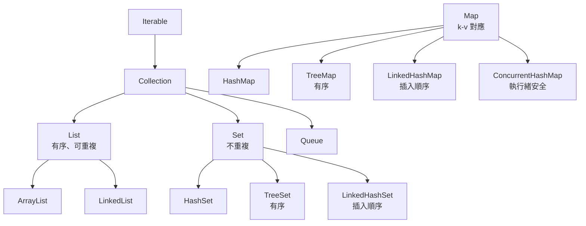
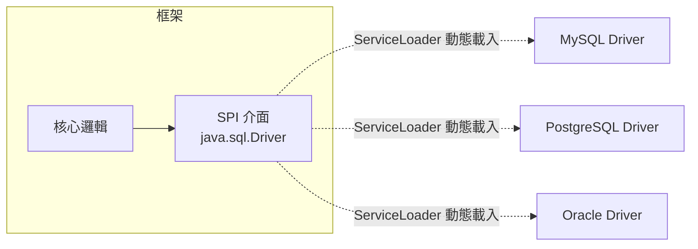

# B1 - Java 核心

← [返回索引(README.md)](./README.md)

---

## 目錄

### 型別與物件
- [POJO / JavaBean 🟢](#pojo)
- [Record(Java 16+)🟢](#record)
- [Sealed Class(Java 17+)🟡](#sealed)
- [Generics(泛型)🟡](#generics)
- [Type Erasure(型別擦除)🔴](#type-erasure)
- [Optional 🟢](#optional)

### Collections 與 Stream
- [Collections Framework 🟢](#collections)
- [Stream API 🟢](#stream)
- [Collectors 🟡](#collectors)

### 同等性與雜湊
- [`equals()` / `hashCode()` 契約 🟡](#equals-hashcode)
- [`==` vs `equals()` 🟢](#equals-vs)
- [Comparable / Comparator 🟢](#comparable)

### 不可變性與執行緒
- [Immutability(不可變性)🟡](#immutability)
- [Thread Safety(執行緒安全)🟡](#thread-safety)
- [`synchronized` / `volatile` 🟡](#sync-volatile)
- [`CompletableFuture` 🔴](#completable-future)
- [Virtual Thread(Java 21+)🔴](#virtual-thread)

### 例外處理
- [Checked vs Unchecked Exception 🟢](#checked-unchecked)
- [try-with-resources 🟢](#try-with-resources)

### 其他常見
- [Annotation Processor 🔴](#annotation-processor)
- [Reflection 🟡](#reflection)
- [ClassLoader 🔴](#classloader)
- [SPI(Service Provider Interface)🟡](#spi)
- [`String.intern()` / String Pool 🟡](#string-pool)
- [AOT vs JIT 編譯 / Native Compiler 🔴](#aot-vs-jit)

---

## 型別與物件

<a id="pojo"></a>
### POJO / JavaBean 🟢

**POJO**(Plain Old Java Object):普通 Java 物件,不繼承特殊類別、不實作特殊介面、不被框架標記。「乾淨的 Java 類別」就是 POJO。

**JavaBean**:額外要求:無參建構子 + private 欄位 + getter/setter + Serializable。

**規範要求**:Domain Model 應為 POJO(無框架依賴)。

---

<a id="record"></a>
### Record(Java 16+)🟢

**定義**:**不可變資料載體**的精簡語法,自動產生建構子、getter、`equals` / `hashCode` / `toString`。

```java
// 一行抵一個 30 行的 class
public record Point(double x, double y) {}

// 帶驗證(Compact Constructor)
public record Money(BigDecimal amount, Currency currency) {
    public Money {
        if (amount == null) throw new IllegalArgumentException();
    }
}
```

**用在哪**:DTO、Value Object、Use Case Command/Result。
**注意**:Record 是 final、欄位皆 final、不能繼承——不適合 JPA Entity(JPA 需要 default constructor + 可變狀態)。

---

<a id="sealed"></a>
### Sealed Class(Java 17+)🟡

**定義**:**限制可以繼承這個類別的子類**——你明確列出允許的子類,編譯器會在 switch 上幫你檢查窮盡性。

```java
public sealed interface OrderState permits Pending, Paid, Shipped, Cancelled {}
public final class Pending implements OrderState {}
public final class Paid implements OrderState {}
public final class Shipped implements OrderState {}
public final class Cancelled implements OrderState {}

// 模式匹配 + 窮盡檢查(Java 21+)
String describe(OrderState s) {
    return switch (s) {
        case Pending p -> "待付款";
        case Paid p -> "已付款";
        case Shipped s2 -> "已出貨";
        case Cancelled c -> "已取消";
        // 不寫 default 也 OK,編譯器確認窮盡
    };
}
```

**用途**:狀態機、有限多型、Tagged Union。

---

<a id="generics"></a>
### Generics(泛型)🟡

**定義**:讓類別 / 方法可以接受**型別參數**,提供編譯期型別安全。

**範例**:
```java
public class Repository<T, ID> {
    public Optional<T> findById(ID id) { ... }
}

// 使用
Repository<User, Long> userRepo = new Repository<>();
```

**萬用字元**:
- `<? extends Number>` — 上界:可以是 Number 或子類(只能讀)
- `<? super Integer>` — 下界:可以是 Integer 或父類(只能寫)
- 口訣:**PECS**(Producer Extends, Consumer Super)

---

<a id="type-erasure"></a>
### Type Erasure(型別擦除)🔴

**定義**:Java 的泛型在**編譯後會被擦除**——`List<String>` 在執行期就是 `List`。

**衍生問題**:
- 不能 `new T()`(不知道 T 是什麼)
- 不能 `instanceof List<String>`(只能 `instanceof List`)
- 不能有 `static T field`
- 重載失敗:`void foo(List<String>)` 與 `void foo(List<Integer>)` 簽名相同

**繞道**:傳 `Class<T>` 參數、`TypeReference<T>`(Jackson)、`ParameterizedTypeReference`(Spring)。

---

<a id="optional"></a>
### Optional 🟢

**定義**:Java 8 引入的容器型別,代表「可能有值」或「沒有值」。**用來消滅 null 的設計**。

**正確用法**:
```java
public Optional<User> findById(Long id) { ... }    // ✅ 回傳值
```

**反例**:
```java
public void foo(Optional<String> name) { ... }     // ❌ 不要當參數
private Optional<String> name;                     // ❌ 不要當欄位
return Optional.of(map.get(key));                  // ❌ map.get 可能 null,會 NPE,該用 Optional.ofNullable
```

**鏈式操作**:
```java
String displayName = userRepo.findById(id)
    .map(User::name)
    .filter(n -> !n.isBlank())
    .orElse("Anonymous");
```

**規範要求(R5)**:方法回傳值用 `Optional<T>` 取代 `null`;集合空時回傳空集合而非 `null`。

---

## Collections 與 Stream

<a id="collections"></a>
### Collections Framework 🟢

**核心介面**:



**選用建議**:
| 需求 | 用什麼 |
| --- | --- |
| 一般 List | `ArrayList` |
| 頻繁頭尾插入 / 雙端佇列 | `ArrayDeque`(別用 LinkedList) |
| 一般 Set | `HashSet` |
| 一般 Map | `HashMap` |
| 多執行緒 Map | `ConcurrentHashMap` |
| 不可變 Collection | `List.of(...)` / `Set.of(...)` / `Map.of(...)` |

---

<a id="stream"></a>
### Stream API 🟢

**定義**:Java 8 引入的**函式式風格**集合處理 API。

**範例**:
```java
List<String> activeAdminEmails = users.stream()
    .filter(u -> u.status() == ACTIVE)
    .filter(u -> u.roles().contains(ADMIN))
    .map(User::email)
    .sorted()
    .toList();
```

**懶求值**:中間操作(`filter`、`map`、`sorted`)是 lazy 的,只有終止操作(`toList`、`forEach`、`reduce`)才會真正執行。

**注意事項**:
- Stream 只能消費**一次**
- `parallelStream()` 慎用——順序敏感、共享狀態的會出事
- 別用 Stream 做副作用(`forEach` 修改外部狀態)——違反函式式精神

---

<a id="collectors"></a>
### Collectors 🟡

**定義**:Stream 的終止操作 `collect(Collector)` 用來把元素收集成集合 / Map / 字串等。

**常用**:
```java
.collect(toList())                                   // List
.collect(toSet())                                    // Set
.collect(toMap(User::id, identity()))                // Map<Long, User>
.collect(groupingBy(User::status))                   // Map<Status, List<User>>
.collect(groupingBy(User::status, counting()))       // Map<Status, Long>
.collect(partitioningBy(u -> u.age() >= 18))         // Map<Boolean, List<User>>
.collect(joining(", ", "[", "]"))                    // [a, b, c]
```

---

## 同等性與雜湊

<a id="equals-hashcode"></a>
### `equals()` / `hashCode()` 契約 🟡

**鐵律**:**`equals()` 相等的物件,`hashCode()` 必須相等**。反之不一定。

**為什麼重要**:
- `HashMap` / `HashSet` 先比 `hashCode` 找 bucket,再用 `equals` 比較
- 違反契約 → 物件丟進 HashMap 後找不回來

**正確寫法**:
```java
@Override
public boolean equals(Object o) {
    if (this == o) return true;
    if (!(o instanceof User u)) return false;
    return Objects.equals(id, u.id);
}

@Override
public int hashCode() {
    return Objects.hash(id);
}
```

**懶人選項**:Lombok `@EqualsAndHashCode`、Java Record 自動產生、IDE 自動產生。

**JPA Entity 特別注意**:不要用 `@Data`(會把所有欄位納入 equals,造成雙向關係 stack overflow)。建議只用 id:
```java
@EqualsAndHashCode(of = "id")
@Entity public class User { ... }
```

---

<a id="equals-vs"></a>
### `==` vs `equals()` 🟢

| | `==` | `equals()` |
| --- | --- | --- |
| 比較內容 | **參考**(記憶體位址) | **內容**(由類別定義) |
| primitive | 比值(`int a == int b`) | 不能用 |
| 字串 | **常會踩坑**(String pool 干擾) | 應該用這個 |

**經典坑**:
```java
String a = "hi";
String b = "hi";
String c = new String("hi");
a == b;            // true(都指向 String pool 同一物件)
a == c;            // false(c 在 heap 新物件)
a.equals(c);       // true
```

---

<a id="comparable"></a>
### Comparable / Comparator 🟢

| | Comparable | Comparator |
| --- | --- | --- |
| 自然排序 | 由類別自身實作 | 外部提供 |
| 方法 | `compareTo(other)` | `compare(a, b)` |
| 一個類別有幾個 | 一個 | 多個 |

```java
// Comparable
public class User implements Comparable<User> {
    public int compareTo(User other) { return this.name.compareTo(other.name); }
}

// Comparator
users.sort(Comparator.comparing(User::age).thenComparing(User::name));
users.sort(Comparator.comparing(User::age).reversed());
```

---

## 不可變性與執行緒

<a id="immutability"></a>
### Immutability(不可變性)🟡

詳見 [A1-code-quality.md#immutability](./A1-code-quality.md#immutability)。

---

<a id="thread-safety"></a>
### Thread Safety(執行緒安全)🟡

**定義**:多執行緒同時使用一個物件時,**不會出現資料錯亂**。

**達成手段**:
1. **不可變**(最簡單最有效)
2. **同步**(`synchronized` / `Lock`)
3. **執行緒局部**(`ThreadLocal`)
4. **無狀態**(stateless)
5. **使用執行緒安全集合**(`ConcurrentHashMap`、`CopyOnWriteArrayList`)

**Spring Bean 預設 Singleton**——所以 Bean 應該**無狀態**或**不可變**,不要在 Bean 加可變欄位(很多人踩過)。

---

<a id="sync-volatile"></a>
### `synchronized` / `volatile` 🟡

**`synchronized`**:互斥鎖,同時只允許一個執行緒進入。
```java
synchronized (this) { ... }     // 鎖物件
synchronized void foo() { ... } // 等同 synchronized(this) { ... }
synchronized static void bar() { ... } // 鎖 Class 物件
```

**`volatile`**:**保證可見性**(一個執行緒寫,其他執行緒立刻看到)+ **禁止指令重排**,但**不保證原子性**。

```java
private volatile boolean shutdown = false;
// thread 1: 主迴圈讀 shutdown
// thread 2: shutdown = true 後,thread 1 立刻看見
```

**錯用範例**:
```java
private volatile int counter = 0;
counter++;   // ❌ 看似原子,實際是 read-modify-write 三步,volatile 保不了
// 正解:用 AtomicInteger
```

---

<a id="completable-future"></a>
### `CompletableFuture` 🔴

**定義**:Java 8 引入的非同步運算工具,支援鏈式組合、組合多個 Future。

```java
CompletableFuture<User> userF = CompletableFuture.supplyAsync(() -> userRepo.find(id));
CompletableFuture<List<Order>> ordersF = CompletableFuture.supplyAsync(() -> orderRepo.byUser(id));

userF.thenCombine(ordersF, (user, orders) -> new UserDashboard(user, orders))
     .thenAccept(dashboard -> publish(dashboard))
     .exceptionally(ex -> { log.error("Failed", ex); return null; });
```

**注意**:
- 預設用 `ForkJoinPool.commonPool()`,**生產環境一定要傳自訂 Executor**
- 不要做阻塞 I/O 在 commonPool 上(會卡死其他任務)

---

<a id="virtual-thread"></a>
### Virtual Thread(Java 21+)🔴

**定義**:JEP 444 推出的**輕量級執行緒**——一個 OS 執行緒可承載成千上萬個 Virtual Thread,讓「一請求一執行緒」的傳統模型重新可行。

```java
try (var executor = Executors.newVirtualThreadPerTaskExecutor()) {
    IntStream.range(0, 10_000).forEach(i ->
        executor.submit(() -> { Thread.sleep(1000); return null; }));
}
// 1 萬個併發,記憶體只多幾十 MB
```

**為什麼革命性**:過去要寫非同步(Reactive、CompletableFuture)解 IO bound,現在可以回頭寫同步阻塞風格——程式碼簡單、效能不差。

---

## 例外處理

<a id="checked-unchecked"></a>
### Checked vs Unchecked Exception 🟢

| | Checked Exception | Unchecked Exception |
| --- | --- | --- |
| 繼承 | `Exception`(非 RuntimeException) | `RuntimeException` |
| 編譯期檢查 | **必須** 處理或宣告 throws | 不必 |
| 範例 | `IOException`、`SQLException` | `NullPointerException`、`IllegalArgumentException` |
| 哲學 | 可恢復的錯誤 | 程式 bug / 不可恢復 |

**現代 Java 建議**:**多數情況用 Unchecked**——Checked Exception 容易污染整個呼叫鏈、Spring / 主流框架幾乎全用 Unchecked。

**注意**:Spring 預設 `@Transactional` 只在 RuntimeException 才 rollback,**Checked Exception 不會 rollback**(常見坑)。

---

<a id="try-with-resources"></a>
### try-with-resources 🟢

**定義**:Java 7 引入,自動關閉實作 `AutoCloseable` 的資源。

```java
// ❌ 老寫法,容易漏 close
InputStream is = null;
try {
    is = ...;
} finally {
    if (is != null) is.close();   // 還可能拋例外覆蓋原本的
}

// ✅ try-with-resources
try (InputStream is = openStream()) {
    // 用 is
}
// 自動 close,且不會 suppress 原本的例外
```

---

## 其他常見

<a id="annotation-processor"></a>
### Annotation Processor 🔴

**定義**:**編譯期**處理 annotation 的工具,可產生新的 Java 檔案。

**用例**:
- **Lombok** — 處理 `@Getter` / `@Setter` 等並修改 AST
- **MapStruct** — 處理 `@Mapper` 產生實作類
- **Quarkus extensions** — build-time augmentation 大量使用
- **Dagger** / **Hilt**(Android DI)

**好處**:零執行期 reflection,效能好、Native Image 友善。

---

<a id="reflection"></a>
### Reflection 🟡

**定義**:執行期**自我檢視與操作**類別、方法、欄位的能力。

```java
Class<?> clazz = Class.forName("com.example.User");
Method m = clazz.getDeclaredMethod("getName");
m.setAccessible(true);
Object value = m.invoke(userInstance);
```

**用在哪**:框架(Spring、Hibernate)、序列化(Jackson)、測試(Mockito)。

**代價**:
- 慢(JIT 難優化)
- 弱型別(執行期才報錯)
- **GraalVM Native Image 不友善**(需配置 reflection.json)→ Quarkus / Spring Native 都儘量避免 reflection

---

<a id="classloader"></a>
### ClassLoader 🔴

**定義**:把 .class 檔案載入 JVM 的元件。Java 預設三層:
- **Bootstrap ClassLoader** — JDK 核心(`java.lang.*`)
- **Platform / Extension ClassLoader** — JDK 擴充
- **System / Application ClassLoader** — 你的應用 classpath

**Tomcat / Spring Boot 內嵌 Server 會多一層 WebApp ClassLoader**——hot reload、jar 隔離靠這個。

**經典問題**:`ClassNotFoundException` vs `NoClassDefFoundError` —— 前者執行期找不到類別,後者載入時連帶失敗(常見於 static 初始化拋例外)。

---

<a id="spi"></a>
### SPI(Service Provider Interface)🟡

**定義**:Java 內建的**插件機制**——**框架定義介面**(API),**第三方提供實作**(Provider),透過 `META-INF/services/` 設定檔或 `module-info.java` 在 runtime **動態發現並載入**。核心類別:**`java.util.ServiceLoader`**。

**API vs SPI 一句話**:
- **API**(Application Programming Interface)— 「**我提供功能給你呼叫**」(框架 → 使用者)
- **SPI**(Service Provider Interface)— 「**你提供實作給我載入**」(使用者 / 第三方 → 框架)



**為什麼用 SPI**:
- **解耦框架與實作**——核心無需 `import` 任何具體 provider
- **plugin 架構**——只要 jar 進 classpath,自動被偵測
- **可替換 / 多實作並存**——換 DB driver 不需改 code

**JDK 內建的 SPI 例子**(隨手都是):

| SPI 介面 | 用途 | 典型實作 |
| --- | --- | --- |
| `java.sql.Driver` | JDBC 資料庫驅動 | MySQL Connector、PostgreSQL JDBC |
| `javax.crypto.Cipher` / Provider | 密碼學提供者 | Bouncy Castle、Sun JCE |
| `java.nio.file.spi.FileSystemProvider` | 自訂檔案系統 | zip filesystem、jimfs |
| `java.util.spi.ResourceBundleProvider` | i18n 資源 | 自家 i18n |
| `java.util.logging.LogManager` | logging | (相對少用,SLF4J 在 logging 圈獨占) |
| `java.net.spi.URLStreamHandlerProvider` | 自訂 URL 協定 | 各家自訂 |

**經典範例**:JDBC Driver 載入機制
```java
// 早期(Java 5 以前)需手動:
Class.forName("com.mysql.cj.jdbc.Driver");

// 現代:把 mysql-connector-j jar 放進 classpath 即可
// 該 jar 內含:
//   META-INF/services/java.sql.Driver
//   檔案內容:com.mysql.cj.jdbc.Driver
// DriverManager.getConnection(...) 觸發 ServiceLoader 自動發現
```

**自己寫一個 SPI**:

```java
// === 1. 定義 SPI 介面(API 提供者) ===
package com.example.payment.spi;

public interface PaymentProvider {
    String name();
    PaymentResult charge(Money amount, Card card);
}

// === 2. Provider A 實作 ===
package com.example.stripe;

public class StripeProvider implements PaymentProvider {
    public String name() { return "stripe"; }
    public PaymentResult charge(Money m, Card c) { /* call Stripe API */ }
}

// stripe jar 內附:
// META-INF/services/com.example.payment.spi.PaymentProvider
// 內容:com.example.stripe.StripeProvider

// === 3. 框架核心使用 ServiceLoader 載入所有 provider ===
ServiceLoader<PaymentProvider> loader = ServiceLoader.load(PaymentProvider.class);
for (PaymentProvider p : loader) {
    System.out.println("Loaded: " + p.name());
}

// 找特定 provider
PaymentProvider stripe = loader.stream()
    .map(ServiceLoader.Provider::get)
    .filter(p -> p.name().equals("stripe"))
    .findFirst()
    .orElseThrow();
```

**Java 9+ Module(JPMS)寫法**:
```java
// module-info.java
module com.example.stripe {
    requires com.example.payment.api;
    provides com.example.payment.spi.PaymentProvider
        with com.example.stripe.StripeProvider;
}
```

**SPI vs Spring DI vs CDI**:

| 機制 | 載入時機 | 配置方式 | 框架依賴 | 適合 |
| --- | --- | --- | --- | --- |
| **Java SPI** | runtime classpath 掃描 | `META-INF/services/` | **無**(純 JDK) | Library / Framework 對外擴充點 |
| **Spring DI** | Spring 容器啟動 | `@Component` / `@Bean` | Spring | Spring 應用內部 |
| **CDI / Jakarta Inject** | CDI 容器啟動 | `@Inject` / `@Produces` | CDI(Quarkus 用) | Jakarta EE / Quarkus |

**典型 SPI 應用場景**:
- **JDBC Driver**(`java.sql.Driver`)
- **SLF4J / Logback** 找 logger binding
- **Hibernate** 找 `Dialect`、`SessionFactoryServiceRegistry` provider
- **Spring Boot AutoConfiguration**:Spring Boot 2 用 `META-INF/spring.factories`(自家風格 SPI);**Spring Boot 3 改用標準 `META-INF/spring/org.springframework.boot.autoconfigure.AutoConfiguration.imports`**(更接近 SPI 結構)
- **Quarkus Extension**:build-time SPI 機制,擴充點極多
- **Apache Camel / Drools** 等框架的元件擴充
- **JDK Crypto Provider**(Bouncy Castle 進來就靠這個)
- **Service Mesh / Sidecar SDK** 的可插拔元件

**SPI 缺點**:
- ❌ ServiceLoader **預設無依賴注入**——provider 是無參建構,要拿其他依賴得自行處理
- ❌ 順序不保證(JDK 21 有 `ServiceLoader.Provider` 排序 API,但需要 provider 自帶 priority)
- ❌ **GraalVM Native Image** 需顯式註冊(Quarkus Extension 處理掉這層)
- ❌ classpath 衝突時誰勝出不直觀

**反模式**:
- ❌ 把所有東西都 SPI 化——簡單應用用 Spring 注入更直接
- ❌ Provider 在 constructor 做重操作(載入時就執行,啟動爆慢)
- ❌ 忘了把 `META-INF/services/` 進 jar(provider 寫了但永遠不被載入,常見坑)

**對應其他章節**:
- 與 [Strategy Pattern](./A2-design-patterns.md) 概念類似(都是介面 + 多實作),**SPI 是 Strategy 的「動態載入」版本**
- 與 [Annotation Processor](#annotation-processor):很多 SPI library(如 Google AutoService)用 Annotation Processor **自動產生 `META-INF/services/` 檔案**——`@AutoService(PaymentProvider.class)` 一個註解搞定
- 與 [Reflection](#reflection):ServiceLoader 內部用 reflection 實例化 provider

---

<a id="string-pool"></a>
### `String.intern()` / String Pool 🟡

**定義**:JVM 內部維護的**字串常數池**——字面量字串會被 intern,確保同樣內容只有一份物件。

```java
String a = "hi";              // 進 String pool
String b = "hi";              // 從 pool 取得同一物件,a == b 為 true
String c = new String("hi");  // heap 新物件,a == c 為 false
String d = c.intern();        // d 重新指回 pool,a == d 為 true
```

**注意**:
- Java 7+ String pool 在 heap(可被 GC)
- 大量 `intern()` 會撐爆 pool,謹慎使用

---

<a id="aot-vs-jit"></a>
### AOT vs JIT 編譯 / Native Compiler 🔴

**Java 編譯流程**:source code → **`.class` bytecode**(`javac`)→ JVM 執行。但 bytecode 不是機器指令,JVM 怎麼執行?有兩條路。

#### JIT(Just-In-Time)編譯 — Java 傳統作法

**定義**:**執行期**才編譯——JVM 啟動後**邊跑邊偵測熱點程式**(被頻繁呼叫的方法),把那些方法即時編譯成原生機器碼,後續直接跑機器碼,跳過 bytecode 解譯。

**HotSpot JVM 的 JIT 階段**:
1. **Interpreter** 解譯 bytecode(慢,但啟動快)
2. **C1 Compiler**(client compiler)— 簡單優化,中等速度
3. **C2 Compiler**(server compiler)— 重度優化,最快

**特性**:
- ✅ **執行期 profile-guided 優化**——能根據實際執行情況做激進優化(inline、escape analysis、deoptimization)
- ✅ 跨平台(同一個 jar 在不同 OS / CPU 都能跑)
- ❌ **啟動慢**(要先解譯、暖機才達峰值效能)
- ❌ **記憶體大**(JIT 編譯器、profile 資料、解譯器、code cache 都吃記憶體)

#### AOT(Ahead-Of-Time)編譯 — 直接編成原生執行檔

**定義**:**編譯期**(build time)就把 Java 程式編譯成**原生機器碼**,**不需要 JVM**(或只需要極簡的 runtime)就能執行。產出像 C 一樣的 native binary。

**特性**:
- ✅ **啟動極快**(50ms 以內)
- ✅ **記憶體極小**(20~50MB)
- ✅ 不需 JDK 部署
- ❌ **失去執行期 profile 優化**——編譯期不知道哪些是熱點
- ❌ **長跑場景峰值效能可能略遜 JIT**
- ❌ **Reflection / 動態類別載入受限**——必須在編譯期能列舉
- ❌ **編譯時間長**(分鐘級)

#### Native Compiler 主流選擇

| 方案 | 廠商 | 現況 |
| --- | --- | --- |
| **GraalVM Native Image** | Oracle | **主流**,Quarkus / Spring Native / Micronaut 都基於此 |
| **Excelsior JET** | Excelsior | **2019 年停止維護** |
| **OpenJDK Project Leyden** | OpenJDK | 進行中,要把 AOT 帶進標準 JDK |
| **CRaC**(Coordinated Restore at Checkpoint) | OpenJDK | 不算 AOT,但解類似問題:**snapshot JVM 狀態,restore 時跳過暖機** |

#### JIT vs AOT 何時選哪個

| 場景 | JIT(傳統 JVM) | AOT(GraalVM Native) |
| --- | --- | --- |
| 長跑服務(24/7) | ✅ **更佳**(峰值效能高) | 🟡 可,但峰值略遜 |
| Serverless / Function | ❌ 啟動太慢 | ✅ **完勝**(冷啟動 50ms vs 數秒) |
| 容器化短暫工作 | ❌ 暖機浪費 | ✅ **更佳** |
| 記憶體有限 | ❌ JVM 自己就 100MB+ | ✅ **更佳** |
| 需要 reflection / dynamic class load | ✅ 自由 | ⚠️ 需配置或避免 |
| Build time 敏感 | ✅ 秒級 | ❌ 分鐘級 |

#### Java 工程師會遇到

- **GraalVM Native Image**:Quarkus 主推、Spring Boot 3+ 也支援(Spring Native)
- **CDS / AppCDS**:JIT 路線下用 CDS(Class Data Sharing)縮短啟動時間,平民化加速方案
- **CRaC**:OpenJDK 21+ 漸普及的「啟動時 restore」方案——對需要 JIT 峰值效能但又想啟動快的場景是新解
- **Build pipeline 有 native build 步驟時**,build time 會大幅拉長(數分鐘),CI 機器規格要拉高

**對 Quarkus 細節**:詳見 `B7-quarkus.md` 的「GraalVM / Native Image」章節。

---

← [返回索引(README.md)](./README.md)
