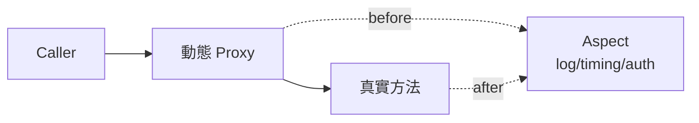

# B3 - AOP 與橫切關注點

← [返回索引(README.md)](./README.md)

---

## 目錄

- [AOP(Aspect-Oriented Programming)🟡](#aop)
- [Cross-Cutting Concerns(橫切關注點)🟡](#cross-cutting)
- [Aspect(切面)🟡](#aspect)
- [JoinPoint(連接點)🟡](#joinpoint)
- [Pointcut(切入點)🟡](#pointcut)
- [Advice(增強)🟡](#advice)
- [Spring AOP vs AspectJ 🔴](#spring-aop-vs-aspectj)
- [Quarkus 的 AOP:Interceptor 🟡](#quarkus-interceptor)
- [Self-invocation 陷阱 🔴](#self-invocation)

---

<a id="aop"></a>
### AOP(Aspect-Oriented Programming,面向切面程式設計)🟡

**定義**:一種程式設計範式,**把重複出現在多個方法的「跨切」邏輯**(log、計時、交易、權限),抽到獨立的「切面」中,在執行期動態織入。

**為什麼用**:
- 業務程式碼**保持乾淨**(不被 log / metrics / 交易 等噪音淹沒)
- 跨切邏輯**集中管理**(改一處全部生效)
- 符合 SOLID 的 **單一職責原則**



---

<a id="cross-cutting"></a>
### Cross-Cutting Concerns(橫切關注點)🟡

**定義**:**穿越多個模組、不屬於某個業務但又必要**的邏輯。經典清單:

| 關注點 | 為什麼是橫切 |
| --- | --- |
| Logging | 每個方法都可能要記 log |
| 錯誤處理 / 計次 | 每個 Service 都要記錄 |
| 執行計時 / Metrics | 每個 Use Case 都要量測 |
| 交易管理 | 多個 Service 方法需要 |
| 權限檢查 | 多個 endpoint 都需要 |
| Audit 審計 | 多個業務動作需要 |

**規範要求**:**非 API 層**的橫切關注點(錯誤 Log、計時、計次、Audit)**統一由 AOP 處理**,不在業務層各自 try-catch。

---

<a id="aspect"></a>
### Aspect(切面)🟡

**定義**:把**橫切邏輯本身**封裝成的類別,內含 Pointcut + Advice。

**範例**:
```java
@Aspect
@Component
@Slf4j
public class ErrorLoggingAspect {

    @Pointcut("execution(* com.example..application..*(..))")
    public void applicationLayer() {}

    @AfterThrowing(pointcut = "applicationLayer()", throwing = "ex")
    public void logError(JoinPoint jp, Throwable ex) {
        log.error("Error in {}: {}", jp.getSignature(), ex.getMessage(), ex);
    }
}
```

**規範要求**:切面定義在 `common/infrastructure/aspect/` 目錄,**切面不得包含業務邏輯**。

---

<a id="joinpoint"></a>
### JoinPoint(連接點)🟡

**定義**:程式執行過程中**可以被切面攔截的點**——Spring AOP 中只支援「方法呼叫」這一種 JoinPoint(AspectJ 還支援欄位存取、建構子等)。

切面方法的第一個參數 `JoinPoint jp` 可拿到呼叫資訊:
```java
jp.getSignature();      // 方法簽名
jp.getArgs();           // 引數
jp.getTarget();         // 被攔截的物件
```

---

<a id="pointcut"></a>
### Pointcut(切入點)🟡

**定義**:**選取一群 JoinPoint 的表達式**,告訴 Spring「我要對哪些方法套用 Advice」。

**常用語法**:
```java
// 所有 application 套件下的方法
@Pointcut("execution(* com.example..application..*(..))")

// 標記 @Auditable 的方法
@Pointcut("@annotation(com.example.common.annotation.Auditable)")

// 所有 Repository
@Pointcut("execution(* com.example..repository..*.*(..))")

// 組合(AND / OR / NOT)
@Pointcut("applicationLayer() && !@annotation(NoAudit)")
```

**execution 表達式結構**:`execution(修飾子? 回傳型別 套件.類別.方法(參數) 例外?)`,各段用 `*`、`..` 通配。

---

<a id="advice"></a>
### Advice(增強)🟡

**定義**:**切面實際執行的動作**,有 5 種時機:

| Advice | 時機 | 用途 |
| --- | --- | --- |
| `@Before` | 方法執行**前** | 權限檢查、參數記錄 |
| `@After` | 方法結束**後**(無論成功失敗) | Audit log |
| `@AfterReturning` | 方法**正常**回傳後 | 結果處理 |
| `@AfterThrowing` | 方法**丟例外**時 | 錯誤 log、轉換例外 |
| `@Around` | **包圍**方法執行(可控制是否呼叫、可改參數/回傳值) | 計時、retry、cache |

**`@Around` 範例**:
```java
@Around("execution(* com.example..usecase..*(..))")
public Object timing(ProceedingJoinPoint pjp) throws Throwable {
    long start = System.nanoTime();
    try {
        return pjp.proceed();             // ← 必須呼叫,否則原方法不會執行
    } finally {
        long ms = (System.nanoTime() - start) / 1_000_000;
        log.info("{} took {}ms", pjp.getSignature(), ms);
    }
}
```

**`@AfterThrowing` 範例**(規範要求的錯誤 log):
```java
@AfterThrowing(
    pointcut = "execution(* com.example..*Service.*(..))",
    throwing = "ex"
)
public void logError(JoinPoint jp, Throwable ex) {
    log.error("Exception in {}: {}", jp.getSignature(), ex.getMessage(), ex);
}
```

---

<a id="spring-aop-vs-aspectj"></a>
### Spring AOP vs AspectJ 🔴

| | Spring AOP | AspectJ |
| --- | --- | --- |
| 織入時機 | 執行期(Proxy) | 編譯期 / Load-time |
| 攔截範圍 | 只能攔 Spring Bean 的 public method | 任何類別、欄位、建構子 |
| 設定複雜度 | 加 `spring-boot-starter-aop` 即可 | 需 Maven plugin / weaver agent |
| 效能 | 略有 overhead(Proxy) | 幾乎無 overhead |
| 適合場景 | 95% 的應用 | 框架開發、極端效能需求 |

**結論**:一般專案用 Spring AOP 就夠,**Spring AOP 用的是 AspectJ 的 annotation 語法,但實作機制不同**(這常讓人混淆)。

---

<a id="quarkus-interceptor"></a>
### Quarkus 的 AOP:Interceptor 🟡

Quarkus 使用 **Jakarta Interceptors** 標準(CDI 一部分),概念與 Spring AOP 相同但寫法不同。

**範例**:
```java
// 1. 自訂 binding annotation
@InterceptorBinding
@Target({ TYPE, METHOD })
@Retention(RUNTIME)
public @interface Logged {}

// 2. 實作 Interceptor
@Logged
@Interceptor
@Priority(Interceptor.Priority.APPLICATION)
public class LoggingInterceptor {
    @AroundInvoke
    public Object log(InvocationContext ctx) throws Exception {
        Log.infof("→ %s", ctx.getMethod().getName());
        try {
            return ctx.proceed();
        } finally {
            Log.infof("← %s", ctx.getMethod().getName());
        }
    }
}

// 3. 使用
@Logged
@ApplicationScoped
public class OrderService { ... }
```

**對照**:

| Spring AOP | Quarkus / CDI Interceptor |
| --- | --- |
| `@Aspect` | `@Interceptor` + `@InterceptorBinding` annotation |
| `@Around` | `@AroundInvoke` |
| `@Before` | `@AroundInvoke`(在 `proceed()` 前做) |
| `@AfterThrowing` | `try-catch` 包 `proceed()` |
| Pointcut 表達式 | 用 annotation 標在類別 / 方法上 |

**Quarkus 內建可用**(無需自己寫):`@Timed`、`@Counted`(MicroProfile Metrics)、`@Logged`(自訂)。

---

<a id="self-invocation"></a>
### Self-invocation 陷阱 🔴

**問題**:Spring AOP 是 **Proxy 模式**——`@Transactional`、`@Cacheable`、自訂 Aspect 都是包在 Proxy 上。**同類別內 `this.foo()` 呼叫不經過 Proxy**,所以 AOP 失效!

**反例**:
```java
@Service
public class OrderService {
    public void outer() {
        this.inner();    // ❌ this. 直接呼叫,Proxy 被繞過,@Transactional 失效
    }

    @Transactional
    public void inner() { /* 不會在交易中! */ }
}
```

**解法**:
1. 拆成兩個 Bean(`OuterService` 注入 `InnerService`)
2. `AopContext.currentProxy()` 取得自身 proxy(需開 `@EnableAspectJAutoProxy(exposeProxy = true)`)
3. 自己注入自己(不推薦,易循環依賴)

**AspectJ 沒這個問題**(編譯期織入,直接改 bytecode)。

---

← [返回索引(README.md)](./README.md)
