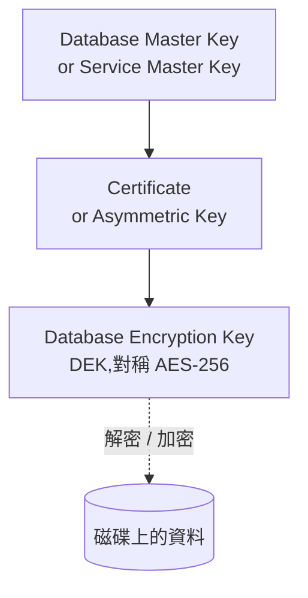
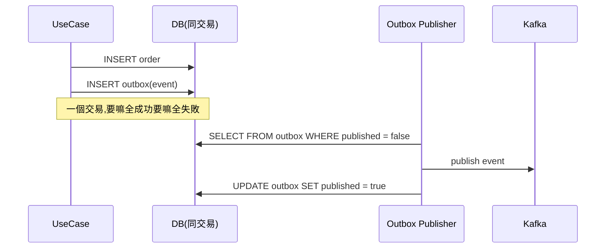
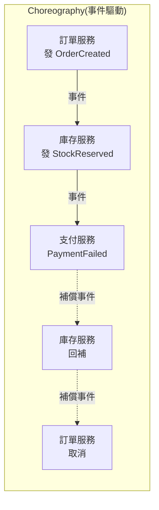
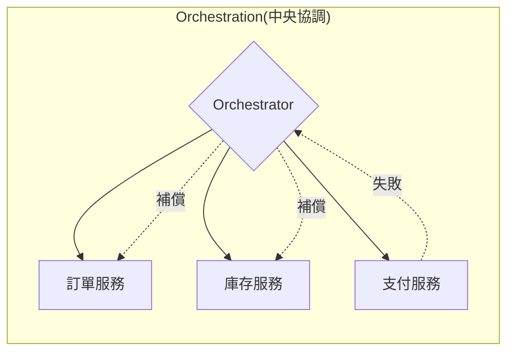
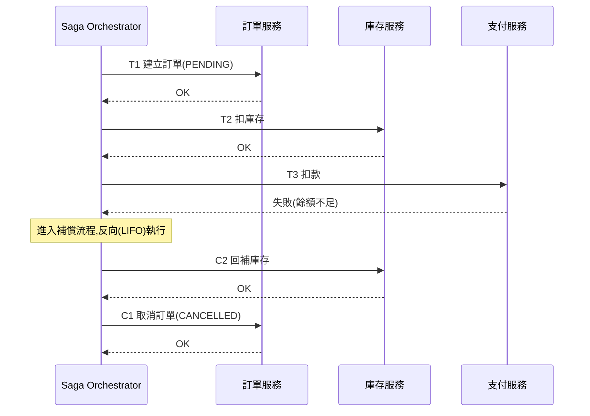

# B4 - 持久層與資料

← [返回索引(README.md)](./README.md)

---

## 目錄

### ORM 與 JPA
- [ORM 🟢](#orm)
- [JPA / Hibernate 🟡](#jpa-hibernate)
- [Entity 🟢](#entity)
- [Blob / Lob(大型物件)🟢](#blob-lob)
- [@OneToMany / @ManyToOne / @ManyToMany 🟡](#relationship)
- [N+1 問題 🔴](#n-plus-1)
- [Lazy vs Eager Loading 🟡](#lazy-eager)
- [JPA Persistence Context / 一級快取 🔴](#persistence-context)
- [Transaction Propagation(交易傳播)🔴](#tx-propagation)

### Repository / Mapper
- [Repository Pattern 🟡](#repository)
- [Spring Data JPA Repository 🟢](#spring-data-jpa)
- [Quarkus Panache Repository 🟢](#panache)
- [Mapper 🟡](#mapper)
- [MapStruct 🟡](#mapstruct)

### 資料初始化
- [Seed Data(種子資料)🟡](#seed-data)

### 快取
- [Cache Aside / Read Through / Write Through 🔴](#cache-strategy)
- [Cache Key 規範 🟡](#cache-key)
- [Redis 基礎資料結構 🟡](#redis)

### 資料安全
- [TDE(Transparent Data Encryption)🟡](#tde)

### 索引
- [Clustered / Non-clustered Index 🟡](#clustered-index)

### 進階模式
- [分散式交易協定(2PC / 3PC / XA / JTA)🔴](#distributed-tx)
- [Outbox Pattern 🔴](#outbox)
- [Saga Pattern(跨系統 Rollback)🔴](#saga)
- [CQRS 🔴](#cqrs)
- [Event Sourcing 🔴](#event-sourcing)

---

## ORM 與 JPA

<a id="orm"></a>
### ORM(Object-Relational Mapping)🟢

**定義**:**物件導向**世界(Java 物件)與**關聯式資料庫**(table)之間的橋接層。讓你用物件操作 DB,而非寫 SQL。

**代價**:抽象漏洞——不熟 ORM 內部機制就會踩 N+1、Lazy Init Exception、Cascade 連環刪等大坑。

---

<a id="jpa-hibernate"></a>
### JPA / Hibernate 🟡

**JPA**(Jakarta Persistence API):Java 的 **ORM 標準規範**(只有介面)。
**Hibernate**:JPA 最常見的**實作**(實際幹活的引擎)。

**關係**:JPA 是規範、Hibernate 是實作,類似 JDBC 與 MySQL Driver 的關係。**Spring Data JPA** 是再上一層的「便利包」。

---

<a id="entity"></a>
### Entity 🟢

**定義**:被 JPA 管理的類別,對應資料庫一張 table。注意:**Domain Layer 的 Entity 與 JPA Entity 不是同一回事**(本規範要求分開)。

**範例**:
```java
@Entity
@Table(name = "users")
@Getter @Setter @NoArgsConstructor
public class UserEntity extends BaseEntity {
    @Id
    @GeneratedValue(strategy = GenerationType.IDENTITY)
    private Long id;

    @Column(nullable = false, unique = true, length = 128)
    private String email;

    @Enumerated(EnumType.STRING)         // 一律用 STRING,別用 ORDINAL
    private UserStatus status;

    @Version
    private Long version;                // 樂觀鎖
}
```

**規範要求**:Entity 只在 Infrastructure Layer,Domain Layer 用純 POJO Model,透過 Mapper 轉換。

---

<a id="blob-lob"></a>
### Blob / Lob(大型物件)🟢

**定義**:資料庫對「**大型物件**」的型別:
- **BLOB**(Binary Large Object)— 二進位資料(圖片、PDF、影片)
- **CLOB**(Character Large Object)— 大型文字(markdown 文章、log)

JPA 用 `@Lob` annotation 把欄位映射到 BLOB / CLOB(視 Java 型別自動選)。

**為什麼用**:
- 一般欄位有大小上限(MySQL `VARCHAR` 最大 65,535 bytes)
- 大型內容超出限制要用 BLOB / CLOB(MySQL `LONGBLOB` 最大 4GB、Postgres `BYTEA` ~1GB)
- 配合 **`FetchType.LAZY`** 才不會每次查 entity 都把幾 MB 的圖片一起載入(這是 N+1 之外的常見效能陷阱)

**Java 型別對應**:

| Java 型別 | DB 型別 | 適用 |
|---|---|---|
| `byte[]` | BLOB | 中小型二進位(< 幾 MB)、用記憶體裝得下 |
| `String` | CLOB | 大型文字 |
| `java.sql.Blob` / `Clob` | BLOB / CLOB | 超大檔(streaming 處理,避免 OOM) |

**範例**:
```java
@Entity
public class Article {
    @Id @GeneratedValue
    private Long id;

    @Lob
    @Basic(fetch = FetchType.LAZY)              // ⚠ 大欄位一定要 LAZY
    @Column(columnDefinition = "LONGTEXT")
    private String content;

    @Lob
    @Basic(fetch = FetchType.LAZY)
    private byte[] coverImage;
}
```

**儲存策略 — 直接存 DB vs 物件儲存**:

| 策略 | 優點 | 缺點 |
|---|---|---|
| **直接存 DB BLOB** | 交易一致性、備份簡單 | DB 尺寸暴漲、備份/同步慢、影響整體效能 |
| **存 S3 等物件儲存,DB 存 URL / Key** | DB 輕、CDN 友善、可水平擴展 | 多一層儲存、需處理孤兒檔(DB 刪了 S3 沒刪) |

**業界共識**:中小型(頭像、icon)可直接存 DB;**中大型(產品圖、PDF、影片)放 S3/MinIO/GCS 等物件儲存**,DB 只存 URL / Object Key。

**瀏覽器端對照**:JavaScript 也有 `Blob` 物件(檔案上傳/下載),是不同層次的東西——詳見 [C3 Blob](./C3-browser-web-api.md#blob)。

> 📌 **個人實戰偏好**:
> - **轉職班專案**寫過將檔案直接存入 DB BLOB
> - **前進(前公司)專案**用過 CLOB 暫存呼叫第三方 API 的 response(常為 XML);欄位/結構未確定時先整段存進 DB,後續確定 schema 後再從 CLOB 讀出轉物件
> - **一般實戰**:檔案落在 Server file system,DB 只存路徑供讀取
> - **個人 side project(`livebeat`)** 規劃改用 **MinIO** 物件儲存

---

<a id="relationship"></a>
### @OneToMany / @ManyToOne / @ManyToMany 🟡

| 關係 | 範例 | 注意 |
| --- | --- | --- |
| `@OneToOne` | User ↔ UserProfile | 雙向時注意 mappedBy |
| `@OneToMany` | Order → 多個 OrderItem | **預設 LAZY**,建議明確標註 |
| `@ManyToOne` | OrderItem → Order | **預設 EAGER**,90% 情況該改 LAZY |
| `@ManyToMany` | User ↔ Role | 需要中間表,建議改用兩個 OneToMany 加一個關聯 Entity |

**關鍵建議**:
- 永遠加 `fetch = FetchType.LAZY`
- 雙向關係要小心 `equals/hashCode` 死循環(用 `@EqualsAndHashCode(onlyExplicitlyIncluded = true)`)
- Cascade 慎用,`CascadeType.ALL` 容易誤刪資料

---

<a id="n-plus-1"></a>
### N+1 問題 🔴

**定義**:一次列表查詢觸發 1 次主查詢 + N 次關聯查詢,效能災難。

**範例**:
```java
List<Order> orders = orderRepo.findAll();          // 1 次 SELECT * FROM orders
for (Order o : orders) {
    o.getItems().forEach(System.out::println);     // 每筆 order 額外打一次 SELECT * FROM items WHERE order_id = ?
}
// 總共 1 + N 次查詢
```

**解法**:
```java
// JPQL fetch join
@Query("SELECT o FROM Order o JOIN FETCH o.items")
List<Order> findAllWithItems();

// Spring Data:@EntityGraph
@EntityGraph(attributePaths = "items")
List<Order> findAll();

// 或開啟 hibernate.default_batch_fetch_size = 16(批次抓)
```

**預防**:在 dev 環境開 `spring.jpa.show-sql=true` + Hibernate Statistics,或用 [Hypersistence Optimizer](https://vladmihalcea.com/hypersistence-optimizer/) 自動偵測。

---

<a id="lazy-eager"></a>
### Lazy vs Eager Loading 🟡

| | Lazy | Eager |
| --- | --- | --- |
| 何時載入 | 第一次存取時 | 主物件載入時即一併載入 |
| 風險 | LazyInitializationException(脫離 Persistence Context 後存取) | N+1、過度抓取 |
| 建議 | **永遠預設 LAZY**,需要時用 `JOIN FETCH` 明確抓 | 幾乎不用 |

---

<a id="persistence-context"></a>
### JPA Persistence Context(一級快取)🔴

**定義**:每個 EntityManager 內部維護的快取,在交易期間追蹤所有被管理的 Entity——這就是 JPA 的「魔法」來源。

**Dirty Checking(髒值檢查)**:
```java
@Transactional
public void updateName(Long id, String name) {
    User user = userRepo.findById(id).get();
    user.setName(name);
    // ❗ 不用 userRepo.save(user)!
    // 交易 commit 時,JPA 比對 Persistence Context 內的 snapshot,自動發 UPDATE
}
```

**Entity 的四種狀態**:
- **Transient(瞬時)**:`new` 出來但沒 persist
- **Managed(受管)**:在 Persistence Context 內
- **Detached(脫離)**:Persistence Context 關閉後
- **Removed(已刪除)**:呼叫 `remove()` 但尚未 flush

---

<a id="tx-propagation"></a>
### Transaction Propagation(交易傳播)🔴

**定義**:當有交易的方法被另一個有交易的方法呼叫,要怎麼處理?

| Propagation | 行為 |
| --- | --- |
| `REQUIRED`(預設) | 有就加入,沒有就建一個 |
| `REQUIRES_NEW` | **永遠**開新交易(暫停外層) |
| `NESTED` | 巢狀交易(SAVEPOINT) |
| `SUPPORTS` | 有就加入,沒有也行 |
| `MANDATORY` | 必須有外層交易,沒有就拋例外 |
| `NEVER` | 必須沒有交易 |

**經典場景**:Audit log 必須**獨立提交**(主交易 rollback 時 log 仍要保留):
```java
@Transactional(propagation = Propagation.REQUIRES_NEW)
public void writeAuditLog(...) { ... }
```

---

## Repository / Mapper

<a id="repository"></a>
### Repository Pattern 🟡

**定義**:DDD 中,Aggregate 的**持久化抽象**——讓 Domain Layer 用「集合」的概念存取資料,不直接接觸 SQL / JPA。

**規範實作**:
- Domain Layer 定義 Port:`OrderRepositoryPort`
- Infrastructure Layer 兩個實作:Real Adapter(包 JPA + Cache)+ Null Adapter
- Use Case **永不直接** 用 `OrderJpaRepository`

---

<a id="spring-data-jpa"></a>
### Spring Data JPA Repository / `JpaRepository` 🟢

**定義**:Spring Data 提供的「魔法 Repository」——只要寫一個 interface 繼承 `JpaRepository<T, ID>`,Spring 在啟動時動態產生實作,自動具備 CRUD、分頁、排序能力。

#### 介面繼承層次

```
Repository<T, ID>                    ← 最底層 marker,無方法
  └─ CrudRepository<T, ID>           ← 加上基本 CRUD
       └─ PagingAndSortingRepository  ← 加上分頁、排序
            └─ JpaRepository<T, ID>   ← 加上 JPA 專屬(flush、batch、Example)
```

| 介面 | 主要方法 |
| --- | --- |
| `CrudRepository` | `save`、`saveAll`、`findById`、`existsById`、`findAll`、`count`、`deleteById`、`delete`、`deleteAll` |
| `PagingAndSortingRepository` | `findAll(Sort)`、`findAll(Pageable)` |
| `JpaRepository` | `flush`、`saveAndFlush`、`deleteAllInBatch`、`getReferenceById`、`findAll(Example)` |

**選哪個**:絕大多數情況繼承 **`JpaRepository`**(最完整);若要與 ORM 解耦改用 NoSQL / 其他 store,可只繼承 `CrudRepository`。

#### 衍生查詢命名慣例(Query Methods)

Spring Data 解析方法名稱**自動產生 SQL**,常用關鍵字:

| 關鍵字 | 範例 | 產生 SQL |
| --- | --- | --- |
| `findBy` / `getBy` / `readBy` | `findByEmail(String)` | `WHERE email = ?` |
| `existsBy` | `existsByEmail(String)` | `SELECT count(*) > 0 ...` |
| `countBy` | `countByStatus(Status)` | `SELECT count(*) ...` |
| `deleteBy` | `deleteByStatus(Status)` | `DELETE WHERE status = ?` |
| `And` / `Or` | `findByEmailAndStatus(...)` | `WHERE email=? AND status=?` |
| `LessThan` / `GreaterThan` | `findByAgeGreaterThan(int)` | `WHERE age > ?` |
| `Between` | `findByCreatedAtBetween(d1, d2)` | `WHERE created_at BETWEEN ? AND ?` |
| `Like` / `Containing` / `StartingWith` / `EndingWith` | `findByNameContaining(String)` | `WHERE name LIKE %?%` |
| `In` / `NotIn` | `findByIdIn(Collection)` | `WHERE id IN (?, ?, ?)` |
| `IsNull` / `IsNotNull` | `findByDeletedAtIsNull()` | `WHERE deleted_at IS NULL` |
| `OrderBy` | `findByStatusOrderByCreatedAtDesc` | `ORDER BY created_at DESC` |
| `Top` / `First` | `findTop10ByStatusOrderByCreatedAtDesc` | `LIMIT 10` |
| `Distinct` | `findDistinctByStatus` | `SELECT DISTINCT` |

**注意**:衍生查詢方法名**錯字到 runtime 才會報錯**(啟動時才解析),CI 應跑 `@DataJpaTest` 確保所有 method 都解析成功。

#### 三種查詢寫法

```java
public interface UserJpaRepository extends JpaRepository<UserEntity, Long> {

    // ① 衍生查詢(method name → SQL)
    Optional<UserEntity> findByEmail(String email);
    List<UserEntity> findByStatusAndCreatedAtAfter(UserStatus status, Instant after);
    long countByStatus(UserStatus status);

    // ② JPQL(物件導向 SQL)
    @Query("SELECT u FROM UserEntity u WHERE u.email LIKE %:keyword%")
    List<UserEntity> search(@Param("keyword") String keyword);

    // ③ Native SQL(直接寫 DB 方言)
    @Query(value = "SELECT * FROM users WHERE LENGTH(email) > :len", nativeQuery = true)
    List<UserEntity> findLongEmails(@Param("len") int len);

    // 修改用 @Modifying
    @Modifying
    @Query("UPDATE UserEntity u SET u.status = :status WHERE u.id IN :ids")
    int batchUpdateStatus(@Param("ids") List<Long> ids, @Param("status") UserStatus status);
}
```

#### 分頁與排序

```java
// 取得 Pageable 並回傳 Page<T>(含 totalCount)
Page<UserEntity> findByStatus(UserStatus status, Pageable pageable);

// 呼叫端
var page = userJpaRepo.findByStatus(
    UserStatus.ACTIVE,
    PageRequest.of(0, 20, Sort.by("createdAt").descending())
);
page.getContent();        // 當頁資料
page.getTotalElements();  // 總筆數
page.getTotalPages();     // 總頁數
```

**Page vs Slice vs List**:
- `Page<T>` — 含總筆數(會多打一次 `count(*)`)
- `Slice<T>` — 不含總筆數,只判斷有無下一頁(效能較好)
- `List<T>` — 不分頁,全部撈

**規範要求**:
- `JpaRepository` **只做純 CRUD 與查詢**,不得包含 Cache 或業務邏輯——Adapter 才負責組裝
- 衍生查詢方法名超過 3 個條件時改用 `@Query`(可讀性)
- 列表查詢**必須支援分頁**(`Pageable`)
- `@Modifying` 必配 `@Transactional`,且通常加 `clearAutomatically = true` 避免 Persistence Context 不一致

---

<a id="panache"></a>
### Quarkus Panache Repository 🟢

**定義**:Quarkus 的 ORM 便利層,類似 Spring Data JPA 但更精簡,有兩種風格:

**Active Record 風格**(Entity 自帶查詢方法):
```java
@Entity
public class User extends PanacheEntity {     // 內建 id 與 CRUD
    public String email;
    public String name;

    public static User findByEmail(String email) {
        return find("email", email).firstResult();
    }
}

// 使用
User u = User.findByEmail("a@b.com");
u.persist();
```

**Repository 風格**(類似 Spring Data):
```java
@ApplicationScoped
public class UserRepository implements PanacheRepository<User> {
    public User findByEmail(String email) {
        return find("email", email).firstResult();
    }
}
```

---

<a id="mapper"></a>
### Mapper 🟡

**定義**:在不同層之間轉換物件的職責類別。

**規範分層**:
| Mapper | 轉換方向 |
| --- | --- |
| API Mapper | Request / Response ↔ Application DTO |
| Application Mapper | DTO ↔ Domain Model |
| Infrastructure Mapper | Domain Model ↔ Entity |

**規範要求**:
- 轉換邏輯**只能在 Mapper**,Use Case / Controller / Adapter 不得自行轉換
- Enum 從外部輸入轉內部時,轉換**集中於 Mapper**

---

<a id="mapstruct"></a>
### MapStruct 🟡

**定義**:Java 的編譯期 Mapper 產生器——你寫 interface,MapStruct 在編譯期產出實作,**無 reflection、零執行期 overhead**。

**範例**:
```java
@Mapper(componentModel = "spring")
public interface UserMapper {
    UserDto toDto(User domain);
    User toDomain(UserDto dto);

    @Mapping(target = "fullName", expression = "java(e.getFirstName() + \" \" + e.getLastName())")
    UserDto fromEntity(UserEntity e);
}
```

**對比手寫 Mapper**:
- ✅ 樣板少,Domain Model 加欄位時 Mapper 漏處理會編譯失敗
- ✅ 效能好(編譯期產 code)
- ❌ 學習曲線:複雜映射需查文件

---

## 資料初始化

<a id="seed-data"></a>
### Seed Data(種子資料)🟡

**定義**:**環境建立 / 應用啟動時預先載入 DB 的資料**——讓系統「**有資料可用**」的起點,不限於哪個環境或用途。

**三種常見情境**(本質都是「預先載入 DB 的資料」,只是用途不同):

| 情境 | 載入什麼 | 主要工具 |
| --- | --- | --- |
| **prod baseline** | 上線必備的查找表(國家代碼、貨幣、預設角色 / 權限種類、系統參數) | Flyway / Liquibase migration |
| **dev 開發環境** | 工程師啟動本機就有的範例資料(100 筆假訂單、10 個假使用者) | `data.sql`、Flyway dev profile |
| **test fixture** | 整合測試前載入特定情境的資料 | `@Sql`、DBUnit / Database Rider、Testcontainers init script |

#### 主要工具

##### Flyway / Liquibase Migration(**強烈推薦**)

**版本化的 schema + 種子管理**——所有 DB 變更(建表、加欄位、種子資料)都是按順序執行的腳本,**進 git、可追溯、可重現**。

```
db/migration/
  V1__create_user_table.sql       ← schema
  V2__create_order_table.sql
  V3__seed_country_codes.sql      ← prod baseline 種子
  V4__seed_default_roles.sql
```

```sql
-- V3__seed_country_codes.sql
INSERT INTO country_codes (code, name) VALUES
  ('TW', '台灣'),
  ('JP', '日本'),
  ('US', '美國')
ON CONFLICT (code) DO NOTHING;   -- 冪等
```

**Flyway vs Liquibase**:
- **Flyway**:純 SQL,簡單直觀,**新專案首選**
- **Liquibase**:支援 XML / YAML / JSON / SQL,跨資料庫好,企業常用

##### Spring Boot `data.sql` / `schema.sql`

`src/main/resources/data.sql` 應用啟動時自動執行。**簡單但缺版本管理**,適合 dev / test,**不適合 prod**。

```yaml
spring:
  jpa:
    defer-datasource-initialization: true  # 等 Hibernate 建表後再跑 data.sql
  sql:
    init:
      mode: always                          # 一律執行(prod 應改 never)
```

##### JPA `@Sql` Annotation(測試專用)

```java
@SpringBootTest
@Sql("/test-data/orders.sql")               // 類別級或方法級
class OrderServiceIT {

    @Test
    @Sql("/test-data/specific-scenario.sql")
    @Sql(scripts = "/test-data/cleanup.sql", executionPhase = AFTER_TEST_METHOD)
    void should_handleSpecificScenario() { ... }
}
```

##### Testcontainers Init Script

```java
@Container
static PostgreSQLContainer<?> postgres = new PostgreSQLContainer<>("postgres:16")
    .withInitScript("init-test-data.sql");  // 容器啟動後立刻跑
```

##### DBUnit / Database Rider

用 **XML / YAML** 描述 fixture,適合複雜資料結構:

```yaml
# users.yml
users:
  - id: 1
    email: alice@example.com
    status: ACTIVE
  - id: 2
    email: bob@example.com
    status: DISABLED

orders:
  - id: 100
    user_id: 1
    status: PAID
```

```java
@DBRider
@DataSet("users.yml")
@Test
void should_findActiveUsers() { ... }
```

#### 規範要求

1. **冪等(idempotent)**:種子腳本**可重複執行**不出錯
   - SQL 用 `INSERT ... ON CONFLICT DO NOTHING` / `ON DUPLICATE KEY UPDATE`
   - 或先 `DELETE` 再 `INSERT`(僅 dev / test)
2. **環境分離**:
   - `db/migration/` 放 prod / 共通 baseline(query lookup table)
   - `db/dev/` 或 Spring profile-specific 放 dev sample data
   - `src/test/resources/test-data/` 放 test fixture
   - **prod migration 中禁止包含使用者資料、業務資料**
3. **禁含真實 PII**:測試資料用假名(`alice@example.com`、`13800138000`),**禁從 prod dump 直接拿來用**(GDPR / 個資法風險)
4. **進 git 版本控管**:跟 schema migration 一起演進、一起 review
5. **執行順序明確**:Flyway 用版本號命名(`V1__`、`V2__`),不要靠檔名字母排序的隱含規則

#### 反模式

```java
// ❌ 反例 1:不冪等的 prod migration
INSERT INTO country_codes VALUES ('TW', '台灣');
// 第二次執行會 unique violation,部署失敗

// ❌ 反例 2:在 data.sql 放使用者敏感資料
INSERT INTO users (email, password) VALUES
  ('admin@company.com', 'plaintext_password');
// 進 git → 永遠洩漏

// ❌ 反例 3:從 prod 撈一份 dump 當 dev / test seed
mysqldump prod > seed.sql
// 真實 PII、可能違反個資法、敏感業務資料外流

// ❌ 反例 4:測試之間共享可變種子
// 測試 A 改了種子資料,測試 B 跑出意外結果
// 解法:每個測試前用 @Sql 重置,或用 @DirtiesContext / Testcontainers 全新 container
```

#### Anti-pattern:把 dev seed 當 prod migration

**真實案例**:dev 環境塞了 1000 筆假資料的 migration 腳本,沒注意被一起部到 prod。
**預防**:
- 嚴格分檔:`db/migration/` 只放 prod 必要的 baseline
- dev sample 用 Spring profile (`@Profile("dev")`) 載入,**migration 不放**
- Code Review 時檢查 migration 內容

---

## 快取

<a id="cache-strategy"></a>
### Cache Aside / Read Through / Write Through 🔴

| 策略 | 讀 | 寫 | 適用 |
| --- | --- | --- | --- |
| **Cache Aside**(旁路) | 先查 Cache,miss 查 DB 並回填 | 寫 DB,**刪除** Cache | 通用,本規範採用 |
| **Read Through** | 應用只接 Cache,Cache 自己負責 fallback DB | 通常與 Write Through 搭配 | 用 Cache library 如 Caffeine + Loader |
| **Write Through** | 同 Read Through | 寫 Cache,Cache 同步寫 DB | 一致性高,效能略差 |
| **Write Behind** | 同上 | 寫 Cache,**非同步**批次寫 DB | 高效能,可能丟資料 |

**Cache Aside 經典程式**:
```java
public Optional<User> findById(UserId id) {
    var key = CacheKeyConstants.USER_PREFIX + id.value();
    return cache.get(key, User.class)
        .or(() -> {
            var user = jpa.findById(id.value()).map(mapper::toDomain);
            user.ifPresent(u -> cache.put(key, u));
            return user;
        });
}

public void save(User user) {
    jpa.save(mapper.toEntity(user));
    cache.delete(CacheKeyConstants.USER_PREFIX + user.id().value());
}
```

**重要陷阱**:寫的時候**刪 Cache 而非更新**——避免並行寫造成 Cache 與 DB 不一致。

---

<a id="cache-key"></a>
### Cache Key 規範 🟡

**規範要求**:
- Cache Key 前綴**集中定義**在 `CacheKeyConstants`
- 命名:`{namespace}:{entity}:{id}`,例 `user:profile:123`
- 加版本號方便日後重構:`user:profile:v2:123`
- 設 TTL,避免永久滯留

```java
public final class CacheKeyConstants {
    private CacheKeyConstants() {}
    public static final String USER_PREFIX = "user:profile:";
    public static final String JWT_BLACKLIST_PREFIX = "jwt:blacklist:";
    public static final Duration USER_TTL = Duration.ofHours(1);
}
```

---

<a id="redis"></a>
### Redis 基礎資料結構 🟡

| 結構 | 用途 |
| --- | --- |
| String | 一般 Cache、計數器(`INCR`) |
| Hash | 物件欄位部分更新(像精簡的 Map) |
| List | 訊息佇列、最新 N 筆 |
| Set | 唯一集合(用過的 token、好友) |
| Sorted Set | 排行榜(分數排序) |
| Stream | 訊息佇列(有 consumer group,類 Kafka 簡化版) |
| Bitmap | 簽到、活躍使用者統計 |
| HyperLogLog | UV 統計(犧牲精準度換空間) |

**注意**:
- Redis 是**單執行緒**處理命令——一個慢命令(`KEYS *`)會卡住所有人
- 設記憶體上限 + eviction policy(`allkeys-lru` 是常見選擇)

---

## 資料安全

<a id="tde"></a>
### TDE(Transparent Data Encryption,透明資料加密)🟡

**定義**:**資料庫引擎層級**的加密技術——**靜態資料(at-rest)** 在寫入磁碟時**自動加密**、讀取時**自動解密**,對應用程式**完全透明**(application 看到的仍是明文,**不需改任何 SQL / code**)。

**為什麼用**:
- **法規合規**:PCI DSS、HIPAA、GDPR、台灣個資法、金融金管會檢查要求「**敏感資料靜態加密**」
- **抵禦磁碟層級的攻擊**:備份檔被偷、實體硬碟遺失、磁碟掃描存取 → 沒金鑰**讀不到**內容
- **應用零改動**:對比 [field-level encryption](./D1-security-jwt.md#aes-256) 需改 code,TDE 純基建層面就能合規

**TDE 加密範圍**:

| 加密目標 | 包含 |
| --- | --- |
| ✅ Data file | 主要 table、index、Heap |
| ✅ Log file | Transaction log(MS SQL)/ WAL(Postgres) |
| ✅ TempDB(MS SQL) | 暫存資料 |
| ✅ Backup file | **這是 TDE 最大價值**——備份檔外洩仍是密文 |
| ❌ **記憶體中的資料** | 仍是明文(`SELECT` 結果、Buffer Pool 內容) |
| ❌ **網路傳輸** | 需另外用 **TLS / mTLS** 保護(見 [D3 TLS](./D3-networking.md#tls-mtls)) |
| ❌ **DBA 的 SELECT** | DBA 用合法帳號連線仍看得到明文(這不是 TDE 要防的) |

**TDE 不解決什麼**(常見誤解):
- ❌ 不防 **SQL Injection**——攻擊者用合法 SQL 仍能讀到明文
- ❌ 不防 **不肖 DBA / 內部威脅**——DBA 連 DB 就看得到明文(需另用 Always Encrypted、欄位加密)
- ❌ 不防 **應用層 bug** 洩漏資料
- ✅ **TDE 只防「資料被搬離受控環境」的場景**(備份外流、磁碟遺失、儲存層滲透)

**主流 DB 的 TDE 對照**:

| DB | TDE 名稱 | 版本要求 | 金鑰管理 |
| --- | --- | --- | --- |
| **SQL Server** | **TDE** | Enterprise 2008+;**Standard 2019+** 也支援 | Database Master Key + Certificate + DEK(Database Encryption Key);可整合 Azure Key Vault(EKM) |
| **Oracle** | **Advanced Security TDE** | 需 Advanced Security 額外授權 | Wallet 或 Oracle Key Vault |
| **MySQL** | **InnoDB Tablespace Encryption** | 5.7+ | Keyring(file / [HashiCorp Vault](./E1-deployment-cicd.md#vault) / AWS KMS) |
| **PostgreSQL** | **無官方 TDE**(社群方案、雲廠商加值) | — | 自家 patch、雲廠 RDS / Aurora 提供 |
| **PostgreSQL 雲版** | RDS / Aurora 加密、GCP Cloud SQL 加密 | 雲廠提供 | AWS KMS / GCP Cloud KMS |
| **MariaDB** | **Data-at-Rest Encryption** | 10.1+ | file_key_management、AWS KMS plugin |

**SQL Server TDE 啟用範例**:
```sql
-- 1. 建立 Database Master Key
USE master;
CREATE MASTER KEY ENCRYPTION BY PASSWORD = 'StrongP@ss123';

-- 2. 建立 Certificate
CREATE CERTIFICATE TDECert WITH SUBJECT = 'TDE Certificate';

-- 3. 在目標 DB 建立 Database Encryption Key(DEK)
USE MyAppDB;
CREATE DATABASE ENCRYPTION KEY
WITH ALGORITHM = AES_256
ENCRYPTION BY SERVER CERTIFICATE TDECert;

-- 4. 啟用 TDE
ALTER DATABASE MyAppDB SET ENCRYPTION ON;

-- 5. 檢查狀態
SELECT name, is_encrypted FROM sys.databases WHERE name = 'MyAppDB';
SELECT * FROM sys.dm_database_encryption_keys;

-- ⚠ 重要:備份 Certificate 與 Master Key!沒有它無法還原備份
BACKUP CERTIFICATE TDECert TO FILE = 'C:\backup\TDECert.cer'
    WITH PRIVATE KEY (FILE = 'C:\backup\TDECert.pvk',
                      ENCRYPTION BY PASSWORD = 'AnotherStrongP@ss');
```

**金鑰階層**(典型 TDE 設計):



**為什麼三層**:
- **DEK** 對稱 key 加密實際資料(對稱快、適合大量資料)
- **Cert / Asymmetric** 加密 DEK,**換 cert 不需重新加密所有資料**(只加密那把 DEK)
- **Master Key** 在最頂層,通常從 OS / HSM / KMS 派生

> 這個「DEK 加密資料、上層 key 加密 DEK」的兩層結構,就是通用的 **信封加密(Envelope Encryption)** 的一種實例;通用概念與 KMS 流程見 [D1 信封加密:DEK + KEK](./D1-security-jwt.md#envelope-encryption)。

**效能影響**:
- CPU **5~15%** 開銷(SQL Server 官方數字)
- **AES-NI 指令集**(現代 CPU 支援)讓 TDE 開銷大幅降低
- 通常**遠小於應用層加密**的影響
- **唯一例外**:大量小型 DB 同時加密 → backup compression 效率變差(密文難壓縮)

**何時不用 TDE 而改用其他方案**:

| 需求 | 用 TDE | 改用其他 |
| --- | --- | --- |
| **靜態資料加密合規** | ✅ 主場 | — |
| **欄位級加密**(信用卡、身分證) | ❌ TDE 全 DB,粒度不夠 | **Field-level encryption**(用 AES-256-GCM 在應用層加密欄位) |
| **防 DBA 看明文** | ❌ TDE 對 DBA 透明 | **Always Encrypted**(SQL Server,key 不在 DB,在 client app) |
| **跨 DB 一致加密** | TDE 各家不同 | **應用層加密**(統一用 KMS + AES) |

**TDE vs Always Encrypted**(SQL Server 兩種加密方案):

| | TDE | Always Encrypted |
| --- | --- | --- |
| 粒度 | **整個 DB** | **特定欄位** |
| 對 application 是否透明 | ✅ 完全透明 | ⚠ 需設定 driver(ADO.NET、JDBC) |
| key 在哪 | DB 引擎內 | **client side**(DB 連 key 都看不到) |
| 防 DBA | ❌ | ✅ |
| 主要用途 | 防備份 / 磁碟外洩 | 防內部威脅、合規(信用卡欄位) |
| 效能影響 | 5~15% CPU | 視欄位數量 |

**雲端 DB 的「加密 at rest」常見內建**:
- AWS RDS、Aurora:建立時勾選「**Enable encryption**」→ KMS 加密,**等同 TDE**
- GCP Cloud SQL、Spanner、BigQuery:**預設加密**(無法關閉)
- Azure SQL Database、Synapse:**預設 TDE 啟用**(Service Managed Key 或 Customer Managed Key)
- **雲時代多數情況不需手動啟用 TDE**——但需確認**是否用 CMK**(Customer Managed Key)以滿足某些合規要求

**對應到 [D1 AES-256](./D1-security-jwt.md#aes-256)**:
- TDE **底層也是 AES-256-GCM(或 AES-CBC)** —— TDE 是 DB 引擎封裝好的「全 DB 透明 AES」
- 兩者**互補**:TDE 保護整個 DB 不被搬走,**field-level AES** 保護敏感欄位即使 DBA 也看不到

**對應到 [Defense in Depth](./D1-security-jwt.md#defense-in-depth)** 的縱深思維:
- TDE 是**一層**(磁碟、備份),不是全部
- 完整資安要 TLS 傳輸 + TDE 靜態 + Field-level 敏感欄位 + Audit log + 最小權限 DB 帳號 + ...

**Java 工程師會遇到**:
- **基本沒事**——TDE 對 JDBC 完全透明,你的 Spring Data JPA / JdbcTemplate 程式碼**不用改任何一行**
- 例外:**Always Encrypted** 需用支援的 JDBC driver 並設定 column key
- **備份還原時**才會碰到——拿備份檔到別台機器還原,**必須帶 Master Key / Certificate**(SQL Server)或 Wallet(Oracle),否則還原失敗
- 監控:**Key Rotation**(金鑰輪替)由 DBA / 資安負責,通常每 1~2 年一次

**反模式**:
- ❌ TDE certificate / master key **沒備份** — 備份檔還原時打不開,**等於資料永久遺失**
- ❌ TDE certificate **跟 DB 備份放同一處** — 同時被偷等於沒加密
- ❌ 以為 TDE 就能滿足 PCI DSS — PCI DSS 對信用卡欄位要求更嚴格(Tokenization 或 field-level encryption)
- ❌ TDE 開了但沒**強制 TLS 連線** — 資料在網路上仍是明文
- ❌ DBA 看得到明文資料的場景仍叫「**敏感資料加密**」 — TDE 不防 DBA

---

## 索引(Index)

<a id="clustered-index"></a>
### Clustered / Non-clustered Index 🟡

**定義**:索引依「**是否決定資料列的實體儲存順序**」分兩類。

**Clustered Index(叢集 / 聚簇索引)**:決定資料表**實體儲存順序**,葉節點**就是實際資料列**。一表**只能一個**(實體排序只有一種),InnoDB / SQL Server 通常就是 primary key。範圍查詢快(資料連續)。

**Non-clustered Index(非叢集 / 二級索引)**:獨立於資料實體順序,葉節點存「索引鍵 + 指向資料的指標」(RID,或 InnoDB 的 clustered key)。一表**可多個**。查詢常需**回表**(key lookup / bookmark lookup):先在索引找指標,再撈完整列,多一次 I/O。

**Covering Index(涵蓋索引)**:把查詢需要的欄位全放進索引 → **免回表**。

**範例**(InnoDB):PK = clustered;其他索引 = secondary(non-clustered),葉節點存 PK 值,回表時用 PK 再查一次 clustered index。

**口訣**:clustered = 資料本身排序、一表一個;non-clustered = 額外查找表、可多個、可能回表。

**關聯**:底層結構見 [G1 B-Tree / B+Tree](./G1-data-structures.md#b-tree);為何 `LIKE 'abc%'` 走索引、複合索引最左前綴,也在 G1。

---

## 進階模式

<a id="distributed-tx"></a>
### 分散式交易協定(2PC / 3PC / XA / JTA)🔴

**定義**:一筆交易橫跨多個資源(多 DB、DB + MQ)或多個服務時,要嘛全部成功、要嘛全部失敗,需要協定來協調。這組名詞是「傳統強一致」路線,[Saga](#saga) / [Outbox](#outbox) 是它在微服務下的替代。

**2PC(Two-Phase Commit,兩階段提交)**
- 角色:Coordinator(協調者)+ Participants(參與者)。
- Phase 1 Prepare:協調者問「可以 commit 嗎」,參與者寫 undo/redo log、鎖資源、回 Yes/No。
- Phase 2 Commit / Abort:全 Yes → commit;任一 No → abort。
- 致命傷:**blocking** — 協調者在 Phase 2 掛掉,已投 Yes 的參與者持鎖卡死;同步等待、單點故障、效能差。

**3PC(Three-Phase Commit)**:為解 blocking,在 Prepare 與 Commit 間插入 **PreCommit** 並全程加 timeout(`CanCommit?` → `PreCommit` → `DoCommit`),讓參與者在協調者失聯時能自主決策。但多一輪往返、效能更差、network partition 下仍可能不一致 → **實務罕用**,多為教材 / 面試題。

**XA**:不是演算法,是 X/Open(現 The Open Group)**DTP 模型的標準規範**,定義 TM(Transaction Manager)與 RM(Resource Manager)之間的介面(`xa_prepare` / `xa_commit`…);底層執行的就是 2PC。需 DB / driver 支援(MySQL XA、Oracle XA)。

**JTA(Jakarta Transaction API)**:XA 的 Java 版 API,資源實作 `XAResource`、資料源用 `XADataSource`。實作引擎:**Narayana**(WildFly / Quarkus)、**Atomikos**(Spring Boot 常用);Bitronix 已於 Spring Boot 3.0 移除。

**Crash Recovery / in-doubt transaction**:2PC 最怕協調者中途掛掉。可靠的 TM(如 Narayana)靠 transaction log + recovery manager,重啟後把「已 prepare 未 commit」的 in-doubt 交易補完或回滾——**有沒有 recovery 是能不能上 production 的分水嶺**。

**一致性光譜**
- **強一致(Strong Consistency)**:2PC / XA 保證交易結束時所有節點一致,代價是阻塞、低可用。
- **最終一致(Eventual Consistency)**:放棄即時一致,只保證「**若無新更新,所有副本最終收斂到一致**」,中間狀態短暫可見。[Saga](#saga)、[Outbox](#outbox)、多數分散式複製 / 快取都走這條,是 CAP 下選 AP 的必然結果。
- 一句話:**2PC 用可用性換一致性;Saga 用一致性(退成最終一致)換可用性**。

**關係**:與 [Saga](#saga) 互為替代方案(見 Saga 條目對照表);與 [Transaction Propagation](#tx-propagation) 不同層級(那是單機 `@Transactional` 傳播,別混淆);跨服務改用 [Outbox](#outbox)。

**何時用**:單服務多資源(DB + MQ)要強一致 → XA / JTA 仍合理;跨多個微服務 → 避免分散式 2PC,走 Saga / Outbox。

---

<a id="outbox"></a>
### Outbox Pattern 🔴

**問題**:在同一個 Use Case 中要寫 DB 也要發 MQ,如何保證**一致性**?(寫 DB 成功但 MQ 沒發出?反之亦然?)

**解法**:**先把事件寫進 DB 的 outbox 表**(與業務同交易),再由獨立的 publisher 把 outbox 表記錄發到 MQ。



**為什麼有效**:DB 交易保證「業務寫入 + 事件寫入」原子性,MQ 失敗只會 retry 不會丟資料。

---

<a id="saga"></a>
### Saga Pattern(跨系統 Rollback)🔴

**定義**:跨多個服務的**長交易**(long-lived transaction)——當分散式系統做不到單一 ACID 交易,改用「**一系列本地交易 + 失敗時的補償操作(Compensating Transaction)**」來達成**最終一致性**(eventual consistency)。

**核心問題**:微服務各自擁有自己的 DB(Database per Service),一筆業務(下單 → 扣庫存 → 扣款)橫跨多個服務,**無法用單一 `@Transactional` 包起來**。傳統 2PC / XA 雖能保證強一致,但會長時間鎖資源、協調者是單點、可用性差,在微服務規模下難以接受。

**Saga 的取捨**:用「**補償**」換「**可用性**」——放棄即時原子性,接受**中間狀態短暫可見**,失敗時用反向業務操作把已完成的步驟「語意上回滾」。

#### 跨系統 Rollback 的本質:補償交易,不是真的 ROLLBACK

| 面向 | 單機交易 ROLLBACK | Saga 補償(Compensating Transaction) |
| --- | --- | --- |
| 機制 | DB 引擎丟棄未 commit 的變更 | **執行一筆新的反向業務交易** |
| 時間點 | commit 之前 | 每一步都**已經 commit**,事後補救 |
| 痕跡 | 像沒發生過 | 留下軌跡(扣款 + 退款兩筆紀錄) |
| 範例 | `ROLLBACK;` | 扣款 → **退款**;扣庫存 → **回補庫存**;發貨 → **召回 / 退貨** |

**關鍵認知**:有些操作**根本無法補償**(寄出的 email、已撥付的款項、已出貨的實體商品)。設計時要把**不可逆步驟盡量往後排**,放在所有可補償步驟之後——這個分界點稱為 **Pivot Transaction(樞紐交易)**:pivot 之前全可補償,pivot 之後只能往前重試直到成功。

#### 兩種風格:Choreography vs Orchestration

> 名稱借自表演藝術:**Orchestration** 像管弦樂團有**指揮**(中央 orchestrator 發號施令、逐步呼叫各服務);**Choreography** 像舞者照**編舞**各自走位(沒有指揮,服務靠彼此的事件互相配合)。下表括號內同時標註「比喻譯名 / 描述譯名」。

| 維度 | Choreography(編舞 / 協同式) | Orchestration(指揮 / 編排式) |
| --- | --- | --- |
| 控制方式 | 服務間靠**事件**互相觸發,無中央協調者 | 中央 **Orchestrator** 逐步呼叫各服務 |
| 流程可見性 | 分散、難追蹤(流程藏在事件鏈裡) | 集中、易監控與除錯 |
| 耦合 | 低(各服務只認事件) | 中(Orchestrator 認得所有服務) |
| 風險 | 事件鏈循環依賴、難掌握全局 | Orchestrator 成為複雜度與單點集中處 |
| 適合 | 步驟少(2~4)、團隊各自自治 | 步驟多、流程複雜、需嚴格監控 |





#### 範例:訂單流程(Orchestration,扣款失敗觸發補償)



**Orchestration 範例**(中央協調者,失敗則 LIFO 反向補償):
```java
@Service
@RequiredArgsConstructor
public class CreateOrderSaga {
    private final OrderService order;
    private final StockService stock;
    private final PaymentService payment;

    public void execute(OrderRequest req) {
        // 用 stack 記錄「每個已完成步驟對應的補償動作」
        Deque<Runnable> compensations = new ArrayDeque<>();
        try {
            OrderId id = order.create(req);                        // T1
            compensations.push(() -> order.cancel(id));            // C1

            stock.reserve(req.items());                            // T2
            compensations.push(() -> stock.release(req.items()));  // C2

            payment.charge(req.userId(), req.amount());            // T3(pivot)
        } catch (Exception e) {
            // 失敗:依 LIFO 反向執行補償(後完成的先回滾)
            compensations.forEach(Runnable::run);
            throw new SagaFailedException("下單失敗,已執行補償", e);
        }
    }
}
```

**注意**:上例為**示意版**(補償狀態只活在記憶體)。正式環境必須把 Saga 狀態**持久化**(saga log / 狀態機),否則程序崩潰時補償會遺失;且補償需冪等、可重試。實務多用 Camunda / Temporal / Axon 等框架托管狀態與重試。

#### 補償交易的設計守則

- **冪等(idempotent)**:補償可能因重試被執行多次,結果須一致——詳見 [B6 Idempotency](./B6-resilience.md#idempotency)。
- **補償也會失敗**:需 retry + backoff,最終失敗要進 dead letter / 告警,留人工介入。
- **不可逆步驟往後排**:把撥款、發貨、寄信等無法補償的動作放在 pivot 之後。
- **正向與補償一樣要測試**:補償邏輯沒被測過,等於沒有 rollback。

#### Saga 缺乏隔離性(ACD without I)

本地交易有 ACID,但 Saga 整體**只保證 A、C、D,沒有 I(Isolation)**——步驟間的中間狀態會被其他交易看見,可能造成**髒讀 / 更新遺失**。常見對策(來自 Chris Richardson《Microservices Patterns》):

| 對策 | 說明 |
| --- | --- |
| **Semantic Lock**(語意鎖) | 在 Saga 進行中把資料標記為 `PENDING`,其他交易看到就等待或拒絕 |
| **Commutative Updates**(可交換更新) | 設計成「加減」而非「設定絕對值」,順序顛倒結果仍正確 |
| **Pessimistic View** | 調整步驟順序,降低髒讀的業務風險 |
| **Reread Value** | 更新前重讀並比對版本,變了就中止(類似樂觀鎖) |
| **By Value** | 依風險高低動態選擇:低風險走 Saga,高風險改用分散式鎖 / 同庫交易 |

#### Saga vs 2PC(XA)vs TCC 對照

> 各協定的完整定義見 [分散式交易協定(2PC / 3PC / XA / JTA)](#distributed-tx);下表聚焦與 Saga 的取捨對照。

| 維度 | 2PC / XA | TCC(Try-Confirm-Cancel) | Saga |
| --- | --- | --- | --- |
| 一致性 | 強一致(ACID) | 較強(資源預留) | **最終一致** |
| 鎖定 | 長時間鎖資源、阻塞 | 短(Try 階段預留) | 不鎖,各本地交易立即 commit |
| 隔離性 | 有 | 部分(預留) | **無**(需自行補) |
| 協調者 | 必須(SPOF 風險) | 應用層自管 | Orchestration 需要 / Choreography 不需 |
| 侵入性 | 低(DB / MQ 原生支援) | **高**(每服務要寫 Try/Confirm/Cancel 三方法) | 中(每步要寫補償) |
| 適用 | 同公司、節點少、可接受阻塞 | 金流等需較強一致的短交易 | 微服務、長流程、可接受最終一致 |

#### 與相關模式的關係

- **[Outbox Pattern](#outbox)**:Choreography Saga 靠事件串接,而「寫 DB + 發事件」必須原子——Outbox 正是保證事件可靠送出的標配。
- **[Event Sourcing](#event-sourcing)**:事件流天然適合驅動 Choreography Saga。
- **狀態機 / 流程引擎**:Orchestration Saga 本質是一台狀態機,常用 BPMN(Camunda / Zeebe)或 Temporal 表達。

#### 實作工具

- **Orchestration**:Camunda / Zeebe(BPMN)、Temporal、AWS Step Functions、Axon Framework、Eventuate Tram Sagas、Spring Statemachine
- **Choreography**:Kafka / RabbitMQ + [Outbox Pattern](#outbox) + Idempotent Consumer

#### 反模式

- ❌ 把 Saga 當**同步 RPC chain**(一個服務同步呼叫下一個、又沒寫補償)——失去解耦與韌性,變成「分散式單體」
- ❌ 補償交易**不冪等**,或沒考慮「補償本身也會失敗」
- ❌ 忽略隔離性,中間狀態被別的交易讀到造成業務錯誤
- ❌ **單體應用硬上 Saga**——同進程同 DB 用本地 `@Transactional` 就好,別自找麻煩
- ✅ 不可逆步驟(撥款、發貨、寄信)一律排在 pivot 之後
- ✅ Saga 狀態持久化,崩潰可續跑;補償有 retry 與告警

#### 何時用 / 何時不用

- **用**:跨多個自治服務或外部系統的長流程、可接受最終一致與中間狀態短暫可見、步驟大多可補償。
- **不用**:同一服務同一 DB(本地交易即可)、需即時強一致(如金融核心帳務瞬時餘額,考慮 TCC 或同庫交易)、流程極短且節點少又可接受阻塞(2PC 也許更簡單)。

---

<a id="cqrs"></a>
### CQRS(Command Query Responsibility Segregation)🔴

詳見 [A3-architecture.md#cqrs](./A3-architecture.md#cqrs)。

---

<a id="event-sourcing"></a>
### Event Sourcing(事件溯源)🔴

**定義**:**不存當前狀態**,而是把所有「狀態改變的事件」依序儲存,當前狀態 = 重放所有事件的結果。

**為什麼用**:完整審計軌跡(每次變更都是不可變事件,天然合規)、時光回溯(重建任意時間點狀態、debug「當時發生什麼」)、與 [CQRS](./A3-architecture.md#cqrs) 天然搭配(事件流投影成多個讀模型)、事件為一等公民便於驅動 Choreography [Saga](#saga)。

**核心元件**:Event Store(只 append、不可變)、Aggregate(重放事件流得當前狀態)、**Snapshot(快照)**(事件太多重放慢 → 定期存快照,之後只重放快照後事件)、Projection / Read Model(投影成查詢視圖,常配 CQRS)。

**範例**:帳戶事件流 `AccountOpened → Deposited(100) → Withdrawn(30)`,當前餘額 = 重放 = 70;存的是這串事件,而非「餘額 = 70」。

**代價**:複雜度爆炸;事件 schema 演進困難(舊事件不可改,要 versioning / upcasting);讀模型為非同步投影 → 最終一致。

**何時用 / 不用**:用於強稽核(金融、帳務、法遵)、需完整歷史、事件驅動架構;純 CRUD、無稽核需求、團隊不熟則**別為用而用**。

---

← [返回索引(README.md)](./README.md)
