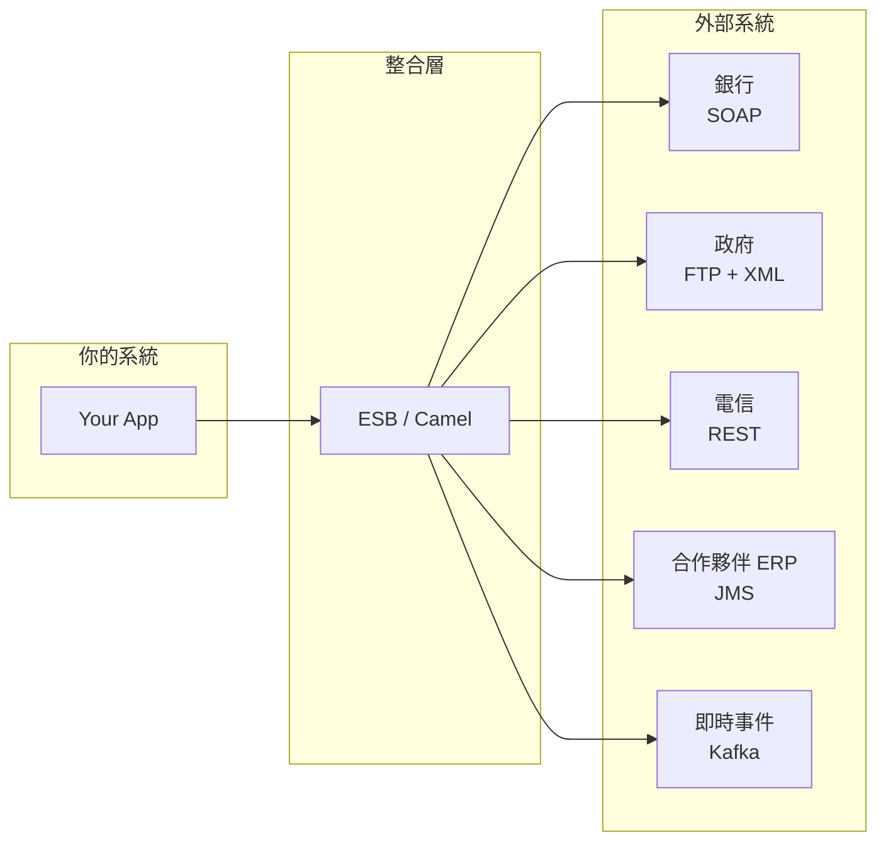
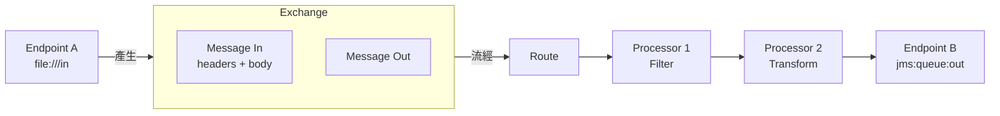
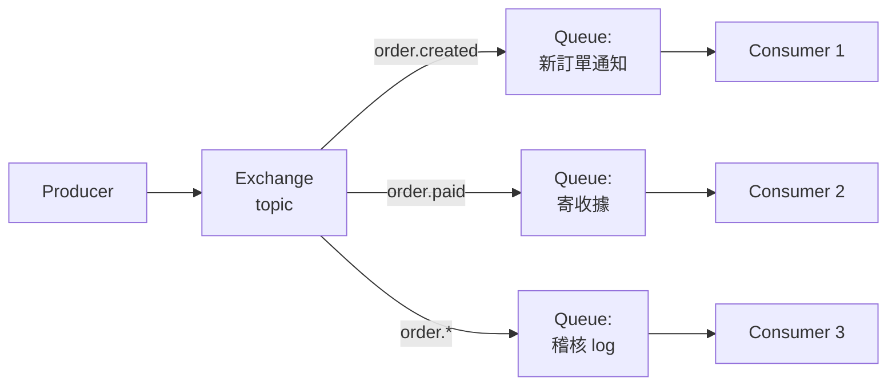

# B5 - 整合與訊息(Integration & Messaging)

← [返回索引(README.md)](./README.md)

---

## 為什麼有這一篇?

當系統不再是「一個 App + 一個 DB」,而是要與**外部系統**(銀行、電信、政府、第三方 SaaS、合作夥伴 ERP)交換資料,各家用的協定、格式、可用性都不同——這時就需要**整合層**(Integration Layer)。



---

## 目錄

### 整合架構
- [ESB(Enterprise Service Bus)🟡](#esb)
- [EIP(Enterprise Integration Patterns)🟡](#eip)

### Apache Camel
- [Apache Camel 🟡](#camel)
- [Route(路由)🟡](#route)
- [Exchange(交換)🟡](#exchange)
- [Message 🟡](#message)
- [Processor(處理器)🟡](#processor)
- [Endpoint(端點)🟡](#endpoint)
- [Component(元件)🟡](#component)
- [DSL(Java/XML/YAML)🟡](#dsl)

### Web Services 與資料格式
- [SOAP vs REST 🟡](#soap-vs-rest)
- [XML / WSDL 🟢](#xml)
- [JSON 🟢](#json)

### 訊息佇列
- [MQ(Message Queue)概念 🟢](#mq)
- [JMS(Java Message Service)🟡](#jms)
- [Queue vs Topic(P2P vs Pub/Sub)🟢](#queue-vs-topic)
- [Kafka 🟡](#kafka)
- [RabbitMQ 🟡](#rabbitmq)
- [Kafka vs RabbitMQ 對照 🟡](#kafka-vs-rabbit)

### 檔案傳輸
- [FTP / SFTP / FTPS 🟢](#ftp)

---

## 整合架構

<a id="esb"></a>
### ESB(Enterprise Service Bus,企業服務匯流排)🟡

**定義**:把多個異質系統(不同協定、不同格式)透過**統一的「匯流排」**連接,讓彼此不需要直接對接。

**核心職責**:
- **協定轉換**:HTTP ↔ JMS ↔ FTP ↔ SOAP
- **格式轉換**:XML ↔ JSON ↔ CSV ↔ EDI
- **路由**:依規則決定訊息送往哪裡
- **編排**:組合多個系統呼叫成一個流程
- **錯誤處理 / 重試 / 監控**

**為什麼用**:
- N 個系統兩兩對接需 **N×(N-1)/2** 條線(10 個系統就 45 條),用 ESB 後變 **N** 條
- 變更協定 / 格式時只改 ESB,不動各系統

**ESB 實作**:
- Apache Camel(輕量、最常見、Spring Boot 友善)
- Mule ESB
- IBM Integration Bus / WebSphere
- WSO2 ESB

**現代演進**:Cloud Native 時代,ESB 漸被「**API Gateway** + **訊息佇列(Kafka)** + **Service Mesh**」組合取代,但傳統企業仍大量使用 ESB。

---

<a id="eip"></a>
### EIP(Enterprise Integration Patterns)🟡

**定義**:Gregor Hohpe 與 Bobby Woolf 在 2003 年整理的書同名,收錄了 **65 種訊息整合模式**,是 ESB / Camel 的理論基礎。

**常見模式**:

| 模式 | 用途 |
| --- | --- |
| **Content-Based Router** | 依訊息內容路由到不同 endpoint |
| **Splitter** | 把一筆訊息拆成多筆處理 |
| **Aggregator** | 把多筆訊息合成一筆 |
| **Filter** | 過濾掉不感興趣的訊息 |
| **Translator** | 訊息格式轉換(XML → JSON) |
| **Wire Tap** | 複製一份訊息送去稽核 / log |
| **Dead Letter Channel** | 處理失敗的訊息送到專用佇列 |
| **Idempotent Receiver** | 確保同一筆訊息只處理一次 |

**Camel 直接內建這些模式**(就是 DSL 的方法名)。

---

## Apache Camel

<a id="camel"></a>
### Apache Camel 🟡

**定義**:**Java 的整合框架**,實作了 EIP,提供統一 DSL 連接 300+ 種系統(資料庫、訊息佇列、檔案、雲端服務、SaaS API)。

**核心概念**(以下五個一起理解最快):



---

<a id="route"></a>
### Route(路由)🟡

**定義**:Camel 的核心抽象——**從某個來源讀取訊息 → 一系列處理 → 送到某個目的地**的流程定義。

**Java DSL 範例**:
```java
@Component
public class OrderRoute extends RouteBuilder {
    @Override
    public void configure() {
        from("file:///data/orders/inbox?move=processed")        // 來源 Endpoint
            .routeId("order-import")
            .log("Received: ${header.CamelFileName}")
            .unmarshal().jacksonXml(Order.class)                 // XML → POJO
            .filter(simple("${body.amount} > 100"))              // EIP: Filter
            .process(this::enrichOrder)                          // 自訂 Processor
            .to("jms:queue:orders.processed");                   // 目的 Endpoint
    }
}
```

---

<a id="exchange"></a>
### Exchange(交換)🟡

**定義**:Camel 中**流經 Route 的資料容器**——你可以把它想成「**一個訊息加上路由元資料的信封**」。

**結構**:
- `In Message` — 進入這個 Processor 的訊息
- `Out Message` — 處理後產出的訊息(可選)
- `Properties` — 整條 Route 共用的鍵值對(類似 ThreadLocal,但綁在 Exchange)
- `Pattern` — `InOnly`(fire-and-forget)/ `InOut`(request-reply)

**Processor 內存取**:
```java
public void process(Exchange exchange) {
    Order order = exchange.getIn().getBody(Order.class);
    exchange.getIn().setHeader("X-Tenant", tenant);
    exchange.setProperty("startTime", System.currentTimeMillis());
}
```

---

<a id="message"></a>
### Message 🟡

**定義**:Exchange 內的**實際內容**,由 **Headers**(metadata)+ **Body**(payload)組成。

**範例**(從 file 來的訊息):
- Body:檔案內容(`InputStream` / `String` / 解析後的 POJO)
- Headers:`CamelFileName`、`CamelFileLength`、`CamelFilePath`、`Content-Type`...

**Headers vs Properties**:
- **Header** 隨訊息傳遞(會跟著訊息出去)
- **Property** 只存活在 Exchange 內(整條 Route 結束就消失)

---

<a id="processor"></a>
### Processor(處理器)🟡

**定義**:**對 Exchange 做轉換 / 處理的邏輯單元**。可以是內建的 EIP(filter、splitter)、簡單 lambda,或自訂類別。

**自訂 Processor**:
```java
@Component
public class OrderEnrichmentProcessor implements Processor {
    @Override
    public void process(Exchange exchange) {
        Order order = exchange.getIn().getBody(Order.class);
        order.setProcessedAt(Instant.now());
        order.setSource("external-system");
        exchange.getIn().setBody(order);
    }
}
```

**Route 中使用**:
```java
.process(orderEnrichmentProcessor)
// 或 lambda
.process(e -> e.getIn().setHeader("X-Foo", "bar"))
```

---

<a id="endpoint"></a>
### Endpoint(端點)🟡

**定義**:訊息的**來源或目的地**,以**URI 字串**表示。Camel 透過 URI 的 schema(`file:`、`jms:`、`kafka:`、`http:`)決定用哪個 Component。

**URI 範例**:
```
file:///data/in?recursive=true&delay=5000
jms:queue:orders?concurrentConsumers=5
kafka:order-events?brokers=localhost:9092&groupId=app1
http://api.example.com/orders?bridgeEndpoint=true
sftp://user@host:22/upload?password=xxx&binary=true
```

**Endpoint 既可當輸入也可當輸出**:
- `from("file:///in")` — 輸入(consumer)
- `to("file:///out")` — 輸出(producer)

---

<a id="component"></a>
### Component(元件)🟡

**定義**:**產生 Endpoint 的工廠**——`camel-jms` 是個 Component,你可以從它產出 `jms:queue:foo`、`jms:topic:bar` 等多個 Endpoint。

**安裝**:在 `pom.xml` 加依賴 `camel-{component}-starter`,Camel 自動註冊。

**常用 Component**:

| Component | 用途 |
| --- | --- |
| `camel-file` / `camel-ftp` / `camel-sftp` | 檔案 / FTP |
| `camel-jms` / `camel-activemq` / `camel-rabbitmq` | 訊息佇列 |
| `camel-kafka` | Kafka |
| `camel-http` / `camel-rest` | HTTP / REST |
| `camel-cxf` | SOAP |
| `camel-jdbc` / `camel-jpa` / `camel-sql` | 資料庫 |
| `camel-mail` | Email |
| `camel-aws-s3` | AWS S3 |
| `camel-bean` | 呼叫 Spring Bean |

---

<a id="dsl"></a>
### DSL(Java / XML / YAML)🟡

Camel 提供多種 DSL 寫 Route:

**Java DSL**(最常用,IDE 支援好):
```java
from("file:///in").to("jms:queue:out");
```

**XML DSL**(舊風格):
```xml
<route>
    <from uri="file:///in"/>
    <to uri="jms:queue:out"/>
</route>
```

**YAML DSL**(較新,Camel K / Quarkus 主推):
```yaml
- from:
    uri: "file:///in"
    steps:
      - to: "jms:queue:out"
```

**規範建議**:Spring Boot 專案用 **Java DSL**,因為可以享受編譯期檢查、refactoring、debug。

---

## Web Services 與資料格式

<a id="soap-vs-rest"></a>
### SOAP vs REST 🟡

| | SOAP | REST |
| --- | --- | --- |
| 傳輸格式 | XML(強制) | JSON / XML / 任意 |
| 協定 | 通常 HTTP,但也可 SMTP / JMS | HTTP only |
| 規格 | 嚴格(WSDL 描述) | 約定俗成(OpenAPI 描述) |
| 工具產 stub | WSDL → Java(`wsimport` / CXF) | OpenAPI → Java(OpenAPI Generator) |
| 安全 | WS-Security(複雜但完整) | HTTPS + OAuth / JWT |
| 適用 | 銀行、政府、企業 B2B、需數位簽章 | 一般網路服務、行動 App、現代 API |
| 學習曲線 | 陡 | 平 |

**何時還要碰 SOAP**:對接舊系統(銀行、保險、政府)、需 WS-Security 規格、需 message-level 簽章/加密。

**範例**(Spring 用 CXF):
```java
@Bean
public BankService bankService() {
    JaxWsProxyFactoryBean f = new JaxWsProxyFactoryBean();
    f.setServiceClass(BankService.class);
    f.setAddress("https://bank.example.com/ws");
    return (BankService) f.create();
}
```

---

<a id="xml"></a>
### XML / WSDL 🟢

**XML**(eXtensible Markup Language):用標籤表示樹狀結構的資料格式。
```xml
<order>
  <id>123</id>
  <amount currency="TWD">1000</amount>
</order>
```

**WSDL**(Web Services Description Language):**SOAP 的規格檔**——描述服務有哪些操作、輸入輸出型別、endpoint 位置。給 SOAP 用的等同 OpenAPI。

**XSD**(XML Schema Definition):描述 XML 結構規則的 schema 檔。

**Java 工具**:
- `JAXB` — XML ↔ Java POJO(`@XmlRootElement`、`@XmlElement`)
- Jackson XML — Jackson 的 XML 模組(同時支援 JSON 和 XML)
- `wsimport` / `cxf-codegen-plugin` — WSDL → Java 介面

---

<a id="json"></a>
### JSON 🟢

**定義**:JavaScript Object Notation。輕量資料交換格式,REST API 的事實標準。

**Java 工具**:
- **Jackson**(Spring 預設):`ObjectMapper`、`@JsonProperty`、`@JsonIgnore`
- **Gson**(Google):`Gson`
- **JSON-B**(Jakarta 標準,Quarkus 預設可選):`@JsonbProperty`

```java
// Jackson
ObjectMapper mapper = new ObjectMapper();
String json = mapper.writeValueAsString(order);
Order parsed = mapper.readValue(json, Order.class);
```

---

## 訊息佇列

<a id="mq"></a>
### MQ(Message Queue)概念 🟢

**定義**:讓系統間透過**訊息**而非直接呼叫互動的中介軟體。生產者(Producer)送訊息進 Queue / Topic,消費者(Consumer)拉取處理。

**為什麼用**:
- **解耦**:生產者不需知道誰在消費
- **削峰**:突發流量先進 Queue,後端慢慢處理,避免被打爆
- **可靠**:訊息持久化,接收方掛了訊息不丟
- **非同步**:呼叫端不需等處理完成

**主流產品**:
- **Kafka** — 高吞吐、串流、log-based
- **RabbitMQ** — 通用、靈活路由、相對輕量
- **ActiveMQ / Artemis** — JMS 實作
- **AWS SQS** / **GCP Pub/Sub** — 雲端託管
- **Redis Streams** — 簡化版

---

<a id="jms"></a>
### JMS(Java Message Service)🟡

**定義**:**Java 的訊息佇列標準 API**(JSR-914),類似 JDBC 之於 DB——一套 API 可對接多個實作(ActiveMQ、Artemis、IBM MQ、TIBCO)。

**核心物件**:
- `ConnectionFactory` — 建立連線
- `Connection` / `Session` — 連線與工作階段
- `Destination`(`Queue` 或 `Topic`)— 目的地
- `MessageProducer` / `MessageConsumer` — 生產者 / 消費者
- `Message`(`TextMessage`、`BytesMessage`、`ObjectMessage`、`MapMessage`)

**Spring 簡化**:`JmsTemplate` + `@JmsListener`
```java
// 發送
@RequiredArgsConstructor
public class OrderPublisher {
    private final JmsTemplate jmsTemplate;
    public void publish(Order o) {
        jmsTemplate.convertAndSend("orders", o);
    }
}

// 接收
@Component
public class OrderListener {
    @JmsListener(destination = "orders")
    public void onMessage(Order o) { ... }
}
```

**注意**:Kafka **不是** JMS(API 完全不同,概念也不同),但常被混為一談。

---

<a id="queue-vs-topic"></a>
### Queue vs Topic(P2P vs Pub/Sub)🟢

```mermaid
flowchart LR
    subgraph Queue (P2P)
        P1[Producer] --> Q[Queue]
        Q --> C1[Consumer 1<br/>拿到訊息 A]
        Q --> C2[Consumer 2<br/>拿到訊息 B]
        Q --> C3[Consumer 3<br/>拿到訊息 C]
    end
```

```mermaid
flowchart LR
    subgraph Topic (Pub/Sub)
        P2[Publisher] --> T[Topic]
        T --> S1[Subscriber 1<br/>拿到 A B C]
        T --> S2[Subscriber 2<br/>拿到 A B C]
        T --> S3[Subscriber 3<br/>拿到 A B C]
    end
```

| | Queue(Point-to-Point) | Topic(Pub/Sub) |
| --- | --- | --- |
| 一筆訊息給誰 | **多個 consumer 競爭,只一個拿到** | **每個 subscriber 都拿到** |
| 用途 | 工作分配、負載分散 | 廣播、事件通知 |
| 範例 | 訂單處理(N 個 worker 分擔) | 「使用者註冊」事件(寄信、發優惠券、加積分都要收) |

**Kafka 的 Consumer Group** 同時實現兩種:同一 group 內競爭(Queue 行為),不同 group 各自獨立(Topic 行為)。

---

<a id="kafka"></a>
### Kafka 🟡

**定義**:LinkedIn 開源的**分散式串流平台**——本質是「**分散式可重播 log**」,設計目標是**極高吞吐**(每秒百萬訊息)。

**核心概念**:

| 概念 | 說明 |
| --- | --- |
| **Topic** | 訊息類別(類似 DB 的 table) |
| **Partition** | Topic 切成多份分散到不同 broker,**同 partition 內保證順序**,跨 partition 無順序保證 |
| **Offset** | 訊息在 partition 內的編號,Consumer 自行記錄讀到哪 |
| **Producer** | 發訊息;依 key 決定 partition(同 key 一定到同 partition) |
| **Consumer** | 讀訊息 |
| **Consumer Group** | 一群 Consumer 協調分配 partition——**partition 數 = group 內並行上限** |
| **Broker** | Kafka 的 server 節點 |
| **Replication** | partition 在多個 broker 間複製,leader 處理讀寫,follower 備援 |

**特色**:
- 訊息**保留固定時間**(預設 7 天)而非「消費完就刪」——可重播、多 consumer 各自進度
- **吞吐極高**(順序寫磁碟比一般想像快得多)
- **不適合複雜路由**(扇出 / 條件分流要在 consumer 端做)

**Spring 範例**(`spring-kafka`):
```java
// 發送
@RequiredArgsConstructor
public class EventPublisher {
    private final KafkaTemplate<String, Object> kafkaTemplate;
    public void publish(String userId, OrderPaidEvent e) {
        kafkaTemplate.send("order-events", userId, e);   // userId 當 key,確保同使用者順序
    }
}

// 接收
@KafkaListener(topics = "order-events", groupId = "notification-service")
public void onPaid(OrderPaidEvent e) { ... }
```

---

<a id="rabbitmq"></a>
### RabbitMQ 🟡

**定義**:基於 **AMQP 0-9-1** 協定的訊息中介軟體,Erlang 寫成。**主打靈活路由**——適合複雜分流。

**核心概念**(注意 Exchange 在這裡是**完全不同**的東西):

| 概念 | 說明 |
| --- | --- |
| **Exchange**(交換器) | 接收 Producer 訊息,**依規則路由到 Queue**(這裡的 Exchange ≠ Camel 的 Exchange!) |
| **Queue** | 真正存訊息的地方 |
| **Binding** | Exchange 與 Queue 之間的綁定規則 |
| **Routing Key** | 訊息上的標籤,用於路由 |

**Exchange 類型**:
- **Direct** — Routing Key 完全匹配 Binding Key
- **Topic** — Routing Key 用 `.` 分段,支援萬用字元(`order.*.paid`)
- **Fanout** — 廣播到所有綁定的 Queue,忽略 Routing Key
- **Headers** — 依 message header 路由



**Spring 範例**(`spring-amqp`):
```java
@RabbitListener(queues = "order.notifications")
public void onCreated(OrderCreatedEvent e) { ... }
```

---

<a id="kafka-vs-rabbit"></a>
### Kafka vs RabbitMQ 對照 🟡

| 面向 | Kafka | RabbitMQ |
| --- | --- | --- |
| **本質** | 分散式 log | 訊息 broker |
| **吞吐** | 極高(每秒百萬) | 中等(每秒萬~十萬) |
| **延遲** | 毫秒級 | 微秒~毫秒級 |
| **訊息保留** | 設定時間,可重播 | 消費後刪除(可改設定) |
| **路由** | 簡單(Topic + Partition) | 複雜靈活(Exchange + Routing Key) |
| **訊息順序** | partition 內保證 | Queue 內保證(單 consumer) |
| **訊息確認** | offset commit | ACK / NACK |
| **Push / Pull** | Consumer **拉**(Pull) | Broker **推**(Push) |
| **適用場景** | 事件流、日誌、CDC、串流分析 | 任務佇列、RPC、複雜路由 |
| **學習曲線** | 中(概念多但少) | 中(概念簡單但配置選項多) |

**選擇建議**:
- **量很大、要重播、要做事件溯源** → Kafka
- **複雜路由、訊息要 ack、傳統訊息佇列場景** → RabbitMQ
- 不確定 → 看團隊熟悉哪個

---

## 檔案傳輸

<a id="ftp"></a>
### FTP / SFTP / FTPS 🟢

| 協定 | 加密 | 連接埠 | 底層 |
| --- | --- | --- | --- |
| **FTP**(File Transfer Protocol) | ❌ 明文 | 21 | TCP |
| **FTPS**(FTP over SSL/TLS) | ✅ TLS | 21(顯式)/ 990(隱式) | TCP + TLS |
| **SFTP**(SSH File Transfer Protocol) | ✅ SSH | 22 | SSH |

**注意**:FTPS 與 SFTP **不是同一個東西**,雖然名字像。實務上 **SFTP 較常見**(只需 SSH,設定簡單),金融 / 政府偶爾用 FTPS。

**Camel 範例**:
```java
from("sftp://user@host:22/upload?password=xxx&delete=true&include=.*\\.csv")
    .to("file:///data/incoming");
```

**現代替代**:雲時代多改用 S3 / 雲端儲存 + presigned URL,但企業 B2B 仍大量用 SFTP。

---

← [返回索引(README.md)](./README.md)
