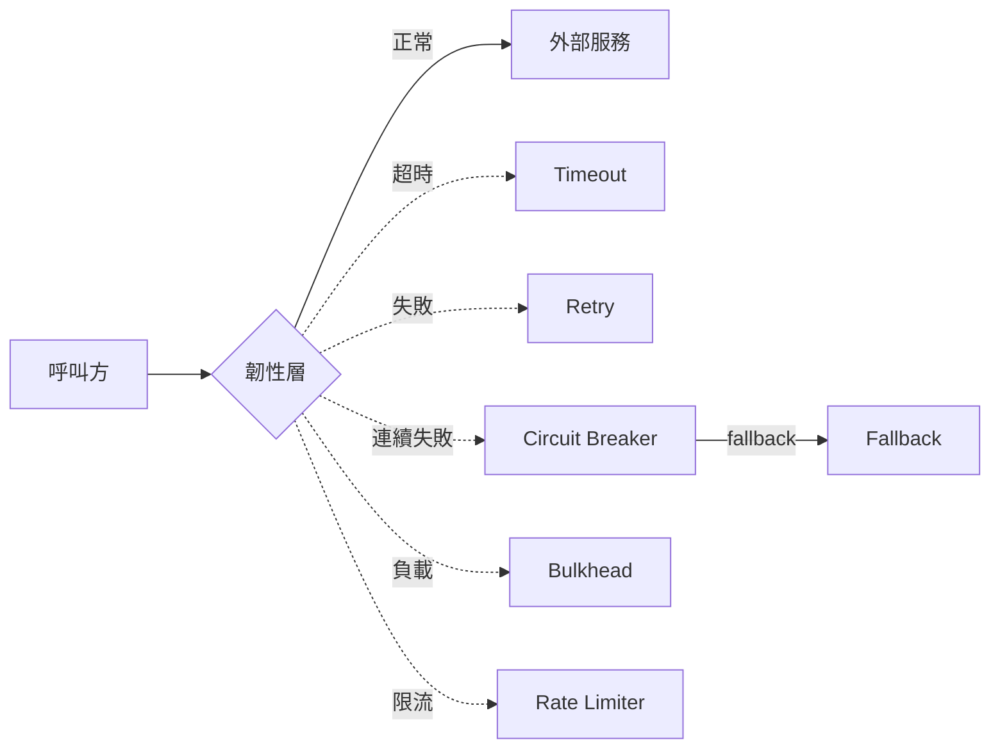
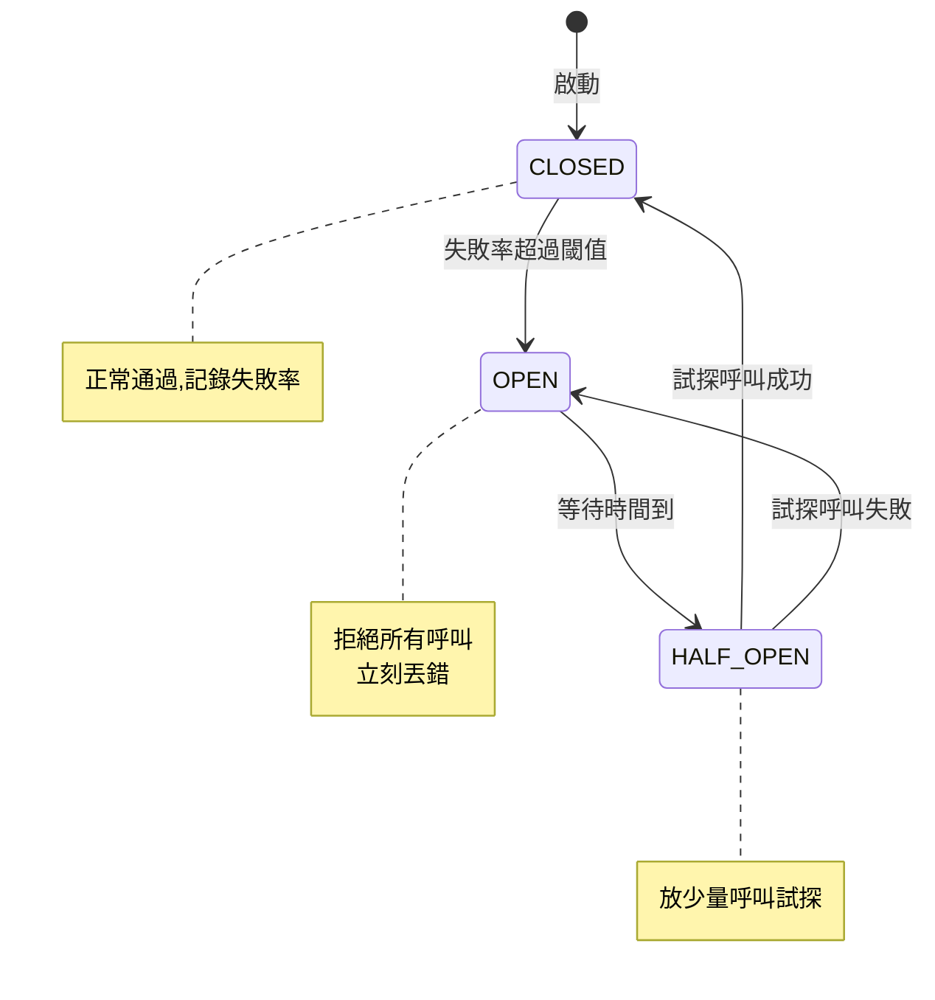

# B6 - 韌性模式(Resilience Patterns)

← [返回索引(README.md)](./README.md)

---

## 為什麼有這一篇?

**單體系統**只有「自己壞了」一種失敗;**分散式系統**多了「別人壞了拖累我」、「網路慢」、「短暫抖動」、「對方回應錯誤但 HTTP 200」等複雜失敗模式。

**Resilience(韌性)**:系統面對失敗時仍能**正常運作或優雅降級**的能力。本章介紹的所有模式,都是在解決「**外部依賴不可靠**」這件事。



---

## 目錄

- [Circuit Breaker(熔斷器)🟡](#circuit-breaker)
- [Retry(重試)🟢](#retry)
- [Timeout(超時)🟢](#timeout)
- [Bulkhead(隔板)🟡](#bulkhead)
- [Rate Limiter(限流器)🟡](#rate-limiter)
- [Fallback(降級)🟢](#fallback)
- [Idempotency(冪等性)🟡](#idempotency)
- [組合順序與最佳實踐 🔴](#composition)
- [Resilience4j 🟡](#resilience4j)
- [Hystrix(已停止維護)🟢](#hystrix)
- [Quarkus 等價物:MicroProfile Fault Tolerance 🟡](#mp-fault-tolerance)

---

<a id="circuit-breaker"></a>
### Circuit Breaker(熔斷器)🟡

**定義**:像家裡的電源斷路器——當下游服務**連續失敗**時,熔斷器**打開**,後續呼叫直接失敗(不再打過去),避免:
1. 把已經病懨懨的下游打死
2. 自己的執行緒卡在等下游回應,連帶被拖垮(雪崩效應)

**三個狀態**:



**關鍵參數**:
- `failureRateThreshold` — 失敗率閾值(例 50%)
- `slidingWindowSize` — 計算失敗率的視窗大小(最近 N 筆)
- `waitDurationInOpenState` — OPEN 狀態維持多久才進 HALF_OPEN
- `permittedCallsInHalfOpenState` — HALF_OPEN 試探幾次

**Resilience4j 範例**:
```java
@CircuitBreaker(name = "paymentService", fallbackMethod = "fallbackPay")
public PayResult pay(Order order) {
    return paymentClient.pay(order);
}

public PayResult fallbackPay(Order order, Throwable t) {
    log.warn("Circuit open, queue for retry: {}", order.id(), t);
    return PayResult.queued(order.id());
}
```

**配置**:
```yaml
resilience4j:
  circuitbreaker:
    instances:
      paymentService:
        failure-rate-threshold: 50
        sliding-window-size: 20
        wait-duration-in-open-state: 30s
        permitted-number-of-calls-in-half-open-state: 3
```

---

<a id="retry"></a>
### Retry(重試)🟢

**定義**:呼叫失敗時**自動重試 N 次**,給暫時性故障(網路抖動、瞬時超載)恢復機會。

**關鍵參數**:
- `maxAttempts` — 最多嘗試次數(包含第一次)
- `waitDuration` — 每次重試間隔
- **Exponential Backoff** — 間隔指數成長(1s → 2s → 4s → 8s)避免雷霆萬鈞
- **Jitter** — 加入隨機抖動,避免一群 client 同時重試打爆下游

**範例**:
```java
@Retry(name = "externalApi")
public Result call() { ... }
```
```yaml
resilience4j:
  retry:
    instances:
      externalApi:
        max-attempts: 3
        wait-duration: 500ms
        retry-exceptions:
          - java.io.IOException
          - org.springframework.web.client.HttpServerErrorException
        ignore-exceptions:
          - com.example.BusinessException        # 業務錯誤不重試
```

**重要原則**:
- **只重試「可能成功」的失敗**——5xx、超時、連線錯誤
- **不重試「肯定還是會失敗」的**——4xx 業務錯誤、Validation
- **冪等性必須保證**:重試會送出第二次請求,如果不冪等,可能扣兩次款

---

<a id="timeout"></a>
### Timeout(超時)🟢

**定義**:呼叫**超過 N 毫秒未回應就放棄**,釋放執行緒。

**為什麼很重要**:無 timeout 是分散式系統最常見的災難——下游卡住,你的執行緒池被耗盡,自己也跟著掛。

**多層 timeout**:
```
HTTP Client(connect timeout / read timeout)
  └─ Resilience4j @TimeLimiter
      └─ Method-level timeout(@Timeout)
          └─ Database statement_timeout
```

**Resilience4j 範例**:
```java
@TimeLimiter(name = "externalApi", fallbackMethod = "timeoutFallback")
public CompletableFuture<Result> callAsync() {
    return CompletableFuture.supplyAsync(() -> client.call());
}
```

**經典坑**:Spring 的 `RestTemplate` **預設沒有 timeout**(等於無限等待)——上線前一定要設:
```java
@Bean RestTemplate restTemplate(RestTemplateBuilder b) {
    return b.setConnectTimeout(Duration.ofSeconds(2))
            .setReadTimeout(Duration.ofSeconds(5))
            .build();
}
```

---

<a id="bulkhead"></a>
### Bulkhead(隔板)🟡

**定義**:命名來自船隻的水密艙——一個艙進水不會沉船。在系統中:**為不同的下游分配獨立的執行緒池 / 連線池**,某個下游慢不會耗盡所有資源。

**範例情境**:
- 沒 Bulkhead:`PaymentService` 和 `RecommendationService` 共用 Tomcat 200 個執行緒。Recommendation 變慢,200 個執行緒全卡在那 → Payment 也死了
- 有 Bulkhead:Recommendation 限 50 個執行緒,Payment 限 100 個。Recommendation 慢,只影響 Recommendation 的呼叫者

**Resilience4j 兩種實作**:
- **Semaphore Bulkhead**(預設):限制同時並行數(輕量,單純計數)
- **Thread Pool Bulkhead**:獨立執行緒池(完全隔離,但 overhead 較高)

```java
@Bulkhead(name = "recommendation", type = Bulkhead.Type.SEMAPHORE)
public List<Item> recommend(UserId id) { ... }
```

---

<a id="rate-limiter"></a>
### Rate Limiter(限流器)🟡

**定義**:**限制單位時間內的呼叫次數**(例:每秒最多 100 次)。常用於:
- 保護下游(別把第三方 API 的免費額度打爆)
- 保護自己(避免被惡意呼叫打死)
- 計費(同一 client 一天最多 N 次)

**演算法**:Token Bucket、Leaky Bucket、Fixed Window、Sliding Window 四種——**演算法細節與對照詳見 [G2 Rate Limiting Algorithms](./G2-algorithms.md#rate-limiting)**。本節聚焦韌性模式與 Resilience4j 配置。

**Resilience4j 範例**(基於 Atomic Token Bucket):
```java
@RateLimiter(name = "thirdPartyApi")
public Result call() { ... }
```
```yaml
resilience4j:
  ratelimiter:
    instances:
      thirdPartyApi:
        limit-for-period: 100         # 每個 refresh period 最多 100 次
        limit-refresh-period: 1s
        timeout-duration: 0           # 超限立刻拒絕(不等)
```

**分散式限流**:Resilience4j 是**單機**的,跨節點限流要用 Redis(`INCR + EXPIRE`)、Sentinel、Bucket4j-Hazelcast 等。

---

<a id="fallback"></a>
### Fallback(降級)🟢

**定義**:呼叫失敗時**回傳替代結果**,而非把錯誤往上拋。

**範例策略**:
- 推薦系統失敗 → 回傳熱門商品
- 即時匯率失敗 → 回傳上次快取
- 寄信失敗 → 寫進待處理 Queue,稍後重送
- 個人化失敗 → 回傳通用版本

**Resilience4j 寫法**:`fallbackMethod`(每個 annotation 都支援)
```java
@CircuitBreaker(name = "rec", fallbackMethod = "popularItems")
public List<Item> recommend(UserId id) {
    return recService.recommend(id);
}

private List<Item> popularItems(UserId id, Throwable t) {
    return cache.getPopularItems();         // 降級:熱門商品
}
```

**規範對應**:Hexagonal 的 **Null Adapter** 本身就是一種 fallback 機制——對「外部服務完全不存在」做降級。

---

<a id="idempotency"></a>
### Idempotency(冪等性)🟡

**定義**:**同一個操作執行 N 次,結果與執行 1 次相同**。數學上 `f(f(x)) = f(x)`。

**為什麼在韌性章節**:**Retry 的前提是冪等**——如果你 retry 一個非冪等操作,重複執行會造成重複扣款、重複下單、重複寄信。沒有冪等保證,所有 retry / Circuit Breaker / 訊息重送機制都是定時炸彈。

#### HTTP method 的冪等性(REST)

| Method | 冪等? | 安全(Safe)? | 說明 |
| --- | --- | --- | --- |
| `GET` | ✅ | ✅ | 只讀,自然冪等 |
| `HEAD` | ✅ | ✅ | 只讀 header |
| `PUT` | ✅ | ❌ | 設定整個資源狀態,N 次設一樣 |
| `DELETE` | ✅ | ❌ | 刪 N 次跟刪 1 次結果一樣(都不存在) |
| `POST` | ❌ | ❌ | **不冪等**,N 次 POST 會建 N 筆 |
| `PATCH` | ❓ | ❌ | 看設計(`{ status: PAID }` 冪等;`{ count: count + 1 }` 不冪等) |

**設計準則**:**寫 API 時要明確標記**——這個 endpoint 是不是冪等?客戶端能不能安全 retry?

#### 三種讓 POST 冪等的手段

##### ① Idempotency Key(冪等鍵)— 最通用

**作法**:客戶端產生唯一 ID(UUID),放在 header `Idempotency-Key`。Server 用此 key 去重——同 key 的第 2 次請求**直接回上次的結果**,不執行業務。

```java
@PostMapping("/orders")
public ApiResponse<OrderResponse> create(
        @RequestHeader("Idempotency-Key") @NotBlank String idempotencyKey,
        @Valid @RequestBody CreateOrderRequest req) {

    // 1. 查 key 是否處理過(Redis with TTL)
    Optional<OrderResponse> cached = idempotencyStore.get(idempotencyKey);
    if (cached.isPresent()) return ApiResponse.ok(cached.get());

    // 2. 用同一個 key 在 DB 加 unique constraint(雙重保險)
    OrderResponse result = createOrderUseCase.execute(req.toCommand(), idempotencyKey);

    // 3. 存結果
    idempotencyStore.put(idempotencyKey, result, Duration.ofHours(24));
    return ApiResponse.ok(result);
}
```

**Stripe、Square、PayPal 的金流 API 全部用這個方式**——客戶端必須帶 `Idempotency-Key`。

##### ② 業務唯一鍵(Natural Idempotency Key)

**作法**:用業務本身已有的唯一性——`(userId, orderId, version)` / `(訂單號, 動作)` / `(訊息 ID)`,在 DB 加 unique constraint。

```java
@Transactional
public void payOrder(OrderId id) {
    // unique(order_id, action='PAY')
    int affected = paymentLogRepo.insertIfNotExists(id, "PAY");
    if (affected == 0) {
        return;                          // 已處理過,直接返回成功
    }
    paymentClient.charge(id);
}
```

##### ③ 樂觀鎖 / 版本號(Optimistic Locking)

**作法**:更新時帶上「我看到的版本號」,DB 比對版本,不對就拒絕。
```java
@Version
private Long version;
// UPDATE orders SET status=?, version=version+1 WHERE id=? AND version=?
```

#### 訊息處理的冪等性

**Kafka / RabbitMQ at-least-once delivery 一定會有重送**——consumer 必須冪等。

**作法**:
- 訊息上帶 `messageId`(UUID),consumer 維護「已處理 messageId 集合」(Redis Set / DB unique constraint)
- 處理前查 → 處理過就 skip,沒處理過就**先記再做**(or **先做再記**,看業務允許哪種瑕疵)

#### 反例

```java
// ❌ 看似 POST 冪等,實際不冪等
@PostMapping("/users")
public User create(@RequestBody UserRequest req) {
    return userRepo.save(new User(req.name(), req.email()));   // 同一 email POST 兩次 = 兩個使用者
}

// ✅ 加 unique constraint + 處理 DuplicateKeyException
@PostMapping("/users")
public User create(@RequestHeader("Idempotency-Key") String key, @RequestBody UserRequest req) {
    return userRepo.findByEmail(req.email())
        .orElseGet(() -> userRepo.save(new User(req.name(), req.email())));
}
```

**口訣**:**寫 API、寫訊息消費者、寫 retry 邏輯時,先問:「這個操作冪等嗎?」**——不冪等就立刻設計冪等保證。

---

<a id="composition"></a>
### 組合順序與最佳實踐 🔴

多個韌性模式同時用時,**順序很重要**!Resilience4j 的標準順序(從外到內,離呼叫端最近的最外):

```
Retry
  └─ CircuitBreaker
       └─ RateLimiter
            └─ TimeLimiter
                 └─ Bulkhead
                      └─ 真實呼叫
```

**為什麼這個順序**:
- **Retry 在最外** — 重試會包含「再走一遍熔斷判斷、再走一遍 timeout」
- **CircuitBreaker 在 Retry 內** — 熔斷打開時 Retry 收到的是 fast-fail,不會無謂重試
- **TimeLimiter 在 Bulkhead 外** — 即使 Bulkhead 拿不到資源,TimeLimiter 仍計時

**Resilience4j 6+ 用 `@Decorators`** 或 Spring Boot annotation 預設按此順序組合,一般直接用即可。

**反例(常見錯誤)**:
- 只設 Retry 不設 CircuitBreaker → 下游永遠在被打
- 只設 CircuitBreaker 不設 Timeout → 第一次失敗前已經卡半小時了

---

<a id="resilience4j"></a>
### Resilience4j 🟡

**定義**:輕量、函式式風格的 Java 韌性函式庫,**Hystrix 的繼承者**。

**核心模組**(各自獨立 jar):
- `resilience4j-circuitbreaker`
- `resilience4j-retry`
- `resilience4j-bulkhead`
- `resilience4j-ratelimiter`
- `resilience4j-timelimiter`
- `resilience4j-cache`
- `resilience4j-spring-boot3`(整合)
- `resilience4j-micrometer`(指標)

**特色**:
- **零依賴**(只依賴 Vavr,新版甚至連 Vavr 都拿掉)
- **函式式 API**:`Decorators.ofSupplier(...)` 鏈式組合
- **Annotation 風格**:Spring Boot 整合後直接用 `@CircuitBreaker` 等
- **可觀測性**:內建 Micrometer / Prometheus 指標

**程式式 vs Annotation 風格**:
```java
// Annotation
@CircuitBreaker(name = "paymentService")
public Result pay(Order o) { ... }

// 程式式(無 Spring AOP 時用)
CircuitBreaker cb = CircuitBreaker.ofDefaults("paymentService");
Supplier<Result> decorated = CircuitBreaker.decorateSupplier(cb, () -> client.pay(o));
Result result = decorated.get();
```

---

<a id="hystrix"></a>
### Hystrix(已停止維護)🟢

**定義**:Netflix 開源的韌性函式庫,**Resilience4j 之前的主流**。

**現況**:**2018 年起進入 Maintenance Mode**,Netflix 自己改用 [Concurrency Limits](https://github.com/Netflix/concurrency-limits)。**新專案不要再用 Hystrix**。

**為什麼被取代**:
- 重(依賴 RxJava)
- 設計過時(thread pool 為主,現代用 semaphore + 非同步較佳)
- Resilience4j 更輕、更模組化、與 Java 8+ 函式式風格對齊

**遷移**:概念幾乎一一對應,主要是 annotation 改名(`@HystrixCommand` → 多個獨立 annotation)。

---

<a id="mp-fault-tolerance"></a>
### Quarkus 等價物:MicroProfile Fault Tolerance 🟡

**定義**:MicroProfile 的容錯規範,Quarkus 透過 `smallrye-fault-tolerance` 實作,**API 與 Resilience4j 不同但概念一致**。

**對照表**:

| Resilience4j | MicroProfile Fault Tolerance |
| --- | --- |
| `@CircuitBreaker` | `@CircuitBreaker` |
| `@Retry` | `@Retry` |
| `@RateLimiter` | (沒有,要自己整合) |
| `@TimeLimiter` | `@Timeout` + `@Asynchronous` |
| `@Bulkhead` | `@Bulkhead` |
| `fallbackMethod = "..."` | `@Fallback(fallbackMethod = "...")` 或 `@Fallback(MyHandler.class)` |

**Quarkus 範例**:
```java
@ApplicationScoped
public class PaymentService {

    @Retry(maxRetries = 3, delay = 500)
    @CircuitBreaker(failureRatio = 0.5, requestVolumeThreshold = 10, delay = 30000)
    @Timeout(2000)
    @Fallback(fallbackMethod = "fallbackPay")
    public PayResult pay(Order order) { ... }

    public PayResult fallbackPay(Order order) {
        return PayResult.queued(order.id());
    }
}
```

**注意**:Quarkus 也可以用 Resilience4j(透過 `quarkus-smallrye-fault-tolerance` 之外的方式),但**推薦用 MP 標準**——更貼近 Quarkus 的 build-time 哲學,Native 友善。

---

← [返回索引(README.md)](./README.md)
