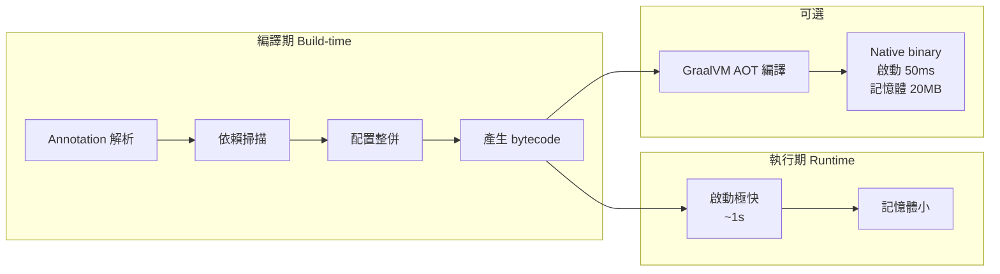

# B7 - Quarkus 專屬概念

← [返回索引(README.md)](./README.md)

---

## 為什麼 Quarkus 值得獨立一篇?

Quarkus 與 Spring Boot 在「DI、AOP、Configuration」等概念**幾乎一一對應**(對照表請看 [B2-spring-vs-quarkus.md](./B2-spring-vs-quarkus.md))。但 Quarkus 有一系列**專屬概念**——基於它的核心哲學「**Container First**、**Build-time over Runtime**、**Native first-class**」。



---

## 目錄

### 核心概念
- [Build-time vs Runtime 🔴](#build-time-vs-runtime)
- [GraalVM / Native Image 🔴](#graalvm-native)
- [Quarkus Extension 🟡](#extension)
- [Dev Mode / Live Reload 🟢](#dev-mode)
- [Continuous Testing 🟡](#continuous-testing)

### 標準與規範
- [CDI(Contexts and Dependency Injection)🟡](#cdi)
- [JAX-RS / RESTEasy Reactive 🟡](#jax-rs)
- [MicroProfile 🟡](#microprofile)
- [SmallRye 🟡](#smallrye)

### 持久層
- [Hibernate ORM with Panache 🟢](#panache)
- [Active Record vs Repository(Panache 兩種風格)🟢](#panache-style)

### 反應式 / 非同步
- [Mutiny(Uni / Multi)🔴](#mutiny)
- [Reactive vs Imperative(Quarkus 雙模式)🟡](#reactive-imperative)

### 配置與部署
- [`application.properties` Profile 寫法 🟢](#config-profile)
- [Quarkus 配置來源優先順序 🟡](#config-source)

---

## 核心概念

<a id="build-time-vs-runtime"></a>
### Build-time vs Runtime 🔴

Quarkus 的**核心創新**:把能在編譯期(Maven/Gradle build)決定的事,**提前到 build-time** 完成。

| 階段 | 傳統 Spring | Quarkus |
| --- | --- | --- |
| 解析 annotation | 執行期 reflection | **編譯期** AST 處理 |
| 掃描 classpath | 啟動時掃 | **編譯期** 完成 |
| 整併配置 | 啟動時讀 yaml | **編譯期** 確定可預期的部分 |
| 產生 Proxy / Interceptor | 執行期動態 | **編譯期** 產生 bytecode |
| 結果 | 啟動數秒 | 啟動 < 1 秒 |

**衍生效應**:
- Reflection 用得少 → GraalVM Native 友善
- Bean 在 build-time 就確定 → **無法執行期動態註冊 Bean**(這是限制也是優勢)
- 修改設定常需重啟(但 Dev Mode 把這個痛點解了)

---

<a id="graalvm-native"></a>
### GraalVM / Native Image 🔴

**GraalVM**:Oracle 開發的 polyglot VM,核心特色是 **Ahead-of-Time(AOT)編譯**——把 Java 程式編譯成**原生執行檔**,不需要 JVM。

**Native Image 的優勢**:
- 啟動時間 **~50ms**(JVM 是秒級)
- 記憶體 **~20MB**(JVM 是百 MB 級)
- 適合 Serverless(Lambda 冷啟動友善)

**Native Image 的限制**:
- **Reflection 必須事先註冊**(`reflect-config.json`)
- **動態類別載入受限**
- **JNI 需配置**
- 編譯時間長(數分鐘)
- Debug 較難

**Quarkus 的優勢**:大量 build-time 處理 + extension 預先處理 reflection 配置 → **絕大多數 Quarkus 程式可直接編 native**,Spring 則需 Spring Native / Spring Boot 3 GraalVM 支援,複雜整合仍可能踩雷。

**指令**:
```bash
./mvnw package -Dnative
./target/myapp-1.0.0-runner    # 直接執行,無需 JVM
```

---

<a id="extension"></a>
### Quarkus Extension 🟡

**定義**:Quarkus 的「**整合套件**」,把第三方函式庫(Hibernate、Kafka、Redis)整合進 Quarkus 的 build-time 處理流程,確保 Native 友善。

**安裝**:
```bash
./mvnw quarkus:add-extension -Dextensions="hibernate-orm-panache,jdbc-postgresql,redis-client"
```

**對比 Spring Starter**:概念類似(都是「加入這個就用得到」),但 Extension 多做一層——**處理 reflection / proxy 配置以支援 Native**。

**精選 Extension**:
| Extension | 對應 Spring 套件 |
| --- | --- |
| `hibernate-orm-panache` | Spring Data JPA |
| `resteasy-reactive` | Spring MVC |
| `smallrye-jwt` | Spring Security JWT |
| `messaging-kafka` | Spring Kafka |
| `redis-client` | Spring Data Redis |
| `cache` | Spring Cache |
| `scheduler` | `@Scheduled`(詳見 [B9 排程與批次處理](./B9-scheduling-batch.md#scheduled))|
| `smallrye-health` | Spring Boot Actuator(部分) |

---

<a id="dev-mode"></a>
### Dev Mode / Live Reload 🟢

**定義**:`./mvnw quarkus:dev` 啟動的開發模式——**改 Java 檔不需重啟**,儲存後立刻反映在下個 HTTP 請求。

**內建功能**:
- Live coding(包含 Java、配置、resources)
- Dev UI(`http://localhost:8080/q/dev/`)— 視覺化所有 Bean、設定、Extension
- Continuous Testing(下個小節)
- Quarkus Console(熱鍵:按 `s` 觸發測試、`p` 暫停、`o` 開瀏覽器...)

**對比 Spring**:Spring 的 spring-boot-devtools 提供類似但較弱的功能,Quarkus 的 Dev Mode 是**官方一級體驗**。

---

<a id="continuous-testing"></a>
### Continuous Testing 🟡

**定義**:在 Dev Mode 中,每當你儲存原始檔,**相關測試自動執行**——只跑受影響的測試,毫秒級 feedback。

**啟用**:Dev Mode console 按 `r` 進入測試模式。
**體驗類似** IntelliJ 的「Tests on save」但更智慧(只跑相關測試)。

---

## 標準與規範

<a id="cdi"></a>
### CDI(Contexts and Dependency Injection)🟡

**定義**:Jakarta EE 的**標準 DI 規範**(JSR 365 / Jakarta CDI)。Quarkus 使用 ArC——CDI 的 build-time 實作。

**核心 annotation**:

| Annotation | 說明 |
| --- | --- |
| `@Inject` | 注入(類似 Spring `@Autowired`) |
| `@ApplicationScoped` | 整個應用一個實例(類似 Spring `@Component`) |
| `@Singleton` | 單例,**啟動時建立、無 Proxy**(更快但少功能) |
| `@RequestScoped` | 每 HTTP 請求一個 |
| `@Dependent`(預設) | 每次注入都產生新實例 |
| `@Named("xxx")` | 命名 bean |
| `@Qualifier`(自訂) | 區分多個實作 |
| `@Produces` | 工廠方法 |
| `@Disposes` | 銷毀回呼 |
| `@Observes` | 事件訂閱(類似 `@EventListener`) |

**範例**:
```java
@ApplicationScoped
public class OrderService {

    @Inject
    OrderRepository repo;

    public void onOrderPaid(@Observes OrderPaidEvent event) {
        // CDI 事件訂閱
    }
}

// 工廠
@ApplicationScoped
public class RestClientProducer {
    @Produces @ApplicationScoped
    public RestClient restClient() {
        return RestClientBuilder.newBuilder().build();
    }
}
```

**ArC 的限制**:Bean 在 build-time 就確定 → **無法用 reflection 動態註冊**。但這正是 Native 友善的代價。

---

<a id="jax-rs"></a>
### JAX-RS / RESTEasy Reactive 🟡

**JAX-RS**(Jakarta RESTful Web Services):**Java REST API 的標準規範**。
**RESTEasy Reactive**:Quarkus 的 JAX-RS 實作,基於 Vert.x(reactive 核心)。

**核心 annotation**:
```java
@Path("/orders")
@Produces(MediaType.APPLICATION_JSON)
@Consumes(MediaType.APPLICATION_JSON)
public class OrderResource {

    @GET @Path("/{id}")
    public OrderResponse get(@PathParam("id") Long id) { ... }

    @POST
    public RestResponse<OrderResponse> create(@Valid CreateOrderRequest req) {
        var created = orderService.create(req);
        return RestResponse.status(Response.Status.CREATED, created);
    }

    @GET
    public List<OrderResponse> list(
        @QueryParam("status") @DefaultValue("ALL") String status,
        @HeaderParam("X-Tenant") String tenant) { ... }
}
```

**對照**:
| JAX-RS | Spring MVC |
| --- | --- |
| `@Path` | `@RequestMapping` |
| `@GET / @POST / ...` | `@GetMapping / @PostMapping` |
| `@PathParam` | `@PathVariable` |
| `@QueryParam` | `@RequestParam` |
| `@HeaderParam` | `@RequestHeader` |
| `@FormParam` | `@RequestParam`(form) |
| 無(直接參數) | `@RequestBody` |

---

<a id="microprofile"></a>
### MicroProfile 🟡

**定義**:**為微服務場景設計的 Jakarta EE 子集 + 擴充規範**——在 Java EE 標準上加上 Config、Health Check、Metrics、Fault Tolerance、JWT 等微服務必備功能。

**核心規範**:

| 規範 | 用途 | Quarkus 對應 |
| --- | --- | --- |
| MP Config | 配置管理 | 內建 |
| MP Health | `/q/health` 健康檢查 | smallrye-health |
| MP Metrics | Prometheus 指標 | smallrye-metrics(已被 micrometer 取代) |
| MP Fault Tolerance | `@Retry` `@CircuitBreaker` `@Timeout` `@Bulkhead` | smallrye-fault-tolerance |
| MP JWT | JWT 整合 | smallrye-jwt |
| MP OpenAPI | OpenAPI 文件 | smallrye-openapi |
| MP REST Client | Type-safe REST client | smallrye-rest-client |

**範例**(Fault Tolerance):
```java
@ApplicationScoped
public class PaymentService {
    @Retry(maxRetries = 3, delay = 500)
    @CircuitBreaker(failureRatio = 0.5, requestVolumeThreshold = 10)
    @Timeout(2000)
    @Fallback(fallbackMethod = "fallbackPay")
    public PayResult pay(Order order) { ... }

    public PayResult fallbackPay(Order order) { ... }
}
```

---

<a id="smallrye"></a>
### SmallRye 🟡

**定義**:Red Hat 主導的 **MicroProfile 開源實作集合**——所有 `smallrye-*` extension 都來自此專案。Quarkus 的 MicroProfile 整合**幾乎等於 SmallRye**。

不需要記細節,看到 `smallrye-jwt` 就理解為「Quarkus 提供的 MicroProfile JWT 實作」即可。

---

## 持久層

<a id="panache"></a>
### Hibernate ORM with Panache 🟢

**定義**:Quarkus 的 Hibernate 便利層,**大幅減少樣板**(等同 Spring Data JPA 在 Spring 中的角色)。

**為什麼需要 Panache**:傳統 Hibernate 寫 Entity 要 getter/setter、寫 Repository 要 EntityManager,Panache 把這些都簡化。

---

<a id="panache-style"></a>
### Active Record vs Repository(Panache 兩種風格)🟢

**Active Record 風格**(Entity 自帶 CRUD):
```java
@Entity
public class User extends PanacheEntity {       // id 自動產生
    public String email;                         // public 欄位,Panache 編譯期轉成 getter/setter
    public String name;
    public LocalDateTime createdAt;

    public static User findByEmail(String email) {
        return find("email", email).firstResult();
    }

    public static List<User> activeOnly() {
        return list("active", true);
    }
}

// 使用
var user = new User();
user.email = "a@b.com";
user.persist();

User.findByEmail("a@b.com");
User.deleteById(123L);
```

**Repository 風格**(較貼近 Clean Architecture):
```java
@Entity public class User { ... }              // 普通 Entity

@ApplicationScoped
public class UserRepository implements PanacheRepository<User> {
    public User findByEmail(String email) {
        return find("email", email).firstResult();
    }
}

@Inject UserRepository userRepo;
```

**規範要求(本規範脈絡)**:Hexagonal 架構下推薦 **Repository 風格** —— Entity 保持單純,Repository 實作 Domain Port。

---

## 反應式 / 非同步

<a id="mutiny"></a>
### Mutiny(Uni / Multi)🔴

**定義**:Quarkus 的反應式程式庫,類似 Project Reactor(Spring WebFlux 用的)。

**兩個核心型別**:
- **`Uni<T>`** — 0 或 1 個元素的非同步結果(類似 `Mono<T>`)
- **`Multi<T>`** — 0 ~ N 個元素的串流(類似 `Flux<T>`)

**範例**:
```java
@GET @Path("/{id}")
public Uni<User> get(@PathParam("id") Long id) {
    return userRepo.findById(id)
        .onItem().ifNull().failWith(NotFoundException::new)
        .onItem().transform(this::mask);
}

@GET @Path("/stream")
public Multi<Order> stream() {
    return Multi.createFrom().ticks().every(Duration.ofSeconds(1))
        .onItem().transformToUniAndConcatenate(t -> orderRepo.next());
}
```

**對照**:
| Mutiny | Reactor(Spring) |
| --- | --- |
| `Uni<T>` | `Mono<T>` |
| `Multi<T>` | `Flux<T>` |
| `.onItem().transform()` | `.map()` |
| `.onFailure().recoverWith()` | `.onErrorResume()` |
| `.subscribe().with(...)` | `.subscribe(...)` |

---

<a id="reactive-imperative"></a>
### Reactive vs Imperative(Quarkus 雙模式)🟡

Quarkus 同時支援兩種程式模型,**同一個 endpoint 可以混用**:

```java
// Imperative(命令式,類似傳統 Spring MVC)
@GET @Path("/users/{id}")
public User get(@PathParam("id") Long id) {
    return userRepo.findByIdOptional(id).orElseThrow();
}

// Reactive(反應式)
@GET @Path("/users/{id}/async")
public Uni<User> getAsync(@PathParam("id") Long id) {
    return userRepo.findById(id);
}
```

**何時選哪個**:
- **預設用 Imperative**(配 Virtual Thread 更香)
- **真的需要高併發 + IO 密集** 才用 Reactive(學習曲線陡)

---

## 配置與部署

<a id="config-profile"></a>
### `application.properties` Profile 寫法 🟢

**Quarkus 在同一個 `application.properties` 用 prefix 切 profile**:
```properties
# 預設(所有 profile 共用)
quarkus.http.port=8080

# dev profile 專用
%dev.quarkus.log.level=DEBUG
%dev.quarkus.datasource.jdbc.url=jdbc:h2:mem:test

# prod profile 專用
%prod.quarkus.log.level=INFO
%prod.quarkus.datasource.jdbc.url=${DB_URL}
```

**對比 Spring**:Spring 是 `application-dev.yml` / `application-prod.yml` 多檔分開。

**內建 profile**:`dev`(Dev Mode)、`test`(測試)、`prod`(打包執行)— 不需特別指定。

---

<a id="config-source"></a>
### Quarkus 配置來源優先順序 🟡

由高到低:
1. 系統屬性(`-Dkey=value`)
2. 環境變數(`KEY=value`,自動轉 `key.value`)
3. `.env` 檔
4. `application.properties`
5. Extension 預設值

**環境變數轉換規則**:點轉底線、減號轉底線、全大寫
- `quarkus.http.port` → `QUARKUS_HTTP_PORT`
- `my.config.foo-bar` → `MY_CONFIG_FOO_BAR`

**讀取配置**:
```java
@ConfigProperty(name = "app.tax.rate", defaultValue = "0.05")
BigDecimal taxRate;

// 或 record(整組配置綁定)
@ConfigMapping(prefix = "app.tax")
public interface TaxConfig {
    BigDecimal rate();
    String currency();
}
```

---

← [返回索引(README.md)](./README.md)
