# D1 - Security / JWT / OAuth

← [返回索引(README.md)](./README.md)

---

## 目錄

- [Authentication vs Authorization 🟢](#authn-vs-authz)
- [Stateless vs Stateful Authentication 🟢](#stateless-vs-stateful)
- [JOSE 家族(JWT / JWS / JWE)🟡](#jose-family)
- [JWT(JSON Web Token)🟡](#jwt)
- [JWS(JSON Web Signature)🟡](#jws)
- [JWE(JSON Web Encryption)🔴](#jwe)
- [JWT Claim 🟡](#jwt-claim)
- [簽章演算法:HMAC vs RSA / ECDSA 🟡](#sign-algorithm)
- [SecurityContext / Authentication 物件 🟡](#security-context)
- [Filter Chain(過濾器鏈)🟡](#filter-chain)
- [Whitelist(白名單)🟢](#whitelist)
- [Access Control 模型:ACL / RBAC / ABAC 🟡](#rbac)
- [OAuth 2.0 / OIDC 🔴](#oauth-oidc)
- [PKCE(Proof Key for Code Exchange)🟡](#pkce)
- [Refresh Token 🟡](#refresh-token)

> → CORS / CSRF / XSS 等 Web 客戶端攻擊防禦,詳見 [D2 Web 攻擊防禦](./D2-web-security.md)

### 企業身份系統(Enterprise Identity)
- [SSO(單一登入)🟡](#sso)
- [SLO(Single Logout / 單一登出)🟡](#slo)
- [SAML 🔴](#saml)
- [LDAP 🟡](#ldap)
- [Active Directory(AD)🟡](#ad)
- [Keycloak 🟡](#keycloak)
- [Keycloak Realm Access 🟡](#realm-access)
- [Entra ID(Microsoft 雲端身份)🟡](#entra-id)
- [Auth0(SaaS 身份平台)🟡](#auth0)
- [FIDO / WebAuthn / Passkey 🟡](#fido)
- [Role Source of Truth 🟡](#role-sot)

### 密碼學與雜湊(Cryptography & Hashing)
- [Hash(雜湊)🟢](#hash)
- [Rainbow Table(彩虹表攻擊)🟡](#rainbow-table)
- [密碼雜湊:Argon2id / bcrypt / scrypt / PBKDF2 🟡](#password-hashing)
- [AES-256(對稱加密)🟡](#aes-256)
- [信封加密:DEK + KEK 🟡](#envelope-encryption)
- [NIST(美國資安 / 密碼標準機構)🟡](#nist)

### PKI 與憑證(Public Key Infrastructure)
- [PKI(公鑰基礎設施)🔴](#pki)
- [X.509 憑證 / CSR / CA 🟡](#x509)
- [CRL / OCSP(憑證撤銷)🟡](#crl-ocsp)
- [Let's Encrypt(免費憑證)🟢](#lets-encrypt)

### 安全原則(Security Principles)
- [Defense in Depth(縱深防禦)🟡](#defense-in-depth)
- [Least Privilege(最小權限原則)🟡](#least-privilege)
- [PAM(Privileged Access Management / 特權存取管理)🟡](#pam)

---

<a id="authn-vs-authz"></a>
### Authentication vs Authorization 🟢

| | Authentication(身份驗證) | Authorization(授權) |
| --- | --- | --- |
| 中文 | 你**是誰** | 你**能做什麼** |
| 縮寫 | AuthN | AuthZ |
| HTTP 狀態碼 | 401 Unauthorized | 403 Forbidden |
| 範例 | 登入(輸入帳密、JWT 驗章) | 檢查 Role、Permission、資源擁有者 |

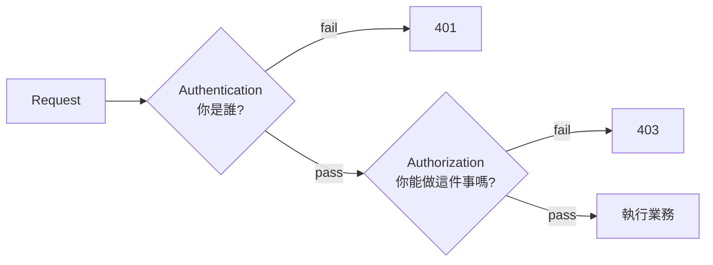

---

<a id="stateless-vs-stateful"></a>
### Stateless vs Stateful Authentication 🟢

| | Stateful(有狀態 / Session) | Stateless(無狀態 / JWT) |
| --- | --- | --- |
| 狀態存哪 | 伺服器(memory / Redis) | 客戶端(JWT 自帶身份) |
| 水平擴展 | 需 Sticky Session 或共享 Session | 任意節點處理 |
| 失效方式 | 直接刪 Session | JWT 過期才失效(主動失效需黑名單) |
| 雲原生友善度 | 中等 | 高 |

**規範採用**:Stateless + JWT,不用 Session。

---

<a id="jose-family"></a>
### JOSE 家族(JWT / JWS / JWE)🟡

**JOSE**(JavaScript Object Signing and Encryption):IETF 一組 RFC,定義 JSON 為基礎的密碼學原語。**JWT 只是其中之一**——常見混用,先一句話釐清:

| 縮寫 | 全名 | 主要 RFC | 一句話 |
| --- | --- | --- | --- |
| **JWT** | JSON Web **Token** | **RFC 7519** | **Token 的標準格式**(payload + claims) |
| **JWS** | JSON Web **Signature** | RFC 7515 | **簽章後**的 JSON(防偽,**內容可讀**) |
| **JWE** | JSON Web **Encryption** | RFC 7516 | **加密後**的 JSON(保密,**內容不可讀**) |
| **JWA** | JSON Web Algorithms | RFC 7518 | 演算法清單(`HS256` / `RS256` / `A256GCM`...) |
| **JWK** | JSON Web Key | RFC 7517 | JSON 表達公鑰 / 私鑰(配合 JWKS URI 公開) |

**關鍵關係**:
- **JWT 是 token 的「概念」**,在傳輸時必須**裝在 JWS 或 JWE 容器裡**
- **JWT-as-JWS**(常見 95%):token **簽章**但**不加密** — 任何人可解碼讀內容,但改不了
- **JWT-as-JWE**(罕見):token **加密** — 連讀也不行;通常配合 nested(JWE 包 JWS,內外都防)

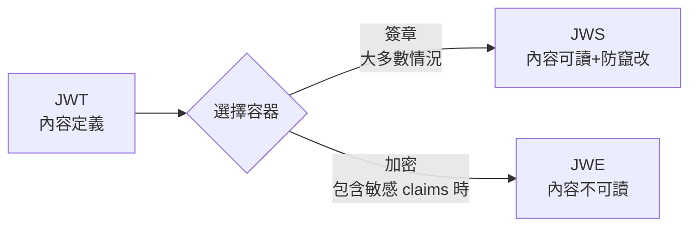

**為什麼新人常搞混**:大部分文章說「JWT」其實指「**JWT-as-JWS**」,因為這是最常見用法。**Signed Token = JWS,Encrypted Token = JWE,Token 本身的內容定義 = JWT**。

---

<a id="jwt"></a>
### JWT(JSON Web Token)🟡

**定義**:**RFC 7519** 定義的**Token 內容格式**——一個 JSON object(payload + claims)+ Header,**搭配 JWS 或 JWE 之一進行傳輸**。實務上**最常見 = JWT-as-JWS**(下面範例皆指此)。三段式結構:`Header.Payload.Signature`,以 `.` 連接,各段 Base64Url 編碼。

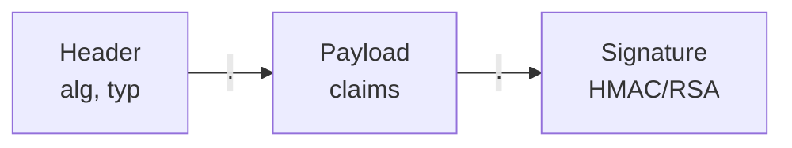

**範例**(decode 後):
```json
// Header
{ "alg": "HS256", "typ": "JWT" }

// Payload
{ "sub": "user-123", "exp": 1735689600, "roles": ["ADMIN"] }

// Signature(用 secret + alg 計算)
HMACSHA256(base64Url(header) + "." + base64Url(payload), secret)
```

**重點**:
- JWT **沒加密**,只是簽章——不要把密碼、信用卡塞進 Payload
- 客戶端可以解 Payload 看內容,但**改不了**(改了簽章對不上)
- 過期前無法主動失效——常見做法是在 Redis 維護黑名單

**Java 範例**(jjwt 函式庫):
```java
// 簽發
String token = Jwts.builder()
    .subject(user.getId())
    .claim("roles", user.getRoles())
    .expiration(Date.from(Instant.now().plus(1, HOURS)))
    .signWith(secretKey)
    .compact();

// 驗證
Claims claims = Jwts.parser()
    .verifyWith(secretKey)
    .build()
    .parseSignedClaims(token)
    .getPayload();
```

---

<a id="jws"></a>
### JWS(JSON Web Signature)🟡

**定義**:**RFC 7515** 定義的 JSON 簽章規範——把任何 payload(常見是 JSON,但可以是任意位元組)**簽章後封裝為 `Header.Payload.Signature` 三段式字串**(Compact Serialization)。**JWT 在實務上幾乎都是裝在 JWS 容器**。

**核心保證**:
- ✅ **完整性**:內容被改 → 簽章對不上
- ✅ **可驗來源**:用對應公鑰可驗證簽章來自誰
- ❌ **不保密**:payload 是 Base64Url 編碼,**任何人都能解碼讀內容**

**為什麼獨立成題**(很多人以為 JWS = JWT):
- JWS 是**通用簽章容器**,payload 不一定是 JWT,可以是任何資料(如 OpenID Connect ID Token、SD-JWT、W3C Verifiable Credentials)
- **JWT 是 payload 的「內容規範」**(必須是 JSON、含特定 claim),**JWS 是「打包方式」**

**JWS Header 必備**:
```json
{
  "alg": "RS256",                   // 簽章演算法(JWA 規範)
  "kid": "key-2024",                // Key ID(對應 JWKS 中的 key)
  "typ": "JWT"                      // payload 型別,若是 JWT 通常寫 "JWT"
}
```

**Compact Serialization**(實務最常見):
```
<base64url(header)>.<base64url(payload)>.<base64url(signature)>
```

**JSON Serialization**(較少見):
```json
{
  "payload": "eyJ...",
  "protected": "eyJ...",
  "signature": "ZXh..."
}
```
適用需要**多重簽章**(multi-signer)的場景。

**`alg: none` 攻擊**(JWS 經典坑):
- 規範允許 `alg: none`(不簽章)——攻擊者把任何 JWT 的 `alg` 改成 `none`,簽章段留空
- **不嚴格的 library 會接受**——攻擊者可偽造任何 token
- **修法**:**驗證時把允許的 alg 寫死成白名單**,絕不接受 `none`、絕不從 token 自己的 header 決定演算法
```java
// ❌ 危險
JWT.decode(token);     // 沒驗簽

// ✅ 寫死 alg 白名單
Jwts.parser()
    .verifyWith(publicKey)
    .build()
    .parseSignedClaims(token);   // jjwt 預設不接受 none
```

**JWKS**(JSON Web Key Set):**RFC 7517**——把多把公鑰用 JSON 陣列發佈於一個 URL(`/.well-known/jwks.json`),驗章方依 `kid` 對應到正確公鑰。Keycloak、Auth0、Google 都暴露 JWKS endpoint,Spring Security `oauth2.resourceserver.jwt.jwk-set-uri` 一行配置完成。

---

<a id="jwe"></a>
### JWE(JSON Web Encryption)🔴

**定義**:**RFC 7516** 定義的 JSON 加密規範——payload 經過**加密**(對方有對應金鑰才解得開),封裝為 `Header.EncryptedKey.IV.Ciphertext.AuthTag` **五段式**字串。

**結構對比**:

| | JWS(簽章) | JWE(加密) |
| --- | --- | --- |
| 段數 | 3 段 | **5 段** |
| 內容是否可讀 | ✅ 可讀(只是 Base64Url) | ❌ 不可讀 |
| 主要保證 | 完整性 + 來源 | **保密** + 完整性(AEAD) |
| Header `alg` | 簽章演算法(HS256 / RS256) | **金鑰加密**演算法(RSA-OAEP、ECDH-ES) |
| Header `enc` | (無) | **內容加密**演算法(A256GCM、A128CBC-HS256) |

**範例 Header**(JWE):
```json
{
  "alg": "RSA-OAEP-256",     // 用 RSA 加密「Content Encryption Key」
  "enc": "A256GCM",          // 用 AES-256-GCM 加密實際內容
  "kid": "recipient-key-1"
}
```

**雙金鑰結構**(為什麼是兩個演算法):
1 / 隨機產生**Content Encryption Key (CEK)** — 對稱 key
2 / **`enc`** 用 CEK 對稱加密實際 payload(AES-GCM 主流)
3 / **`alg`** 用接收方公鑰**加密 CEK**,夾在 token 內(EncryptedKey 段)
4 / 接收方用私鑰解出 CEK,再用 CEK 解出 payload

**為什麼不直接用對方公鑰加密 payload**:RSA 等非對稱加密**慢且有長度限制**(2048-bit RSA 一次只能加密 ~190 bytes);對稱加密快、無長度限制——**混合加密**是常識做法,JWE 是其標準化。

**何時用 JWE 而非 JWS**:

| 情境 | 用 JWS 即可 | 需要 JWE |
| --- | --- | --- |
| Payload 含 user id、role | ✅ | — |
| Payload 含敏感資訊(身分證、薪資、健保) | ❌ JWS 任何人可讀 | **必須加密** |
| 內部微服務、TLS 已足以保密 | ✅ | — |
| 跨組織傳遞、需端對端保密 | ❌ | ✅ |
| 高合規場景(金融、醫療) | 視資料而定 | 通常需要 |

**Nested JWT**(JWS + JWE 雙層):
- 先**簽章**(JWS),再把整個 JWS **加密**包進 JWE
- 接收方先解密,再驗簽
- 同時保證**保密 + 來源驗證**,**HIPAA、PSD2 等高合規場景**常見

**現況與痛點**:
- JWE **比 JWS 少很多人用**——多數系統靠 TLS 保密傳輸 + JWS 防竄改即可
- Library 支援不如 JWS 完整(jjwt、Nimbus JOSE+JWT、Auth0 java-jwt 都支援,但配置複雜)
- 金鑰交換、撤銷比 JWS 麻煩
- 除非真有「**Token 在不可信中介流動且不能被讀**」的需求,**否則別輕易用 JWE**(JWT 比較貴的 audit 通常會建議 JWE,但工程上落地坎多)

**Java 範例**(Nimbus JOSE+JWT,JWE):
```java
JWEHeader header = new JWEHeader.Builder(JWEAlgorithm.RSA_OAEP_256, EncryptionMethod.A256GCM)
    .keyID("recipient-key-1")
    .build();

JWEObject jwe = new JWEObject(
    header,
    new Payload(claimsJson)
);
jwe.encrypt(new RSAEncrypter((RSAPublicKey) recipientPublicKey));
String serialized = jwe.serialize();    // 5 段 Base64Url

// 接收方解密
JWEObject parsed = JWEObject.parse(serialized);
parsed.decrypt(new RSADecrypter((RSAPrivateKey) recipientPrivateKey));
String payload = parsed.getPayload().toString();
```

**對應到 [AES-256](#aes-256)**:JWE 的 `enc` 實際上就是 AES-GCM 在使用;JWE 把「金鑰封裝 + 加密 + 完整性驗證」標準化為一個 token 格式。

---

<a id="jwt-claim"></a>
### JWT Claim 🟡

**定義**:Payload 內的每個欄位稱為 Claim。分三類:

| 類型 | 說明 | 範例 |
| --- | --- | --- |
| Registered(註冊保留) | 標準定義的欄位 | `iss`、`sub`、`aud`、`exp`、`iat`、`nbf`、`jti` |
| Public(公開) | IANA 註冊的常用欄位 | `email`、`name` |
| Private(私有) | 系統自定 | `roles`、`tenantId` |

**常見保留 Claim**:
- `sub`(subject)— 主體,通常放 user id
- `exp`(expiration)— 過期時間(Unix timestamp)
- `iat`(issued at)— 簽發時間
- `iss`(issuer)— 簽發者
- `jti`(JWT ID)— Token 唯一識別,用於黑名單

**規範要求**:Claim Key 一律寫成常數,放在 `JwtConstants` —— 不可硬編碼字串。

---

<a id="sign-algorithm"></a>
### 簽章演算法:HMAC vs RSA / ECDSA 🟡

| | 對稱(HMAC, HS256) | 非對稱(RSA, RS256 / ECDSA, ES256) |
| --- | --- | --- |
| Key 結構 | 單一 secret(簽 + 驗用同一個) | Private Key 簽,Public Key 驗 |
| 多服務驗證 | 所有驗證方都需知道 secret(風險高) | 只發 Public Key,Private Key 只在簽發者(較安全) |
| 效能 | 快 | 慢(但夠用) |
| 適用 | 單一服務 | 微服務、SSO、第三方驗證 |

**規範要求**:Secret / Public Key 來自 **DB**,透過 `JwtKeyPort` 取得,Null Adapter 提供開發用預設 Key。

---

<a id="security-context"></a>
### SecurityContext / Authentication 物件 🟡

**Spring Security**:每個請求的身份資訊存在 `SecurityContextHolder` 裡(底層 ThreadLocal),Filter 解完 JWT 後 set 進去,業務層用 `SecurityContextHolder.getContext().getAuthentication()` 取出。

```java
public class JwtAuthFilter extends OncePerRequestFilter {
    @Override
    protected void doFilterInternal(HttpServletRequest req, HttpServletResponse res, FilterChain chain) {
        var token = extractToken(req);
        if (token != null && jwtParser.isValid(token)) {
            var auth = jwtParser.toAuthentication(token);
            SecurityContextHolder.getContext().setAuthentication(auth);
        }
        chain.doFilter(req, res);
    }
}
```

**規範要求**:Stateless 模式下,SecurityContext 由 Filter 建立,**不存於 Session**,請求結束自動清除。

---

<a id="filter-chain"></a>
### Filter Chain(過濾器鏈)🟡

**定義**:Servlet 規範的 `Filter` 串成的處理鏈,每個 Filter 可以決定放行(`chain.doFilter`)或中斷。Spring Security 自身就是一個 Filter,內部又串了一堆 Security Filter(認證、授權、CSRF、CORS 等)。

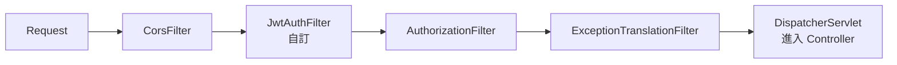

**這就是責任鏈模式的實例**。

---

<a id="whitelist"></a>
### Whitelist(白名單)🟢

**定義**:不需驗證 JWT 即可存取的路徑清單,例如 `/health`、`/login`、`/swagger`。

**規範要求**:
- 白名單**存於 DB**(可動態調整,不需重啟)
- 支援多種比對方式(完全匹配 / Regex / Ant Pattern / Method+Path)→ **Strategy Pattern**
- 命中白名單**仍記錄存取紀錄**(避免被當垃圾桶)

**Ant Pattern 速覽**:
- `?` — 匹配一個字元
- `*` — 匹配零或多個字元(不跨 `/`)
- `**` — 匹配多層路徑

例:`/api/v1/**` 匹配 `/api/v1/users` 與 `/api/v1/users/123`。

---

<a id="rbac"></a>
### Access Control 模型:ACL / RBAC / ABAC 🟡

存取控制(誰能對什麼做什麼)有四種主流模型,**複雜度與彈性遞增**:

#### ACL — Access Control List(存取控制清單)

**定義**:**直接在資源上列出誰可以做什麼**——最原始的權限模型,作業系統檔案權限就是 ACL。

```
file: /reports/q1.pdf
  alice: read, write
  bob:   read
  group:dev: read
```

**用在**:檔案系統(Linux ACL)、AWS S3 Bucket Policy、雲端硬碟分享(「給 alice 編輯權限」)。

**優缺點**:
- ✅ 簡單直觀
- ❌ 使用者多時管理爆炸(N 使用者 × M 資源 = N×M 條規則)
- ❌ 無法表達「角色」這層抽象

#### RBAC — Role-Based Access Control(角色為基礎)

**定義**:**使用者 → 角色 → 權限**三層結構,加一層「角色」抽象來解 ACL 規模問題。

- **User**(使用者)─[擁有]→ **Role**(角色)─[包含]→ **Permission**(權限)

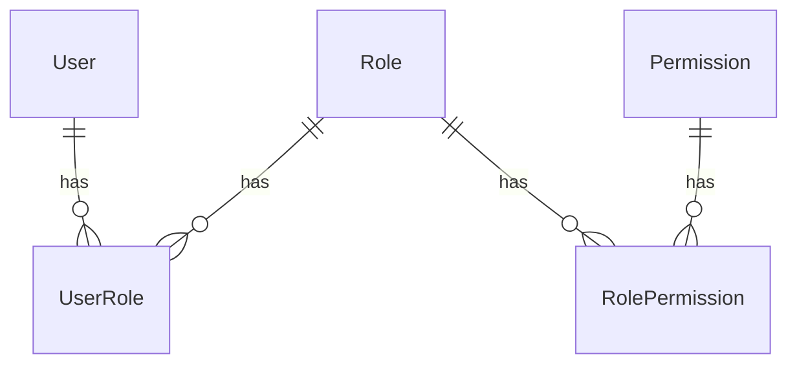

**檢查方式**:
- **角色制**:`hasRole("ADMIN")`
- **權限制**:`hasPermission("order:write")` —— 較細緻,**推薦**
- **擁有者制**:`ownerId == currentUserId`(資源等級的 ACL,常與 RBAC 混用)

**用在**:絕大多數企業應用、本規範採用。

#### ABAC — Attribute-Based Access Control(屬性為基礎)

**定義**:依**屬性 / 環境條件**動態判斷——使用者、資源、行為、時間、地點、IP 都是屬性。

**範例規則**(用 XACML 或 OPA 表達):
- 「**部門 = HR** 且 **時間 = 上班時間** 且 **資源類型 = 員工資料**」才能讀
- 「客戶 IP 在白名單」才能轉帳

**用在**:金融、政府、醫療等高合規場景。**OPA(Open Policy Agent)**是現代 ABAC 主流引擎。

#### 對照表

| 模型 | 規則複雜度 | 細緻度 | 學習成本 | 適合 |
| --- | --- | --- | --- | --- |
| ACL | 低 | 資源等級 | 低 | 檔案、單純分享 |
| RBAC | 中 | 角色 / 權限 | 低 | 大多數企業應用 |
| ABAC | 高 | 任意屬性組合 | 高 | 高合規、複雜業務 |
| **混合(本規範)** | 中-高 | RBAC 主 + 擁有者制 + 部分 ABAC | 中 | 兼顧管理性與彈性 |

**規範要求**:不同 API 可能用不同判斷方式 → 用 **Strategy Pattern** 統一管理。

---

<a id="oauth-oidc"></a>
### OAuth 2.0 / OIDC 🔴

**OAuth 2.0**:授權框架,讓使用者**授權第三方應用代為存取**自己的資源(不洩漏密碼)。**只管授權,不管驗證身份**。

**OIDC**(OpenID Connect):建構在 OAuth 2.0 上的**身份驗證**層,讓你能拿到「使用者是誰」的 ID Token(本質是 JWT)。

**典型流程**(Authorization Code Flow):
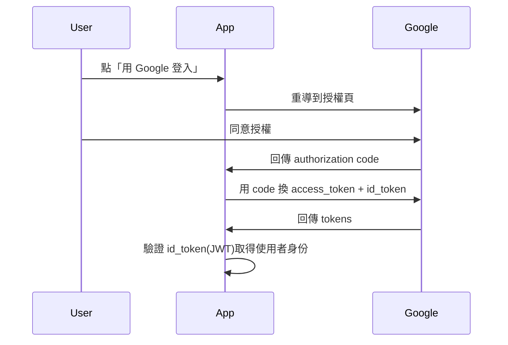

**常見角色**:
- **Resource Owner**:使用者
- **Client**:你的 App
- **Authorization Server**:Google / Auth0 / Keycloak
- **Resource Server**:被存取的 API

---

<a id="pkce"></a>
### PKCE(Proof Key for Code Exchange,「pixy」)🟡

**定義**:**RFC 7636** 定義的 OAuth 2.0 **Authorization Code Flow 強化**——讓 client 在「換 token」時證明自己是當初發起授權的同一個應用。**防止 Authorization Code 被攔截後被重放**。**讀作「pixy」**(`/ˈpɪksi/`)。

**為什麼需要**:
- **公開 client(SPA、Mobile App)無法安全保存 `client_secret`**——程式碼可被反組譯、瀏覽器可看 source
- 攻擊者若**攔截到 authorization code**(URL redirect 中、log 中、瀏覽器歷史),原本只需用公開的 `client_id` 即可換 token
- PKCE 在 client 端**動態產生一次性 secret**(`code_verifier`),authorization 階段送 hash(`code_challenge`)、token 交換階段送原文,server 端比對——攻擊者**沒有原文,即使有 code 也換不到 token**

**核心三步**:

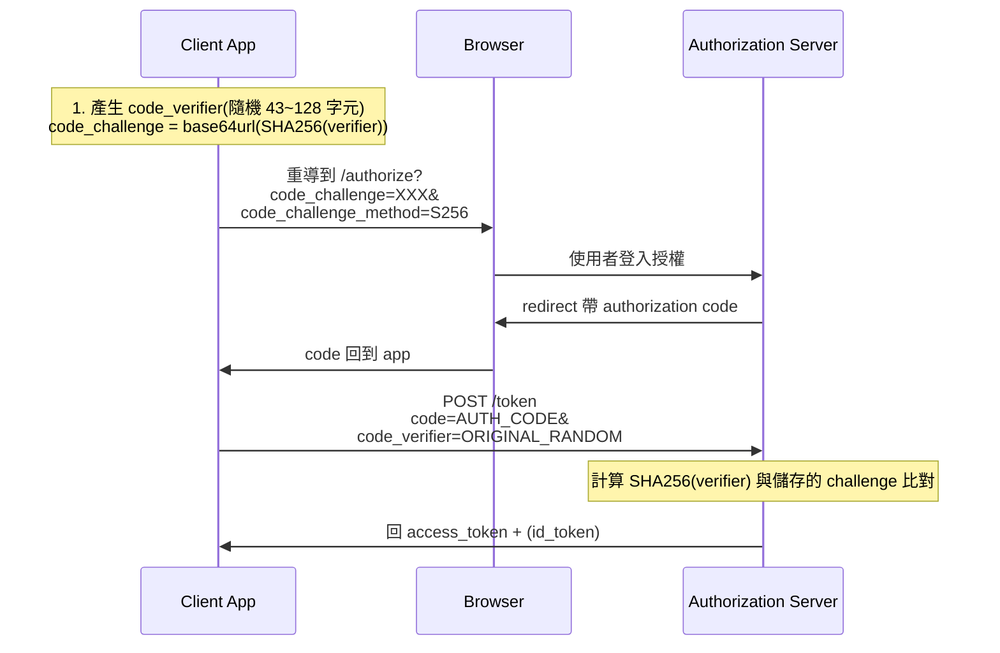

**`code_challenge_method`**:
- **`S256`**(SHA-256,**推薦,實質強制**)— `challenge = base64url(SHA256(verifier))`
- `plain`(明文,僅 backwards compat,**不要用**)

**範例**(JavaScript 前端):
```javascript
// 1. 產 verifier 與 challenge
function generateVerifier() {
    const arr = new Uint8Array(64);
    crypto.getRandomValues(arr);
    return base64UrlEncode(arr);    // 43~128 字元
}

async function challengeFromVerifier(verifier) {
    const data = new TextEncoder().encode(verifier);
    const hash = await crypto.subtle.digest("SHA-256", data);
    return base64UrlEncode(new Uint8Array(hash));
}

const verifier = generateVerifier();
sessionStorage.setItem("pkce_verifier", verifier);
const challenge = await challengeFromVerifier(verifier);

// 2. 跳到授權頁
location.href = `https://idp.example.com/authorize?` +
    `client_id=my-spa&` +
    `redirect_uri=${encodeURIComponent("https://app.example.com/cb")}&` +
    `response_type=code&` +
    `code_challenge=${challenge}&` +
    `code_challenge_method=S256&` +
    `scope=openid profile`;

// 3. callback 拿到 code 後換 token
const code = new URL(location.href).searchParams.get("code");
const verifierStored = sessionStorage.getItem("pkce_verifier");

await fetch("https://idp.example.com/token", {
    method: "POST",
    headers: { "Content-Type": "application/x-www-form-urlencoded" },
    body: new URLSearchParams({
        grant_type: "authorization_code",
        client_id: "my-spa",
        code,
        redirect_uri: "https://app.example.com/cb",
        code_verifier: verifierStored
    })
});
```

**現況**:**OAuth 2.1 草案**(RFC 草案)規範**所有 client(含 confidential client)都應使用 PKCE**——已從「行動 / SPA 專用」演進為「**通用最佳實踐**」。

**OAuth Implicit Flow 已不推薦**:
- 過去 SPA 流行用 Implicit Flow(直接從 URL 取 access_token)
- IETF [OAuth 2.0 Security BCP](https://datatracker.ietf.org/doc/html/draft-ietf-oauth-security-topics) 明確建議**改用 Authorization Code Flow + PKCE**
- Implicit Flow 的 access_token 在 URL,易被 log、瀏覽器歷史、redirect 中介看到

**Spring Security 整合**:Spring Security 6+ 已內建 PKCE 支援。
```java
@Bean
ClientRegistrationRepository clientRegistrationRepository() {
    return new InMemoryClientRegistrationRepository(
        ClientRegistration.withRegistrationId("keycloak")
            .clientId("my-spa")
            .clientAuthenticationMethod(ClientAuthenticationMethod.NONE)  // public client
            .authorizationGrantType(AuthorizationGrantType.AUTHORIZATION_CODE)
            .redirectUri("{baseUrl}/login/oauth2/code/{registrationId}")
            .scope("openid", "profile")
            .authorizationUri("https://keycloak.example.com/realms/myrealm/protocol/openid-connect/auth")
            .tokenUri("https://keycloak.example.com/realms/myrealm/protocol/openid-connect/token")
            // Spring Security 自動啟用 PKCE for public client
            .build()
    );
}
```

**反模式**:
- ❌ Public client 不用 PKCE — 攔截即破
- ❌ `code_challenge_method=plain` — 等於無 PKCE
- ❌ verifier 存 `localStorage`(其他頁面 XSS 可讀) — 建議用 `sessionStorage` + 一次性使用後立刻刪除
- ❌ 重複用同一個 verifier — 必須**每次 flow 新產生**

---

<a id="refresh-token"></a>
### Refresh Token 🟡

**定義**:一個**長效的 Token**,專門用來換取新的(短效)Access Token,讓使用者不必頻繁登入。

**為什麼要分兩種 Token**:
- Access Token 短效(15 分鐘),即使外洩傷害有限
- Refresh Token 長效(7~30 天),只在「換 Token」這一個 endpoint 使用,且通常存在 HttpOnly Cookie / 安全儲存
- 可以主動撤銷 Refresh Token(存 DB,失效時刪除)

---

## 企業身份系統(Enterprise Identity)

<a id="sso"></a>
### SSO(Single Sign-On,單一登入)🟡

**定義**:**登入一次,存取多個系統**——使用者在一個 Identity Provider(IdP)登入後,訪問其他應用(Service Provider,SP)不需重新登入。

**為什麼用**:
- 員工不需記 N 組帳密
- 集中管理(離職一鍵停用所有系統權限)
- 安全策略統一(MFA、密碼規則一處設定)

**實作協定**:
- **SAML 2.0** — 企業傳統,XML-based
- **OAuth 2.0 + OIDC** — 現代,JSON / JWT-based
- **Kerberos** — Windows AD 環境內部
- **CAS**(Central Authentication Service)— 大學 / 開源界常見

**典型流程**(以 OIDC 為例):

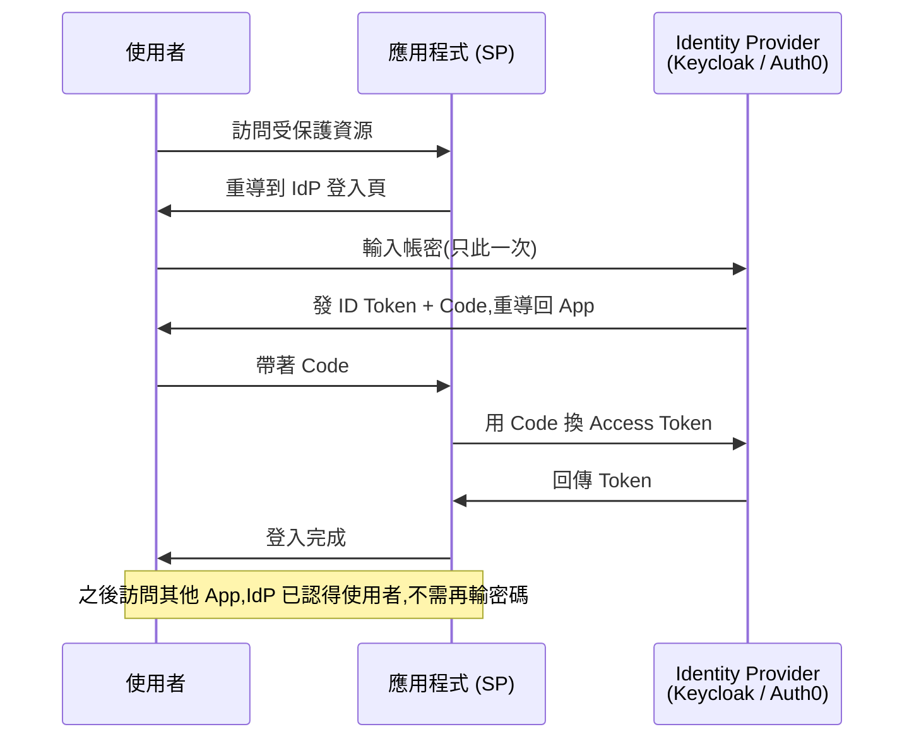

---

<a id="slo"></a>
### SLO(Single Logout / 單一登出)🟡

**定義**:**SSO 的反向操作**——使用者在一個應用點「登出」,**所有透過該 IdP 登入的應用一併登出**。對應 SSO(Single Sign-On)的「**登入一次**」,SLO 達成「**登出一次**」。

**為什麼需要**:
- SSO 讓員工一次登入存取 10 個系統,**沒有 SLO 就要登 10 次出**——體驗破洞、安全漏洞
- 離職 / 帳號遭盜時,管理員一鍵全域登出
- 共用裝置(醫院、櫃台、會議室電腦)離席時必須完整登出

**兩種觸發來源**:

| 來源 | 中文 | 流程 |
| --- | --- | --- |
| **SP-Initiated Logout** | SP 發起登出 | 使用者在 App A 按登出 → App A 通知 IdP → IdP 通知其他 App 也清 session |
| **IdP-Initiated Logout** | IdP 發起登出 | 管理員 / 使用者直接在 IdP 介面登出 → IdP 通知所有 SP |

**典型流程**(OIDC RP-Initiated Logout):

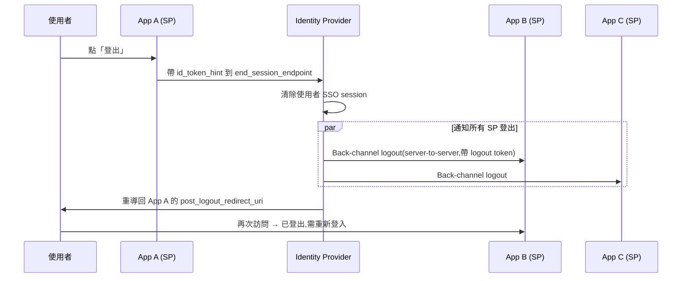

**OIDC 兩種登出機制**:

| 機制 | 通道 | 特點 |
| --- | --- | --- |
| **Front-Channel Logout** | 瀏覽器(iframe 載入各 SP 的 logout URL) | 簡單,但**使用者必須開著瀏覽器**;iframe 失敗無法重試 |
| **Back-Channel Logout**(推薦) | **Server-to-Server**(IdP 直接呼叫各 SP 註冊的 logout endpoint) | 不依賴瀏覽器,可重試,需 SP 維護 session 對應表 |

**SAML 對應**:**SLO Profile**(SAML 2.0),機制類似但 XML-based。

**Stateless + JWT 的特殊處理**:
- JWT 是自帶簽章的 stateless token,**過期前無法主動失效**——SLO 要真正「立刻登出」,需配合 token **黑名單**(`jti` 存 Redis)或縮短 Access Token 有效期 + Refresh Token 撤銷
- 詳見 [JWT](#jwt) 與 [Refresh Token](#refresh-token)

**Keycloak 整合**(Spring Boot):
```yaml
spring:
  security:
    oauth2:
      client:
        registration:
          keycloak:
            # ... 略
        provider:
          keycloak:
            issuer-uri: https://keycloak.example.com/realms/myrealm
            # Keycloak 自動暴露 end_session_endpoint,Spring Security 6+ 內建支援
```

```java
http.logout(logout -> logout
    .logoutSuccessHandler(new OidcClientInitiatedLogoutSuccessHandler(clientRegistrationRepository))
);
```

**反模式**:
- ❌ 只清 App 自己的 cookie / session,**不通知 IdP**——使用者下次訪問其他 App 仍是登入狀態
- ❌ 沒實作 Back-Channel logout endpoint,IdP 通知時 SP 收不到
- ✅ **每個 SP 都註冊 logout endpoint 給 IdP**、**登出測試覆蓋所有應用**

---

<a id="saml"></a>
### SAML(Security Assertion Markup Language)🔴

**定義**:基於 **XML** 的 SSO 協定,2005 年 SAML 2.0 定案,**企業界(尤其美國)主流**。

**核心概念**:
- **Assertion** — IdP 發出的「身份斷言」(XML 文件,有簽章)
- **IdP**(Identity Provider)— 發證者(Okta / ADFS / Keycloak)
- **SP**(Service Provider)— 你的應用
- **SSO Endpoint** — 登入入口
- **Metadata XML** — 雙方交換的設定檔

**SAML vs OIDC**:

| | SAML 2.0 | OIDC |
| --- | --- | --- |
| 格式 | XML(複雜) | JSON / JWT(輕量) |
| 適用 | 企業內部、Web 應用 | 行動 App、SPA、現代 API |
| 學習曲線 | 陡 | 平 |
| 流行度 | 企業傳統 | 新建系統首選 |

**Java 整合**:Spring Security SAML 2.0 / Keycloak SAML adapter / SAML2Aware filter。

---

<a id="ldap"></a>
### LDAP(Lightweight Directory Access Protocol)🟡

**定義**:**目錄服務的標準協定**(RFC 4511),用於儲存與查詢「組織內人員、設備、權限」的樹狀結構資料。

**典型用途**:
- **集中帳號管理**——員工帳號、密碼、所屬部門全存在 LDAP server
- **權限查詢**——「使用者 alice 屬於哪些 group?」
- **電話簿 / 郵件位址查詢**

**樹狀結構範例**:

```
dc=example,dc=com                            (Domain Component)
├── ou=People                                (Organizational Unit)
│   ├── uid=alice                            (User Identifier)
│   │   cn: Alice Wang                       (Common Name)
│   │   mail: alice@example.com
│   │   memberOf: cn=admins,ou=Groups,...
│   └── uid=bob
└── ou=Groups
    ├── cn=admins
    └── cn=developers
```

**核心術語**:
- **DN**(Distinguished Name)— 完整路徑唯一識別:`uid=alice,ou=People,dc=example,dc=com`
- **CN**(Common Name)、**OU**(Organizational Unit)、**DC**(Domain Component)
- **Bind** — 連線並驗證身份
- **Search** — 查詢

**主流實作**:
- **OpenLDAP** — 開源
- **Microsoft Active Directory** — Windows 環境(細節見下節)
- **389 Directory Server** / **ApacheDS**

**Java 整合**:Spring LDAP / Spring Security LDAP / `javax.naming` JNDI(原生)。

```java
@Configuration
public class LdapConfig {
    @Bean
    public LdapTemplate ldapTemplate() {
        var ctx = new LdapContextSource();
        ctx.setUrl("ldap://ldap.example.com:389");
        ctx.setBase("dc=example,dc=com");
        ctx.setUserDn("cn=admin,dc=example,dc=com");
        ctx.setPassword(env("LDAP_PASSWORD"));
        ctx.afterPropertiesSet();
        return new LdapTemplate(ctx);
    }
}
```

---

<a id="ad"></a>
### Active Directory(AD)🟡

**定義**:**Microsoft 的目錄服務**,Windows 網域(Domain)的核心——**LDAP 是協定,AD 是實作**(再加上一堆 Microsoft 專屬擴充)。

**AD 的組成**:
- **Domain Controller(DC)** — AD 的伺服器節點
- **Domain / Forest / OU** — 階層化組織單位
- **User / Computer / Group** — 物件
- **Group Policy(GPO)** — 對群組套用設定(密碼規則、軟體安裝)
- **Kerberos** — AD 內部的票證式驗證
- **Schema** — 資料結構定義(可擴充)

**AD 與 LDAP 的關係**:
- AD 提供 LDAP **介面**(port 389 / 636 LDAPS),Java 應用可用 LDAP 客戶端存取 AD
- 但 AD 也用很多**非 LDAP 的協定**:Kerberos、DCOM、SMB、DNS 整合

**Azure AD / Entra ID**:雲端版 AD,**底層協定改用 OAuth 2.0 + OIDC + SCIM**,不是 LDAP。是兩個不同的東西,只是名字像。

**Java 整合**:跟 LDAP 一樣用 Spring LDAP / Spring Security,連線字串改成 AD server 即可。

---

<a id="keycloak"></a>
### Keycloak 🟡

**定義**:Red Hat 開源的**身份驗證與授權伺服器(IAM)**,一站式提供:
- SSO(SAML 2.0 / OAuth 2.0 / OIDC)
- 使用者管理(自帶 DB,也可整合 LDAP / AD)
- Role / Group 管理
- Multi-Factor Authentication(MFA)
- 社群登入(Google / Facebook / GitHub)
- 帳號註冊 / 忘記密碼 / Email 驗證流程

**為什麼選 Keycloak**:
- 免費、開源、企業可控(資料留在自己機房)
- 替代 Auth0 / Okta(商業 SaaS,按使用者收費)
- 與 Quarkus 同屬 Red Hat 體系,整合好

**核心概念**:
- **Realm**(領域)— 隔離單位,一個 Keycloak 可有多個 realm(各自管理使用者、Client)
- **Client** — 接入 Keycloak 的應用(你的 Spring Boot 後端就是一個 Client)
- **Role**(Realm Role / Client Role)
- **User Federation** — 整合外部身份來源(LDAP / AD)

**Spring Boot 整合**:用 Spring Security OAuth2 Resource Server
```yaml
spring:
  security:
    oauth2:
      resourceserver:
        jwt:
          issuer-uri: https://keycloak.example.com/realms/myrealm
          # Keycloak 暴露 JWKs endpoint,Spring 自動抓 public key 驗證 JWT
```

**Quarkus 整合**:`quarkus-oidc` extension 一行配置完成。

---

<a id="realm-access"></a>
### Keycloak Realm Access 🟡

**定義**:Keycloak 發出的 JWT 中,**用來夾帶使用者角色資訊**的標準 claim 路徑——`realm_access.roles`(realm-level 角色)與 `resource_access.<client_id>.roles`(client-level 角色)。**Spring Security / Quarkus 從這兩個位置抽取 Role 做 Authorization**。

**為什麼是個專有術語**:
- Spring Security 預設從 JWT 的 `scope` claim 抽 authorities,**Keycloak 的角色不在 `scope`**,而在 `realm_access.roles`——必須**手動配置 converter** 才能讀出
- 跨平台對接 SSO 時這是**最常見的踩坑點**:JWT 解出來看起來沒角色,其實角色在 nested claim 裡

**Keycloak JWT Payload 範例**:
```json
{
  "sub": "user-uuid-123",
  "preferred_username": "alice",
  "email": "alice@example.com",
  "realm_access": {
    "roles": ["offline_access", "admin", "user"]   // ← Realm 層角色
  },
  "resource_access": {
    "order-service": {                              // ← Client 層角色
      "roles": ["order:read", "order:write"]
    },
    "account": {
      "roles": ["manage-account"]
    }
  },
  "scope": "openid profile email",
  "iss": "https://keycloak.example.com/realms/myrealm",
  "aud": "order-service"
}
```

**兩種角色的差別**:

| 類型 | claim 路徑 | 適用 |
| --- | --- | --- |
| **Realm Role** | `realm_access.roles` | 跨應用通用角色(admin / user / guest) |
| **Client Role** | `resource_access.<client_id>.roles` | 應用內細粒度角色(order:read、payment:approve) |

**Spring Security 整合**(必須自訂 Converter):
```java
@Bean
JwtAuthenticationConverter jwtAuthenticationConverter() {
    var converter = new JwtAuthenticationConverter();
    converter.setJwtGrantedAuthoritiesConverter(jwt -> {
        var roles = Optional.ofNullable(jwt.getClaimAsMap("realm_access"))
            .map(m -> (List<String>) m.get("roles"))
            .orElse(List.of());
        return roles.stream()
            .map(r -> new SimpleGrantedAuthority("ROLE_" + r))
            .collect(Collectors.toList());
    });
    return converter;
}

@Bean
SecurityFilterChain filter(HttpSecurity http) throws Exception {
    return http
        .oauth2ResourceServer(o -> o.jwt(j -> j.jwtAuthenticationConverter(jwtAuthenticationConverter())))
        .build();
}
```

**Quarkus 整合**(`quarkus-oidc` 內建支援):
```properties
quarkus.oidc.roles.source=accesstoken
quarkus.oidc.roles.role-claim-path=realm_access/roles    # 路徑用 / 分隔 nested
# 或同時取 client role
# quarkus.oidc.roles.role-claim-path=realm_access/roles,resource_access/order-service/roles
```

**對應到 [Role Source of Truth](#role-sot)**:
- realm_access / resource_access **是 Keycloak 為 SoT 時的 Token 中角色資訊承載點**
- 若採用「應用 DB 為 SoT」混合策略,可選擇性忽略 Keycloak 的 role,只從 JWT 拿 `sub`(user id)再查自家 DB

**反模式**:
- ❌ 直接把 Keycloak Realm Role 當業務權限用(`admin` → 所有人都共用同一個 admin 含意,粒度太粗)
- ❌ 把過多細粒度權限(50+ permission)塞進 JWT — Token 變肥、JWT cookie 可能超過 4KB 上限
- ✅ JWT 只放**粗粒度角色**(admin / user / vip),細粒度從 DB 查

---

<a id="entra-id"></a>
### Entra ID(Microsoft 雲端身份)🟡

**定義**:Microsoft 的**雲端 IAM 服務**,前身為 **Azure Active Directory(Azure AD)**,於 **2023 年 7 月正式改名為 Microsoft Entra ID**。**Microsoft 365 / Azure / Dynamics 365 / GitHub Enterprise 等微軟生態的身份基礎**,也是企業 B2B SaaS 對接客戶的事實標準之一。

**Entra 是「傘狀品牌」**,Entra ID 只是家族中的一個產品:

| 產品 | 角色 |
| --- | --- |
| **Entra ID**(舊 Azure AD) | 雲端 IAM、SSO、MFA、Conditional Access |
| **Entra ID Governance** | 權限治理、Access Review |
| **Entra Verified ID** | Decentralized ID(W3C DID/VC) |
| **Entra Permissions Management** | 多雲 CIEM(雲端權限管理) |
| **Entra Internet Access / Private Access** | SSE / ZTNA |

> **Entra ID ≠ Active Directory(AD)**:**雲端版,協定改用 OAuth 2.0 / OIDC / SCIM**,與地端 AD 的 LDAP / Kerberos 是兩套不同協定。詳見 [AD](#ad)。

**為什麼選 Entra ID**:
- 已用 Microsoft 365 / Azure,身份系統零成本接續
- B2B SaaS 對企業客戶必備(客戶 99% 都用 Microsoft 帳號登入)
- 比 Keycloak / Auth0 在 Office 生態整合度高(Outlook、Teams、SharePoint 直通)

**核心概念**:

| Entra ID 概念 | 對應 Keycloak | 說明 |
| --- | --- | --- |
| **Tenant**(租戶) | Realm | 一個組織一個 Tenant,以網域識別(例 `contoso.onmicrosoft.com`) |
| **App Registration** | Client | 接入 Entra 的應用,設定 redirect URI / scopes / 憑證 |
| **Service Principal** | (無對應) | App 在某 Tenant 的執行身份實例(同一 App Registration 可在多租戶都有 SP) |
| **Enterprise Application** | (無對應) | Tenant 端對 SaaS App 的安裝紀錄(SCIM provisioning、SSO 設定) |
| **App Roles** | Client Role | App Registration 定義的角色,JWT 中放在 `roles` claim |
| **Groups** | Group | 使用者群組,JWT 中放在 `groups` claim(**值是 GUID,不是名稱**) |
| **Conditional Access** | (無對應) | 動態存取政策(位置 / 裝置合規 / MFA 風險) |

**地端與雲端整合**:
- **Entra Connect Sync**(舊名 Azure AD Connect)— 將本地 AD 同步到雲端 Entra ID,**Hash Sync / Pass-through Authentication / Federation(ADFS)** 三種模式
- **Cloud Sync**(新一代,輕量 agent,逐步取代 Connect Sync)

**協定支援**:
- **OIDC / OAuth 2.0**(主流,新應用首選)
- **SAML 2.0**(舊系統、企業 SSO 對接)
- **WS-Federation**(極舊,逐步淘汰)
- **SCIM 2.0**(自動使用者佈建)

**Spring Boot 整合**(走 OIDC):

```yaml
spring:
  security:
    oauth2:
      resourceserver:
        jwt:
          issuer-uri: https://login.microsoftonline.com/${TENANT_ID}/v2.0
          # JWKS 端點 Spring 自動發現:
          # https://login.microsoftonline.com/${TENANT_ID}/discovery/v2.0/keys
```

**Microsoft 官方 Java SDK**:
- **MSAL4J**(Microsoft Authentication Library for Java)— 處理 OAuth 互動式登入、token 取得與快取
- **Microsoft Graph SDK for Java**— 查詢 Entra 中的 User / Group / Application 物件

**Java Web 應用 OAuth 流程範例**(MSAL4J client credentials):

```java
ConfidentialClientApplication app = ConfidentialClientApplication.builder(
        env("AZURE_CLIENT_ID"),
        ClientCredentialFactory.createFromSecret(env("AZURE_CLIENT_SECRET")))
    .authority("https://login.microsoftonline.com/" + env("AZURE_TENANT_ID"))
    .build();

IAuthenticationResult result = app.acquireToken(
    ClientCredentialParameters.builder(Set.of("https://graph.microsoft.com/.default")).build()
).get();
```

**Entra ID JWT Payload 範例**(注意角色 claim 路徑與 Keycloak 不同):

```json
{
  "aud": "api://order-service",
  "iss": "https://login.microsoftonline.com/<tenant-id>/v2.0",
  "sub": "AAAAAAAA-BBBB-CCCC-DDDD-EEEEEEEEEEEE",
  "oid": "user-object-id-guid",
  "preferred_username": "alice@contoso.com",
  "roles": ["order.read", "order.write"],            // ← App Roles(對應 Keycloak resource_access)
  "groups": ["11111111-...", "22222222-..."],        // ← Group ID,不是名稱
  "scp": "User.Read",                                 // ← Delegated 場景才有 scp(scope)
  "ver": "2.0"                                        // ← Token version
}
```

**常見坑**:
- **Token v1 vs v2**:Endpoint `oauth2/v2.0/...` 與 `oauth2/...` 發出的 token 結構不同——`roles` claim 只在 **v2 token** 才有,務必 issuer URI 用 `/v2.0`
- **`groups` claim 是 GUID 不是名稱**:後端要做 group → 角色對應,通常在 App Registration 開啟「Group claims」並選擇是否帶 SAM accountName(預設不帶)
- **大量 Group 會被截斷**:使用者 >150 個 group 時 token 不會塞 `groups` 而是給 `_claim_names` + Graph API endpoint,Server 要回頭查 Graph
- **多租戶 App(`multi-tenant`)**:issuer URI 用 `common` / `organizations` / `<tenant-id>`,JWT 驗證需動態取得正確 tenant 的 JWKS
- **App Role vs Delegated Permission(scope)**:App Role 用在「應用呼應用」(client credentials)或「使用者登入後的權限」;Scope 用在「使用者授權 App 代表自己」(delegated)

**Entra ID vs Keycloak vs Auth0**:

| | Entra ID | Keycloak | Auth0 |
| --- | --- | --- | --- |
| 部署 | SaaS | 自架(可 SaaS:Red Hat SSO) | SaaS |
| 計費 | 含於 M365 / 額外授權 | 開源免費 | 按 MAU 計費 |
| 強項 | Microsoft 生態、企業客戶 SSO | 自有可控、Quarkus 整合 | Developer 體驗、Custom Login 流程 |
| 適合 | 已用 M365 / Azure 的企業 | 內部系統、想自己掌控資料 | B2C App、需要快速接 social login |

**相關連結**:[AD](#ad)、[OAuth 2.0 / OIDC](#oauth-oidc)、[SSO](#sso)、[Keycloak](#keycloak)

---

<a id="auth0"></a>
### Auth0(SaaS 身份平台)🟡

**定義**:**Identity-as-a-Service(IDaaS)**的代表產品,提供完整的 Auth / SSO / Social Login / MFA / 使用者管理,**developer-first** 是其招牌定位。**2021 年被 Okta 以 65 億美元收購**,目前 Auth0 與 Okta 是同一公司下的**兩條獨立產品線**——Okta 偏企業 IT 導向(Workforce Identity),Auth0 偏應用開發者(Customer Identity / CIAM)。

**為什麼選 Auth0**:
- 不想自架 Keycloak、也不在 Microsoft 生態
- 需要快速接 Social Login(Google / Facebook / Apple / GitHub / LINE)
- **Universal Login** 可客製登入頁面而不必自己重做 OAuth flow
- B2C 應用(電商、行動 App)、SaaS 對接外部開發者(Developer Portal)

**核心概念**:

| Auth0 概念 | 對應 Keycloak | 說明 |
| --- | --- | --- |
| **Tenant** | Realm | 一個 Tenant 一個獨立網域(`<tenant>.auth0.com`) |
| **Application** | Client | 接入 Auth0 的 App(SPA / Native / Regular Web / M2M) |
| **API** | Resource Server | 受保護的後端 API,定義 scope / permission |
| **Connection** | User Federation / Identity Provider | 使用者來源:Database / Social / Enterprise(SAML / LDAP / AD) |
| **Rules**(deprecated) / **Actions** | Authenticator SPI | 登入流程中插入自訂邏輯(MFA、加 custom claim、阻擋) |
| **Hooks**(deprecated) | — | 舊版 webhook,已被 Actions 取代 |
| **Organization** | Group / Sub-Realm | B2B 多租戶情境,把使用者按客戶組織分組 |

**Rules vs Actions(重要遷移)**:
- **Rules**:JavaScript 寫在 Auth0 dashboard,**已 deprecated**(2024 年 EOL)
- **Actions**:取代 Rules,改用 Node.js + 明確的 Trigger(`post-login`、`credentials-exchange` 等)、可版本控制、可在 Marketplace 分享

**協定支援**:
- **OIDC / OAuth 2.0**(主)
- **SAML 2.0**(SP / IdP 雙向皆支援)
- **WS-Federation**(舊系統對接)

**Spring Boot 整合**(走 OIDC,跟 Keycloak 寫法一致):

```yaml
spring:
  security:
    oauth2:
      resourceserver:
        jwt:
          issuer-uri: https://${AUTH0_TENANT}.auth0.com/
          # JWKS 自動發現:https://<tenant>.auth0.com/.well-known/jwks.json
          audiences: https://api.your-app.com   # 必設,Auth0 token 必有 aud
```

**Auth0 自家 Java SDK**:
- **`com.auth0:java-jwt`**— JWT 解析與驗章 library(D1 [JWS 段](#jws)已提及,並非 Auth0 專用,Spring/Quarkus 也常用)
- **`com.auth0:auth0-java`**— Management API 客戶端(查使用者、改 metadata)
- **`com.auth0:mvc-auth-commons`**— Servlet 整合,適合不用 Spring Security 的場景

**Auth0 JWT Payload 範例**(注意 Custom Claim namespace 規則):

```json
{
  "iss": "https://your-tenant.auth0.com/",
  "sub": "auth0|65f8a...",
  "aud": ["https://api.your-app.com", "https://your-tenant.auth0.com/userinfo"],
  "iat": 1735689600,
  "exp": 1735693200,
  "scope": "read:orders write:orders",
  "permissions": ["order:read", "order:write"],         // ← RBAC 開啟後才有
  "https://your-app.com/roles": ["admin", "vip"],       // ← Custom Claim 必須有 https:// namespace
  "https://your-app.com/tenant_id": "tenant-abc"
}
```

**Custom Claim 規則(易踩坑)**:
- **必須加 namespace**(`https://your-domain/...`)否則 Auth0 會把非保留 claim 丟掉
- **不要用 `auth0.com` 為前綴**(被視為保留)
- 規則來源:OIDC spec 規範哪些 claim 是保留,其餘自訂 claim 必須以 URI 形式避免衝突

**Action 範例**(`post-login` trigger,加 custom claim):

```javascript
exports.onExecutePostLogin = async (event, api) => {
  const namespace = 'https://your-app.com';
  if (event.authorization) {
    api.idToken.setCustomClaim(`${namespace}/roles`, event.authorization.roles);
    api.accessToken.setCustomClaim(`${namespace}/tenant_id`,
      event.user.app_metadata.tenant_id);
  }
};
```

**常見坑**:
- **Free tier MAU 上限**:7,500 MAU(2026 年數字,可能變動);超過會強制升級
- **`aud` claim 必填**:申請 token 時 `audience` 參數沒帶,Auth0 會發出**只能呼叫 `/userinfo` 的 opaque token**,不是 JWT — Spring 驗章會直接失敗
- **`scope` vs `permissions`**:Application 設定有勾選「Enable RBAC + Add Permissions in the Access Token」才會有 `permissions` claim
- **Custom Claim 沒 namespace** → 被丟掉,App 拿不到
- **Rules 不要再寫新的**(已 deprecated),全部用 Actions

**Auth0 vs Keycloak vs Entra ID**:已在 [Entra ID 條目](#entra-id)末段對照表呈現。

**相關連結**:[OAuth 2.0 / OIDC](#oauth-oidc)、[JWT](#jwt)、[Keycloak](#keycloak)、[Entra ID](#entra-id)

---

<a id="fido"></a>
### FIDO / WebAuthn / Passkey 🟡

**FIDO**(Fast IDentity Online):**無密碼身份驗證**標準聯盟(2013 成立),目標是**徹底取代密碼**——用**公私鑰加密 + 裝置生物辨識**(指紋、Face ID、安全金鑰)做驗證。

**為什麼出現**:
- 密碼是**所有身份驗證問題的根源**:會被釣魚、會被外洩、會被重用、會被 brute force
- 即使加 MFA 簡訊 / TOTP,釣魚網站仍能即時轉發 OTP(中間人攻擊)
- FIDO 用**域名綁定 + 公鑰簽章**——釣魚網站收不到也用不上,**結構上 phishing-proof**

**FIDO 家族**:

| 名稱 | 用途 | 現況 |
| --- | --- | --- |
| **FIDO U2F** | 第一代,**第二因素**(配合密碼用) | 已被 FIDO2 涵蓋 |
| **FIDO2** | 第二代,**可作為唯一驗證**(完全無密碼) | **目前主流** |
| **WebAuthn**(Web Authentication) | **FIDO2 的瀏覽器 API 標準**(W3C) | 瀏覽器原生支援 |
| **CTAP**(Client to Authenticator Protocol) | 瀏覽器 ↔ 認證器(USB key、手機)通訊協定 | FIDO2 底層 |
| **Passkey** | **Apple / Google / Microsoft 推的 FIDO2 同步金鑰**——可跨裝置同步 | **使用者面前的品牌名** |

**Passkey vs 傳統 FIDO 金鑰**:
- 傳統 FIDO Key(YubiKey)是**裝置綁定**——金鑰存在硬體裡,換手機就要重新註冊
- Passkey 透過 iCloud Keychain / Google Password Manager **跨裝置同步**——體驗大幅改善,代價是雲端供應商成為信任根

**WebAuthn 流程**(註冊與登入):

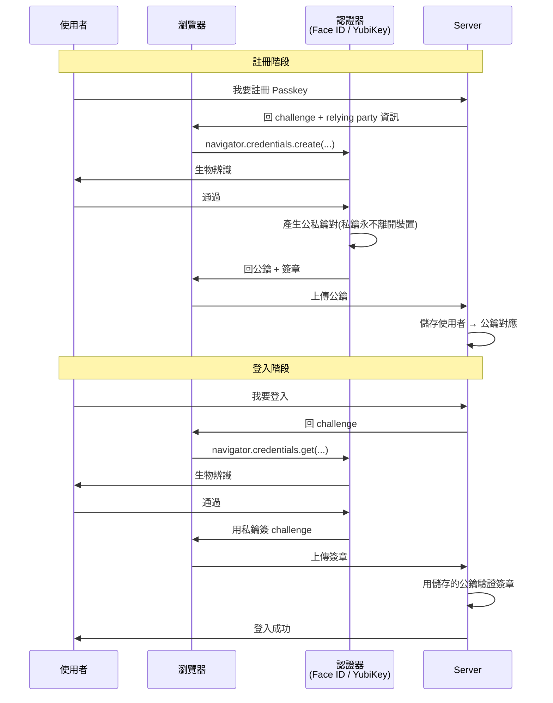

**重點概念**:
- **私鑰永遠不離開使用者裝置**——Server 只有公鑰,被駭也偷不到能登入的東西
- **Challenge-Response**:每次登入 Server 出題、裝置簽章,**回放攻擊無效**
- **Origin binding**:WebAuthn 把當前域名綁進簽章,**釣魚網站無法重用**

**為什麼 phishing-proof**:傳統 MFA(簡訊 / TOTP),使用者會把 OTP 輸入到釣魚網站,攻擊者轉發給真網站照樣登入。FIDO 的簽章與**真實域名**綁定,釣魚網站收到簽章也無法在真網站使用。

**Java 整合**:
- **WebAuthn4J**(主流開源 Java library)— 處理註冊與登入時的密碼學驗證
- **Yubico java-webauthn-server**(Yubico 官方)
- **Spring Security**:目前無內建 WebAuthn,需自寫 controller + 上述 library;Spring Security 6.4+ 開始有 incubation 模組
- **Keycloak**:**內建支援 WebAuthn / Passkey**——在 Authentication Flow 加 WebAuthn Authenticator 即可,後端不用改 code

**部署清單**:
- 後端產生 / 驗證 challenge(WebAuthn4J)
- 儲存使用者公鑰(credentialId、publicKey、signCount)
- 前端用 `navigator.credentials.create` / `get` 與認證器互動
- **必須 HTTPS**(localhost 例外)
- 設定 Relying Party ID(通常是域名)

**現況與趨勢**:
- Google / Apple / Microsoft / GitHub / Amazon 已全面支援 Passkey
- 銀行、政府逐步導入(高安全場景已是 best practice)
- 與 [SSO](#sso) 結合常見作法:**IdP(Keycloak / Okta)啟用 Passkey,SP 仍走 OIDC,SP 不需自己整合 WebAuthn**

---

<a id="role-sot"></a>
### Role Source of Truth(角色的真相來源)🟡

**定義**:**權限資料(Role / Permission / 使用者-角色關係)由誰管理才算數**——這個「誰」就是 Source of Truth(SoT)。

**為什麼是個議題**:大型系統常有多套權限系統,常見錯誤是「**多處同時改、誰也對不起來**」:
- AD 有 group
- Keycloak 有 role
- 應用 DB 有自訂 permission
- 試算表有負責人清單

**常見策略**:

| 策略 | 說明 | 適用 |
| --- | --- | --- |
| **AD / LDAP 為 SoT** | 員工 group 來自 AD,應用直接查 AD,**自己不存** | 純內部系統、組織架構穩定 |
| **Keycloak 為 SoT** | Keycloak 整合 AD 但加上應用維度的 role,**JWT 中夾帶 role** | 多應用共用 IAM、需細粒度權限 |
| **應用 DB 為 SoT** | 應用自己維護 Role/Permission/UserRole/RolePermission,從 IdP 拿到 user 後查自家 DB | 業務權限複雜、跨組織獨立 |
| **混合(分層)** | **Authentication 由 IdP / AD,Authorization 由應用 DB**(本規範採用) | 中大型企業最常見 |

**規範採用混合策略**:
- AD / Keycloak 提供 **「你是誰」+ 部門 / 員工 group**(這層是 IT 部門管的)
- 應用 DB 提供 **「你能做什麼」+ 業務角色 / 細粒度權限**(這層是業務管的)
- 透過 **PermissionPort** 從 DB 動態查,不寫死在 code

**Anti-pattern**(反模式):
- ❌ 兩邊都改 — Keycloak 加 role,DB 也加 role,有天會打架
- ❌ 沒人是真相 — Excel 一份、code 一份、DB 一份,稽核時對不齊
- ✅ 明確一處 — 寫進 ADR(Architecture Decision Record)、團隊都知道

---

## 密碼學與雜湊(Cryptography & Hashing)

<a id="hash"></a>
### Hash(雜湊)🟢

**定義**:把**任意長度輸入**經過數學運算,輸出**固定長度的指紋(digest)**——同一輸入永遠產生同一輸出,輸入變一個 bit 輸出全變。

**核心性質**:
1. **確定性**:同樣輸入永遠同樣輸出
2. **單向性(One-way)**:由輸出**算不出**輸入(理論上)
3. **碰撞抗性(Collision-resistant)**:找到兩個不同輸入產生相同輸出**極困難**
4. **雪崩效應(Avalanche)**:輸入動 1 bit,輸出至少一半 bit 改變

**Hash vs 加密**:這是**最常被混淆**的概念:

| | Hash | 加密(Encryption) |
| --- | --- | --- |
| 可逆? | ❌ **不可逆** | ✅ 可解密 |
| 輸出長度 | 固定 | 與輸入相關 |
| 用途 | 驗證完整性、密碼儲存、簽章 | 保密傳輸 / 儲存 |
| 範例 | SHA-256、SHA-3、BLAKE3 | AES-256、RSA |

**常見演算法**:

| 演算法 | 輸出長度 | 現況 |
| --- | --- | --- |
| MD5 | 128 bit | ❌ **已破**——僅可作為非安全用途(校驗檔案完整性) |
| SHA-1 | 160 bit | ❌ **已破**——Google 在 2017 找到碰撞 |
| **SHA-256**(SHA-2 family) | 256 bit | ✅ 主流,JWT 簽章、區塊鏈使用 |
| **SHA-3**(Keccak) | 可變 | ✅ NIST 後標準,**並非取代 SHA-2**,並列共存 |
| **BLAKE3** | 可變 | ✅ 新一代,**快**,但生態尚淺 |

**Java 範例**:
```java
MessageDigest md = MessageDigest.getInstance("SHA-256");
byte[] hash = md.digest("hello".getBytes(StandardCharsets.UTF_8));
String hex = HexFormat.of().formatHex(hash);
// 2cf24dba5fb0a30e26e83b2ac5b9e29e1b161e5c1fa7425e73043362938b9824
```

**典型用途**:
- **密碼儲存**(配合 [密碼雜湊](#password-hashing) 演算法,不直接用 SHA-256)
- **完整性校驗**:檔案 / 訊息是否被竄改(`sha256sum`)
- **簽章**:JWT、TLS、Git commit ID
- **去重 / 索引 key**

**反模式**:
- ❌ 用 SHA-256 直接 hash 密碼(**速度太快,易被 GPU 暴力)**——必須用慢速密碼雜湊(Argon2id / bcrypt)
- ❌ 用 MD5 / SHA-1 做任何安全用途

---

<a id="rainbow-table"></a>
### Rainbow Table(彩虹表攻擊)🟡

**定義**:**預先計算大量密碼 → hash 對照表**,攻擊者拿到 DB 中的 hash 後,**直接查表反推原密碼**——把離線運算成本前置,大幅加快密碼破解。

**為什麼能成功**:
- 傳統 hash(MD5、SHA-1、未加 salt 的 SHA-256)**快、確定、可預計算**
- 常見密碼(`123456`、`password`、`qwerty`)永遠 hash 出同一個值
- 攻擊者一次算好「**Top 1000 萬密碼 → hash**」對照表,破解時查表 O(1) 命中

**簡化的彩虹表結構**:
```
hash                              密碼
5f4dcc3b5aa765d61d8327deb882cf99  password
e10adc3949ba59abbe56e057f20f883e  123456
482c811da5d5b4bc6d497ffa98491e38  password123
fcea920f7412b5da7be0cf42b8c93759  1q2w3e4r
...                               ...
```

**鏈式壓縮(Chain Compression)**:

直接存全部 (密碼, hash) 在實務上不可行——8 位英數密碼約需 5000 TB。彩虹表的核心技巧是**只存鏈頭與鏈尾,中間全部丟掉**,把空間壓到 1/N(N 為鏈長,實務上 10,000~100,000)。

**兩個函數**:
- **H** — 真正的 hash 函數(MD5、SHA-1...)
- **R_i** — reduction function:把 hash 值**映射回**密碼空間中的某個字串。**不是 hash 的反函數**(hash 不可逆),只是一個壓縮對應。每個位置使用**不同的 R**——這就是「彩虹」的由來,稍後解釋為何必要。

**建鏈**:從起始密碼 `p0` 出發,交替套用 H 與 R 走 N 步,只存鏈頭與鏈尾:

```
p0 ─H→ h0 ─R0→ p1 ─H→ h1 ─R1→ p2 ─H→ h2 ─R2→ p3 ─H→ h3
↑                                                       ↑
鏈頭(儲存)                                          鏈尾(儲存)
```

中間的 `p1, p2, p3, h0, h1, h2` 全部丟掉,**需要時從鏈頭重算**。

---

**玩具範例**(N=4, 3 條鏈, 密碼空間 = "000"~"999", H 與 R 都是假函數):

建鏈過程的完整 trace(實際只有最左和最右兩欄存到 disk):

```
鏈 1: "000" ─H→ "@K9P" ─R0→ "472" ─H→ "#X3M" ─R1→ "819" ─H→ "&Q7Z" ─R2→ "265" ─H→ "%T4N"
鏈 2: "100" ─H→ "!L2W" ─R0→ "638" ─H→ "$M8V" ─R1→ "194" ─H→ "^B5R" ─R2→ "701" ─H→ "@F1Y"
鏈 3: "200" ─H→ "*N6S" ─R0→ "552" ─H→ "~G3D" ─R1→ "087" ─H→ "+J0X" ─R2→ "913" ─H→ "=E9C"
```

Disk 上實際儲存:

| 鏈頭 (p0) | 鏈尾 (h3) |
| --- | --- |
| "000" | "%T4N" |
| "100" | "@F1Y" |
| "200" | "=E9C" |

3 條鏈 cover 12 個密碼,只存 3 筆 → 空間壓縮 4 倍(實務上 N=10,000 → 壓縮 1 萬倍)。

---

**查表流程**:假設攻擊者拿到 X = `"!L2W"`,想反推對應密碼。

每次嘗試「**假設 X 位於位置 k**」,從 X 套一連串 R 和 H 算出**候選鏈尾**,對鏈尾索引查一次。包裝層數隨位置遞增:

| X 假設位於 | 候選值算式 |
| --- | --- |
| 倒數第 1 (h3) | `X` |
| 倒數第 2 (h2) | `H(R2(X))` |
| 倒數第 3 (h1) | `H(R2(H(R1(X))))` |
| 倒數第 4 (h0) | `H(R2(H(R1(H(R0(X))))))` |

**規律**:最內層的 R 下標 = 假設位置;往外每多包一層 H+R,R 的下標 +1,最外層永遠以 H 結尾。

對 X = `"!L2W"` 跑一次:

| 嘗試 | 候選值 | 鏈尾索引查找 |
| --- | --- | --- |
| 1 | `"!L2W"` | 沒命中 |
| 2 | `H(R2(X))` | 沒命中 |
| 3 | `H(R2(H(R1(X))))` | 沒命中 |
| 4 | `H(R2(H(R1(H(R0(X))))))` = `"@F1Y"` | **命中鏈 2** |

命中後,從鏈 2 鏈頭 `"100"` 重走鏈條找出 X 的位置:

| 步驟 | 動作 | 值 | = X? |
| --- | --- | --- | --- |
| 0 | p0 | `"100"` |  |
| 1 | H(p0) | `"!L2W"` | **Yes** → 密碼 = `"100"` |

**關鍵觀念**:每次「嘗試」只算一個候選值、做一次索引查找——**與「存了幾條鏈」無關**(鏈條數只影響鏈尾索引大小,查找仍是 O(log n) 或 O(1))。整體查表 = N 個位置 × 每次 O(N) 運算 = **O(N²) 算力換 1/N 空間**。

---

**False Alarm(誤報)**:R 是 **many-to-one** 函數——把巨大的 hash 空間壓進小的密碼空間,**多個不同的 hash 經過 R 都會映射到同一個密碼**。導致查表時可能誤報:候選值 = 某條鏈尾,但 X 其實**不在**那條鏈裡。

**例子**:攻擊者拿到 X = `"ZZZZ"`(對應的密碼**不在表內**),但 `R2("ZZZZ")` 碰巧等於 `R2("^B5R") = "701"`:

```
鏈 2 合法路徑:    "^B5R" ─R2→ "701" ─H→ "@F1Y" (鏈尾)
False alarm 路徑: "ZZZZ" ─R2→ "701" ─H→ "@F1Y" (剛好命中同個鏈尾)
```

兩條路徑在 `"701"` 處會合 → H 是確定性函數,後續必然算出同個鏈尾 `"@F1Y"`。攻擊者以為命中,從鏈 2 鏈頭走完整條鏈卻找不到 X → 浪費 O(N) 運算,回頭嘗試下一個位置 k。

**為何每個位置要用不同的 R**:若整鏈共用同一個 R,兩條鏈中途撞值就會**永久合併**(chain merge),覆蓋率大幅下降。用 N 個不同的 R 讓「撞同值」只能發生在**同一位置**——機率降低 N 倍,鏈條才能保持獨立。

| 撞的種類 | 時機 | 後果 |
| --- | --- | --- |
| **False alarm** | 查表時 | 白走一條鏈,正確性不受影響 |
| **Chain merge** | 建表時 | 兩鏈合併,永久浪費儲存與覆蓋率 |

不同 R 主要解決 chain merge;false alarm 是 R 壓縮的本質代價,不可避免。**這就是「Rainbow」二字的工程意義**——N 個不同的 R 排列起來像彩虹的不同顏色。

**Salt 如何破解 Rainbow Table**:
- **Salt** = 給每個使用者一段**隨機字串**,hash 前混入(`hash(password + salt)`)
- 同樣密碼 `password`,Alice 用 salt `abc`、Bob 用 salt `xyz`,**hash 完全不同**
- 攻擊者**必須對每個 user 重新算表**——彩虹表瞬間失效

```
user      salt              hash
alice     a8f7c3...         hash("password" + "a8f7c3...")
bob       9e2b1d...         hash("password" + "9e2b1d...")
```

**Salt 的要求**:
- **每個使用者獨立**(不能全系統共用同一個 salt)
- **足夠長**(至少 16 bytes)
- **隨機**(`SecureRandom`,不用普通 `Random`)
- **與 hash 一同存 DB**(不必加密、不是機密——salt 不機密,但要 unique)

**Pepper(胡椒)**:再進一階,**額外**全系統共享的密鑰(放在環境變數,不存 DB)——`hash(password + salt + pepper)`。DB 整個被偷光,沒有 pepper 也無法 brute force。但若 pepper 也外洩則無效,**通常 Argon2id 已夠用,pepper 是 paranoid 額外保險**。

**現代防禦**:
1. **用慢速密碼雜湊**([Argon2id](#password-hashing) 等)——彩虹表只對快 hash 有效
2. **加 salt**——讓彩虹表無法重複使用
3. **足夠 work factor**——讓單次嘗試也很慢

**只要這三條全做**,Rainbow Table 在實務上已不構成威脅。但仍是面試與安全討論常考的歷史概念。

---

<a id="password-hashing"></a>
### 密碼雜湊:Argon2id / bcrypt / scrypt / PBKDF2 🟡

**為什麼密碼不能用普通 hash**:
- SHA-256 **速度極快**——GPU 一秒可算數十億次,弱密碼**幾分鐘破光**
- 密碼雜湊演算法**故意設計成慢**(數十~數百 ms),讓暴力破解成本爆炸
- 內建 salt、可調 work factor、抗 GPU / ASIC

**四大主流密碼雜湊**:

| 演算法 | 年份 | 抗 GPU | 抗 ASIC | 建議 |
| --- | --- | --- | --- | --- |
| **PBKDF2** | 2000 | ⚠ 弱 | ⚠ 弱 | 已過時,但仍是 FIPS 認證選項(政府專案) |
| **bcrypt** | 1999 | ✅ 中 | ⚠ 中 | 仍可用,Spring Security 預設 |
| **scrypt** | 2009 | ✅ 強(memory-hard) | ✅ 強 | 介於 bcrypt 與 Argon2 之間 |
| **Argon2id** | 2015 | ✅ **最強** | ✅ **最強** | **OWASP 首推**、Password Hashing Competition 2015 冠軍 |

**Argon2 三個變體**:
- **Argon2d** — 抗 GPU 強,但易受 side-channel attack
- **Argon2i** — 抗 side-channel,但抗 GPU 較弱
- **Argon2id** — **兩者混合,推薦**

**OWASP 2024 建議參數**(Argon2id):
- `m` = 19 MiB(記憶體)
- `t` = 2(iterations)
- `p` = 1(parallelism)
- 輸出 32 bytes

**Spring Security 範例**:
```java
@Bean
PasswordEncoder passwordEncoder() {
    // 預設 Argon2id,參數內部已合理
    return new Argon2PasswordEncoder(16, 32, 1, 19 * 1024, 2);
    // 或最簡單:用 DelegatingPasswordEncoder,DB 內存 {argon2id}$...$...
    // return PasswordEncoderFactories.createDelegatingPasswordEncoder();
}

// 註冊
String hashed = passwordEncoder.encode(rawPassword);
userRepo.save(new User(username, hashed));

// 驗證
boolean ok = passwordEncoder.matches(rawPassword, user.getHashedPassword());
```

**DB 儲存格式**(Spring Security 慣例,prefix 標示演算法):
```
{argon2id}$argon2id$v=19$m=19456,t=2,p=1$<salt-base64>$<hash-base64>
{bcrypt}$2a$10$N9qo8uLOickgx2ZMRZoMyeIjZAgcfl7p92ldGxad68LJZdL17lhWy
```

**Why prefix**:支援平滑升級——舊使用者用 bcrypt 存著,新註冊用 Argon2id,登入時兩種都驗,逐步淘汰。

**選擇建議**:
- **新系統**:**Argon2id**(無 FIPS 要求)
- **政府 / 金融 FIPS 環境**:PBKDF2(被 FIPS 140 認證)
- **既有用 bcrypt**:可不急遷移,但新註冊應改用 Argon2id

**反模式**:
- ❌ 用 SHA-256 / MD5 存密碼(GPU 暴力 < 1 小時破光)
- ❌ 全系統共用一個 salt(等於沒 salt)
- ❌ 自己「捲幾次 SHA-256」當密碼雜湊(永遠不要自己發明密碼學)
- ✅ 用標準 library(Spring Security PasswordEncoder)+ 標準演算法

---

<a id="aes-256"></a>
### AES-256(對稱加密)🟡

**AES**(Advanced Encryption Standard):2001 年 NIST 標準對稱加密演算法(Rijndael 演算法),**目前世界主流對稱加密**。**256** = key 長度 256 bit。

**對稱 vs 非對稱**:

| | 對稱(AES-256) | 非對稱(RSA / ECDSA) |
| --- | --- | --- |
| 金鑰 | 一把(加 / 解用同一個) | 一對(public / private) |
| 速度 | **快**(數百 MB/s 起跳,有 CPU AES-NI 指令加速) | 慢(KB/s 等級) |
| 用途 | **大量資料加密** | 金鑰交換、簽章 |
| 範例 | 檔案、DB 欄位、TLS session 資料 | TLS handshake、JWT 簽章 |

**AES 三種 key 長度**:

| 長度 | 安全性 | 適用 |
| --- | --- | --- |
| AES-128 | 仍安全(對量子也撐一陣) | 行動裝置、效能敏感 |
| AES-192 | (較少用) | — |
| **AES-256** | **最強**,抗未來量子衰減仍可接受 | **政府機密、企業預設、長期儲存** |

**加密模式(Mode of Operation)是真正的重點**:**AES 本身只加密 16 bytes 一個 block**,長資料如何加密由「**模式**」決定:

| 模式 | 全名 | 是否安全 | 適用 |
| --- | --- | --- | --- |
| **ECB** | Electronic Codebook | ❌ **嚴重不安全**(相同明文出相同密文,圖案外洩) | 不要用 |
| **CBC** | Cipher Block Chaining | ⚠ 有 padding oracle 攻擊風險 | 已被 GCM 取代 |
| **CTR** | Counter | ✅ 安全 | 串流場景 |
| **GCM** | Galois/Counter Mode | ✅ **目前推薦**——**Authenticated Encryption**(同時保密 + 完整性) | **預設首選** |
| **CCM** | Counter with CBC-MAC | ✅ 安全(類似 GCM) | 物聯網 |

**重點**:**永遠用 `AES-256-GCM`**,不要用 ECB / CBC。**GCM 同時做加密 + 訊息驗證**,**單一原語搞定一切**。

**IV(Initialization Vector)/ Nonce**:
- 每次加密**必須用一個新的 IV / nonce**(GCM 是 12 bytes)
- 同 key + 同 nonce + 不同明文 = **災難**(可推回密文)
- **不必機密,但必須 unique**
- 通常**與密文一起存**(prefix 12 bytes)

**Java 範例**(AES-256-GCM):
```java
import javax.crypto.Cipher;
import javax.crypto.SecretKey;
import javax.crypto.spec.GCMParameterSpec;
import javax.crypto.spec.SecretKeySpec;
import java.security.SecureRandom;

byte[] key = new byte[32];                 // 256 bit
new SecureRandom().nextBytes(key);          // 真實場景從 KMS / Vault 取
SecretKey secretKey = new SecretKeySpec(key, "AES");

// 加密
byte[] iv = new byte[12];                  // GCM 標準 nonce 長度
new SecureRandom().nextBytes(iv);

Cipher cipher = Cipher.getInstance("AES/GCM/NoPadding");
cipher.init(Cipher.ENCRYPT_MODE, secretKey, new GCMParameterSpec(128, iv));
byte[] ciphertext = cipher.doFinal("hello world".getBytes(StandardCharsets.UTF_8));

// 通常把 iv + ciphertext 一起存(iv 不需保密,但每次必須新)
byte[] payload = ByteBuffer.allocate(iv.length + ciphertext.length)
    .put(iv).put(ciphertext).array();

// 解密
ByteBuffer bb = ByteBuffer.wrap(payload);
byte[] ivOut = new byte[12];
bb.get(ivOut);
byte[] cipherOut = new byte[bb.remaining()];
bb.get(cipherOut);
Cipher dec = Cipher.getInstance("AES/GCM/NoPadding");
dec.init(Cipher.DECRYPT_MODE, secretKey, new GCMParameterSpec(128, ivOut));
String plain = new String(dec.doFinal(cipherOut), StandardCharsets.UTF_8);
```

**典型使用場景**:
- **DB 欄位加密**(信用卡號、身分證、健保資料)——field-level encryption
- **檔案加密**(磁碟備份、上傳到 S3 的敏感檔)
- **TLS 對稱階段**(handshake 用非對稱協商 key,之後用 AES-GCM 加密所有訊息)
- **Token 加密**(極少數情境,通常 JWT 用簽章而非加密)

**金鑰管理才是真正的難題**:
- AES key **必須安全儲存**——明文存 DB 等於沒加密
- 用 **KMS**(AWS KMS、GCP Cloud KMS、Azure Key Vault)、**[HashiCorp Vault](./E1-deployment-cicd.md#vault)**、HSM(管 key 的標準做法是 [信封加密](#envelope-encryption))
- 支援 **金鑰輪替**(key rotation):應用層用 key version,舊 key 仍保留以解舊資料
- **加密金鑰不可進 git**

**對應到 [Defense in Depth](#defense-in-depth)**:即使 SQL Injection 攻破 DB、即使檔案系統被滲透,**AES-256-GCM 加密的敏感欄位仍是密文**——多一層防線。

**反模式**:
- ❌ 用 ECB 模式 — 圖案外洩(Wikipedia 經典範例:加密企鵝圖)
- ❌ 重複用同一個 IV / nonce — GCM 災難性失效
- ❌ AES key 寫死在 code / 存 DB 明文 — 等於沒加密
- ❌ 用 AES 加密密碼(密碼不該加密,而該 **hash**,見 [密碼雜湊](#password-hashing))
- ✅ AES-256-GCM + 隨機 nonce + KMS 管 key

---

<a id="envelope-encryption"></a>
### 信封加密(Envelope Encryption):DEK + KEK 🟡

**定義**:不要拿「同一把 key」直接加密所有資料,而是分兩層——
- **DEK**(Data Encryption Key,資料加密金鑰):對稱 key(如 [AES-256](#aes-256)),**實際拿來加密資料**。可以很多把(每個檔案 / 每筆記錄一把)。
- **KEK**(Key Encryption Key,金鑰加密金鑰):**只拿來加密 DEK**,本身**永不離開 KMS / HSM**。

把「被 KEK 加密過的 DEK(wrapped DEK)」和密文存在一起;要解密時,把 wrapped DEK 丟回 KMS,由 KMS 用 KEK 解出明文 DEK,再用 DEK 解資料。形狀就像「資料鎖進**信封**(DEK),信封再鎖進**保險箱**(KEK)」。

**為什麼這樣設計**:
- **效能**:對稱 DEK 加密大量資料很快;較貴的 KMS 呼叫 / 非對稱運算只用在「加密那把小小的 DEK」
- **金鑰輪替便宜**:換 KEK 只需**重新包裝 DEK(幾十 bytes)**,不必重新加密 TB 級資料(**re-wrap 而非 re-encrypt**)
- **隔離爆炸半徑**:每筆資料用不同 DEK,單一 DEK 外洩只影響那一筆;KEK 永遠不落地
- **稽核 / 集中管控**:解密一定要呼叫 KMS → KMS 留下「誰在何時解了什麼」的紀錄

**AWS KMS 典型流程**:
```
GenerateDataKey  → KMS 回傳 { 明文 DEK, 被 KEK 加密過的 DEK }
    用明文 DEK 加密資料,然後立刻把明文 DEK 從記憶體丟掉
    把「密文 + 被加密的 DEK」一起存起來
Decrypt(被加密的 DEK) → KMS 用 KEK 解出明文 DEK → 應用再用它解資料
```
KEK 就是 KMS 裡的 CMK / Key;GCP Cloud KMS、Azure Key Vault、[HashiCorp Vault](./E1-deployment-cicd.md#vault) 的 **Transit engine** 同理。

**反例**:
- ❌ 用**一把 master key 直接**加密所有欄位 → 想輪替 key 得把整個 DB 重新加密一遍
- ❌ 把 DEK 明文存在資料旁邊 → 等於沒加密
- ✅ DEK 加密資料、KEK(在 KMS)加密 DEK、明文 DEK 用完即丟

**你已經看過它的實例**:
- [B4 TDE](./B4-persistence.md#tde) 的三層金鑰(Master Key → Certificate → DEK)就是信封加密——換 cert 不必重新加密整個 DB,只重包那把 DEK
- [AES-256](#aes-256) 條目結尾說「金鑰管理才是真正的難題」,信封加密 + KMS 就是業界標準答案

---

<a id="nist"></a>
### NIST(National Institute of Standards and Technology,美國國家標準暨技術研究院)🟡

**定義**:美國商務部轄下的標準機構,範圍很廣(度量衡、材料……);但軟體工程師會碰到的主要是它的**資安 / 密碼學標準**——其出版品常被當成「業界該怎麼做」的權威依據,連非美系統也大量引用。

**最常被引用的 NIST 出版品**:

| 出版品 | 主題 | 你會在哪用到 |
| --- | --- | --- |
| **SP 800-63B** | 數位身份 / 密碼規範 | 「別再強制定期改密碼、別再硬性要求特殊符號」即出自此;見 [密碼雜湊](#password-hashing) |
| **FIPS 140-2 / 140-3** | 加密模組驗證 | 政府 / 金融要求「FIPS 驗證過的加密實作」;見 [AES-256](#aes-256) |
| **FIPS 197 / 180-4** | AES / SHA 演算法本身 | [AES-256](#aes-256)、[Hash](#hash) 的標準來源 |
| **PQC(2024)** | 後量子密碼:ML-KEM(Kyber)、ML-DSA(Dilithium) | 抗量子遷移(呼應 AES-256「抗量子」討論) |
| **CSF(Cybersecurity Framework)** | 資安治理框架(Identify / Protect / Detect / Respond / Recover) | 企業資安盤點、稽核 |
| **SP 800-53** | 安全控制項清單 | 政府 / 合規(常與 FedRAMP 一起出現) |

**為什麼工程師要知道**:
- 合規場景(政府標案、金融、醫療)常**直接要求對齊某份 NIST 文件**
- 它與 [OWASP](./D2-web-security.md)(偏 Web 攻防實務清單)互補:NIST 偏標準 / 治理 / 密碼學
- 和 [RFC](./D3-networking.md#rfc)(IETF 的網路協定規範)定位不同:NIST 是美國政府標準、RFC 是網路協定標準

> 一句話:遇到「要符合 NIST 800-63 / FIPS」這類需求,先來這裡對照是哪份文件、對應到本表哪個概念。

**與 ISO / DJCP 的分工**:NIST(含 CSF)是**技術 / 治理框架**、屬自願參考;若要談「可稽核、可發證」的組織管理系統(**ISO 27001 / 27701**)或中國**法定**的 **DJCP(等保)**,見 [A4 企業管理系統標準與認證](./A4-methodology.md#management-system-standards)。

---

## PKI 與憑證(Public Key Infrastructure)

<a id="pki"></a>
### PKI(Public Key Infrastructure,公鑰基礎設施)🔴

**定義**:用**數位憑證(certificate)+ 信任鏈(chain of trust)** 管理「**誰的公鑰是哪一個**」的整套體系。**沒有 PKI,公鑰加密只是「能算數」,無法回答「這把公鑰真的屬於 bank.com 嗎?」**——而這正是 TLS / 程式簽章 / S/MIME / 文件簽章的根本問題。

**為什麼需要**:
- 非對稱加密只解決「**有公鑰就能加密 / 驗章**」,但**怎麼確認這把公鑰真的屬於我以為的人**?
- 中間人攻擊:攻擊者塞給你一把他的公鑰,假裝是 bank.com
- PKI 用「**可信第三方(CA,Certificate Authority)**」簽章背書 → 你只要信任 CA,就能間接信任所有 CA 簽發的憑證

**PKI 的核心元素**:

| 元素 | 角色 |
| --- | --- |
| **CA**(Certificate Authority,憑證授權單位) | 簽發 / 撤銷 / 維護憑證(DigiCert、Let's Encrypt、GlobalSign) |
| **RA**(Registration Authority) | CA 的代理人,驗證申請者身份 |
| **Subscriber / End Entity** | 申請憑證的人(網站、人、IoT 設備) |
| **Relying Party** | 信賴憑證的人(瀏覽器、TLS client) |
| **Root CA** | 最頂層,自簽憑證,**內建於 OS / Browser truststore** |
| **Intermediate CA** | Root CA 簽出的中間層 CA,實際對外簽發 |
| **CRL / OCSP** | 撤銷機制(下節) |

**信任鏈**:

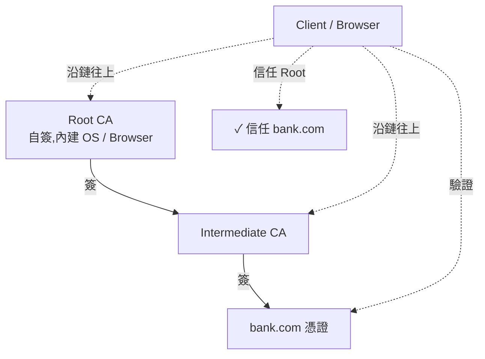

**TLS Handshake 的 PKI 部分**(見 [TLS / mTLS](./D3-networking.md#tls-mtls)):
1. Server 出示憑證 + 中間 CA 憑證
2. Client 用內建 truststore 中的 Root CA 公鑰**驗證信任鏈**
3. 檢查憑證**域名**、**有效期**、**未撤銷**(CRL / OCSP)
4. 全通過 → 用憑證內的公鑰做後續金鑰交換

**Java 工程師會遇到的 PKI 操作**:

| 操作 | 工具 / 命令 |
| --- | --- |
| 產私鑰 + CSR | `keytool -genkeypair` 或 `openssl req -new -newkey rsa:4096` |
| 看憑證內容 | `keytool -printcert -file cert.crt`、`openssl x509 -in cert.crt -text` |
| 匯入信任憑證到 JVM | `keytool -importcert -keystore $JAVA_HOME/lib/security/cacerts -alias my-ca -file my-ca.crt` |
| 看 truststore 內憑證列表 | `keytool -list -keystore cacerts` |
| Spring Boot 啟用 HTTPS | `server.ssl.key-store=...` + `server.ssl.key-store-password=...` |
| 自簽憑證(dev 用) | `mkcert localhost`(現代工具)、或 `keytool -genkeypair -storetype PKCS12` |

**KeyStore 格式**:

| 格式 | 副檔名 | 說明 |
| --- | --- | --- |
| **PKCS#12** | `.p12` / `.pfx` | **跨平台標準**,現代首選 |
| **JKS** | `.jks` | Java 專屬老格式,**Java 9+ 已被 PKCS#12 取代為預設** |
| **PEM** | `.pem` / `.crt` / `.key` | OpenSSL / Linux 慣用文字格式 |

**對應到 [Defense in Depth](#defense-in-depth)**:PKI 是「身份」與「保密」的第一層基礎設施——但**用得不好仍會出包**(過期、key 外洩、信任了不該信任的 CA)。

**反模式**:
- ❌ **忽略憑證驗證**(`SSLContext.init(null, trustAll, null)`)— Java 程式打外部 API 時這樣做等於關掉 PKI,完全失去保護
- ❌ Root CA 私鑰存在 Internet 可達主機 — Root CA 私鑰外洩 = **末日**
- ❌ **長壽憑證**(10 年期)— 一外洩就是長期災難,現代 best practice 是**短壽 + 自動輪替**(Let's Encrypt 90 天)

---

<a id="x509"></a>
### X.509 憑證 / CSR / CA 🟡

**X.509**:ITU-T 規範的**公鑰憑證標準**(現行 v3,1996),**PKI 的「憑證」就是 X.509 憑證**。TLS / 程式簽章 / S/MIME 都用 X.509。

**X.509 憑證內容**:

```
Certificate:
    Data:
        Version: 3 (0x2)
        Serial Number: ab:12:34:...                    ← 唯一序號(撤銷用)
        Issuer: CN=DigiCert TLS RSA SHA256, O=DigiCert  ← 簽發者(中間 CA)
        Validity
            Not Before: Jan  1 00:00:00 2026 GMT       ← 有效期起
            Not After : Apr  1 00:00:00 2027 GMT       ← 有效期止
        Subject: CN=bank.com, O=Bank Inc, C=US          ← 持有者
        Subject Public Key Info:                        ← 公鑰
            Algorithm: rsaEncryption (2048 bit)
            Modulus: ...
        X509v3 extensions:
            Subject Alternative Name:                   ← SAN(主流 CN 已退役)
                DNS: bank.com, DNS: www.bank.com
            Key Usage: Digital Signature, Key Encipherment
            Extended Key Usage: TLS Web Server Auth
            CRL Distribution Points: http://crl.digicert.com/...
            Authority Information Access: OCSP URI: http://ocsp.digicert.com
    Signature Algorithm: sha256WithRSAEncryption        ← CA 用什麼演算法簽
    Signature Value: 5e:af:...                          ← CA 的簽章
```

**SAN(Subject Alternative Name)**:現代瀏覽器**忽略 CN**,只看 SAN——**簽憑證一定要設 SAN**,否則新版瀏覽器拒絕信任。

**CSR(Certificate Signing Request)**:申請者把「**公鑰 + 身份資訊**」打包成 CSR 送給 CA,CA 驗證後簽出憑證。

```bash
# 產私鑰 + CSR
openssl req -new -newkey rsa:4096 -keyout bank.key -out bank.csr \
  -subj "/C=US/O=Bank Inc/CN=bank.com" \
  -addext "subjectAltName=DNS:bank.com,DNS:www.bank.com"

# CA 簽出憑證(實務上送 CA portal)
openssl x509 -req -in bank.csr -CA ca.crt -CAkey ca.key -out bank.crt -days 365
```

**憑證驗證類型**(DV / OV / EV):

| 類型 | 全名 | CA 驗什麼 | 用途 / 識別 |
| --- | --- | --- | --- |
| **DV** | Domain Validation | 只驗**域名擁有權**(DNS / HTTP challenge) | Let's Encrypt、一般 HTTPS |
| **OV** | Organization Validation | 驗組織資訊(電話 / 商業登記) | 企業官網 |
| **EV** | Extended Validation | 更嚴格組織驗證 | 銀行;**現代瀏覽器已不顯示綠色公司名**,實質作用降低 |

---

<a id="crl-ocsp"></a>
### CRL / OCSP(憑證撤銷)🟡

**為什麼需要撤銷**:憑證有效期可能 90 天 ~ 數年。期間若**私鑰外洩、員工離職、域名易主**——必須能在過期前**主動失效**。

**CRL**(Certificate Revocation List,**憑證撤銷清單**):**RFC 5280**——CA 維護一份「**已撤銷的憑證序號清單**」,定期(數小時 ~ 數天)發佈,Relying Party 下載比對。

```
CRL 內容簡化:
Version: 2
Issuer: CN=DigiCert TLS RSA SHA256
This Update: 2026-05-20
Next Update: 2026-05-21
Revoked Certificates:
    Serial: ab:12:34:...   Revocation Date: 2026-05-15   Reason: keyCompromise
    Serial: cd:56:78:...   Revocation Date: 2026-05-18   Reason: cessationOfOperation
Signature Algorithm: sha256WithRSAEncryption
Signature: ...
```

**CRL 的問題**:
- ❌ **檔案越來越大**(全球累積撤銷數百萬筆 → 數 MB 起跳)
- ❌ **延遲**(Next Update 可能 24 小時後)
- ❌ Browser **下載 CRL 慢**,影響使用者體驗
- ❌ 多數 Browser **失敗時靜默忽略**(fail-soft)→ 等於沒檢查

**OCSP**(Online Certificate Status Protocol,**線上憑證狀態協定**):**RFC 6960**——Relying Party 對 CA 的 OCSP responder **單筆查詢**「這張憑證(序號 XXX)還有效嗎?」,即時回答 `good` / `revoked` / `unknown`。

**OCSP 的問題**:
- ❌ **每次都打 CA** → CA 知道你訪問了哪些網站(**隱私問題**)
- ❌ CA OCSP 服務掛掉 → Browser 怎麼處理?(fail-soft 一樣等於沒檢查)
- ❌ 對 CA 的 OCSP 服務造成大量流量

**OCSP Stapling**(改良):**RFC 6066**——Server **預先**向 CA 查 OCSP 結果(含 CA 簽章),**TLS handshake 時 server 主動「貼上」OCSP 回應**,client 不需自己查 CA。
- ✅ 解決隱私問題(client 不必直接連 CA)
- ✅ 減少 CA 流量
- ✅ TLS handshake 一次搞定
- 現代 Web Server(Nginx、Apache、Caddy)都支援,**強烈建議啟用**

**現況與趨勢**(2026):
- **CRLite / Mozilla CRLite**:把整個 CRL 用 Bloom Filter / Cascade 壓縮成幾 MB,瀏覽器內建——**取代傳統 CRL 與 OCSP**
- **Short-lived Certificate**(短壽憑證,Let's Encrypt 90 天):**用「快過期」取代撤銷**——若 key 外洩,最多 90 天就自動失效
- **Apple Safari、Google Chrome 已逐步減少對 OCSP 的依賴**,改用 CRLite-like 機制
- **Server 端仍應**:啟用 OCSP Stapling、定期輪替憑證、有撤銷 procedure

**Java 工程師會遇到**:
- Spring Boot 預設**不檢查 OCSP / CRL**(效能考量)——需要時自行啟用:
```properties
java -Dcom.sun.security.enableCRLDP=true \
     -Dcom.sun.net.ssl.checkRevocation=true \
     -jar app.jar
```
- 對接金融 / 政府 API(尤其 mTLS)時可能**強制要求**檢查 CRL / OCSP
- mTLS 場景 client 憑證撤銷由 server 端負責檢查

---

<a id="lets-encrypt"></a>
### Let's Encrypt(免費憑證)🟢

**定義**:**ISRG**(Internet Security Research Group)2015 年推出的**免費、自動化、開放的 CA**——**徹底改變了 HTTPS 普及**(2015 前 HTTPS < 30%,現在 > 90%)。

**為什麼革命性**:

| | 傳統商業 CA(DigiCert / GlobalSign) | Let's Encrypt |
| --- | --- | --- |
| 價格 | $50 ~ $1000+ / 年 | **免費** |
| 申請流程 | 填表 → 上傳 CSR → 等驗證 → 收 email | **自動化**(數秒內) |
| 有效期 | 1 ~ 2 年 | **90 天**(逼著自動輪替,反而更安全) |
| 驗證類型 | DV / OV / EV | **僅 DV** |
| API | (通常無) | **ACME 協定**(RFC 8555),自動化標配 |

**ACME(Automated Certificate Management Environment)**:Let's Encrypt 推動的協定,**讓 client 透過 API 申請 / renew 憑證**。

**Domain Validation 兩種挑戰**:
- **HTTP-01**:Let's Encrypt 給你一個 token,你放到 `http://yourdomain.com/.well-known/acme-challenge/<token>`,LE 抓得到 = 你擁有這域名
- **DNS-01**:Let's Encrypt 給你一個 token,你建立 `_acme-challenge.yourdomain.com` 的 TXT record,LE 查 DNS 拿到 = 你擁有這域名(**支援 wildcard**)
- **TLS-ALPN-01**:在 TLS handshake 階段驗證(較少用)

**主流 Client 工具**:

| 工具 | 特色 |
| --- | --- |
| **Certbot** | 官方推薦,Python 寫,**最普及** |
| **acme.sh** | Bash 寫,**輕量**,IoT / 嵌入式環境常用 |
| **lego** | Go 寫,自動化 CI / K8s 友善 |
| **cert-manager** | **Kubernetes 內申請 / 輪替憑證**(K8s 必備) |
| **Caddy / Traefik** | Web Server / Reverse Proxy **內建自動 ACME**(部署即 HTTPS) |

**Certbot 範例**(VM 部署):
```bash
sudo certbot --nginx -d bank.example.com -d www.bank.example.com
# 自動產 key、申請憑證、設 Nginx、安排 cron 輪替
```

**Kubernetes + cert-manager**:
```yaml
apiVersion: cert-manager.io/v1
kind: ClusterIssuer
metadata: { name: letsencrypt-prod }
spec:
  acme:
    server: https://acme-v02.api.letsencrypt.org/directory
    email: ops@example.com
    privateKeySecretRef: { name: letsencrypt-prod }
    solvers:
      - http01: { ingress: { class: nginx } }

---
apiVersion: networking.k8s.io/v1
kind: Ingress
metadata:
  name: bank
  annotations:
    cert-manager.io/cluster-issuer: letsencrypt-prod
spec:
  tls:
    - hosts: [bank.example.com]
      secretName: bank-tls
  rules: [...]
```
**cert-manager 自動申請與輪替,工程師不需介入**。

**Java 應用整合**:
- 通常**不在 Spring Boot 內處理 ACME** — 由 Nginx / Traefik / cert-manager 在 reverse proxy / Ingress 層終止 TLS
- 若應用直接面對 internet 且需 TLS:`acme4j` library 可在 Java 內跑 ACME flow

**Rate Limit 注意**(避免被擋):
- Let's Encrypt 對單一域名有 rate limit(**每週 50 張 / 域名**等)
- 開發階段用 **Staging 環境**(`acme-staging-v02.api.letsencrypt.org`),無 rate limit 但憑證不被瀏覽器信任

**現況與生態**:
- 全球 **> 50%** TLS 憑證來自 Let's Encrypt(2024 統計)
- 啟發了競爭者:**ZeroSSL**(Sectigo)、**Google Trust Services**(Google 推自家免費 CA)、**Buypass Go SSL**
- **企業內部 PKI**:仍用自家 CA + ACME(Step CA、[HashiCorp Vault](./E1-deployment-cicd.md#vault) PKI、AWS Certificate Manager Private CA)

**反模式**:
- ❌ 手動每 90 天更新 — 一定會忘,**該自動化**
- ❌ 在 prod 用 staging 憑證 — 瀏覽器不信任
- ❌ 把私鑰 commit 到 git — 任何時候都不該,自動化工具會把私鑰留在 server local

---

## 安全原則(Security Principles)

<a id="defense-in-depth"></a>
### Defense in Depth(縱深防禦)🟡

**定義**:**多層防禦,每層都有把關**——任一層被突破,後面還有層。詞源來自軍事,不依賴單一防線。

**為什麼**:沒有任何一層防禦是完美的。WAF 可能漏設規則、JWT key 可能外洩、DB 可能被注入——**單層失效不應等於系統淪陷**。

**典型分層**:

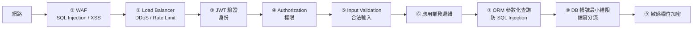

**規範對應**:
- ① WAF / 防火牆(基礎設施層)
- ② Rate Limiter(B6-resilience.md)
- ③ JWT Filter(本檔)
- ④ 動態權限策略(本檔 RBAC 段)
- ⑤ `@Valid` Validation(A1-code-quality.md)
- ⑥ Domain 業務規則
- ⑦ JPA / 參數化 SQL(B4-persistence.md)
- ⑧ DB 帳號分權限(read-only account / write account)
- ⑨ Field-level encryption(信用卡、身分證)

**反模式**:「**反正前面有 WAF 擋了**」就在後端不檢查 input — WAF 規則更新慢、可能漏設,後端必須自己驗證。**Trust no one, validate everywhere**.

---

<a id="least-privilege"></a>
### Least Privilege(最小權限原則)🟡

**定義**:**每個帳號 / 程式 / 服務,只擁有完成工作所需的最低權限,不多一分**。

**為什麼**:一旦該帳號被攻陷,**爆炸半徑(blast radius)受限**——不會因為一個 service 被入侵,整個雲帳號 / 整個 DB 跟著掛。

**實務應用**:

| 場景 | ❌ 反例 | ✅ 正解 |
| --- | --- | --- |
| **DB 連線** | App 用 `root` / `dba` 連 DB | App 專屬帳號,只給 `SELECT/INSERT/UPDATE` 該應用的 schema |
| **AWS IAM** | Lambda 給 `AdministratorAccess` | 只給「讀 S3 bucket X、寫 DynamoDB table Y」 |
| **Container** | `USER root` 跑 | `USER 1000` 非特權使用者 |
| **K8s Service Account** | 預設 `default` SA(可呼叫整個 API Server) | 限定 SA + RBAC 只給需要的資源 |
| **檔案系統** | `chmod 777` | `chmod 600`(只 owner 讀寫) |
| **第三方 API Key** | 一把 key 全功能 | 分功能 key,各自最小權限 |
| **內部系統** | 員工預設管理員 | 依職務分配最小權限,定期 review |

**規範對應**:
- 應用使用獨立 DB 帳號(不用 root)
- AD / Keycloak 中 group 僅給該角色實際需要的資源
- API Key 分功能、可撤銷、有效期短
- Pod 用非 root user 跑

**搭配**:**Just-in-Time Access**(臨時提升權限,限時自動回收)、**定期權限審計**、**離職立即撤權**。對**特權帳號**(root / DBA / admin)的最小權限,實務上由 [PAM](#pam) 工具集中落實。

---

<a id="pam"></a>
### PAM(Privileged Access Management / 特權存取管理)🟡

**定義**:專門**管理、保護、稽核「特權帳號」**的一整套機制與工具。特權帳號 = 擁有高權限、能改系統 / 看敏感資料的帳號:**root / Administrator / DBA / `sa` / 雲端 root / 網路設備 admin / 高權限 service account**。

**為什麼用**:特權帳號是攻擊者的**頭號目標**——一旦拿到,等於拿到全域控制權(blast radius 最大)。PAM 把這些高權限憑證**集中保管、限時發放、全程錄影稽核**,等於把 [Least Privilege](#least-privilege) 從「程式 / 服務」延伸落實到「**人**」的層面。

**PAM 六大核心能力**:

| 能力 | 做什麼 | 解決的問題 |
| --- | --- | --- |
| **憑證保管庫(Credential Vault)** | 特權密碼集中加密保管,使用者「借用」而非直接知道密碼 | 密碼共用、寫在便利貼 / 腳本裡 |
| **自動輪替(Password Rotation)** | 用完即換、定期輪替 | 密碼長年不變、離職員工還記得 |
| **JIT 提權(Just-in-Time Access)** | 平時 **zero standing privilege**,需要時限時提升、到期自動回收 | 帳號長期掛著管理員權限 |
| **Session 錄影 / 監控** | 特權連線全程錄影,可即時中斷可疑操作 | 出事後查不到「誰做了什麼」 |
| **跳板 / Bastion(Proxy)** | 透過 PAM proxy 連目標主機,admin 不直接碰目標 | 直連目標、繞過稽核 |
| **稽核 / 合規(Audit)** | 完整記錄:誰、何時、用哪個特權帳號、做了什麼 | 法規 / 稽核要求可追溯 |

**PAM vs 相關概念(常混淆)**:

| 概念 | 範圍 | 與 PAM 關係 |
| --- | --- | --- |
| **IAM**(Identity & Access Management) | 管**所有人**的身份與存取 | PAM 是 IAM 中**專管特權帳號**的子集 |
| **PIM**(Privileged Identity Management) | 微軟 Entra 用語 | 約等於 PAM 的 **JIT 提權**部分 |
| **[Least Privilege](#least-privilege)** | 安全**原則** | PAM 是落實此原則(對特權帳號)的**工具** |
| **[HashiCorp Vault](./E1-deployment-cicd.md#vault)** | secrets 管理,偏**機器 / 應用**的動態機密 | PAM 偏**人 / 互動式 session** 的特權帳號;兩者重疊但側重不同 |

**主要工具 / 廠商**:**CyberArk**、**Delinea**(見下)、**BeyondTrust**、微軟 **Entra PIM**、HashiCorp Boundary。

**Delinea**:PAM 市場領導者之一,由 **Thycotic 與 Centrify 於 2021 年合併**後改名而來。旗艦產品 **Secret Server**(特權密碼保管庫,PAM 的核心)、**Privilege Manager**(端點最小權限 / 移除本機 admin)、**DevOps Secrets Vault**(給 CI/CD 與應用用的機密管理)。與 **CyberArk** 並列為企業 PAM 的兩大主流選擇。

**反模式**:
- ❌ 把 root / `sa` 密碼寫進部署腳本、設定檔、或團隊共用的密碼本
- ❌ 所有人共用同一組 admin 帳號 — 出事查不到責任歸屬
- ❌ 管理員權限「一給就是永久」,沒有 JIT、沒有定期 review

---

← [返回索引(README.md)](./README.md)
