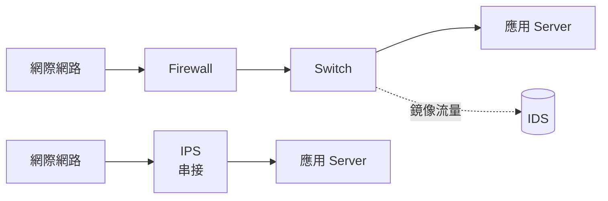

# D2 - Web 攻擊防禦(CORS / CSRF / XSS)

← [返回索引(README.md)](./README.md)

---

> 本章聚焦「**瀏覽器層面的 Web 客戶端攻擊與防禦**」。
> 身份驗證、授權、JWT、OAuth、企業身份系統(SSO/SAML/LDAP)等,請見 [D1 Security / JWT / OAuth](./D1-security-jwt.md)。

## 目錄

- [CORS 🟢](#cors)
- [CSRF 🟡](#csrf)
- [XSS 🟡](#xss)

### 偵測與防禦
- [IDS / IPS(入侵偵測與防禦)🟡](#ids)

---

<a id="cors"></a>
### CORS(Cross-Origin Resource Sharing)🟢

**定義**:瀏覽器的安全機制——預設**禁止**網頁向不同 origin 的 API 發請求。Server 需在 response header 加 `Access-Control-Allow-Origin` 等告知瀏覽器「允許這個來源」。

**Spring 設定**:
```java
@Bean
public CorsConfigurationSource corsConfig() {
    var c = new CorsConfiguration();
    c.setAllowedOrigins(List.of("https://app.example.com"));
    c.setAllowedMethods(List.of("GET", "POST", "PUT", "DELETE"));
    c.setAllowedHeaders(List.of("*"));
    c.setAllowCredentials(true);
    var src = new UrlBasedCorsConfigurationSource();
    src.registerCorsConfiguration("/**", c);
    return src;
}
```

**注意**:CORS 是**瀏覽器**強制的,Server-to-Server、Postman、curl 都不受限。

---

<a id="csrf"></a>
### CSRF(Cross-Site Request Forgery)🟡

**定義**:跨站請求偽造——惡意網站誘導你的瀏覽器帶著你的 cookie 對其他網站發請求。

**Stateless + JWT 為什麼不需要 CSRF Token**:
- CSRF 利用的是「瀏覽器自動帶 cookie」
- JWT 放在 `Authorization` header,**不會自動帶**(必須 JS 主動加)
- 所以 Stateless API 通常 `csrf().disable()`

**Spring 設定**:
```java
http.csrf(AbstractHttpConfigurer::disable);
```

---

<a id="xss"></a>
### XSS(Cross-Site Scripting)🟡

**定義**:攻擊者將惡意 JavaScript 注入網頁,於**受害者瀏覽器**執行——可以偷 cookie、偽造畫面、代發請求(等同冒用使用者身份)。

**三大類**:

| 類型 | 注入方式 | 範例 |
| --- | --- | --- |
| **Stored XSS** | 惡意 script 存進 DB,所有看到該頁的人都會中招 | 留言板、暱稱、商品評論 |
| **Reflected XSS** | script 寫在 URL query,Server 原樣回傳到頁面 | `?keyword=<script>...</script>` 的搜尋頁 |
| **DOM-based XSS** | 完全發生在前端,JS 把 `location.hash` 之類的東西塞進 `innerHTML` | 不經 Server 也能觸發 |

**為什麼後端工程師要懂(就算 XSS 在前端執行)**:
- **不要把使用者輸入原樣吐回 Response**(API 回 JSON 時用 `@JsonValue` 或框架預設 escape;回 HTML 時用 Thymeleaf / Mustache 的自動 escape)
- 入庫的內容該不該 sanitize?——**通常存原文、輸出時 escape**(`OWASP Java Encoder`);需要保留富文本時用白名單過濾(`Jsoup.clean(input, Safelist.basic())`)
- 設定 **HTTP Security Headers**:
    - `Content-Security-Policy`:限制可載入的 script 來源(最有效的縱深防禦)
    - `X-Content-Type-Options: nosniff`
    - Cookie 設 `HttpOnly`(讓 JS 讀不到 session cookie,即使中了 XSS 也偷不走)

**Spring Boot 設定範例**:
```java
@Bean
SecurityFilterChain filter(HttpSecurity http) throws Exception {
    return http
        .headers(h -> h
            .contentSecurityPolicy(csp -> csp.policyDirectives(
                "default-src 'self'; script-src 'self' https://cdn.example.com"))
            .contentTypeOptions(Customizer.withDefaults())
        )
        .build();
}
```

**XSS vs CSRF 一句話對照**:

| | XSS | CSRF |
| --- | --- | --- |
| 攻擊位置 | **在受害者瀏覽器執行任意 JS** | **借用已登入身份發跨站請求** |
| 偷得到 cookie? | 可以(若沒設 `HttpOnly`) | 不行,只是「順便帶上」 |
| Stateless + JWT 還會中? | **會**——JWT 若放 `localStorage`,XSS 一樣能讀走 | 通常不會(JWT 在 header,不會自動帶) |
| 主要防禦 | **輸出 escape** + **CSP** + `HttpOnly` cookie | CSRF Token / SameSite Cookie |

**反例**:
```java
// 危險:把 query 原樣塞進 HTML response
@GetMapping(value = "/search", produces = MediaType.TEXT_HTML_VALUE)
public String search(@RequestParam String q) {
    return "<h1>搜尋:" + q + "</h1>";  // ?q=<script>...</script> 直接中招
}
```
正確做法是用模板引擎(Thymeleaf 等)讓框架自動 escape,或手動 `HtmlUtils.htmlEscape(q)`。

---

## 偵測與防禦

<a id="ids"></a>
### IDS / IPS(入侵偵測與防禦)🟡

**IDS**(Intrusion Detection System,入侵偵測系統):**監聽**網路流量或主機行為,**發現**異常 / 攻擊就**告警**,但**不主動阻擋**。

**IPS**(Intrusion Prevention System,入侵防禦系統):**進階版**——除偵測外**主動阻斷**惡意流量。可視為 **「IDS + 自動 block」**。

**兩者差別速覽**:

| | IDS | IPS |
| --- | --- | --- |
| 部署位置 | **旁路**(鏡像流量,不在主路徑) | **串接**(in-line,所有流量穿過) |
| 行為 | 偵測 → 告警 | 偵測 → **阻斷** |
| 對流量影響 | 不會中斷 | 可能誤殺(false positive 直接 block) |
| 故障風險 | IDS 掛掉只是少了監控 | IPS 掛掉**整條線路斷**(需 fail-open / bypass) |
| 典型代表 | **Snort**(IDS 模式)、Zeek / Bro、Suricata | **Snort**(IPS 模式)、Suricata、Cisco Firepower |

**部署視覺化**:



**IDS 兩大偵測引擎類型**:

| 類型 | 中文 | 怎麼判斷異常 | 代表 |
| --- | --- | --- | --- |
| **Signature-based** | 特徵碼比對 | 比對已知攻擊 pattern(類似防毒軟體) | Snort 規則庫、Suricata |
| **Anomaly-based** | 異常偵測 | 學基準行為,偏離就告警(機器學習 / 統計) | Zeek、商業 UEBA |

**Signature-based** 對**已知**攻擊精準,**Anomaly-based** 能抓 0-day 但 false positive 多——實務常**兩者並用**。

**HIDS vs NIDS**(部署目標):

| 縮寫 | 全名 | 監控對象 | 代表 |
| --- | --- | --- | --- |
| **NIDS** | Network IDS | **網路流量** | Snort、Suricata、Zeek |
| **HIDS** | Host IDS | **單台主機**(syslog、檔案完整性、process) | OSSEC、Wazuh、Tripwire |

**Java 工程師會遇到的場景**:
- 客戶 / 部署環境有 IDS/IPS,**特定 request pattern 被誤判攔截**——例如 SQL Injection-like 字串(實際是合法業務輸入)被擋,需與資安團隊調規則或建白名單
- 上 prod 前 **DAST 掃描**(見 [E1 Code Quality / Security Scan](./E1-deployment-cicd.md#scan-tools))與 IDS 規則對照
- 出現異常告警時要**配合資安分析**:提供 application log、相對應的 trace ID、業務脈絡

**對比 WAF**:
- **WAF**(Web Application Firewall)— **L7 應用層**,專注 HTTP 攻擊(SQL Injection、XSS、命令注入)
- **IDS/IPS** — **L3-L7 通用**,涵蓋 port scan、DDoS pattern、惡意軟體 C2 通訊、橫向移動
- **三者共存**:**Firewall + WAF + IDS/IPS** 是縱深防禦標配(對應 [Defense in Depth](./D1-security-jwt.md#defense-in-depth))

**SIEM 整合**:IDS 告警通常送到 **SIEM**(Security Information and Event Management,如 Splunk、Elastic Security、Azure Sentinel)集中分析,而非直接 PagerDuty——SOC(Security Operations Center)團隊負責處理。

**反模式**:
- ❌ 「**有 WAF 就夠了**」—— WAF 只看 HTTP,擋不了 SSH 暴力、橫向移動
- ❌ IPS 設成 **fail-close**(掛了就完全斷流) — 該設 **fail-open**,以免 IPS 故障導致整條線路癱瘓
- ❌ 完全靠 anomaly-based,沒人定期 review 規則 — false positive 淹沒真正攻擊

---

← [返回索引(README.md)](./README.md)
