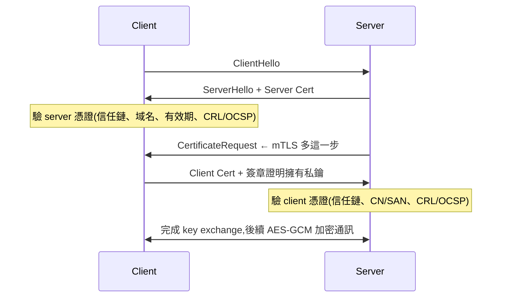
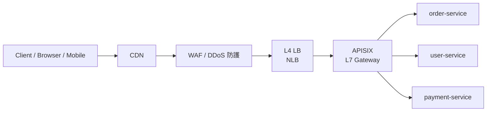

# D3 - 網路術語(Networking)

← [返回索引(README.md)](./README.md)

---

## 為什麼有這一篇?

Java 工程師雖然不直接配置網路設備,但**部署、跨機房連線、API 設計、安全討論、企業合作對接**時都會聽到這些詞。本篇收錄常遇到的網路名詞,以便日常查詢與會議溝通。

> 此章節為**逐步擴充**設計,新詞遇到再加入。

---

## 目錄

### 規範與標準
- [RFC(Request for Comments)🟡](#rfc)

### 網路基礎
- [OSI 七層模型 🟢](#osi-7-layer)

### 傳輸層
- [TCP 🟢](#tcp)
- [UDP 🟡](#udp)

### 應用層協定
- [HTTP / HTTPS 🟢](#http-https)
- [HTTP Status Codes 🟢](#http-status)
- [RPC(Remote Procedure Call)🟡](#rpc)
- [RESTful API 🟡](#restful)
  - [HATEOAS 🔴](#hateoas)
- [WebSocket 🟡](#websocket)
- [TLS / mTLS 🟡](#tls-mtls)

### 名稱解析與內容傳遞
- [DNS 🟢](#dns)
- [CDN 🟢](#cdn)

### 負載平衡
- [Load Balancer L4 vs L7 🟡](#l4-vs-l7)

### API Gateway
- [APISIX(雲原生 API Gateway)🟡](#apisix)
- [Kong(API Gateway)🟡](#kong)

### 企業網路
- [VPN 🟡](#vpn)
- [MPLS 🔴](#mpls)

---

## 規範與標準

<a id="rfc"></a>
### RFC(Request for Comments)🟡

**定義**:**IETF**(Internet Engineering Task Force)發佈的**網路與相關協定的標準文件**——「**Request for Comments**」字面意思是「**徵求意見書**」(1969 年 Steve Crocker 為 ARPANET 提出時的命名),但實際上 RFC **就是網際網路的事實標準**。每份 RFC 有唯一編號(`RFC 7519`、`RFC 6749`),**一旦發佈,編號永不變更、永不撤回**——後續若需修訂則發新 RFC。

**為什麼工程師要懂 RFC**:
- 多數**核心 API / Token / 協定的真實規範定義在 RFC**——OAuth、JWT、OIDC、HTTP、TLS、JSON、URI...
- 框架文件常引用 RFC(`RFC 7519` 是 JWT 唯一權威來源,Auth0 / Spring Security 文件都是「**解釋**」RFC)
- **規範不一致 / 框架有 bug 時**,**權威仲裁是 RFC,不是 Stack Overflow**
- 與外部團隊 / 客戶 / 標準對接時,引用 RFC 編號比引用個別實作更有公信力

**RFC 的關鍵狀態**(Status):

| 狀態 | 中文 | 說明 |
| --- | --- | --- |
| **Proposed Standard** | 提議標準 | 大部分活躍 RFC 的狀態(`RFC 7519` JWT、`RFC 6749` OAuth 都是) |
| **Internet Standard** | 網際標準 | 最高等級,已廣泛部署、互通性證明(`STD` 編號,如 STD 80 = HTML);多數 RFC **不會升到這級** |
| **Best Current Practice** | 當前最佳實踐 | `BCP` 編號(BCP 195 = TLS 部署建議) |
| **Experimental** | 實驗性 | 草案、未確定 |
| **Informational** | 資訊性 | 不是規範,僅供參考 |
| **Historic** | 歷史 | 已被新 RFC 取代 |

**「Updates」vs「Obsoletes」關係**:RFC **永不修改**,而是發新 RFC:
- **Updates**:小幅補充 / 微調(原 RFC 仍有效)
- **Obsoletes**:**完全取代**(原 RFC 變 Historic)
- 例:`RFC 7519`(JWT)被多份 RFC `Updates`,但仍是 JWT 主場規範;`RFC 2616`(HTTP/1.1)被 `RFC 7230~7235` Obsoletes

**Java / 後端工程師必知的 RFC 清單**:

| RFC | 主題 | 一句話用途 |
| --- | --- | --- |
| **RFC 791** | IPv4 | IP 協定 |
| **RFC 793** | TCP | TCP 協定 |
| **RFC 3986** | URI | URI 通用語法 |
| **RFC 4648** | Base64 / Base64Url | JWT / JOSE 用的 base64url |
| **RFC 6749** | **OAuth 2.0** | OAuth 授權框架 |
| **RFC 6750** | OAuth Bearer Token | `Authorization: Bearer ...` 的規範 |
| **RFC 7515** | **JWS**(JSON Web Signature) | 詳見 [JWS](./D1-security-jwt.md#jws) |
| **RFC 7516** | **JWE**(JSON Web Encryption) | 詳見 [JWE](./D1-security-jwt.md#jwe) |
| **RFC 7517** | JWK(JSON Web Key) | 公私鑰 JSON 表達(JWKS) |
| **RFC 7518** | JWA(JSON Web Algorithms) | JOSE 演算法清單 |
| **RFC 7519** | **JWT**(JSON Web Token) | 詳見 [JWT](./D1-security-jwt.md#jwt) |
| **RFC 7636** | **PKCE** | 詳見 [PKCE](./D1-security-jwt.md#pkce) |
| **RFC 8555** | ACME | 詳見 [Let's Encrypt](./D1-security-jwt.md#lets-encrypt) |
| **RFC 7807** | Problem Details for HTTP APIs | 標準化錯誤回應(`application/problem+json`) |
| **RFC 5246 / 8446** | **TLS 1.2 / 1.3** | 詳見 [TLS / mTLS](#tls-mtls) |
| **RFC 5280** | X.509 / CRL | 憑證與撤銷標準 |
| **RFC 6960** | OCSP | 線上憑證狀態查詢 |
| **RFC 8259** | JSON | JSON 語法權威 |
| **RFC 7231 / 9110** | HTTP Semantics | HTTP 動詞、狀態碼語意 |
| **RFC 9112** | HTTP/1.1 | HTTP/1.1(2022 最新整合版) |
| **RFC 9113** | HTTP/2 | HTTP/2 |
| **RFC 9114** | HTTP/3 | HTTP/3 |
| **RFC 7807 / 9457** | Problem Details | API 錯誤標準格式 |

**怎麼查 RFC**:
- **官方索引**:[`https://www.rfc-editor.org/`](https://www.rfc-editor.org/)
- **datatracker.ietf.org** — 草案、討論、變更歷史
- **快速搜尋**:Google 直接打「RFC 7519」即可
- **規範閱讀技巧**:先看 **Abstract**(摘要)→ 看 **Section 1 Introduction** → 看自己需要的部分(`Section 4` 通常是核心定義)

**RFC 的「**MUST / SHOULD / MAY**」**(`RFC 2119`):
- **MUST / MUST NOT**:**強制**,違反不合規
- **SHOULD / SHOULD NOT**:**建議**,有充分理由可違反
- **MAY**:**可選**

讀 RFC 必須**精準分辨**這幾個字——「**MUST**」就是「必須」,「**SHOULD**」就是「建議」,新人常把 SHOULD 當 MUST,導致過度嚴格實作。

**Java 工程師會遇到 RFC 的場景**:
- **與第三方串接**對方說「按 RFC 7519 實作」→ 不要靠猜,直接查那份 RFC
- **框架行為與預期不一致**:把 RFC 對應段落貼出來討論
- **設計 API 錯誤格式**:套 RFC 7807(Problem Details)是常見最佳實踐
- **規格 review**:OpenAPI 規格可引用 RFC 編號標準化欄位語意

**對應到 [A4 開發方法論](./A4-methodology.md)**:RFC 是「**Spec-First**」的極致——**先有規範,實作跟著規範**。多數 IETF 標準是這樣演進的(草案 → 提議 → 廣泛實作 → 互通驗證 → 正式)。

---

## 網路基礎

<a id="osi-7-layer"></a>
### OSI 七層模型 🟢

**定義**:ISO 在 1984 年提出的 **Open Systems Interconnection** 概念模型,把網路通訊由下而上拆成 **7 層**,每層只負責自己的工作,用標準介面與上下層溝通——這套抽象讓你可以「**只懂某層、不懂全部**」就能討論網路問題。

**為什麼用**:
- 工程師日常不會真的「實作」OSI 七層(現實是 TCP/IP 四層),但這是**討論、除錯、選工具時的共通語言**
- 「L4 / L7 Load Balancer」「L3 路由」「L2 交換器」這些詞都是 OSI 層級
- 問題定位:「在哪一層?」(實體斷線?DNS 問題?TLS 設定錯?)

**七層由下而上**:

| 層 | 名稱 | 代表協定 / 設備 | 你日常會碰到的點 |
|---|---|---|---|
| **L7** | Application(應用層) | HTTP / HTTPS / DNS / SMTP / FTP | API 設計、瀏覽器、Postman |
| **L6** | Presentation(表現層) | TLS / SSL / 編碼(UTF-8 / Base64) | TLS 憑證、字元編碼 |
| **L5** | Session(會議層) | NetBIOS / RPC | 較少直接接觸 |
| **L4** | Transport(傳輸層) | TCP / UDP | port 號、TCP 三次握手 |
| **L3** | Network(網路層) | IP / ICMP / 路由器 | IP 地址、路由表、NAT |
| **L2** | Data Link(資料鏈結層) | Ethernet / MAC / 交換器 | MAC 位址、ARP |
| **L1** | Physical(實體層) | 網路線、Wi-Fi、光纖 | 線插好沒?訊號夠不夠? |

**OSI 7 層 vs TCP/IP 4 層**:

| OSI | TCP/IP 4 層 |
|---|---|
| L1 + L2 | Network Access |
| L3 | Internet |
| L4 | Transport |
| L5 + L6 + L7 | Application |

實際工程上 TCP/IP 4 層更常用,但對話中的 **「L4」「L7」仍是 OSI 編號**。

**常用情境**:
- 「這台 ALB 是 **L7** Load Balancer」→ Application 層,看 HTTP 路徑 / header 路由
- 「這台 NLB 是 **L4** Load Balancer」→ Transport 層,只看 TCP/UDP 連線、不解 HTTP
- 「線都接好了還是 ping 不到」→ 從 L1 一路往上 debug

---

## 傳輸層

<a id="tcp"></a>
### TCP(Transmission Control Protocol)🟢

**定義**:**可靠**、**有序**、**連線導向**的傳輸層協定。三向交握(SYN / SYN-ACK / ACK)建立連線,有 ACK 確認、流量控制、壅塞控制。

**特性**:
- ✅ 保證資料送達(失敗會 retransmit)
- ✅ 保證順序(封包順序與發送一致)
- ✅ 流量控制(避免接收方被打爆)
- ❌ 有 overhead,延遲較高

**Java 工程師會遇到**:
- HTTP / HTTPS 底層走 TCP
- JDBC、JMS、gRPC 預設走 TCP
- Socket 程式設計(`java.net.Socket`)
- 網路 timeout 設定(connect timeout / read timeout)都跟 TCP 相關

---

<a id="udp"></a>
### UDP(User Datagram Protocol)🟡

**定義**:**不可靠**、**無連線**、**無順序保證**的傳輸層協定。封包丟了不重送、順序錯了不調整。

**特性**:
- ❌ 不保證送達
- ❌ 不保證順序
- ✅ 無建連 overhead,**延遲極低**
- ✅ 封包小

**何時用 UDP**:
- DNS 查詢
- VoIP / 視訊會議(掉一些封包寧願跳格不要卡)
- 線上遊戲(即時性 > 完整性)
- DHCP、SNMP、NTP
- HTTP/3(QUIC)— 把 reliability 移到應用層,但底層走 UDP

**Java 工程師會遇到**:`DatagramSocket` 用於遊戲伺服器、Metrics 收集(StatsD over UDP)、log 收集(syslog over UDP)。

---

## 應用層協定

<a id="http-https"></a>
### HTTP / HTTPS 🟢

**HTTP**(HyperText Transfer Protocol):應用層**請求 / 回應**協定,Web 與 REST API 的事實標準。

**版本演進**:

| 版本 | 重點 | 仍在用? |
| --- | --- | --- |
| HTTP/1.0 | 一連線一請求 | 幾乎已淘汰 |
| **HTTP/1.1** | 持久連線、Pipelining、Host header | **大量仍在用** |
| **HTTP/2** | 多工(multiplexing)、Header 壓縮、Server Push、Binary frame | 主流 |
| **HTTP/3**(QUIC) | 走 UDP、解決 HTTP/2 head-of-line blocking、加密內建 | 漸普及 |

**HTTPS** = HTTP over **TLS** —— 加密 + 身份驗證 + 完整性。現代網路**幾乎強制 HTTPS**(Let's Encrypt 普及、瀏覽器要求、Google 排名加分)。

**Java 工程師會遇到**:
- Spring MVC / WebFlux / JAX-RS 都基於 HTTP
- `RestTemplate` / `WebClient` / `RestClient` 是 HTTP client
- gRPC 走 HTTP/2,效能來自此
- HTTP/2 / HTTP/3 啟用通常設定在 reverse proxy(Nginx / Cloudflare)而非 Spring Boot

---

<a id="http-status"></a>
### HTTP Status Codes 🟢

**定義**:HTTP 規範定義的狀態碼,**3 位數**,Server 在 response 裡帶上,告訴 Client 結果。第一位數字代表類別:**1xx** 資訊、**2xx** 成功、**3xx** 重導向、**4xx** Client 錯、**5xx** Server 錯。

**為什麼用**:
- **API 設計**的核心約定——前端可以用狀態碼決定下一步(401 → 跳登入頁、429 → 退避重試)
- 監控 / 告警的依據(`5xx 比例 > 1%` 觸發 alert)
- 與 HTTP cache、CDN、Proxy 的行為都綁定狀態碼

**常用狀態碼速查**:

| 碼 | 名稱 | 典型用途 |
|---|---|---|
| **2xx Success** | | |
| 200 | OK | 一般成功 |
| 201 | Created | POST 建立資源成功(`Location` header 指向新資源)|
| 204 | No Content | 成功但無 body(典型:DELETE 成功)|
| **3xx Redirect** | | |
| 301 | Moved Permanently | URL 永久遷移(SEO 重要)|
| 302 | Found | 暫時重導 |
| 304 | Not Modified | 資源未變(配合 `If-Modified-Since` / ETag)|
| **4xx Client Error** | | |
| 400 | Bad Request | request 格式錯(JSON 解不出、缺 query)|
| **401** | **Unauthorized** | **未驗證身份**(沒帶 token / token 過期)|
| **403** | **Forbidden** | **驗證了但沒權限**(身份對、角色不對)|
| 404 | Not Found | 資源不存在 |
| 409 | Conflict | 狀態衝突(版本不對、唯一鍵重複)|
| 422 | Unprocessable Entity | 格式對但語意錯(Email 格式錯、密碼太弱)|
| 429 | Too Many Requests | 觸發 Rate Limit(配合 `Retry-After` header)|
| **5xx Server Error** | | |
| 500 | Internal Server Error | 後端 unhandled exception |
| 502 | Bad Gateway | 反代/閘道收不到上游回應 |
| 503 | Service Unavailable | 服務暫時不可用(維護、過載)|
| 504 | Gateway Timeout | 上游處理超時 |

**最容易混淆的 401 vs 403**:
- **401** = 「**我不知道你是誰**」(沒帶 credential / token 失效)
- **403** = 「**我知道你是誰,但你沒權限**」(角色 / Role 不對)
- 常見實作錯誤:沒帶 token → 應該回 **401** 而不是 403

**400 vs 422 的選擇**:
- **400** = request 結構錯(JSON parse 失敗、缺欄位)
- **422** = 結構正確但語意錯(欄位值不合驗證規則)
- 但**不是所有框架都用 422**——Spring 預設驗證失敗回 400

---

<a id="rpc"></a>
### RPC(Remote Procedure Call)🟡

**定義**:**遠端程序呼叫**——「呼叫遠端機器上的程序,就像呼叫本地函式一樣」。分散式系統最早的設計範式之一(1970s),典型如 ONC RPC、CORBA、Java RMI;現代 RPC 以 **gRPC** 為主流。

**為什麼用**:
- **語意直觀**:呼叫 `getUser(id)` 比 `GET /users/:id` 更接近原本程式設計的「函式呼叫」思維
- **強型別 schema**(IDL,Interface Definition Language):接口契約明確,語言中立
- **效能**:常用二進位協定(Protocol Buffers、Thrift),比 JSON 小、快
- **適合微服務內部通訊**(已知對方是誰、不暴露給瀏覽器)

**主流 RPC 框架**:

| 框架 | 出品 | 協定 | 適用 |
|---|---|---|---|
| **gRPC** | Google | HTTP/2 + Protocol Buffers | 現代微服務、跨語言、streaming |
| **Apache Thrift** | Facebook → Apache | TCP + Thrift binary | Facebook / Twitter 老系統 |
| **Apache Dubbo** | Alibaba | TCP + 自家序列化 | 中國微服務生態 |
| **Java RMI** | Java 內建 | RMI Wire Protocol | 純 Java 老系統 |
| **JSON-RPC** | — | HTTP + JSON | 輕量 RPC、瀏覽器友善 |

**範例(gRPC)**:用 `.proto` 定義介面:
```protobuf
// user.proto
service UserService {
    rpc GetUser(GetUserRequest) returns (User);
    rpc ListUsers(ListRequest) returns (stream User);   // server streaming
}

message GetUserRequest { int64 id = 1; }
message User { int64 id = 1; string name = 2; string email = 3; }
```

```java
// Server 端實作
@GrpcService
public class UserServiceImpl extends UserServiceGrpc.UserServiceImplBase {
    @Override
    public void getUser(GetUserRequest req, StreamObserver<User> obs) {
        User u = User.newBuilder().setId(req.getId()).setName("Alice").build();
        obs.onNext(u);
        obs.onCompleted();
    }
}

// Client 端呼叫
var stub = UserServiceGrpc.newBlockingStub(channel);
User u = stub.getUser(GetUserRequest.newBuilder().setId(123).build());
```

**RPC vs REST vs gRPC vs GraphQL 對照**:

| 維度 | RPC(通用) | REST | gRPC | GraphQL |
|---|---|---|---|---|
| 範式 | **行為導向**(呼叫函式) | **資源導向** | RPC(細分) | **查詢導向** |
| 協定 | 各家不同 | HTTP/1.1 | HTTP/2 | HTTP(常用 POST) |
| 資料格式 | 二進位 / JSON | JSON / XML | **Protocol Buffers** | JSON |
| 介面契約 | IDL / WSDL / `.proto` | OpenAPI(可選) | `.proto`(強制) | GraphQL Schema(強制) |
| Streaming | 視框架 | 困難 | ✅ Bi-directional | ⚠ Subscription |
| Browser 直接呼叫 | ⚠ | ✅ | ❌(需 grpc-web 代理) | ✅ |
| 效能(訊息大小 / 序列化) | 高 | 中 | **最高** | 中 |
| 適用 | 內部服務、微服務 | Web API(對外) | 內部微服務、跨語言 | 前端要靈活查詢 |
| 學習曲線 | 中 | 平 | 中(Protobuf 需學) | 中 |

**選型決策**:
- **對外 API、瀏覽器呼叫** → REST(或 GraphQL)
- **內部微服務、效能敏感** → gRPC
- **前端要靈活組合資料、欄位多變** → GraphQL
- **歷史包袱(已用 Dubbo / RMI)** → 維持
- **行為導向 endpoint 偶爾穿插在 REST 中** → 合理(REST-ish)

**REST vs RPC 的歷史脈絡**:Roy Fielding 在 2000 年發表 REST 的部分動機,正是**反對當時 RPC(SOAP / CORBA)的複雜性**,主張回歸 HTTP 原始語意。詳見 [RESTful API](#restful)。

---

<a id="restful"></a>
### RESTful API 🟡

**定義**:Roy Fielding 在 2000 年博士論文提出的 **架構風格**(不是協定、不是規範)——**REST**(Representational State Transfer)指「透過交換**資源的表達形式**(JSON / XML)來轉移系統狀態」。實作在 HTTP 上即俗稱的 RESTful API。

**為什麼用**:
- **HTTP 動詞 + 資源 URL** 的設計直觀,容易跨團隊、跨語言溝通
- 沒有額外協定堆疊(對比 SOAP / gRPC)
- 與 HTTP 生態(快取、CDN、Proxy、Status Code)天然整合

**REST 六大約束**(Fielding 原文):

| # | 約束 | 意思 |
|---|---|---|
| 1 | Client-Server | 前後分離 |
| 2 | **Stateless** | Server **不**保留 client 狀態(每個 request 自帶完整身份)|
| 3 | Cacheable | response 必須能標示「可不可被快取」|
| 4 | Uniform Interface | **資源導向**設計、URL 是 nouns、HTTP verb 表動作 |
| 5 | Layered System | client 不需知道後面是 server / cache / load balancer |
| 6 | Code on Demand(選用)| server 可傳送可執行程式碼給 client |

**HTTP 動詞對應**:

| 動詞 | 用途 | 冪等? | 範例 |
|---|---|:---:|---|
| GET | 讀取 | ✅ | `GET /users/123` |
| POST | 建立 | ❌ | `POST /users` |
| PUT | **整體**更新 | ✅ | `PUT /users/123`(送完整資源)|
| PATCH | **部分**更新 | ❌(規範)| `PATCH /users/123`(只送變更欄位)|
| DELETE | 刪除 | ✅ | `DELETE /users/123` |

**URL 設計慣例**:
- 用**名詞**(`/users` 而非 `/getUsers`)
- 用**複數**(`/users/123` 而非 `/user/123`)
- 用**層級表示關係**(`/users/123/orders/456`)
- **避免動詞**(動詞讓 HTTP verb 表達)

**Richardson Maturity Model**(REST 成熟度模型,Martin Fowler 推廣):

| Level | 名稱 | 特徵 | 例子 |
|:---:|---|---|---|
| **0** | The Swamp of POX | 一個 URL、用 POST 全包(像 RPC over HTTP)| `POST /api` body 寫 `{"action":"getUser","id":123}` |
| **1** | Resources | 多個 URL,但動詞還是亂用 | `POST /getUser` / `POST /createUser` |
| **2** | HTTP Verbs | 正確用 HTTP 動詞 + 狀態碼 | `GET /users/123` / `POST /users` / `DELETE /users/123` |
| **3** | HATEOAS | response 帶 hyperlinks 引導 client 下一步 | `{"id":123, "_links":{ "orders":"/users/123/orders" }}` |

**業界實情**:
- 多數「RESTful API」其實只到 **Level 2**(基本 HTTP 動詞 + URL 設計),L3 HATEOAS 罕見
- 「**REST-ish**」一詞代表「不嚴格按 Fielding 原文,但精神到位」
- 真要嚴格 RESTful,得不償失;**滿足 L2 + 一致命名 + 合理狀態碼** 已是良好設計

<a id="hateoas"></a>
#### HATEOAS(Hypermedia As The Engine Of Application State,超媒體作為應用狀態引擎)🔴

**定義**:Richardson L3 的核心——response 不只回資料,還回**當前狀態下「下一步能做什麼」的超連結**。client 不硬編 URL,而是**跟著 server 回傳的連結走**(像瀏覽器跟著網頁的 `<a>` 連結),URL 結構與狀態轉移由 server 主導。

**為什麼(理論上)用**:
- **解耦 client / server**:URL 改版時 client 不必同步改,路徑都從 response 連結拿
- **可發現性**:client 不必事先讀完整份 API 文件,順著連結就能探索可用操作
- **狀態驅動**:依資源**當前狀態**動態決定可用動作(訂單 `PAID` 才出現 `cancel` 連結)

**範例**(常見格式 HAL,以 `_links` 表達):

```json
{
  "id": 123,
  "status": "PAID",
  "_links": {
    "self":   { "href": "/orders/123" },
    "cancel": { "href": "/orders/123/cancel" },
    "items":  { "href": "/orders/123/items" }
  }
}
```

> 狀態若是 `SHIPPED`,server 就不回 `cancel` 連結 → client 自然知道不能取消。

**反例 / 為什麼罕見**:
- client 端**硬編 URL**(直接打 `POST /orders/123/cancel`)、完全不看 `_links` → 退回 L2,HATEOAS 形同虛設
- 多數 client(尤其前端 / mobile)就是照文件硬編,動態跟連結走的成本高、收益低
- 格式分裂(HAL / JSON:API / Siren / Collection+JSON 各搞各的),缺乏統一標準
- 結論:**理論優雅、實務罕見**;Spring HATEOAS 等框架雖支援,落地專案少

**常見誤解**:HATEOAS **不是**「RESTful 3.0」之後才有的新功能——它是 Roy Fielding **2000 年原始 REST 約束**的一部分(屬 Uniform Interface 底下的「hypermedia as the engine of application state」),Fielding 本人甚至主張**沒做到 HATEOAS 就不算真 REST**。你看到的「3」是 Richardson **Level 3**,那是「**成熟度等級**」而非「**版本號**」;REST 是架構風格、**沒有官方 1.0 / 2.0 / 3.0 版本**。成熟度等級高 ≠ 出現時間晚。

**與其他 API 風格對照**:詳見 [RPC vs REST vs gRPC vs GraphQL 對照](#rpc)(主場在 [RPC](#rpc) 條目)。

> 📌 **個人實戰偏好**:實際接觸的專案**大致為 RPC 風格**(類 Richardson Level 0/1),很少遇到嚴謹的 RESTful 設計。

---

<a id="websocket"></a>
### WebSocket 🟡

**定義**:**RFC 6455** 定義的**全雙工持久連線**協定——client 與 server 透過 HTTP/1.1 Upgrade handshake 升級成 WebSocket 連線後,雙方可**主動推訊息**,**沒有 request / response 的概念**。

**為什麼用**:
- 即時應用(聊天、協作、線上遊戲、股市報價、通知 push)
- 取代 **Long Polling**(每秒打 HTTP,**浪費 header + TCP 開銷**)
- 與 HTTP/2 / HTTP/3 server push 不同——WebSocket 是**雙向**訊息流,push 仍受限於 request 啟動

**握手與 Frame 結構**:

```
1) Client → Server (HTTP/1.1 Upgrade)
GET /chat HTTP/1.1
Host: example.com
Upgrade: websocket
Connection: Upgrade
Sec-WebSocket-Key: dGhlIHNhbXBsZSBub25jZQ==
Sec-WebSocket-Version: 13

2) Server → Client (101 Switching Protocols)
HTTP/1.1 101 Switching Protocols
Upgrade: websocket
Connection: Upgrade
Sec-WebSocket-Accept: s3pPLMBiTxaQ9kYGzzhZRbK+xOo=

3) 之後雙方在同一個 TCP 連線上交換 frame
   Frame: [opcode][payload length][mask][payload]
   opcode: 0x1 text / 0x2 binary / 0x8 close / 0x9 ping / 0xA pong
```

**與其他即時技術對照**:

| 技術 | 方向 | 連線 | 適合 |
| --- | --- | --- | --- |
| **WebSocket** | 全雙工 | 持久 TCP | 雙向即時(聊天、協作) |
| **SSE**(Server-Sent Events) | 單向(server → client) | 持久 HTTP | server push 為主(通知、即時報價,client 不需推) |
| **Long Polling** | 偽即時 | 不停重連 | 老瀏覽器相容、無法升級的環境 |
| **HTTP/2 Server Push** | server → client | HTTP/2 multiplexed | 推資源(JS / CSS),非任意訊息 |
| **WebRTC DataChannel** | P2P 全雙工 | UDP-based(SCTP over DTLS) | P2P 低延遲(視訊、遊戲) |

**子協定(Sub-Protocols)**:WebSocket 只規範 frame,**訊息格式由應用層自定**。常見子協定:
- **STOMP** — Simple Text Oriented Messaging Protocol,類訊息佇列的 pub/sub(Spring 主推)
- **MQTT over WebSocket** — IoT
- **GraphQL Subscription** — `graphql-ws` 標準
- **socket.io 自家協定** — Node.js 圈,可自動 fallback Long Polling

**Spring Boot 整合**(STOMP):
```java
@Configuration
@EnableWebSocketMessageBroker
public class WsConfig implements WebSocketMessageBrokerConfigurer {
    @Override
    public void registerStompEndpoints(StompEndpointRegistry registry) {
        registry.addEndpoint("/ws").withSockJS();
    }
    @Override
    public void configureMessageBroker(MessageBrokerRegistry config) {
        config.enableSimpleBroker("/topic");                // server → client 訂閱
        config.setApplicationDestinationPrefixes("/app");   // client → server 送
    }
}

@Controller
class ChatController {
    @MessageMapping("/chat")
    @SendTo("/topic/messages")
    public ChatMessage handle(ChatMessage msg) { return msg; }
}
```

**Quarkus 整合**(Jakarta WebSocket):
```java
@ServerEndpoint("/chat/{room}")
@ApplicationScoped
public class ChatSocket {
    @OnOpen
    public void onOpen(Session s, @PathParam("room") String room) { /* ... */ }

    @OnMessage
    public void onMessage(String msg, Session s) { /* ... */ }

    @OnClose
    public void onClose(Session s) { /* ... */ }
}
```

**常見坑**:
- **Sticky session**:多實例部署時,WS 連線必須打到同一台後端——Gateway / LB 需配 sticky(如 [APISIX](#apisix) `chash`、[Kong](#kong) `hash_on`),否則重連會掉狀態
- **Auth**:WebSocket handshake 是 HTTP,可帶 Cookie / Authorization header;**但後續 frame 不會重驗,初次握手就要確認身份**
- **代理穿透**:有些企業 Proxy 不支援 Upgrade,需 fallback 到 SockJS / Long Polling
- **與 HTTP/2 不能無縫升級**:**RFC 8441** 定義了 WebSocket over HTTP/2,但採用率仍低;多數 client / server 預設仍是 HTTP/1.1 + WebSocket
- **連線數限制**:每個 WS 都吃一條 TCP + 記憶體(buffer),百萬連線需 epoll / Netty 級別 server,Tomcat NIO connector 上限有限——大規模 IM 系統通常用 Netty 直接寫,不用 Spring MVC

**前端 API**:詳見 [C3 WebSocket(瀏覽器視角)](./C3-browser-web-api.md#websocket)。

---

<a id="tls-mtls"></a>
### TLS / mTLS 🟡

**TLS**(Transport Layer Security):**加密 + 身份驗證 + 完整性**的傳輸層上層協定,SSL 的後繼者(SSL 1.0/2.0/3.0 已淘汰,TLS 1.0/1.1 也快了,**目前主流 TLS 1.2、TLS 1.3**)。

**TLS 三個保證**:
1. **加密**:封包內容竊聽者看不到
2. **身份驗證**:client 知道對方真的是 `bank.com`(透過憑證鏈驗證)
3. **完整性**:封包被改會被偵測

**TLS Handshake 簡化**:
1. Client Hello → 支援哪些演算法
2. Server Hello + Certificate → 選定演算法 + 出示憑證
3. Client 驗證憑證(信任鏈、域名、有效期)
4. 雙方協商出對稱金鑰
5. 之後通訊用對稱金鑰加密(快)

**mTLS**(mutual TLS,雙向 TLS):**雙方都要出示憑證**——不只 client 驗 server,server 也驗 client。



**何時用 mTLS**:

| 情境 | 為什麼 mTLS 而非單向 TLS |
| --- | --- |
| **Service Mesh 內部通訊**(Istio / Linkerd / Consul) | 微服務眾多,**任一台被攻陷不該能假冒其他服務** |
| **B2B API 對接**(銀行、政府、企業夥伴) | 不能光靠 API Key——憑證是更強的身份證明 |
| **IoT / Edge 設備接入** | 每台設備有自己的 client cert,可細粒度撤銷 |
| **Zero Trust 架構**(BeyondCorp / SASE) | 「**永不信任,持續驗證**」——每個請求都驗 client |
| **內部高敏感 API**(管理介面、金鑰服務) | API Key 可外洩,client cert + private key 較難取走 |

**mTLS 與 PKI 的關係**(對應 [D1 PKI](./D1-security-jwt.md#pki)):
- mTLS 雙方憑證**都由 PKI 簽發**——通常**自家 Internal CA**(企業內網用)而非公開 CA(Let's Encrypt 等)
- **撤銷機制**(CRL / OCSP)在 mTLS 比單向 TLS 更重要:client cert 數量多,離職 / 設備換手就要立刻撤銷
- **憑證輪替自動化**是長期維運關鍵(Step CA、[HashiCorp Vault](./E1-deployment-cicd.md#vault) PKI、Istio Citadel)

**Spring Boot 啟用 mTLS Server**(`application.yml`):
```yaml
server:
  port: 8443
  ssl:
    enabled: true
    key-store: classpath:server.p12              # Server 自己的 KeyStore(含私鑰 + 憑證)
    key-store-password: ${KEYSTORE_PASSWORD}
    key-store-type: PKCS12
    key-alias: server

    trust-store: classpath:truststore.p12        # 信任的 CA(用來驗 client cert)
    trust-store-password: ${TRUSTSTORE_PASSWORD}
    trust-store-type: PKCS12

    client-auth: need                             # need=強制驗 client、want=可選、none=單向 TLS
```

**Spring Boot mTLS Client**(打外部 API):
```java
@Bean
RestClient mtlsRestClient() throws Exception {
    var keyStore = KeyStore.getInstance("PKCS12");
    try (var in = new FileInputStream("client.p12")) {
        keyStore.load(in, "password".toCharArray());
    }

    var sslContext = SSLContextBuilder.create()
        .loadKeyMaterial(keyStore, "password".toCharArray())     // client cert + private key
        .loadTrustMaterial(new File("truststore.p12"), "password".toCharArray())  // 信任的 CA
        .build();

    var requestFactory = new HttpComponentsClientHttpRequestFactory(
        HttpClients.custom().setSSLContext(sslContext).build()
    );

    return RestClient.builder().requestFactory(requestFactory).build();
}
```

**KeyStore 與 TrustStore 的差別**(常被混淆):
- **KeyStore** = **「我自己的」憑證 + 私鑰**——出示給對方時用
- **TrustStore** = **「我信任的」CA 憑證**——驗對方時用
- 同一個檔案可同時是 KeyStore + TrustStore(JKS 結構不阻止),但實務上**分開更清楚**

**Service Mesh 的 mTLS 自動化**:
- **Istio**:在 Pod 旁邊跑 **Envoy sidecar**,**自動**處理 mTLS handshake、憑證輪替、撤銷——應用程式碼**完全無感**(寫 plain HTTP 即可,sidecar 加密)
- **Linkerd**:類似機制,更輕量
- **這是大規模 mTLS 唯一可行方式**——上千個服務手動管理憑證不可能

**SPIFFE / SPIRE**:Cloud Native 的「**workload identity**」標準——每個 workload 自動取得 X.509 / JWT-SVID 身份,**Service Mesh 的 mTLS 底層常用 SPIFFE**。

**常見坑與監控**:
- ❌ **憑證過期上線災難**:server 或 client cert 凌晨過期,凌晨全掛——必須監控**所有憑證的剩餘有效期**(Prometheus blackbox-exporter + 告警)
- ❌ **TrustStore 沒包含中介 CA**:對方 cert 鏈不完整 → SSL handshake exception
- ❌ **dev 環境關閉憑證驗證**(`TrustManager` 全信任) → 程式碼上 prod 沒改回來
- ❌ **client cert revoke 沒生效**:server 要設定**定期 reload CRL** 或啟用 OCSP Stapling
- ✅ **自動輪替**(cert-manager、Step CA、[Vault](./E1-deployment-cicd.md#vault) PKI)+ **監控過期** + **prod 不關驗證**

**Java 工程師開發階段速查**:
- 自簽憑證(dev / test):`mkcert localhost`(現代工具)、或 `keytool -genkeypair -storetype PKCS12 -keystore server.p12`
- 看憑證內容:`keytool -printcert -file cert.crt`、`openssl x509 -in cert.crt -text -noout`
- 看 KeyStore 內容:`keytool -list -keystore server.p12 -storetype PKCS12`
- **`InstallCert`** 工具:把對方 self-signed cert 加進本機 JVM truststore(僅限 dev)
- 憑證過期監控:K8s 用 cert-manager 自帶,VM 用 Prometheus blackbox-exporter

---

## 名稱解析與內容傳遞

<a id="dns"></a>
### DNS(Domain Name System)🟢

**定義**:把**人類可讀的域名**(`api.example.com`)轉成**機器用的 IP 位址**(`93.184.216.34`)的分散式系統。網際網路的「電話簿」。

**常見記錄類型**:

| Type | 用途 |
| --- | --- |
| **A** | 域名 → IPv4 |
| **AAAA** | 域名 → IPv6 |
| **CNAME** | 域名 → 另一個域名(別名) |
| **MX** | 郵件伺服器 |
| **TXT** | 任意文字(SPF、DKIM、域名所有權驗證) |
| **NS** | 該域名的 Name Server |
| **SRV** | 服務發現(_service._tcp.domain) |

**TTL**(Time To Live):告訴 client 這筆記錄可快取多久。改 DNS 後生效時間 = TTL。

**Java 工程師會遇到**:
- `InetAddress.getByName()` 內部就是 DNS 查詢(會 cache)
- JVM 預設 DNS cache 行為(`networkaddress.cache.ttl`)— **生產環境**注意此預設值,以免上游 IP 變了你還用舊 IP
- K8s Service 名稱透過 cluster DNS 解析(`my-service.my-namespace.svc.cluster.local`)
- 雲廠 LB 通常給 DNS 名稱而非固定 IP(IP 會變)

---

<a id="cdn"></a>
### CDN(Content Delivery Network)🟢

**定義**:把**靜態內容**(圖片、JS、CSS、影片、API 回應)**快取在全球邊緣節點**,client 從**地理上最近**的節點取得,降低延遲與來源伺服器負載。

**主流廠商**:Cloudflare、AWS CloudFront、Akamai、Fastly、GCP Cloud CDN。

**現代 CDN 不只快取靜態**:
- **動態 API 加速**:就近處理 TCP/TLS handshake、壓縮、HTTP/3
- **WAF**(Web Application Firewall)— 擋 SQL Injection、XSS
- **DDoS 防護**
- **Edge Computing**(Cloudflare Workers / CloudFront Functions)

**Java 工程師會遇到**:
- 設 Cache-Control / ETag header 讓 CDN 正確快取
- API 回應經 CDN 時注意 cache key(避免使用者 A 看到使用者 B 的內容)
- Real client IP 從 `X-Forwarded-For` / `CF-Connecting-IP` 取,不是 `request.getRemoteAddr()`(會是 CDN 節點 IP)

---

## 負載平衡

<a id="l4-vs-l7"></a>
### Load Balancer:L4 vs L7 🟡

**Load Balancer**:把進來的流量分配到後端多個 server,目的:**水平擴展、高可用、健康檢查、流量分配**。

**L4 vs L7 差別**(OSI 模型層次):

| | **L4(Transport Layer)** | **L7(Application Layer)** |
| --- | --- | --- |
| 看到什麼 | TCP / UDP 封包(IP + Port) | HTTP 請求(URL、Header、Body) |
| 能做什麼 | 依連線分流、簡單 hash | 依 URL path、header、cookie、query 分流 |
| 效能 | **快**(不解 HTTP) | 較慢(要解 HTTP) |
| 智能度 | 低 | 高 |
| 終止 TLS | 通常不終止(passthrough) | **常終止 TLS**(Header 才看得到) |
| 範例 | AWS NLB、HAProxy(TCP mode)、L4 硬體 LB | AWS ALB、NGINX、HAProxy(HTTP mode)、Envoy、Istio Gateway |

**何時用哪個**:
- **L4**:極高吞吐、TCP / 非 HTTP 流量(MQ、DB、gRPC streaming)、TLS passthrough
- **L7**:Web / API 流量、需要根據 path 分流(`/api/users` → user-service、`/api/orders` → order-service)、要做 rate limit / auth / WAF

**Java 工程師會遇到**:
- K8s `Service` 預設是 L4,**Ingress** 才是 L7
- Sticky Session 在 L7 LB 比較好做(基於 cookie)
- API Gateway(Kong、Spring Cloud Gateway)本質是 L7 LB + 加值
- 系統設計面試**必問**

---

## API Gateway

<a id="apisix"></a>
### APISIX(雲原生 API Gateway)🟡

**定義**:**Apache APISIX**——CNCF / Apache 頂級專案的**雲原生動態 API Gateway**(2019 開源,中國 API7 公司主導),基於 **NGINX + LuaJIT + etcd**,定位是「**比 Kong 更現代、效能更好**」。

**API Gateway 是什麼**(對照前面 [L7 LB](#l4-vs-l7)):
- L7 Load Balancer 的**加強版**——除了**路由與負載**,還做:
    - 認證 / 授權(JWT、OAuth、Key Auth)
    - Rate Limiting / Throttling
    - 流量改寫(rewrite header、URL、body)
    - 緩存、壓縮
    - WAF / 防護
    - 可觀測性(Prometheus、OpenTelemetry)
    - 灰度發布 / Canary 流量切分
- **微服務時代 API 統一入口**——所有 client 流量先經 Gateway,後端服務不需各自處理橫切關注點

**APISIX 核心特性**:
- **動態配置**:路由 / 上游 / Plugin 配置存 **etcd**,**毫秒級熱更新**,不需 reload(對比 Nginx config 改完要 reload)
- **Plugin 豐富**(80+ 內建):JWT、OAuth2、CORS、Rate Limit、Prometheus、OpenTelemetry、gRPC transcoding、Serverless function
- **多協定**:HTTP/1.1、HTTP/2、gRPC、WebSocket、MQTT、TCP/UDP proxy
- **多語言 Plugin**:除 Lua 外,可用 Java、Go、Python、JavaScript 開發 plugin(Plugin Runner 架構)
- **K8s 原生**:有 **APISIX Ingress Controller**,作為 K8s Ingress 替代

**主流 API Gateway 對照**:

| 產品 | 底層 | 配置儲存 | 熱更新 | 多語言 plugin | 適合 |
| --- | --- | --- | --- | --- | --- |
| **APISIX** | NGINX + LuaJIT | etcd | ✅ 毫秒級 | ✅ Java / Go / JS | 雲原生、高效能、追求現代設計 |
| **Kong** | NGINX + LuaJIT | PostgreSQL / Cassandra / DB-less | ✅(較慢) | ✅ Go / JS / Python | 老牌,生態最大,商業版 Kong Enterprise |
| **NGINX / NGINX Plus** | NGINX | 設定檔 | ⚠ 需 reload(Plus 支援 dynamic config) | ⚠ Lua via OpenResty | 傳統流量主機、已熟 NGINX 團隊 |
| **Envoy / Istio Gateway** | C++ Envoy | xDS / Istio | ✅ | ⚠ WASM filter | Service Mesh、Istio 環境 |
| **Spring Cloud Gateway** | Reactor Netty(Java) | 配置 / Discovery | ✅ | Java(同 Spring 生態) | Spring 生態、Java 團隊熟悉 |
| **AWS API Gateway** | AWS managed | AWS console | ✅ | Lambda / 認證 hooks | AWS-native serverless |
| **Tyk** | Go | Redis / file | ✅ | Go / JS | 中小型團隊,UI 友善 |

**Spring Boot 應用整合 APISIX(JWT 驗證)**:
```yaml
# APISIX route 設定(YAML / Admin API)
routes:
  - uri: /api/orders/*
    upstream:
      type: roundrobin
      nodes:
        order-service:8080: 1
    plugins:
      jwt-auth: {}                       # JWT 驗證在 Gateway,後端不需各自實作
      limit-count:
        count: 100
        time_window: 60
        key: remote_addr
      prometheus: {}
```

**架構視角**(從 client 到後端):



**Java 工程師會遇到**:
- **何時不在 Spring Boot 自己做 rate limit、JWT 驗證、CORS**——當這些**橫切關注點**移到 Gateway,後端應用只專注業務邏輯,**Spring Security 仍需驗證身份**(Gateway 過 JWT 後可信地傳 `X-User-Id` header,後端據此查權限)
- 部署時需與 Gateway 團隊對接 **路由與 plugin 配置**(通常版本控管在 Git,via GitOps 同步到 etcd)
- 排錯時需理解 **Gateway log + 後端 log** 兩段——X-Forwarded-For、X-Request-Id 必須一致以串連 trace
- **與 Service Mesh 的差別**:Service Mesh(Istio)做**東西向**(服務間)流量,API Gateway 做**南北向**(client → 後端)流量,**兩者互補**

**現況**:
- Apache APISIX 是中國雲原生圈主推方案,**全球採用度漸升**
- 與 Kong 並列為雲原生 API Gateway 兩大開源領導者
- 新建系統若有 Spring / Java 既有生態,**Spring Cloud Gateway** 也是合理選項(同團隊維護)

---

<a id="kong"></a>
### Kong(API Gateway)🟡

**定義**:**Kong Gateway**——2015 Mashape 開源、目前由 Kong Inc. 主導的 **API Gateway 老牌領導者**,基於 **NGINX + LuaJIT**(同 [APISIX](#apisix)),但**更早問世、生態最大、商業版 Kong Enterprise / SaaS 版 Konnect 完整**。

**核心架構**:
- **Kong Gateway**(OSS)— 核心 proxy
- **Kong Manager**(Enterprise GUI)— 管理 console
- **Konnect**(SaaS)— 託管控制平面,自己只跑 data plane
- **Kong Mesh** — Kuma-based service mesh,做東西向流量
- 配置存 **PostgreSQL / Cassandra**,或 **DB-less**(YAML 宣告式)

**Plugin 生態**(280+):
- **Auth**:Key Auth / JWT / OAuth2 / OIDC / LDAP / mTLS
- **流量**:Rate Limiting / Request Size / Proxy Cache
- **轉換**:Request / Response Transformer / Correlation ID
- **可觀測性**:Prometheus / Zipkin / Datadog / OpenTelemetry
- **AI Gateway**(2024 新方向):LLM proxy、Token rate limit、Prompt guard

**APISIX vs Kong 對照**:

| 維度 | Kong | APISIX |
| --- | --- | --- |
| 出生年 | 2015 | 2019 |
| 配置儲存 | **PostgreSQL / Cassandra / DB-less** | **etcd** |
| 熱更新 | ✅(DB-less 較快;DB 模式有 cache lag) | ✅ **毫秒級** |
| 效能 | 中(NGINX 級) | **高**(基於 OpenResty 改良) |
| Plugin 數 | 280+ | 100+ |
| 多語言 plugin | Go / JS / Python(Plugin Server) | Java / Go / Python / JS |
| SaaS / Enterprise | **Konnect**(成熟) | API7(較小) |
| 社群活躍度 | 高(歷史最久) | 高(中國雲原生圈強勢) |
| AI Gateway | 已內建 | 部分 |

**Kong 路由 + JWT plugin 範例**(declarative YAML):
```yaml
_format_version: "3.0"
services:
  - name: order-service
    url: http://order-service:8080
    routes:
      - name: orders
        paths: [/api/orders]
    plugins:
      - name: jwt
        config:
          claims_to_verify: [exp]
      - name: rate-limiting
        config:
          minute: 100
          policy: local
      - name: prometheus
```

**Kong 在 K8s 的位置**:
- **Kong Ingress Controller** — 作為 K8s Ingress 實作,**可取代 NGINX Ingress**;支援 CRD `KongPlugin`、`KongConsumer` 等
- 與 Istio / Linkerd 互補:**Kong 南北向(API Gateway),Service Mesh 東西向(服務間)**

**Java 工程師會遇到**:
- 公司既存系統有 Kong 時,**Spring Security 仍需驗證身份**(Kong JWT plugin 過 token 後,可傳 `X-Consumer-Id` / `X-Userinfo` header 給後端)
- 排錯時要查 **Kong access log + 後端 log**——`X-Kong-Request-Id` 用於串連(同 [x-request-id](./E1-deployment-cicd.md#x-request-id))
- **Konnect SaaS** 適合**不想自己維運 Kong** 的團隊(但 data plane 仍跑在自家 VPC,只是控制平面 SaaS 化)

**選 Kong 還是 APISIX**:
- 老團隊、生態優先、需企業 SaaS、AI Gateway 場景 → **Kong**
- 新建系統、追求效能、雲原生、etcd 既有 → **APISIX**
- 兩者底層同源(NGINX + Lua),**性能差距已不顯著,選擇主要看生態與企業支援**

---

## 企業網路

<a id="vpn"></a>
### VPN(Virtual Private Network)🟡

**定義**:在**公開網路**(網際網路)上建立**加密隧道**,讓使用者像連在內網一樣存取資源。

**常見類型**:

| 類型 | 用途 |
| --- | --- |
| **Remote Access VPN** | 個人 / 員工從家裡連公司內網(OpenVPN、WireGuard、Cisco AnyConnect) |
| **Site-to-Site VPN** | 兩個機房 / 雲帳號之間建立永久連線(IPsec VPN) |
| **SSL VPN** | 走 HTTPS 不需安裝 client(瀏覽器存取) |
| **Cloud VPN** | AWS Site-to-Site VPN、GCP Cloud VPN |

**Java 工程師會遇到**:
- 開發 / 維運要連企業內網 DB / Jenkins / Confluence,先連 VPN
- 跨雲帳號 / 跨機房 micro-services 通訊,常用 Site-to-Site VPN(或更穩定的 Direct Connect / Interconnect)
- 對接客戶 / 合作夥伴的內網系統(銀行、政府、保險),通常要拉 VPN

**對比 Zero Trust**:傳統 VPN 是「進了內網什麼都能存取」,Zero Trust 是「無論在哪都要驗證每個請求」(BeyondCorp、SASE)。新建系統優先 Zero Trust。

---

<a id="mpls"></a>
### MPLS(Multi-Protocol Label Switching)🔴

**定義**:在**OSI 第 2.5 層**(介於 L2 / L3 之間)的協定——**用標籤(label)做高速封包轉發**,而非每跳都查 routing table。常用於電信業者骨幹網與大型企業 WAN。

**為什麼設計這個**:
- 傳統 IP routing 每跳都要查 routing table(慢)
- MPLS 在進入網路時打標籤,中間路由器**只看標籤**(快)
- 易於做 **流量工程**(Traffic Engineering)— 不同流量走不同路徑

**MPLS 常用於**:
- **電信業者 backbone**(中華電信、AT&T、Verizon)
- **MPLS VPN**(L3VPN / L2VPN)— 企業跨機房連線,比 IPsec VPN 穩定、低延遲、高頻寬,但**貴**
- 與 BGP 結合做 BGP/MPLS VPN

**Java 工程師會遇到**:
- 公司跟分公司 / 客戶之間「**租用 MPLS 專線**」討論時(由網管 / 採購主導,但工程團隊會聽到)
- 跨機房延遲 / 頻寬討論
- 現代雲時代 MPLS 漸被 **SD-WAN**(Software-Defined WAN)取代——SD-WAN 用一般網際網路 + 智能路由達到類似效果,**便宜很多**

**重點認知**:這是**網管 / 電信領域**的詞,Java 工程師通常**只需聽得懂**——「我們有 MPLS 專線到客戶 A,所以延遲穩定」這種討論能跟得上即可,不需要自己配置。

---

← [返回索引(README.md)](./README.md)
