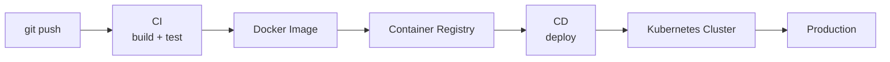
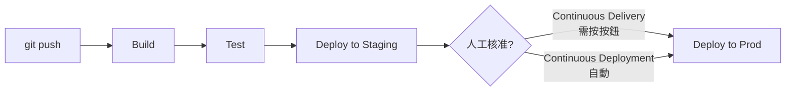
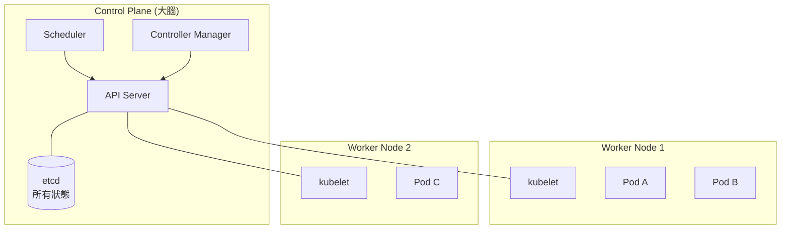
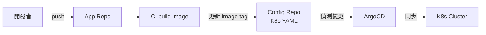
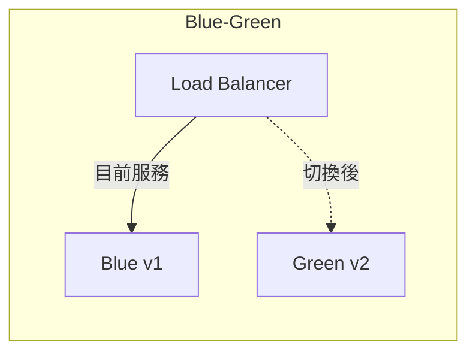
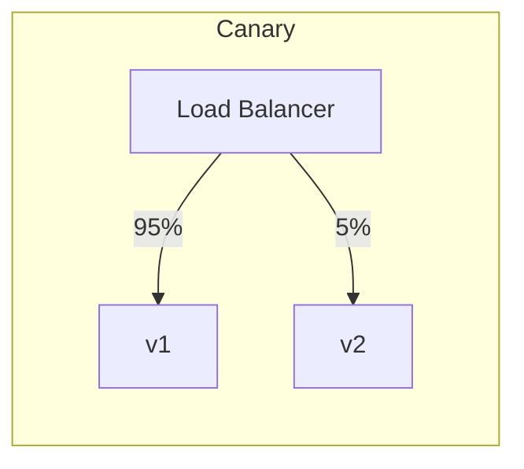

# E1 - 部署與 CI/CD(Deployment & CI/CD)

← [返回索引(README.md)](./README.md)

---

## 為什麼有這一篇?

純「寫 code」的工程師可能不太碰部署,但**現代後端開發無法迴避這一塊**——從 commit 到 production,中間要經過 build、test、image、registry、deploy、rollback、observe。本篇收錄這條 pipeline 上的核心詞彙。



---

## 目錄

### CI/CD 概念
- [CI / CD / CD(三個 CD 的區別)🟢](#ci-cd)
- [Pipeline / Stages / Artifact 🟢](#pipeline)
- [Build / Test / Deploy 三階段最佳實踐 🟡](#build-test-deploy)

### CI 工具
- [Jenkins 🟡](#jenkins)
- [Jenkinsfile / Pipeline as Code 🟡](#jenkinsfile)
- [GitHub Actions / GitLab CI(對照)🟢](#github-actions)
- [Code Quality / Security Scan 工具 🟡](#scan-tools)

### 容器化
- [Docker 🟢](#docker)
- [Dockerfile 🟢](#dockerfile)
- [Image / Container / Layer 🟢](#image-container)
- [Container Registry 🟢](#registry)
- [Artifact Repository(Nexus / Artifactory)🟡](#artifact-repo)

### Kubernetes
- [Kubernetes(K8s)🟡](#k8s)
- [Pod 🟡](#pod)
- [Deployment 🟡](#deployment)
- [Service 🟡](#service)
- [Ingress 🟡](#ingress)
- [Namespace / ConfigMap / Secret 🟡](#namespace-config)
- [Helm 🟡](#helm)
- [GitOps / ArgoCD 🔴](#gitops)

### 部署方法論
- [12-Factor App(完整 12 條)🟡](#twelve-factor)
- [部署策略:Blue-Green / Canary / Rolling 🟡](#deployment-strategy)

### Observability(觀測性)
- [三大支柱:Logs / Metrics / Traces 🟡](#three-pillars)
- [logrotate(傳統日誌輪替)🟢](#logrotate)
- [ELK Stack 🟡](#elk)
- [Loki + Grafana 🟡](#loki)
- [Prometheus + Grafana 🟡](#prometheus)
- [Datadog / New Relic 🟢](#datadog)
- [OpenTelemetry 🔴](#otel)
- [Jaeger / Zipkin(分散式追蹤)🟡](#jaeger-zipkin)

---

## CI/CD 概念

<a id="ci-cd"></a>
### CI / CD / CD(三個 CD 的區別)🟢

容易混淆,先講清楚:

| 縮寫 | 全名 | 做什麼 | 觸發到哪一步 |
| --- | --- | --- | --- |
| **CI** | **Continuous Integration**(持續整合) | 程式 push 後**自動 build + 跑測試** | 確保 main 分支永遠可建置、可通過測試 |
| **CD** | **Continuous Delivery**(持續交付) | CI 通過後**自動產出可部署的 artifact**,但**部署到 prod 仍需人工按鈕** | 隨時可一鍵上線 |
| **CD** | **Continuous Deployment**(持續部署) | 比 Delivery 更進一步,**通過測試後自動部到 prod**,完全無人工介入 | 真正的全自動 |



**選擇**:
- **小團隊 / 高自動化測試覆蓋率** → Deployment(全自動)
- **金融 / 企業 / 法規限制** → Delivery(留人工關卡)
- **新創 SaaS** 多採 Deployment

---

<a id="pipeline"></a>
### Pipeline / Stages / Artifact 🟢

**Pipeline**:整條從 commit 到 production 的**自動化流程定義**,通常以程式碼形式存在(`Jenkinsfile`、`.github/workflows/*.yml`)。

**Stage**:Pipeline 的**階段**——一個典型 pipeline 會有:
1. **Checkout** — 抓 source code
2. **Build** — 編譯(`mvn package`、`gradle build`)
3. **Test** — 跑單元 / 整合測試
4. **Code Quality** — Sonar、Lint、Coverage 檢查
5. **Security Scan** — SAST、依賴漏洞掃描(Snyk、Trivy)
6. **Package** — 打 Docker image
7. **Push** — 推到 Registry
8. **Deploy** — 部署到 Staging / Prod

**Artifact**:Build 階段產出的**可部署產物**——`.jar`、`.war`、Docker image、靜態網頁 zip。Pipeline 各 stage 之間透過 artifact 傳遞。

**Step / Job / Task**:Stage 內的最小執行單位(不同工具叫法不同)。

---

<a id="build-test-deploy"></a>
### Build / Test / Deploy 三階段最佳實踐 🟡

**Build Once, Deploy Many**:
- ❌ 反例:Staging 一次 build、Prod 再 build 一次 → 可能 build 出不同結果(網路波動、依賴版本變化)
- ✅ 正解:**只 build 一次**,同一個 image 從 Dev → Staging → Prod 都用同一份(只換 Config)

**Fail Fast**:
- 把**最快、最可能失敗**的測試放在最前面(unit test → integration test → E2E)
- 任何一階段失敗立刻停,不要繼續浪費資源

**Cache 依賴**:
- Maven `~/.m2`、Gradle `~/.gradle`、Node `node_modules`、Docker layer 都應該 cache
- 否則每次 build 都重抓依賴,慢且不穩

---

## CI 工具

<a id="jenkins"></a>
### Jenkins 🟡

**定義**:**老牌的開源 CI/CD 伺服器**(2011 年從 Hudson fork),Java 寫的,自架(self-hosted)。**企業內部最常見**的 CI 工具,尤其在傳統產業。

**核心元素**:
- **Master / Controller** — 排程、UI、配置
- **Agent / Node** — 實際跑 build 的機器(可以是 VM、Docker、K8s Pod)
- **Job / Pipeline** — 一個建置任務
- **Plugin** — Jenkins 的靈魂與夢魘——**1800+ plugin** 撐起所有功能(Git、Docker、K8s、Slack 通知...)

**為什麼還在用**:
- 完全開源、零訂閱費
- 自架、資料留內網(金融 / 政府 / 軍工幾乎只能選這個)
- Plugin 生態最完整
- 整合任何企業內部系統(Jira、Bitbucket、Artifactory)

**為什麼新專案越來越少用**:
- 維運負擔(Master 要顧、Plugin 要升、Agent 要管)
- UI 老派
- 雲原生 SaaS(GitHub Actions / GitLab CI)更輕鬆

---

<a id="jenkinsfile"></a>
### Jenkinsfile / Pipeline as Code 🟡

**定義**:把 Jenkins Pipeline 寫成**檔案放進 git repo**,而非在 Jenkins UI 點選——這就是 **Pipeline as Code**。

**Declarative Pipeline 範例**(現代寫法):
```groovy
pipeline {
    agent { label 'docker' }
    options {
        timeout(time: 30, unit: 'MINUTES')
        timestamps()
    }
    stages {
        stage('Build') {
            steps { sh './mvnw clean package -DskipTests' }
        }
        stage('Test') {
            steps { sh './mvnw test' }
            post {
                always { junit 'target/surefire-reports/*.xml' }
            }
        }
        stage('Docker Build & Push') {
            when { branch 'main' }
            steps {
                sh 'docker build -t myapp:${BUILD_NUMBER} .'
                sh 'docker push myregistry/myapp:${BUILD_NUMBER}'
            }
        }
        stage('Deploy to Prod') {
            when { branch 'main' }
            input { message 'Deploy to production?' }
            steps {
                sh 'kubectl set image deployment/myapp myapp=myregistry/myapp:${BUILD_NUMBER}'
            }
        }
    }
    post {
        failure {
            slackSend channel: '#alerts', message: "Build failed: ${env.BUILD_URL}"
        }
    }
}
```

**Scripted vs Declarative**:Scripted 是早期 Groovy 風格(自由度高、易亂);Declarative 是 2017 後新風格(結構嚴謹、易讀)。**新專案一律用 Declarative**。

---

<a id="github-actions"></a>
### GitHub Actions / GitLab CI(對照)🟢

**現代主流**——code 在哪、CI 就在哪,免維護 server。

**GitHub Actions 範例**(`.github/workflows/ci.yml`):
```yaml
name: CI
on:
  push:
    branches: [main]
  pull_request:

jobs:
  build:
    runs-on: ubuntu-latest
    steps:
      - uses: actions/checkout@v4
      - uses: actions/setup-java@v4
        with:
          java-version: '21'
          distribution: 'temurin'
          cache: 'maven'
      - run: ./mvnw verify
      - uses: docker/build-push-action@v5
        with:
          push: true
          tags: ghcr.io/${{ github.repository }}:${{ github.sha }}
```

**對照表**:

| | Jenkins | GitHub Actions | GitLab CI |
| --- | --- | --- | --- |
| 託管 | 自架 | SaaS(免費額度有) | SaaS / 自架 |
| 配置 | `Jenkinsfile`(Groovy) | `.github/workflows/*.yml` | `.gitlab-ci.yml` |
| 學習曲線 | 陡 | 平 | 中 |
| Plugin 生態 | 最完整 | 龐大且成長中 | 內建較完整 |
| 適合 | 企業、內網、客製化 | OSS、雲原生新專案 | GitLab 用戶、自架 SaaS |

---

<a id="scan-tools"></a>
### Code Quality / Security Scan 工具 🟡

**定位**:在 CI Pipeline 的 **Test 之後 / Package 之前**,自動掃描程式碼找出**品質問題**與**安全漏洞**。任何企業級 pipeline 都該有。

#### 三大類掃描

| 類型 | 全名 | 在掃什麼 | 何時跑 |
| --- | --- | --- | --- |
| **SAST** | Static Application Security Testing | **source code 的安全漏洞**(SQL Injection、XSS、密碼明文、不安全的 deserialization) | CI 早期 |
| **SCA** | Software Composition Analysis | **第三方依賴**的已知漏洞(CVE),license 合規 | CI 早期 |
| **DAST** | Dynamic Application Security Testing | **執行中的應用**(模擬攻擊、Penetration Test) | Staging 環境 |

#### 主流工具

| 工具 | 類型 | 說明 |
| --- | --- | --- |
| **Checkmarx**(CxSAST) | SAST | **企業級 SAST**,商業產品。常與 Jenkins 整合,在 build 時掃描原始碼,產出 vulnerability report。**金融、政府、大企業最常見** |
| **SonarQube** | SAST + 程式碼品質 | **最廣泛使用**的開源(社群版免費,企業版付費)。除了安全,還掃 code smell、coverage、complexity、duplication。商業版有 Security 模組強化 SAST |
| **Snyk** | SCA + SAST | 雲原生,**對開源專案友善**(GitHub 整合好)。專長是 SCA(掃 `pom.xml` / `package.json` 的依賴漏洞) |
| **OWASP Dependency-Check** | SCA | OWASP 開源,純 Maven plugin / Gradle plugin,免費掃 CVE |
| **Veracode** | SAST + DAST | 老牌商業 SAST/DAST,大企業常見 |
| **Fortify**(Micro Focus) | SAST | 老牌商業,Checkmarx 競品 |
| **GitHub Advanced Security** | SAST + Secret Scan | GitHub 內建(企業版),CodeQL 引擎 |
| **Trivy** | Image 漏洞掃描 | 掃 Docker image 內的 OS 套件、language libraries 漏洞 |
| **git-secrets / TruffleHog** | Secret Scan | 掃 commit 是否含密碼、API Key |

#### Pipeline 中的典型擺放

```
Checkout → Build → Unit Test → SAST(Checkmarx / SonarQube)→ SCA(Snyk / Dependency-Check)
        → Package → Image Build → Image Scan(Trivy)→ Push → Deploy → DAST
```

#### Checkmarx 使用情境

**為什麼企業選 Checkmarx**:
- 對 **130+ 種語言** 支援深度高(Java、C#、JS、Python、COBOL、ABAP...)
- 規則庫覆蓋 **OWASP Top 10**、**CWE**、**PCI DSS**、**HIPAA** 合規
- **企業內網部署**(資料不外流,符合金融 / 政府法規)
- 有專業服務團隊與規則客製化

**典型 Jenkins 整合**:Checkmarx 提供 Jenkins Plugin,在 pipeline 加一個 `step`:
```groovy
stage('Security Scan') {
    steps {
        checkmarxScan(
            projectName: env.JOB_NAME,
            preset: 'Checkmarx Default',
            failBuildOnNewResults: true,
            highSeverity: 0,           // 高風險不可有
            mediumSeverity: 5          // 中風險上限
        )
    }
}
```

掃完產出 HTML / PDF 報告,**通常 Code Review 時 reviewer 會看 Checkmarx 結果**——金融專案這是強制流程。

#### 規範建議

- **SAST 與 SCA 是 CI 必備**,不該因「太慢 / 太多 false positive」就關掉
- 設定**門檻**:high severity = 0 才能合 main、medium severity 上限明確
- **False positive 必須標記與追蹤**(別忽略,下次又誤報)
- 商業產品(Checkmarx / Veracode)成本高,新創 / 中小團隊用 SonarQube + Snyk + OWASP Dependency-Check 組合通常夠用

---

## 容器化

<a id="docker"></a>
### Docker 🟢

**定義**:**容器化平台**——把應用程式 + 它的所有依賴(JDK、libraries、配置)**打包成一個 image**,任何裝了 Docker 的機器都能跑出**完全相同**的環境。

**為什麼革命性**(解決什麼問題):
- ❌ 「在我電腦上可以跑」(環境差異)
- ❌ 一台機器一個應用(資源浪費)
- ❌ 部署設定散落 init script 裡(難重現)
- ✅ Docker:把「環境」也變成 code 與 image,跟 source 一樣可版本控制

**對比 VM**:

| | VM | Container |
| --- | --- | --- |
| 隔離級別 | OS 層(完整 OS) | Process 層(共享 host kernel) |
| 啟動 | 數十秒 | 秒級 |
| 大小 | GB 級 | MB 級 |
| 密度 | 一台機器 10+ VM | 一台機器 100+ container |

**核心指令**:
```bash
docker build -t myapp:1.0 .            # 從 Dockerfile build image
docker run -p 8080:8080 myapp:1.0      # 跑 container
docker ps                               # 看 running container
docker logs <container_id>              # 看 log
docker exec -it <id> sh                 # 進去 container 內
docker push myregistry/myapp:1.0        # 推到 Registry
```

---

<a id="dockerfile"></a>
### Dockerfile 🟢

**定義**:描述**如何 build image** 的腳本檔。

**Spring Boot 範例(多階段 build)**:
```dockerfile
# Stage 1: Build
FROM maven:3.9-eclipse-temurin-21 AS builder
WORKDIR /app
COPY pom.xml .
RUN mvn dependency:go-offline                     # 先抓依賴(可被 cache)
COPY src ./src
RUN mvn clean package -DskipTests

# Stage 2: Runtime(只留執行所需)
FROM eclipse-temurin:21-jre-alpine
WORKDIR /app
COPY --from=builder /app/target/*.jar app.jar
EXPOSE 8080
USER 1000                                          # 不要用 root 跑!
ENTRYPOINT ["java", "-jar", "app.jar"]
```

**最佳實踐**:
- **多階段 build**:builder 階段含 JDK + 工具(肥),runtime 階段只含 JRE(瘦)
- **層次順序**:**變動少的指令放上面**(`COPY pom.xml` → `mvn dependency`),這樣 source code 改動時 cache 仍可用
- **不要用 `latest` tag**:用具體版本(`21-jre-alpine`)
- **不要用 root**:加 `USER 1000` 用非特權使用者
- **`.dockerignore`** 排除 `target/`、`.git/`、`node_modules/`

**Quarkus 加分**:Quarkus 內建多種 Dockerfile(`src/main/docker/Dockerfile.jvm` / `Dockerfile.native`),直接拿來用。

---

<a id="image-container"></a>
### Image / Container / Layer 🟢

| 概念 | 說明 | 比喻 |
| --- | --- | --- |
| **Image**(映像檔) | **唯讀**的範本,包含 OS + 應用 + 設定 | Class |
| **Container**(容器) | Image 的**執行實例**,可讀寫 | Object(Class 的 instance) |
| **Layer**(層) | Image 內部由多層疊起,Dockerfile 每個 `RUN`/`COPY` 指令產生一層 | Diff / Patch |

**Layer Caching**:同一層只要不變就 reuse,加速 build。所以 Dockerfile 寫法很重要。

**Image 大小調校**:
- 用 alpine 基底(`eclipse-temurin:21-jre-alpine`)— 標準 image 約 200MB,alpine 約 80MB
- 多階段 build 砍掉不必要的工具
- 整合 distroless image(只剩 JRE,連 shell 都沒有,更安全)

---

<a id="registry"></a>
### Container Registry 🟢

**定義**:**Image 的倉庫**,類似 Maven Central / npm registry,但裝的是 Docker image。

**主流選擇**:
- **Docker Hub** — 公開最大,免費 plan 有 pull 限制
- **GitHub Container Registry(GHCR)** — `ghcr.io/<user>/<image>`,跟 GitHub 整合
- **AWS ECR** / **GCP GCR / Artifact Registry** / **Azure ACR** — 雲廠自家
- **Harbor** — 自架的開源 registry(企業內網常用)
- **JFrog Artifactory** — 商業版,可同時管 Maven / npm / Docker

**Tag 規範建議**:
- `myapp:1.2.3` — semver
- `myapp:1.2.3-rc1` — pre-release
- `myapp:sha-a1b2c3d` — git commit
- `myapp:latest` — **避免用於 prod**(無法回溯)

---

<a id="artifact-repo"></a>
### Artifact Repository(Nexus / Artifactory)🟡

**定義**:**儲存與管理 build 產物(artifacts)** 的伺服器——Maven jar、Docker image、npm package、Helm chart、Python wheel、NuGet 等都可放。**企業內部必備**。

**為什麼需要**:
- **私有依賴儲存**:公司內部 jar / SDK 不能放 Maven Central,要放自家 repo
- **鏡像加速**:把 Maven Central / Docker Hub 鏡像到內網,build 不必跨牆抓
- **離線環境**:金融 / 政府 / 軍工內網無法連外,**所有依賴都要本地**
- **版本管控與審計**:誰在何時 push 什麼版本,可追溯
- **依賴掃描**:整合 SCA 工具(Snyk / Sonatype IQ)掃 CVE
- **License 合規**:確保第三方依賴的授權合規

#### 主流產品對照

| 產品 | 廠商 | 特色 |
| --- | --- | --- |
| **Sonatype Nexus** | Sonatype | **企業最常用**,免費版(OSS)足以撐起多數場景;商業版(Nexus Repository Pro)有額外功能 |
| **JFrog Artifactory** | JFrog | **企業級全功能**,商業為主(社群版功能受限),整合 JFrog Xray(SCA) |
| **AWS CodeArtifact** | AWS | 雲廠原生,整合 IAM,適合 AWS-native 環境 |
| **GCP Artifact Registry** | Google Cloud | GCP 原生,取代舊的 Container Registry / Maven 倉庫 |
| **Azure Artifacts** | Microsoft | Azure DevOps 整合 |
| **GitHub Packages** | GitHub | 與 GitHub repo 緊密整合,支援 Maven / Docker / npm / NuGet |
| **GitLab Package Registry** | GitLab | GitLab 內建 |

#### Artifact Repository 與 Container Registry 的關係

**Container Registry 其實是 Artifact Repository 的一種特化**——只存 Docker image 的 repo。但很多 Artifact Repository 同時支援多種格式:

| 用途 | 純 Container Registry | Artifact Repository(全能型) |
| --- | --- | --- |
| Docker image | ✅ | ✅ |
| Maven jar | ❌ | ✅ |
| npm package | ❌ | ✅ |
| Helm chart | 部分支援 | ✅ |
| 範例 | Docker Hub、GCR、ECR | Nexus、Artifactory |

**現代趨勢**:**用一個全能 Artifact Repository 收所有東西**(jar + image + helm + npm),而不是各搞一個 server。

#### Maven 設定範例(指向 Nexus)

`~/.m2/settings.xml`:
```xml
<settings>
  <mirrors>
    <mirror>
      <id>nexus</id>
      <mirrorOf>*</mirrorOf>
      <url>https://nexus.company.com/repository/maven-public/</url>
    </mirror>
  </mirrors>
  <servers>
    <server>
      <id>nexus</id>
      <username>${env.NEXUS_USER}</username>
      <password>${env.NEXUS_PASSWORD}</password>
    </server>
  </servers>
</settings>
```

`pom.xml` 中發佈到 Nexus:
```xml
<distributionManagement>
  <repository>
    <id>nexus</id>
    <url>https://nexus.company.com/repository/maven-releases/</url>
  </repository>
  <snapshotRepository>
    <id>nexus</id>
    <url>https://nexus.company.com/repository/maven-snapshots/</url>
  </snapshotRepository>
</distributionManagement>
```

#### 規範建議

- **企業環境必有 Artifact Repository**,不能直接讓 dev / CI 機器打 Maven Central
- **私有 jar 不要打進 image**——應放 Artifact Repository,build image 時拉
- **release vs snapshot 分倉**:`maven-releases` 不可覆蓋,`maven-snapshots` 可覆蓋
- **權限分離**:讀(全員)、寫(CI 機器人帳號)、管理(架構團隊)
- **Cleanup policy**:snapshot 自動清舊版本,避免儲存爆炸
- **整合 SCA 掃描**:每個入庫的 artifact 自動掃 CVE(Sonatype IQ / JFrog Xray)

---

## Kubernetes

<a id="k8s"></a>
### Kubernetes(K8s)🟡

**定義**:**容器編排系統**——管理多個 container 在一群 server 上的部署、擴展、健康檢查、自動重啟。Google 開源,**雲原生事實標準**。

**為什麼需要 K8s**:幾個 container 自己 docker run 就夠;當你有**幾百個 container 跨數十台機器**,需要回答:
- 哪台機器有資源跑這個 container?(scheduling)
- 一台機器掛了,container 自動搬到別台?(self-healing)
- 流量大了自動加 instance?(auto-scaling)
- 怎麼讓 container 之間互相找到對方?(service discovery)
- 滾動更新時不斷服務?(rolling update)

K8s 把這些都解決。

**核心架構**:



---

<a id="pod"></a>
### Pod 🟡

**定義**:**K8s 最小部署單位**——一個 Pod 包含**一個或多個 container**(共享網路、儲存、生命週期)。

**為什麼是 Pod 而不是 Container**:有時候應用需要 sidecar(log collector、proxy、auth agent)跟主 container 緊密綁在一起,Pod 就是這個包裝。

**單 container Pod 範例**:
```yaml
apiVersion: v1
kind: Pod
metadata:
  name: myapp
spec:
  containers:
    - name: myapp
      image: myregistry/myapp:1.0
      ports:
        - containerPort: 8080
      resources:
        requests: { memory: "256Mi", cpu: "250m" }
        limits: { memory: "512Mi", cpu: "500m" }
```

**重點**:**幾乎不會直接建 Pod**,通常透過 Deployment 管理(下一條)。

---

<a id="deployment"></a>
### Deployment 🟡

**定義**:**管理一組相同的 Pod**,負責:複製份數(replicas)、滾動更新、版本回滾。

**範例**:
```yaml
apiVersion: apps/v1
kind: Deployment
metadata:
  name: myapp
spec:
  replicas: 3                    # 我要 3 個 instance
  selector:
    matchLabels: { app: myapp }
  strategy:
    type: RollingUpdate          # 滾動更新
    rollingUpdate:
      maxUnavailable: 1
      maxSurge: 1
  template:
    metadata:
      labels: { app: myapp }
    spec:
      containers:
        - name: myapp
          image: myregistry/myapp:1.0
          livenessProbe:                     # 死了重啟
            httpGet: { path: /health, port: 8080 }
          readinessProbe:                    # 還沒準備好不收流量
            httpGet: { path: /ready, port: 8080 }
```

**版本回滾**:
```bash
kubectl rollout history deployment/myapp
kubectl rollout undo deployment/myapp --to-revision=2
```

---

<a id="service"></a>
### Service 🟡

**定義**:**Pod 的穩定入口**——Pod 會被銷毀重建、IP 會變,Service 提供一個固定的 DNS 名稱與虛擬 IP,把流量分派給後面的 Pod。

**類型**:

| Type | 用途 |
| --- | --- |
| `ClusterIP`(預設) | 只在 cluster 內部訪問,服務間溝通用 |
| `NodePort` | 每個 Node 開一個 port 對外(30000~32767) |
| `LoadBalancer` | 雲廠提供的 Load Balancer(AWS ELB / GCP LB) |
| `ExternalName` | 把 cluster 內名稱對應到外部 DNS |

**範例**:
```yaml
apiVersion: v1
kind: Service
metadata:
  name: myapp
spec:
  selector: { app: myapp }
  ports:
    - port: 80
      targetPort: 8080
  type: ClusterIP
```

**服務發現**:同一 namespace 內,直接用 `http://myapp` 就可呼叫。

---

<a id="ingress"></a>
### Ingress 🟡

**定義**:**HTTP / HTTPS 流量入口**——把外部 URL 路由到 cluster 內不同 Service,提供 TLS 終止、虛擬主機、路徑路由。

**範例**:
```yaml
apiVersion: networking.k8s.io/v1
kind: Ingress
metadata:
  name: myapp
  annotations:
    cert-manager.io/cluster-issuer: letsencrypt
spec:
  tls:
    - hosts: [api.example.com]
      secretName: myapp-tls
  rules:
    - host: api.example.com
      http:
        paths:
          - path: /orders
            pathType: Prefix
            backend:
              service: { name: order-service, port: { number: 80 } }
          - path: /users
            pathType: Prefix
            backend:
              service: { name: user-service, port: { number: 80 } }
```

**Ingress Controller**:Ingress 只是規則描述,真正執行的是 **Ingress Controller**(NGINX、Traefik、Istio Gateway、雲廠專用)。

---

<a id="namespace-config"></a>
### Namespace / ConfigMap / Secret 🟡

**Namespace**:cluster 內的**邏輯隔離**(類似資料夾)。常見切法:
- 環境:`dev` / `staging` / `prod`
- 團隊:`team-a` / `team-b`
- 應用:`monitoring` / `logging` / `myapp`

**ConfigMap**:**非機密配置**(application name、log level、feature flag),以 key-value 存放。
```yaml
apiVersion: v1
kind: ConfigMap
metadata: { name: myapp-config }
data:
  application.yaml: |
    spring:
      jpa:
        show-sql: false
    app:
      tax-rate: 0.05
```

**Secret**:**機密資訊**(密碼、API Key、TLS 憑證),Base64 編碼(**不是加密!**)。生產環境應搭配:
- **Sealed Secret**(Bitnami)— 加密的 Secret 可以放 git
- **External Secrets Operator** — 從 Vault / AWS Secrets Manager 同步
- **HashiCorp Vault** — 機密管理專用工具

**注入到 Pod**:可作為環境變數或檔案掛載。
```yaml
spec:
  containers:
    - name: myapp
      envFrom:
        - configMapRef: { name: myapp-config }
        - secretRef: { name: myapp-secret }
```

---

<a id="helm"></a>
### Helm 🟡

**定義**:**K8s 的套件管理器**——把一組 K8s YAML(Deployment + Service + Ingress + ConfigMap)打包成「Chart」,可參數化、版本控管、安裝/升級。

**為什麼需要**:
- 一個應用可能有 10 個 YAML,手寫 + 跨環境差異(dev 1 replica、prod 5 replica)很痛
- Helm 把差異參數化,一個 chart 可裝多環境
- 第三方應用(Postgres、Redis、Prometheus)都有現成 chart,一行裝完

**範例**:
```bash
helm repo add bitnami https://charts.bitnami.com/bitnami
helm install my-redis bitnami/redis --set auth.password=xxx
helm upgrade my-redis bitnami/redis --set replica.replicaCount=3
helm rollback my-redis 1
```

**Chart 結構**:
```
mychart/
  Chart.yaml          # 元資料
  values.yaml         # 預設參數
  templates/
    deployment.yaml   # 用 {{ .Values.xxx }} 取值
    service.yaml
    ingress.yaml
```

---

<a id="gitops"></a>
### GitOps / ArgoCD 🔴

**定義**:**git repo 是 cluster 期望狀態的單一真相來源**——你不再用 `kubectl apply`,而是改 git,**ArgoCD 自動把 cluster 同步到 git 描述的狀態**。

**為什麼這樣做**:
- **可審計**:誰改了什麼、何時、為什麼,git log 全在
- **可回滾**:`git revert` 即回滾部署
- **PR Review**:部署變更需 code review 才能 merge
- **災難復原**:cluster 全毀,從 git 一鍵復原

**典型架構**:



**工具**:**ArgoCD**(最流行)、**Flux**(CNCF graduated)。

---

## 部署方法論

<a id="twelve-factor"></a>
### 12-Factor App(完整 12 條)🟡

**定義**:由 Heroku 工程師整理的**雲原生 SaaS 應用十二原則**(2011),至今仍是建構雲應用的黃金準則。

| # | 原則 | 中文 | 說明 |
| --- | --- | --- | --- |
| 1 | **Codebase** | 程式碼庫 | **一個 app 對應一個 git repo**,多份部署(dev/staging/prod)共用同一份 code,只是配置不同 |
| 2 | **Dependencies** | 依賴 | **明確宣告**(`pom.xml`/`package.json`),**不依賴系統內建套件**,不要假設機器上有什麼 |
| 3 | **Config** | 配置 | **從環境變數讀**,不寫死在 code,不放進 git。代表配置隨環境變,code 不變 |
| 4 | **Backing Services** | 後端服務 | DB、Cache、MQ 等**外部資源視為「可替換的 attached resource」**,改連線字串就能換,不需改 code |
| 5 | **Build, Release, Run** | 建置、發佈、執行 | **三階段嚴格分離**:build 編譯、release 加上 config、run 執行。不能在 prod 改 code 或重編 |
| 6 | **Processes** | 程序 | App 是**無狀態 process**,session 等狀態存外部(Redis / DB),才能水平擴展與隨時重啟 |
| 7 | **Port Binding** | 連接埠綁定 | App **自帶 web server**(Tomcat embedded),透過 port binding 對外服務,不需依賴外部 server(Apache、IIS) |
| 8 | **Concurrency** | 並行 | **靠 process 模型水平擴展**——多開幾個 instance,而不是把單一 process 塞滿 thread |
| 9 | **Disposability** | 用後即棄 | **快速啟動、優雅關閉**(收 SIGTERM 後停接新請求、跑完手上的就退)。讓水平擴展與重啟成本低 |
| 10 | **Dev/Prod Parity** | 開發 / 生產對等 | **dev 與 prod 環境盡量一致**(同樣的 DB、MQ、OS),縮短 dev → prod 的時間、人員、工具差距。Docker 大幅幫助實現此原則 |
| 11 | **Logs** | 日誌 | **App 把 log 當 event stream 寫到 stdout**,不自己寫檔、不自己 rotate;由執行環境(K8s / 雲平台)收集處理 |
| 12 | **Admin Processes** | 管理任務 | **一次性 admin task**(DB migration、清理 job)用**同一份 code、同一個 release** 跑,不要 SSH 進 prod 手動執行 |

**為什麼要全部記**:這 12 條像 SOLID 之於設計——零散看每條都「廢話」,放在一起就是雲原生 app 的完整檢核表。**Spring Boot / Quarkus 大部分預設行為都符合 12-Factor**,你做對只是因為框架幫你做對了。

**現代擴充**(15-Factor、Beyond 12-Factor):觀測性、安全、API-first、Telemetry、Auth 等。

---

<a id="deployment-strategy"></a>
### 部署策略:Blue-Green / Canary / Rolling 🟡

| 策略 | 做法 | 風險 | 資源 |
| --- | --- | --- | --- |
| **Recreate** | 全停舊版,起新版 | 高(有 downtime) | 低 |
| **Rolling Update**(K8s 預設) | 一次替換少量 instance,新舊並存 | 中(version skew) | 中 |
| **Blue-Green** | 兩套完整環境,切流量(load balancer 一個指令) | 低(可瞬間回滾) | 高(雙倍) |
| **Canary** | 新版**先給 1%~5% 流量**測試,觀察指標好就放大 | 最低(風險可控) | 中 |





**搭配 Feature Flag**:再進一步——code 上線了,但功能用 Feature Flag 開關,**部署 ≠ 發佈**,可以針對特定使用者開啟。

---

## Observability(觀測性)

**Observability vs Monitoring**:
- **Monitoring(監控)**:你**事先知道**要看什麼(CPU、記憶體、QPS),設好警報
- **Observability(觀測性)**:能**事後追問未預期的問題**——「為什麼 03:14 那 5 個請求變慢?」要能查得到

雲原生時代,系統由眾多服務組成,**Observability 是必備能力**。

<a id="three-pillars"></a>
### 三大支柱:Logs / Metrics / Traces 🟡

| 支柱 | 是什麼 | 答得了什麼問題 | 工具範例 |
| --- | --- | --- | --- |
| **Logs(日誌)** | 應用發生事件的文字記錄 | 「**這個請求發生什麼事**?」(細節) | ELK、Loki、Splunk |
| **Metrics(指標)** | 隨時間變化的數值(QPS、延遲、錯誤率) | 「**現在系統有沒有問題**?」(趨勢、警報) | Prometheus、Datadog、Micrometer |
| **Traces(追蹤)** | 一個請求穿過多個服務的完整鏈路 | 「**慢在哪一個服務 / 方法**?」(分散式時序) | Jaeger、Zipkin、Tempo |

**現代趨勢**:三者整合在同一平台(Datadog、New Relic、Grafana 全家桶、OpenTelemetry 統一收集)。

---

<a id="logrotate"></a>
### logrotate(傳統日誌輪替)🟢

**定義**:**Linux 內建的日誌檔案輪替工具**——按時間 / 大小自動**切割、壓縮、刪除舊 log**,防止單一 log 檔無限長大塞爆磁碟。設定檔在 `/etc/logrotate.conf` 與 `/etc/logrotate.d/*`,由 cron 每日呼叫。

**為什麼存在**:傳統應用(在 VM / 實體機跑)把 log 寫到檔案(`/var/log/myapp.log`),不處理會**幾天就把磁碟塞爆**。logrotate 解決:
1. **切檔**:每天 / 每週切一個新檔(`myapp.log.1`、`myapp.log.2`...)
2. **壓縮**:舊檔自動 gzip(`myapp.log.2.gz`)
3. **刪除**:超過 N 份就刪最舊的
4. **通知應用**:切完後**送 signal 給應用 reopen 檔案 handle**(否則應用還寫在被改名的舊檔)

**典型設定**(`/etc/logrotate.d/myapp`):
```
/var/log/myapp/*.log {
    daily                      # 每天輪替
    rotate 14                  # 保留 14 份
    compress                   # 壓縮舊檔
    delaycompress              # 上一份不壓(以免應用還在寫)
    missingok                  # log 不存在不報錯
    notifempty                 # 空檔不轉
    create 0640 myapp myapp    # 切完建新檔的權限與 owner
    sharedscripts
    postrotate
        # 通知應用 reopen log file(視應用而異)
        /bin/kill -USR1 `cat /var/run/myapp.pid 2>/dev/null` 2>/dev/null || true
    endscript
}
```

**為什麼這條獨立成題**(雲原生環境會少用,但 legacy 仍多):
- 雲原生(K8s / Docker)應用該**寫 stdout**,由執行環境處理 log,不該寫檔——對應 [12-Factor App](#twelve-factor) 第 11 條 **Logs**
- 但實務上**大量企業專案仍跑在 VM**(金融、政府、軍工),或應用框架習慣寫檔案 → **logrotate 是必備**
- 不設 logrotate → **某天磁碟 100% → 應用整個掛**(這是面試與事故報告常見題)

**Java 應用的兩種選擇**:

| 方式 | 做法 | 適合 |
| --- | --- | --- |
| **應用內建輪替** | Logback / Log4j2 的 `RollingFileAppender` 自己處理 | 雲環境、不依賴 OS、Spring Boot 預設 |
| **OS logrotate** | Logback 只寫一個 log,logrotate 切 | 統一管理多應用 log、運維熟悉的部署 |

**Logback 內建輪替範例**(`logback-spring.xml`):
```xml
<appender name="FILE" class="ch.qos.logback.core.rolling.RollingFileAppender">
    <file>/var/log/myapp/app.log</file>
    <rollingPolicy class="ch.qos.logback.core.rolling.SizeAndTimeBasedRollingPolicy">
        <fileNamePattern>/var/log/myapp/app.%d{yyyy-MM-dd}.%i.log.gz</fileNamePattern>
        <maxFileSize>100MB</maxFileSize>
        <maxHistory>14</maxHistory>          <!-- 保留 14 天 -->
        <totalSizeCap>10GB</totalSizeCap>     <!-- 總上限 10GB -->
    </rollingPolicy>
    <encoder>
        <pattern>%d{yyyy-MM-dd HH:mm:ss} [%thread] %-5level %logger{36} - %msg%n</pattern>
    </encoder>
</appender>
```

**選擇建議**:
- **K8s / Docker 環境**:**寫 stdout**,讓 K8s + Fluent Bit / Filebeat 處理(不用 logrotate 也不用 Logback rolling)
- **VM / 實體機**:應用內建輪替(Logback)**或** logrotate 二選一,**不要兩者並用**(會打架)
- **logrotate 適合**:多個應用、各自寫不同檔、運維有 logrotate 既有經驗

**對應到 [Defense in Depth](./D1-security-jwt.md#defense-in-depth)** 的縱深思維:
- 不只 logrotate,還要設**磁碟使用率告警**(80% 警告、90% 告急)——防止某應用 log 量爆炸
- log 內容**不該含密碼、信用卡**(對應 [PII / GDPR / 安全 review])

**常見坑**:
- ❌ logrotate 沒設 `copytruncate` 或 `postrotate kill -USR1`,**應用仍寫在被改名的舊檔** → 新的 `myapp.log` 永遠 0KB
- ❌ Logback rolling 與 logrotate 並用 → 兩邊都改檔,log 散亂
- ❌ 沒設 `maxHistory` / `rotate N` → 磁碟仍會慢慢爆
- ❌ JSON log 用 logrotate 壓縮後,**ELK 端解析配置沒更新** → 收不到

---

<a id="elk"></a>
### ELK Stack 🟡

**定義**:**Elasticsearch + Logstash + Kibana** 三件套,**最廣泛使用的開源 log 平台**。

| 元件 | 角色 |
| --- | --- |
| **Elasticsearch** | 儲存 + 全文檢索 log,擴展性好 |
| **Logstash** | 收集、解析、轉換 log(從各種來源讀,做 filter,往 ES 寫) |
| **Kibana** | UI,搜尋 / 視覺化 / 儀表板 |

**演進**:現代版本常稱 **Elastic Stack**(因為加了 **Beats**——輕量 agent 取代 Logstash 在 client 端的角色,Logstash 留在中間做重度處理):

```
應用 → Filebeat(輕量 agent) → Logstash(處理) → Elasticsearch(儲存) → Kibana(查)
                          ↘ 可直接送到 ES,跳過 Logstash
```

**Java 工程師整合方式**:
- **方式 1**:應用寫 log 到 stdout / 檔案,Filebeat 撿走
- **方式 2**:用 `logback-logstash-encoder` 直接送 JSON 到 Logstash
- **MDC** 帶 `correlationId` / `userId` / `traceId`,Kibana 可依此搜尋

**痛點**:
- Elasticsearch **吃資源凶**(記憶體、磁碟、CPU)
- Hot-Warm-Cold 架構複雜
- 大量資料保留成本高

**對比**:
- **OpenSearch**:AWS fork 的 Elasticsearch(2021 年因授權爭議分家),功能幾乎等同
- **Splunk**:商業老牌,功能完整但**極貴**,大企業常用
- **Loki**(下一條)是輕量替代

---

<a id="loki"></a>
### Loki + Grafana 🟡

**定義**:**Grafana Labs 開發的 log 系統**——「**不索引內容,只索引 label**」的設計,大幅降低儲存成本。

**對比 ELK**:

| | ELK / Elasticsearch | Loki |
| --- | --- | --- |
| 索引方式 | **全文索引**所有 log 內容 | **只索引 label**(`service`、`pod`、`level`),內容壓縮儲存 |
| 儲存成本 | 高 | **低 10x** |
| 查詢能力 | **強**(全文搜尋) | 弱(需指定 label 範圍後再 grep) |
| 適合 | 需要強大全文搜尋 | 大量 log、查詢用 label 範圍即可 |
| 操作介面 | Kibana | Grafana(整合 metrics / traces) |

**何時選 Loki**:
- 已用 Grafana 看 metrics,想統一介面
- log 量大、預算敏感
- 主要查詢模式是「服務 X 在 Y 時間的 log」(label 範圍)

---

<a id="prometheus"></a>
### Prometheus + Grafana 🟡

**Prometheus**:**雲原生 metrics 事實標準**(SoundCloud 開源,CNCF graduated)。

**核心特色**:
- **Pull model**:Prometheus **主動去抓**(scrape)應用暴露的 metrics endpoint(`/metrics`)
- **Time-series database**:儲存帶 label 的時間序列資料
- **PromQL**:強大的查詢語言(`rate(http_requests_total[5m])`)
- **Alertmanager**:警報路由(送 Slack / PagerDuty / Email)

**Java 整合**:
- **Spring Boot Actuator** + **Micrometer**:加 `micrometer-registry-prometheus` 依賴,自動暴露 `/actuator/prometheus`
- **Quarkus**:`quarkus-micrometer-registry-prometheus` extension

**範例**(Spring Boot):
```yaml
management:
  endpoints:
    web:
      exposure:
        include: health,info,prometheus,metrics
  metrics:
    tags:
      application: ${spring.application.name}
```

**自訂 metrics**:
```java
@RequiredArgsConstructor
public class OrderService {
    private final MeterRegistry meterRegistry;

    public void create(Order order) {
        // ...
        meterRegistry.counter("orders.created",
            "type", order.type().name()).increment();
    }
}
```

**Grafana**:Prometheus 的視覺化前端(也支援多資料源)。**官方 dashboard** 數百種現成 JSON,匯入即用。

---

<a id="datadog"></a>
### Datadog / New Relic 🟢

**定位**:**商業 SaaS APM**(Application Performance Monitoring)平台,**整合 Logs / Metrics / Traces / Synthetic Monitoring / RUM**(真實使用者監控)於一站。

**為什麼企業用**:
- 開箱即用,**不用自架** Prometheus / ELK / Jaeger
- UI 體驗好、警報設定方便
- 跨服務 / 跨雲廠 / 跨技術一致的觀測介面
- 客服支援(凌晨 3 點掛了有人接電話)

**痛點**:**極貴**——按主機 / GB / 客戶事件數計費,規模大後帳單可怕。

**主要選擇**:
- **Datadog**:最完整,市占率高,UI 漂亮
- **New Relic**:老牌,APM 起家
- **Dynatrace**:AI 驅動的根因分析強
- **AppDynamics**(Cisco):企業老牌
- **Honeycomb**:強調**high-cardinality**(高基數)觀測,複雜分散式系統好用

**Java 整合**:都提供 Java agent,啟動時 `-javaagent:dd-java-agent.jar` 自動 instrument 大部分框架(Spring、JPA、HTTP client、Kafka 等)。

---

<a id="otel"></a>
### OpenTelemetry(OTel)🔴

**定義**:CNCF 標準專案,**統一 Logs / Metrics / Traces 的收集與傳輸協定**——**把 vendor lock-in 解掉**。

**為什麼革命性**:
- 過去:用 Datadog 要安裝 Datadog agent,換到 New Relic 要全部改寫
- OTel:**一次 instrument,送到任何後端**(Datadog、Prometheus、Jaeger、自家系統)
- **vendor-neutral**——換觀測平台不用改 code,只改 collector 配置

**架構**:

```
應用(用 OTel SDK instrument)
    ↓ OTLP 協定
OTel Collector(中間 agent,做轉換 / 路由)
    ↓
任何後端(Datadog / Jaeger / Prometheus / ELK / 自家)
```

**Java 整合**:
- **Auto-instrumentation**:`-javaagent:opentelemetry-javaagent.jar`,自動 trace 大部分框架
- **手動**:OTel SDK API 加自訂 span / metric

**現況**:**Traces 已成熟**(取代 Jaeger / Zipkin client),**Metrics 漸普及**,**Logs 還在演進**。新專案應**優先選 OTel**,而非綁特定 vendor SDK。

---

<a id="jaeger-zipkin"></a>
### Jaeger / Zipkin(分散式追蹤)🟡

**Distributed Tracing(分散式追蹤)**:一個 HTTP 請求穿過多個微服務時,**用同一個 Trace ID 串起所有 span**,在儀表板上看完整的呼叫鏈。

**核心概念**:
- **Trace**:一次完整請求(從入口到結束)
- **Span**:Trace 中的一個工作單元(一次 RPC、一次 DB 查詢)
- **Trace ID**:整條 trace 的識別碼
- **Span ID**:單一 span 的識別碼
- **Parent Span ID**:形成樹狀結構

**主流工具**:
- **Jaeger**(Uber 開源,CNCF graduated)— 最普及
- **Zipkin**(Twitter 開源,老牌)
- **Tempo**(Grafana Labs)— 整合 Loki / Prometheus 全家桶
- **Datadog APM**、**New Relic** — 商業

**Java 整合**(現代寫法):
- 用 **OpenTelemetry Java agent** 自動 instrument
- Spring Boot 3.0+ 內建 **Micrometer Tracing**,可直送 Zipkin / Tempo / OTel
- Header 傳遞 `traceparent`(W3C 標準)讓 trace 跨服務串起來

**為什麼必要**:微服務一個請求穿 5 個服務,有問題不知道慢在哪——分散式追蹤讓你**直接看到時序圖**:`API Gateway 5ms → User Service 200ms ← 慢在這裡 → DB 180ms`。

---

← [返回索引(README.md)](./README.md)
