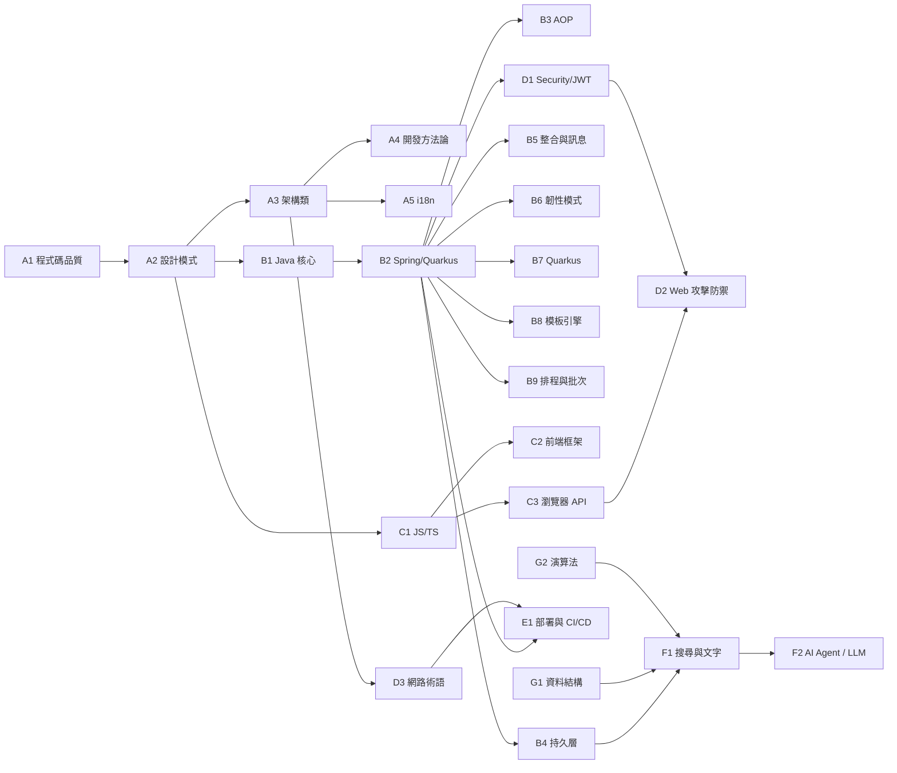

# 個人技術術語表(Glossary)— Backend / Frontend / AI

> 收錄全端工程師日常會遇到的核心概念。
> 程式碼範例以 **Java(Spring Boot / Quarkus)** 與 **JavaScript / TypeScript** 為主,
> 但多數概念(架構、設計模式、安全、CI/CD、網路、AI)適用於各語言的開發者。

## 使用方式

- 每個術語都附帶 **定義 / 為什麼用 / 範例**(必要時加上反例)
- 程式碼範例以 **Spring Boot + Lombok** 為主,**Quarkus** 則使用標準 Jakarta EE 寫法;前端範例以 **Vue 3 / TypeScript** 為主
- 難度標籤:🟢 基礎 / 🟡 中階 / 🔴 進階
- **單一主場原則(Single Source of Truth)**:同一概念在 Glossary 中**只有一個地方詳述**(canonical home),其他章節若提及只給「一句話 + 連結」;避免內容分裂、易於維護

## 通用詞彙(Quick Reference)

太基礎或太通用、不值得獨立成章節,但在文件中常出現:

- **API**(Application Programming Interface)— 系統對外暴露的「介面」,讓其他程式呼叫使用。可以是類別方法的 API、HTTP REST API、或函式庫 API。
- **SDK**(Software Development Kit)— 對接某服務或平台的「**開發工具包**」,通常包含 Client 函式庫、文件、範例。例如 AWS Java SDK、Stripe Java SDK——你 import 後就能呼叫對方服務,不用自己組 HTTP 請求。
- **SDK ⊃ API**(SDK 包含 API):SDK 通常**包裝**底層 API 提供更友善的介面。例:AWS 公開 REST API,AWS Java SDK 把它封裝成方法呼叫,你 import 後直接呼叫 Java 方法,不必自己組 HTTP 請求。
- **DTO**(Data Transfer Object)— 跨層傳輸物件,詳見 [A1 程式碼品質](./A1-code-quality.md)。
- **POJO**(Plain Old Java Object)— 普通 Java 物件,無框架依賴,詳見 [B1 Java 核心](./B1-java-essentials.md#pojo)。
- **CRUD** — Create / Read / Update / Delete,資料的四種基本操作。
- **CI / CD** — Continuous Integration / Continuous Delivery / Deployment,持續整合 / 持續交付,詳見 [E1 部署與 CI/CD](./E1-deployment-cicd.md)。
- **KM**(Knowledge Management)— **知識管理**,組織把員工的隱性知識(經驗、Know-how)與顯性知識(文件、SOP)系統化整理、儲存、分享、再利用的流程與工具。常見載體:Confluence、Notion、Obsidian、企業 Wiki、本 Glossary 自身。對工程團隊而言,程式碼註解、ADR(Architecture Decision Record)、Runbook、Postmortem、Onboarding 文件、Glossary 都屬於 KM 產出。

## 索引

### A — 通用工程基礎(語言無關)

| # | 主題 | 內容摘要 |
| --- | --- | --- |
| A1 | [程式碼品質](./A1-code-quality.md) | SOLID、DRY、KISS、YAGNI、Magic Number/String、Enum、Constants、Lombok、Validation、Value Object、Package Principles、ArchUnit |
| A2 | [設計模式](./A2-design-patterns.md) | Strategy、Factory、Chain of Responsibility、Singleton、Builder、Observer、Template Method、Adapter、Decorator |
| A3 | [架構類術語](./A3-architecture.md) | Clean Architecture、Hexagonal、Modulith、Port & Adapter、Bounded Context、Graceful Degradation、DDD、CQRS、Rule Engine |
| A4 | [開發方法論](./A4-methodology.md) | SDLC、TDD、BDD、API-First / OpenAPI-Driven、Spec-First、SRS-Driven、Java 主場測試工具、周邊測試工具、MVP、企業管理系統標準與認證(ISO 9001/20000/27001/27701、CMMI、DJCP) |
| A5 | [i18n / 國際化](./A5-i18n.md) | i18n / l10n、Locale、ResourceBundle / MessageSource、Locale 解析策略、日期/數字/貨幣格式化、前後端 i18n 分工 |

### B — 後端 Java 生態(Spring Boot / Quarkus 視角)

| # | 主題 | 內容摘要 |
| --- | --- | --- |
| B1 | [Java 核心](./B1-java-essentials.md) | Optional、Stream、equals/hashCode、Immutability、Thread-Safety、CompletableFuture、Checked vs Unchecked Exception、SPI(ServiceLoader)、AOT vs JIT、Memory Leak(記憶體洩漏) |
| B2 | [Spring Boot vs Quarkus](./B2-spring-vs-quarkus.md) | IoC、DI、Bean、Scope、Profile、AutoConfiguration、CDI、JAX-RS、Spring MVC、`@RestController`、API Versioning |
| B3 | [AOP 與橫切關注點](./B3-aop.md) | Aspect、Pointcut、Advice(Around/Before/After/AfterThrowing)、Cross-Cutting Concerns |
| B4 | [持久層與資料](./B4-persistence.md) | JPA、Repository、Entity、Blob / Lob、Mapper、MapStruct、Cache、Redis、TDE、Outbox Pattern、Saga(跨系統 Rollback)、CQRS、Event Sourcing |
| B5 | [整合與訊息](./B5-integration-messaging.md) | ESB、Apache Camel(Exchange/Processor/Route)、SOAP、JMS、Kafka、RabbitMQ、XML、FTP |
| B6 | [韌性模式](./B6-resilience.md) | Circuit Breaker、Resilience4j、Retry、Timeout、Bulkhead、Rate Limiter、Fallback、Idempotency |
| B7 | [Quarkus 專屬概念](./B7-quarkus.md) | GraalVM Native Image、Build-time vs Runtime、Dev Mode、MicroProfile、Panache、SmallRye |
| B8 | [模板引擎(JSP / Thymeleaf)](./B8-templating.md) | JSP、JSTL、Thymeleaf、JSP vs Thymeleaf 對照、模板引擎 vs SPA 取捨 |
| B9 | [排程與批次處理](./B9-scheduling-batch.md) | `@Scheduled`(Spring & Quarkus)、Quartz、Spring Batch、Spring Cloud Task、`@Async`、Thread Pool / Executor、排程 vs 批次 vs 非同步 |

### C — 前端

| # | 主題 | 內容摘要 |
| --- | --- | --- |
| C1 | [JavaScript / TypeScript](./C1-javascript-typescript.md) | JS、TS、Prototype、Deep Clone、`eval()`、Optional Chaining、Nullish Coalescing、JSX |
| C2 | [前端框架與生態](./C2-frontend-framework.md) | Vue 2 / Vue 3、React、Angular、Pinia / Vuex、Props / Emit / Event Bus、Vite、Tailwind / Bootstrap、Element Plus、Quasar |
| C3 | [瀏覽器 / Web API](./C3-browser-web-api.md) | XHR、Fetch、Axios、Cookies、LocalStorage / SessionStorage、Blob、WebSocket(瀏覽器視角) |

### D — Web 通用 / 安全

| # | 主題 | 內容摘要 |
| --- | --- | --- |
| D1 | [Security / JWT / OAuth](./D1-security-jwt.md) | JOSE 家族(JWT / JWS / JWE / JWK / JWA)、Stateless、Whitelist、AuthN vs AuthZ、ACL/RBAC/ABAC、OAuth 2.0 / OIDC、PKCE、SSO、SLO、SAML、LDAP、AD、Keycloak、Realm Access、Entra ID、Auth0、FIDO / WebAuthn / Passkey、Role SoT、Hash、Rainbow Table、Argon2id、AES-256、信封加密(DEK / KEK)、NIST、PKI、X.509、CRL / OCSP、Let's Encrypt、Defense in Depth、PAM(含 Delinea) |
| D2 | [Web 攻擊防禦(CORS / CSRF / XSS)](./D2-web-security.md) | CORS、CSRF、XSS(Stored / Reflected / DOM-based)、IDOR、CSP、`HttpOnly` Cookie、IDS / IPS |
| D3 | [網路術語](./D3-networking.md) | RFC、OSI 七層、TCP / UDP、HTTP / HTTPS、HTTP Status、RESTful API(含 HATEOAS)、WebSocket、TLS / mTLS、DNS、CDN、Load Balancer L4 vs L7、APISIX / Kong(API Gateway)、服務發現 / Service Mesh(Consul)、VPN、MPLS |

### E — 基礎建設與運維

| # | 主題 | 內容摘要 |
| --- | --- | --- |
| E1 | [部署與 CI/CD](./E1-deployment-cicd.md) | CI / CD、Jenkins、Docker、Kubernetes、Helm、HashiCorp Vault(機密管理)、OpenBao、GitOps、12-Factor App、部署策略、Checkmarx / SonarQube / Snyk、Observability、logrotate、traceparent / x-request-id、Artifact Repository |

### F — 資料 / 搜尋 / AI

| # | 主題 | 內容摘要 |
| --- | --- | --- |
| F1 | [搜尋與文字處理](./F1-search-text.md) | 中文切詞(IK / jieba / HanLP)、TF-IDF / BM25 / Cosine、Word Embedding / Word2Vec / BERT、nd4j、kNN / Dense Vector、向量資料庫、Elasticsearch Analyzer / Custom Scoring、Microsoft Fabric |
| F2 | [AI Agent 與 LLM 應用](./F2-ai-agent.md) | LLM / Token / Prompt / Context Window、TensorFlow / DL4J / ONNX / DJL、Tool Use、Hermes Agent、Browser Agent、LSP、MCP、Spring AI / LangChain4j、RAG、Fine-tuning vs RAG |

### G — CS 基礎(資料結構與演算法)

| # | 主題 | 內容摘要 |
| --- | --- | --- |
| G1 | [資料結構](./G1-data-structures.md) | Trie、Binary Tree、BST、Red-Black Tree、B-Tree / B+Tree、Heap / Priority Queue、Hash Table 與衝突處理、Bloom Filter、Graph 表示法、Linked List、Stack / Queue / Deque、Skip List、LSM-Tree |
| G2 | [演算法](./G2-algorithms.md) | 排序總覽、Binary Search、KMP、Aho-Corasick、Edit Distance、BFS / DFS、Dijkstra、Topological Sort、Union-Find、Dynamic Programming、LRU / LFU Cache、Consistent Hashing、Rate Limiting Algorithms |

## 推薦閱讀順序

- **新手後端**:A1 → A2 → B1 → B2(打底)
- **熟悉 Java 後端**:A3 → B3 → B4(進階架構)
- **Quarkus 使用者**:B2 → B7(對照學習)
- **整合 / 訊息開發**:B5 → B6(訊息系統與韌性)
- **前端 / 全端切入**:C1 → C2 → C3(JS 語言 → 框架 → 瀏覽器 API)
- **Web 安全**:D1 → D2(身份 → 攻擊防禦)
- **DevOps / 部署工程師**:E1 → D3(容器、K8s、CI/CD、12-Factor、網路)
- **流程 / 規範討論**:A4(開發方法論)
- **CS 基礎 / 面試 / 系統設計**:G1 → G2(資料結構 → 演算法,隨時查的參考工具箱)
- **搜尋 / NLP 開發者**:F1(中文切詞、相關性計分、向量搜尋)
- **AI / LLM 開發者**:F1 → F2(向量搜尋 → LLM Agent / RAG / MCP)

## 關於專有名詞縮寫

文件中遇到陌生縮寫時的查詢順序:
1 / 來自規範文件的專有名詞 → 該章節
2 / 通用 IT 縮寫 → 上方「通用詞彙」
3 / 框架特定 → B2(Spring/Quarkus)、B7(Quarkus 專屬)
4 / 前端特定 → C1(JS/TS)、C2(框架)、C3(瀏覽器 API)
5 / 跨章節概念 → 用瀏覽器 `Cmd/Ctrl+F` 全文搜尋

---

## 變更歷程

> 依慣例**由新到舊**排列——最新版本在最上。

| 版本 | 日期 | 變更摘要 |
| --- | --- | --- |
| **2.4.7** | **2026-07-16** | **A4 新增「標準、認證與合規」段與「企業管理系統標準與認證(ISO / CMMI / DJCP)」條目**(新增 `<a id="management-system-standards">`,置於檔尾「比較」段之後):整合六項組織層級管理系統標準／合規制度——CMMI v2.0(流程成熟度框架,非管理系統)、DJCP 等保(中國法定網安制度,公安部主管、分五級)、ISO 9001(品質 QMS)、ISO 20000(IT 服務 ITSM)、ISO 27001(資安 ISMS)、ISO 27701(隱私 PIMS,27001 擴充);含六標準速記對照表、三個易混關係(27701 須先有 27001、DJCP 非 ISO 而是中國法定、CMMI 非管理系統)、一句話總結;依主場原則連 [SDLC](./A4-methodology.md#sdlc) / [D1 Security・NIST](./D1-security-jwt.md#nist) / [D2](./D2-web-security.md) / [E1 SAST/DAST](./E1-deployment-cicd.md)。**D1 NIST 條目末補一句話 + 連結**回此條(區分 NIST 技術/治理框架 vs ISO 可發證管理系統 / DJCP 法定制度,依單一主場不重複詳述)。A4 目錄新增「標準、認證與合規」組、README A4 索引摘要補該條目。 |
| **2.4.6** | **2026-06-14** | **E1 新增 OpenBao 條目**(新增 `<a id="openbao">`,接於 [Vault](./E1-deployment-cicd.md#vault) 後):Vault 的開源 fork——同源、CLI / API 大致相容,核心差在授權(BSL 1.1 → MPL 2.0)與治理(HashiCorp / 已被 IBM 收購 → Linux Foundation);補 2023 年 HashiCorp 改 BSL 背景與 Vault vs OpenBao 對照表,依主場原則機密管理機制連回 [Vault](./E1-deployment-cicd.md#vault) 不重複;**順手補回 2.4.5 漏列的 E1 目錄 Vault 行**;README E1 索引「HashiCorp Vault」後補「OpenBao」。 **D3 新增「服務發現 / Service Mesh」段與 Consul 條目**(新增 `<a id="consul">`,置於 API Gateway 與 企業網路 之間):Consul 四大功能(服務發現 / 健康檢查 / KV / Consul Connect mesh)、為什麼用、與 K8s Service・Istio / Linkerd・Stork / Eureka 對照表;依主場原則 service mesh mTLS 機制連 [TLS / mTLS](./D3-networking.md#tls-mtls)、授權背景連 [Vault](./E1-deployment-cicd.md#vault) / [OpenBao](./E1-deployment-cicd.md#openbao);D3 mTLS 段「Istio / Linkerd / Consul」的 Consul 改為連結;D3 目錄新增該段、README D3 索引補「服務發現 / Service Mesh(Consul)」。 **A4 新增 SDLC(Software Development Life Cycle)條目**(新增 `<a id="sdlc">`,流程相關段首、置於 Agile 前):六階段框架(需求 → 設計 → 實作 → 測試 → 部署 → 維運)、**SDLC(階段=What)vs 方法論(怎麼跑=How)** 釐清(強調 SDLC ≠ Waterfall)、六階段活動表、常見模型對照(Waterfall / V-Model / Iterative / Spiral / Agile / DevOps)、Secure SDLC / Shift-Left 連 [E1 Checkmarx/SonarQube/Snyk](./E1-deployment-cicd.md) 與 [D2](./D2-web-security.md);依主場原則連 [Waterfall](./A4-methodology.md#waterfall) / [Agile](./A4-methodology.md#agile) / [MVP](./A4-methodology.md#mvp);A4 目錄 + README A4 索引補 SDLC。 **D1 新增 PAM(Privileged Access Management)條目**(新增 `<a id="pam">`,安全原則段、接於 [Least Privilege](./D1-security-jwt.md#least-privilege) 後):特權帳號定義、六大核心能力(憑證保管庫 / 自動輪替 / JIT 提權 / Session 錄影 / Bastion 跳板 / 稽核)、PAM vs IAM・PIM・[Least Privilege](./D1-security-jwt.md#least-privilege)・[Vault](./E1-deployment-cicd.md#vault) 對照、主要廠商、反模式;**Delinea** 依主場原則折入此條(原 Thycotic + Centrify 2021 合併改名、旗艦 Secret Server,與 CyberArk 並列);Least Privilege「搭配」行補連 PAM;D1 目錄 + README D1 索引補「PAM(含 Delinea)」。 |
| **2.4.5** | **2026-06-05** | **D2 新增 IDOR 條目**(新增 `<a id="idor">`):OWASP A01 Broken Access Control 代表攻擊——只驗登入未驗物件擁有者、改 id 越權讀寫,補定義 / 為什麼危險 / 典型 id+1 場景 / Spring 擁有者比對與 `@PostAuthorize` 防禦 / 只驗登入的反例 / 防禦清單(物件層級授權、UUID 緩解不取代授權、多租戶 `tenant_id` 過濾),依主場原則連 [D1 ACL/RBAC/ABAC](./D1-security-jwt.md#rbac) / [Least Privilege](./D1-security-jwt.md#least-privilege);D2 目錄 + README D2 索引補 IDOR。 **D1 新增「信封加密(Envelope Encryption):DEK + KEK」條目**(新增 `<a id="envelope-encryption">`,接於 AES-256 後):DEK / KEK 兩層金鑰定義、為什麼分層(效能 / 輪替只 re-wrap / 隔離爆炸半徑 / 稽核)、AWS KMS `GenerateDataKey` 流程、反例,連 [AES-256](./D1-security-jwt.md#aes-256) 與 [B4 TDE](./B4-persistence.md#tde) 實例;**B4 TDE 金鑰階層補一句**指回此通用概念(主場在 D1,B4 不重寫);D1 目錄 + README D1 索引補「信封加密(DEK/KEK)」。 **E1 新增 HashiCorp Vault 條目**(新增 `<a id="vault">`,定為 canonical home):機密管理定位、動態機密、四大 Secrets Engine(KV / Dynamic / Transit / PKI)、與 K8s 整合、工具對照表;依單一主場原則,原散落 4 處改為「一句話 + 連結」回此處——[D1 KMS](./D1-security-jwt.md#aes-256) / [D1 PKI(Let's Encrypt)](./D1-security-jwt.md#lets-encrypt)、[D3 mTLS 憑證輪替](./D3-networking.md#tls-mtls)(2 處)、[B4 MySQL keyring](./B4-persistence.md#tde);E1 Secret 段 bullet 改連結、README E1 索引補「HashiCorp Vault(機密管理)」。 **F2 新增 LSP(Language Server Protocol)條目**(新增 `<a id="language-server-protocol">`,放 MCP 旁):編輯器 ↔ 語言智慧解耦、JSON-RPC、N×M → N+M、共用 language server,並與 [MCP](./F2-ai-agent.md#mcp) 類比互連;加與 [A1 Liskov(`#lsp`)](./A1-code-quality.md#lsp) 同縮寫的消歧註記;MCP 條目「LSP 之於 IDE」那句改為連結;F2 目錄 + README F2 索引補 LSP。 **D1 新增 NIST 條目**(新增 `<a id="nist">`,密碼學與雜湊區、接於信封加密後):最常引用出版品對照表(SP 800-63B 密碼規範 / FIPS 140 / FIPS 197・180-4 / 2024 PQC ML-KEM・ML-DSA / CSF / SP 800-53),與 OWASP、[RFC](./D3-networking.md#rfc) 定位對照,連 [密碼雜湊](./D1-security-jwt.md#password-hashing) / [AES-256](./D1-security-jwt.md#aes-256) / [Hash](./D1-security-jwt.md#hash);D1 目錄 + README D1 索引補 NIST。 **metrics / tracing 經查已收錄**於 [E1 Observability 三大支柱](./E1-deployment-cicd.md#three-pillars) 及 Prometheus / Jaeger・Zipkin / OpenTelemetry 專條,依單一主場原則不重複新增。 |
| **2.4.4** | **2026-06-03** | **B7 SmallRye 條目從一句話骨架擴充為完整條目**:補「MicroProfile(規範)→ SmallRye(Red Hat 實作)→ Quarkus(extension)」三層關係圖、SmallRye 旗下主要專案總覽表(`smallrye-fault-tolerance` / `smallrye-jwt` / `smallrye-reactive-messaging` / Mutiny / `smallrye-config` / `smallrye-health` / `smallrye-openapi` / `smallrye-rest-client` / `smallrye-metrics` / `smallrye-graphql` / Stork)並標註各自 canonical home、「超出 MicroProfile 的部分」(Mutiny / Reactive Messaging / Stork / SmallRye Config)說明、WildFly / Open Liberty 也採用之註記;依主場原則連結 [B6 MP Fault Tolerance](./B6-resilience.md#mp-fault-tolerance) / [D1 JWT](./D1-security-jwt.md#jwt) / [B5 Kafka](./B5-integration-messaging.md#kafka) 與本篇 [Mutiny](./B7-quarkus.md#mutiny) / [配置來源](./B7-quarkus.md#config-source) / [MicroProfile](./B7-quarkus.md#microprofile);保留「一句話原則」。**README B7 摘要原已列 SmallRye,無需更動**。 **(本版併入,獨立主題)D3 RESTful API 條目補「HATEOAS 深入」子段**(新增 `<a id="hateoas">`):補全稱 Hypermedia As The Engine Of Application State、定義 / 為什麼用 / 為什麼罕見、HAL `_links` 範例與「client 硬編 URL」反例,並加「常見誤解」釐清——HATEOAS 是 Fielding 2000 原始 REST 約束、**非「RESTful 3.0」新功能**,Richardson L3 是**成熟度等級而非版本號**;D3 目錄補 HATEOAS 子項、README D3 索引「RESTful API」後補註「(含 HATEOAS)」 |
| **2.4.3** | **2026-05-27** | **B4 Saga「兩種風格」可讀性修正**:補比喻來源說明(Orchestration = 管弦樂團有「指揮」/ Choreography = 舞者照「編舞」各自走位),對照表欄名補描述式譯名——Choreography(編舞 / 協同式)、Orchestration(指揮 / 編排式),避免冷讀時誤把「編舞 / 指揮」當一般溝通用語 |
| **2.4.2** | **2026-05-27** | **B1 新增「記憶體管理」小節 — Memory Leak(記憶體洩漏)**:GC Root 可達性導致 leak 的本質、GC Root 範圍、常見來源對照表(static 集合 / 未關資源 / ThreadLocal 未 remove / 監聽器未反註冊 / ClassLoader leak / 內部類隱式持有 / 壞掉的 equals-hashCode)、症狀與診斷(HeapDumpOnOutOfMemoryError、jmap、Eclipse MAT Dominator Tree / Path to GC Roots、jstat、Micrometer)、反例與預防清單、Memory Leak vs OOM 釐清、heap 以外(Metaspace / off-heap / thread leak)與前端 JS leak;連結 [try-with-resources](./B1-java-essentials.md#try-with-resources) / [ClassLoader](./B1-java-essentials.md#classloader) / [equals-hashCode](./B1-java-essentials.md#equals-hashcode) / C2 / C3 / E1 Observability。**README B1 摘要補列 Memory Leak** |
| **2.4.1** | **2026-05-27** | **B4 SAGA 條目從骨架擴充為完整條目**(更名「Saga Pattern(跨系統 Rollback)」):補「跨系統 Rollback 的本質——補償交易 vs 真 ROLLBACK 對照」、Pivot Transaction(樞紐交易)、Choreography vs Orchestration 對照表 + 雙流程圖、訂單流程 sequence diagram、Orchestration Java 示意(LIFO 補償 stack)、補償交易設計守則、「Saga 缺乏隔離性(ACD without I)」六大對策(Semantic Lock / Commutative Updates / Pessimistic View / Reread Value / By Value)、Saga vs 2PC(XA)vs TCC 對照、實作工具(Camunda / Temporal / Axon / Eventuate)、反模式與適用情境;與 [Outbox](./B4-persistence.md#outbox) / [B6 Idempotency](./B6-resilience.md#idempotency) / Event Sourcing 互相連結。**README B4 摘要補列 Saga、Event Sourcing**(原僅列到 Outbox / CQRS) |
| **2.4.0** | **2026-05-20** | **新分區 G — CS 基礎(資料結構與演算法)**,共 **2 章 26 條**(分區字母 → 23 章 + G1/G2 = 25 章)。**G1 資料結構**:Trie / Binary Tree / BST / Red-Black Tree / B-Tree+B+Tree / Heap / Hash Table & 衝突處理 / Bloom Filter / Graph 表示法 / Linked List / Stack & Queue & Deque / Skip List / LSM-Tree(13 條);**G2 演算法**:排序總覽 / Binary Search / KMP / Aho-Corasick / Edit Distance / BFS-DFS / Dijkstra / Topological Sort / Union-Find / Dynamic Programming 入門 / LRU-LFU Cache / Consistent Hashing / Rate Limiting Algorithms(13 條)。**Rate Limiter SoT 從 B6 移到 G2**(B6 改連結,聚焦韌性模式);**D3 新增 WebSocket**(RFC 6455、Upgrade handshake、frame 結構、子協定 STOMP / MQTT / GraphQL Subscription、Spring `@MessageMapping` / Quarkus `@ServerEndpoint`、Sticky session、與 SSE / Long Polling / HTTP/2 Push / WebRTC 對照)與 **Kong**(NGINX + LuaJIT、Konnect SaaS、APISIX vs Kong 對照、declarative YAML、Kong Ingress Controller、AI Gateway);**E1 新增 traceparent / tracestate**(W3C Trace Context Recommendation、`version-traceId-spanId-flags`、跨服務改寫流程、與 B3 / uber-trace-id / x-datadog 對照)與 **x-request-id**(業界慣例、與 traceparent 定位差異、Spring Boot Filter + MDC 範例);**C3 新增 WebSocket 瀏覽器視角**(SoT 連回 D3、`new WebSocket()` API、socket.io-client / STOMP.js / graphql-ws / mqtt.js wrapper);**F1 中文切詞段首補連結**到 G1 Trie + G2 Aho-Corasick。**註**:本次原以 A6 建檔,經評估「資料結構/演算法屬 CS fundamentals 而非軟體工程實踐」,改為獨立分區 G(同步預留 G2),A 系列保持「軟體工程實踐」主題一致。原 2.4.0 含 Auth0 條目,後 2.3.1 已將其改寫為三方 IdP 對照(Entra ID + Auth0 + Keycloak),此處 Auth0 描述已從 2.4.0 移除。 |
| **2.3.1** | **2026-05-21** | **D1 新增商業 / 雲端 IdP 條目**:**Entra ID**(原 Azure AD,2023 改名;Tenant / App Registration / Service Principal / Conditional Access、Entra Connect Sync、Token v1 vs v2、`roles` claim 與 `groups` claim GUID 坑、MSAL4J 範例、與 Keycloak / Auth0 對照表)、**Auth0 改寫為詳細版**(2021 Okta 收購、Tenant / Application / Connection / Rules→Actions 遷移、Custom Claim `https://` namespace 規則、java-jwt / auth0-java / mvc-auth-commons SDK、Free tier MAU、`audience` 必填坑;**取代 2.4.0 原本的精簡 Auth0 條目**);**E1 ELK Stack 擴充 Kibana 段**:Discover / Visualize / Lens / Dashboard / Alerting / Maps / Canvas / Dev Tools 模組總覽、**KQL 語法常用範例**、Index Pattern → Data View 8.x 改名、Spaces 多租戶、**Kibana vs Grafana 對照表**、常見坑(時區 / 預設 15 分鐘 / Saved Object 備份 / Role 與 ES Role 耦合)。**註**:本列為 2.4.0 之後補登,內容主題早於 2.4.0(以 2.3.1 編號)以保留主題分群。 |
| **2.3.0** | **2026-05-20** | **D1 再次大幅擴充**:JWT 段補 **JOSE 家族總覽**(JWT / JWS / JWE / JWA / JWK)、**JWS**(`alg: none` 攻擊、JWKS / kid、Compact vs JSON Serialization)、**JWE**(5 段式結構、雙金鑰結構、Nested JWT、Nimbus 範例)、OAuth 段補 **PKCE**(`code_verifier` / `code_challenge` / S256、Public Client 必備、與 OAuth 2.1 趨勢);新增 **PKI 與憑證** 段:**PKI**(CA / RA / Relying Party、信任鏈、KeyStore 格式 PKCS#12 / JKS / PEM)、**X.509**(憑證結構、SAN、CSR、DV / OV / EV)、**CRL / OCSP**(CRL 大小 / OCSP 隱私問題、OCSP Stapling、CRLite 趨勢、短壽憑證)、**Let's Encrypt**(ACME / HTTP-01 / DNS-01、Certbot、acme.sh、cert-manager、雲原生 K8s 範例);**B1 新增 SPI**(`META-INF/services/` / `ServiceLoader` / API vs SPI、JDBC Driver 範例、與 Spring DI / CDI 對照、Google AutoService);**C1 新增 `eval()`**(危險原語、XSS 管道、CSP `unsafe-eval`、替代方案、與 Java `Runtime.exec` 類比);**D3 新增規範與標準段**:**RFC**(IETF / Updates vs Obsoletes、MUST/SHOULD/MAY、Java 工程師必知 RFC 清單);**D3 擴充 mTLS**(Spring Boot KeyStore / TrustStore 設定、Service Mesh / Istio / SPIFFE、自簽憑證工具、與 D1 PKI 連結、憑證輪替監控);**B4 新增資料安全段**:**TDE**(SQL Server / Oracle / MySQL / 雲端 RDS 對照、三層金鑰階層、TDE 不防什麼、與 Always Encrypted / field-level encryption 對照、與 D1 AES-256 連結) |
| **2.2.0** | **2026-05-19** | **D1 大幅擴充**:企業身份系統補 **SLO**(Single Logout / Back-Channel logout / SP-Initiated vs IdP-Initiated)、**Keycloak Realm Access**(`realm_access.roles` / `resource_access` / Spring Security JwtAuthenticationConverter / Quarkus role-claim-path)、**FIDO / WebAuthn / Passkey**(phishing-proof 原理 / WebAuthn4J / Keycloak 內建支援);新增 **密碼學與雜湊** 章節:**Hash**(SHA-256 / SHA-3 / 雪崩效應)、**Rainbow Table**(salt / pepper / 現代防禦三條件)、**密碼雜湊**(Argon2id / bcrypt / scrypt / PBKDF2 對照、OWASP 2024 參數、Spring Security `PasswordEncoder`)、**AES-256**(對稱 vs 非對稱、GCM 模式、IV / nonce、Java 範例、KMS 金鑰管理);**D2 新增 IDS / IPS**(Signature vs Anomaly、HIDS vs NIDS、與 WAF 對照、SIEM 整合);**D3 新增 API Gateway 段**:**APISIX**(NGINX + LuaJIT + etcd、Plugin 生態、與 Kong / Envoy / Spring Cloud Gateway 對照、Spring Boot 整合 JWT);**A3 新增 Rule Engine**(Drools / Easy Rules / Camunda DMN、Rete 演算法、Rule Engine vs Strategy Pattern 對照、保險 / 風控 / 反詐欺典型情境);**A4 新增 MVP**(Build-Measure-Learn、Minimum vs Viable、Dropbox / Airbnb / Zappos 範例、MVP vs MMP vs MLP vs PoC vs Prototype 對照);**E1 新增 logrotate**(設定檔範例、Logback RollingFileAppender 對照、雲原生 vs VM 選擇、常見坑);**F1 新增企業資料平台段**:**Microsoft Fabric**(OneLake / Lakehouse vs Warehouse / 與 Databricks / Snowflake / BigQuery 對照、Java OLTP → Fabric OLAP 同步方式) |
| **2.1.0** | **2026-05-18** | **新增 B9 排程與批次處理**(`@Scheduled` Spring & Quarkus 合條、Quartz、Spring Batch、Spring Cloud Task、`@Async`、Thread Pool / Executor、排程 vs 批次 vs 非同步三者分工對照),共 7 條,以「排程 / 批次 / 非同步」三區塊組織;**D3 新增 RPC 條目**(含 RPC vs REST vs gRPC vs GraphQL 對照表,RESTful 條目原對照表改為連結引用,符合主場原則);**F2 新增 ACP(Agent Communication Protocol)條目**(含 MCP vs ACP 對照,MCP 條目補連結);章節數 22 → **23** |
| **2.0.0** | **2026-05-14** | **定位重構**:從「Java 工程師術語表」改為「個人技術術語表 — Backend / Frontend / AI」,反映全端與 AI 學習方向。**章節重編號**為分區字母 + 數字(A1-A5 通用基礎 / B1-B8 後端 Java / C1-C3 前端 / D1-D3 Web 通用 / E1 基建 / F1-F2 資料・AI),共 22 章。**新增 6 章骨架**:A5 i18n、B8 模板引擎、C1 JS/TS、C2 前端框架與生態、C3 瀏覽器 / Web API、D2 Web 攻擊防禦(從原 04 拆出);**既有章節補骨架**:B2 Spring MVC、B4 Blob / Lob、D3 OSI 七層・HTTP Status・RESTful API。新增「單一主場原則」與「📌 個人實戰偏好待補充」流程,新章節以骨架(定義 / 為什麼用 / 預計覆蓋關鍵字 / 範例)形式建立,內容寫作將於後續分階段補完 |
| 1.5.2 | 2026-05-13 | 04 新增 XSS 條目(Stored / Reflected / DOM-based 三大類、後端的責任、CSP / HttpOnly / OWASP Java Encoder / Jsoup 等防禦手段、Spring Boot 設定範例、與 CSRF 對照表、Thymeleaf 模板自動 escape 反例);README 04 章摘要群組化為「Web 攻擊防禦(CORS / CSRF / XSS)」 |
| 1.5.0 | 2026-05-05 | 新增 16 AI Agent 與 LLM 應用(LLM 基礎概念 / Token / Prompt / Context Window / Temperature、深度學習函式庫 TensorFlow・DL4J・ONNX Runtime・DJL、AI Agent 概念、Tool Use / Function Calling、Hermes Agent、Browser Agent、MCP、Spring AI / LangChain4j、RAG、Fine-tuning vs RAG);補強 13 新增 Artifact Repository 小節(Sonatype Nexus / JFrog Artifactory / 雲廠 Artifact Registry / Maven 設定範例) |
| 1.4.1 | 2026-05-05 | 補強 07 新增「資料初始化」小節 / Seed Data(種子資料)— 涵蓋 prod baseline / dev 開發資料 / test fixture 三情境,工具(Flyway / Liquibase / `data.sql` / `@Sql` / Testcontainers init script / DBUnit),冪等與環境分離規範,反模式案例 |
| 1.4.0 | 2026-05-05 | 新增 15 搜尋與文字處理(nd4j / 中文切詞 IK Analyzer・jieba-analysis・HanLP / TF-IDF / BM25 / Cosine Similarity / Word Embedding / Word2Vec / BERT / kNN / 向量資料庫 / Elasticsearch Analyzer・Custom Scoring);補強 12 新增 Java 主場測試工具(JUnit / Mockito / AssertJ / WireMock / Testcontainers)、13 新增 Observability(三大支柱 / ELK Stack / Loki / Prometheus / Datadog / OpenTelemetry / Jaeger・Zipkin)|
| 1.3.0 | 2026-05-04 | 新增 14 網路術語(MPLS / TCP / UDP / HTTP / TLS / DNS / CDN / L4 vs L7 / VPN);補強 06 ArchUnit 獨立條目、08 AOT vs JIT 編譯 / Native Compiler、12 周邊測試工具(Selenium / Playwright / Cypress / Jest)、13 Code Quality / Security Scan(Checkmarx / SonarQube / Snyk);Glossary 07 擴充 JpaRepository 完整介面層次與衍生查詢慣例;架構規範 spring-boot-spec 新增 9.8 JpaRepository 使用守則,兩份規範解耦獨立適用 |
| 1.2.0 | 2026-04-30 | 新增 13 部署與 CI/CD(Jenkins / Docker / K8s / Helm / GitOps / 12-Factor 完整 12 條);補強 03 API Versioning、04 ACL/RBAC/ABAC + 安全原則(Defense in Depth / Least Privilege)、06 Package Principles 六原則(REP/CCP/CRP/ADP/SDP/SAP)、11 Idempotency |
| 1.1.0 | 2026-04-30 | 新增 10 整合與訊息、11 韌性模式、12 開發方法論;補強 03 `@RestController` 獨立條目、04 企業身份系統章節;README 加入通用詞彙快速參考 |
| 1.0.0 | 2026-04-30 | 初版,基於 `project-init.md` 整理(01~09) |
